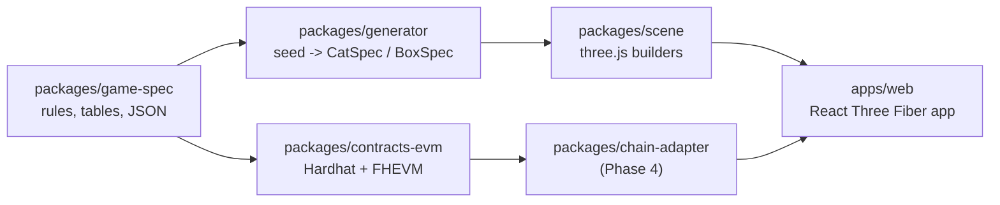

# DO NOT OPEN

A confidential NFT collection on the Zama Protocol (FHEVM). 5,000 sealed boxes. Each
holds a cat whose state and traits are drawn and stored encrypted on-chain, so nobody,
the deployer included, knows what is inside until a box is observed.

Target: Ethereum Sepolia, then mainnet, then Solana once Zama ships SVM support.

## Status

| Phase | Scope                                                                 | State       |
| ----- | --------------------------------------------------------------------- | ----------- |
| 1     | Game spec, generator, art direction, sealed box + shake, five cats    | **Done**    |
| 2     | Contract: mint, shake, observe, proveAlive, ACL, mock tests, CLI demo | **Done** (Sepolia deploy needs your key) |
| 3     | duel, entangle, feed, paidShake and their 3D effects                  | Next        |
| 4     | EVM chain adapter, full frontend on Sepolia, offscreen metadata render|             |
| 5     | Full docs, Solana porting map, audit checklist                        |             |

## Layout



Portable: `game-spec`, `generator`, `scene`, `apps/web`. Chain-specific:
`contracts-evm` and the adapter implementation. The frontend will only ever talk to
the `ChainAdapter` interface.

## Run it

```bash
pnpm install
pnpm test        # generator: 22 tests, contracts: 28 tests on the FHEVM mock
pnpm typecheck
pnpm dev         # http://localhost:5173, mock mode, no chain
```

Requires Node 20+ and pnpm 9. Copy `.env.example` to `.env` when a phase needs secrets.
No private key is ever committed.

## Read next

- [`docs/DESIGN.md`](docs/DESIGN.md) — art direction, effect catalogue, performance budget
- [`docs/ZAMA_NOTES.md`](docs/ZAMA_NOTES.md) — verified FHEVM versions and where the protocol differs from the original brief
- [`packages/contracts-evm/README.md`](packages/contracts-evm/README.md) — contracts, cost per function, deploy and CLI
- [`packages/game-spec/README.md`](packages/game-spec/README.md) — seed layout, odds, rarity formula
- [`assets/BLENDER_TODO.md`](assets/BLENDER_TODO.md) — assets that need modelling (none yet)
