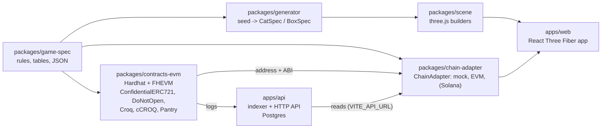
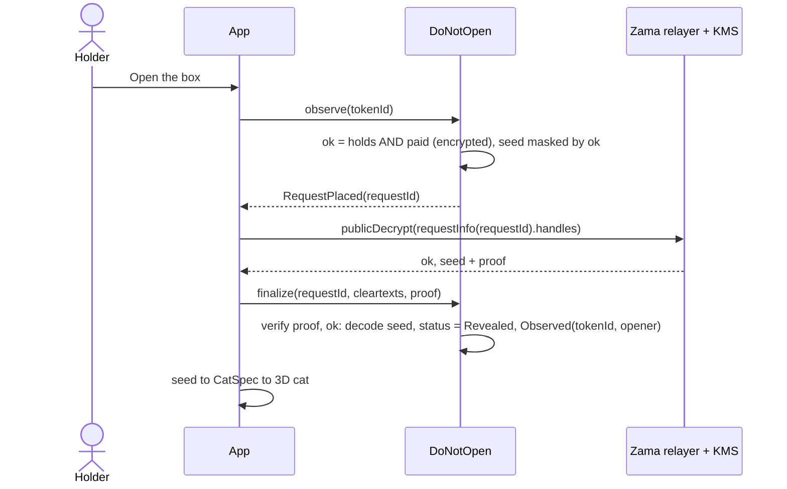
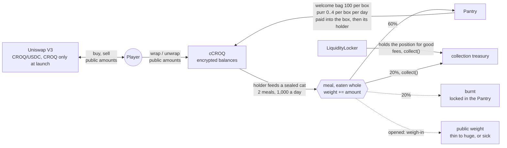

# DO NOT OPEN

A confidential NFT collection on the Zama Protocol (FHEVM). 10,000 sealed boxes. Each
holds a cat whose state and traits are drawn and stored encrypted on-chain, so nobody,
the deployer included, knows what is inside until a box is observed.

Who holds which box, how many boxes an account holds, and how many boxes were sold are
encrypted too: `DoNotOpen` is a Confidential ERC-721, and only milestones of the sale are
announced. See [`docs/HIDDEN_OWNERS.md`](docs/HIDDEN_OWNERS.md).

Prices are in USDC and paid in cUSDC, Zama's confidential USDC, so no amount is public;
the app shields plain USDC first when needed. The app's bureau de change swaps between ETH,
USDC, cUSDC, CROQ and cCROQ in one form, with the route, fees and slippage shown before signing. Holders pet their cats (affection, which can turn the accessory golden) and feed
them croquettes (CROQ), a game currency with encrypted balances. The cat eats every
croquette and puts on a weight nobody can read; when the box is opened, the cat is
weighed in public. The heavier it is, the rarer its build, and past a tolerance of its
own the cat is sick: an ultra-rare trophy.

Target: Ethereum Sepolia, then mainnet, then Solana once Zama ships SVM support.

Live at [do-not-open.app](https://do-not-open.app) (on Sepolia until the mainnet launch) and
[testnet.do-not-open.app](https://testnet.do-not-open.app); the API answers at
`api.do-not-open.app`. Domains and DNS in [`deploy/README.md`](deploy/README.md#domains).

## Status

| Phase | Scope                                                                 | State       |
| ----- | --------------------------------------------------------------------- | ----------- |
| 1     | Game spec, generator, art direction, sealed box + shake, five cats    | **Done**    |
| 2     | Contract: mint, shake, observe, proveAlive, ACL, mock tests, CLI demo | **Done**, live on Sepolia |
| 3     | duel, entangle, feed, paidShake and their 3D effects                  | **Done**, live on Sepolia |
| 4     | EVM chain adapter, full frontend on Sepolia, offscreen metadata render| **Done**    |
| 5     | Full docs, Solana porting map, audit checklist                        | **Done**    |
| CROQ  | Croquette economy: CROQ + cCROQ, Pantry, a CROQ-only Uniswap V3 pool locked for good, 10,000 boxes | **Done**, live on Sepolia |
| Weight | Meals eaten whole, 20/60/20 split, daily cap, weigh-in, builds, sickness | **Done**, live on Sepolia |
| Hidden owners | Confidential ERC-721, hidden mint quantity, sale milestones, game actions checked under encryption | **Done**, live on Sepolia |
| Duel shelf | Boxes put up for a duel, open to any box or reserved for one, holding proven at posting, 7 days on the shelf | **Done**, live on Sepolia |
| Release form | Terms of play initialed clause by clause and signed with the wallet (EIP-191, free) before playing, filed by the API (`POST /v1/terms`) | **Done** |
| Studio | `/studio`: a random procedural rat for free in the browser, rats from a prompt (cartoon sketch, then a 3D model) through AI services paid in USDC packs (`StudioPacks`) | **Done**, live on Sepolia |
| Rats | Adopt a studio rat (`Rats`, ERC-721, 1 or 3 USDC), 10 CROQ a day from the `RatPantry`, sniffing boxes through the paid shake, "My rats" in the game | **Done**, live on Sepolia (the pantry waits for its CROQ) |

## Layout



The backend, `apps/api`, indexes the protocol into Postgres and serves the app's reads, so
visitors do not each hit a public RPC; it runs on its own server, the site stays on Vercel.
See [`apps/api/README.md`](apps/api/README.md) and [`deploy/README.md`](deploy/README.md).

Portable: `game-spec`, `generator`, `scene`, `apps/web`. Chain-specific:
`contracts-evm` and the adapter implementations. The frontend only ever talks to the
`ChainAdapter` interface: `apps/web` does not depend on ethers, viem or the Relayer SDK.

## Run it

```bash
pnpm install
pnpm test        # generator, chain adapter, and 95 contract tests on the FHEVM mock
pnpm typecheck
pnpm dev         # http://localhost:5173: home page; the game is at /app (mock mode, no chain)
```

The same app on Sepolia, against Zama's relayer. The hidden-owner contracts are not
deployed there yet: until `pnpm deploy:sepolia` runs, this mode points at the previous
version (the table below), which the current adapter does not speak.

```bash
VITE_CHAIN_MODE=sepolia pnpm dev     # or open http://localhost:5173/app?chain=sepolia
```

You need a browser wallet with a little Sepolia ETH for gas. Prices are in Zama's test USDC
on Sepolia; the wallet slip has a button that mints some, and the bureau de change (in the
menu) shields it as cUSDC, buys it with ETH or trades it for croquettes.
Who holds a box is encrypted, so the app finds yours from your own transfer receipts: one
decryption signature per visit ("Show my boxes"). `?chain=mock` and `?chain=sepolia`
switch modes without restarting. The menu does the same under the languages: ETH / SOL
(Solana stays disabled until Zama ships SVM support) and Testnet / Mainnet: Testnet reloads
the page with `?chain=sepolia`, Mainnet stays disabled until a mainnet deployment exists
(an old `?chain=mainnet` link lands on Sepolia).

Token metadata is served live by the API (`GET /metadata/:id`); its images are stored for
good on Arweave, for free, as soon as a box is minted or a cat opened (see
[`apps/api/README.md`](apps/api/README.md#token-images-on-arweave)). Offline render (JSON, a
3D render and an SVG fallback per token):

```bash
pnpm --filter @dno/web render:metadata                    # fixtures
pnpm --filter @dno/web render:metadata --source sepolia   # every minted token
```

Requires Node 20+ and pnpm 9. Copy `.env.example` to `.env` when a phase needs secrets.
No private key is ever committed.

## How a box is opened

Every reveal follows this shape: a request on-chain, a decryption off-chain, a proof
back on-chain. There is no decryption callback on the current protocol. Nothing reverts
on ownership: a request by someone who does not hold the box is settled `Refused` and
decrypts to zeros.



The other mechanics are in [`docs/FLOWS.md`](docs/FLOWS.md).

## Croquettes

Two tokens: **CROQ**, a plain ERC-20 that any market can list, and **cCROQ**, its
confidential ERC-7984 wrapper, which is what the game uses. 20,000,000 CROQ were minted
once at deployment; nothing can mint more.



| Share | CROQ |
| --- | --- |
| Game reserve (Pantry, pays the purr, takes back 60% of every meal) | 10,000,000 |
| Welcome bags (Pantry, 100 per box) | 1,000,000 |
| Market liquidity (Uniswap V3, CROQ only, locked) | 4,000,000 |
| Treasury | 5,000,000 |

The market is one Uniswap V3 position that holds only CROQ: the creator put in no USDC.
It sells CROQ from 0.001 USDC up to 1 USDC each, so CROQ never sells below 0.001 USDC, and
until someone buys there is no USDC to sell into. The position is held for good by the
`LiquidityLocker`; its 1% trading fees go to the treasury.

The rules, what leaks and the costs are in [`docs/CROQ.md`](docs/CROQ.md).

## The studio

The studio (`/studio`) is the way in for people who do not care about blockchains. It draws
the depot's rats, not cats, on purpose: the cats only come out of boxes, so nothing drawn in
the studio can be taken for one. Anyone draws a random rat there for free: a procedural rat
generator (`buildRatSpec` in `packages/generator`, `createRat` in `packages/scene`: buck teeth,
big ears, hats, a wedge of cheese, assembled from the Blender rat kit `rat.glb`), in the
browser, no wallet. To draw a rat from a prompt
("a chubby rat chef stealing a wheel of cheese"), a player buys a
pack in plain USDC from `StudioPacks`: **Starter**, 2 USDC for 10 sketches and 1 3D model;
**Litter**, 8 USDC for 50 and 5. A sketch is a cartoon picture in the house style (try again
until it looks right); a model turns a sketch into a 3D mesh, drawn with the game's toon
materials. The API spends a unit before it calls the AI services and gives it back if they
fail, and stops for the day past a dollar budget. Each pack sells for at least twice what it
is expected to cost, so the services are paid back with a margin for the treasury. The
numbers are in [`packages/game-spec/studio.json`](packages/game-spec/studio.json), the flow in
[`docs/FLOWS.md`](docs/FLOWS.md#the-studio).

A rat can then be adopted: minted in `Rats`, a plain ERC-721, for 1 USDC (a free rat, by its
seed) or 3 USDC (an AI rat: the API stores its picture on Arweave like a cat's and keeps its 3D model). An
adopted rat earns 10 plain CROQ a day from the `RatPantry` (funded with 500,000 CROQ sent from the
treasury with a plain transfer, at most 7 days kept between two claims; while it is empty a
claim waits rather than losing the days) and sniffs boxes for its
owner through the paid shake. "My rats" in the game lists them.

## On Sepolia

The current contracts, deployed on 2026-10-03 (block 11836238) with the security review's
fixes, decoy transfers and a fresh croquette economy. The deployer
`0x6a18cFC3fAeef453B295B12246d40a82593b3208` owns every contract and is the treasury:

| Contract | Address |
| --- | --- |
| `DoNotOpen` (Confidential ERC-721, 10,000 boxes) | [`0x816a39b04e0672B4746A5B696E14145F4F852d37`](https://sepolia.etherscan.io/address/0x816a39b04e0672B4746A5B696E14145F4F852d37) |
| `DoNotOpenConfig` | [`0xf4589d1d91Df3a0A98E7C6E79f6CaFCdbdc8203D`](https://sepolia.etherscan.io/address/0xf4589d1d91Df3a0A98E7C6E79f6CaFCdbdc8203D) |
| `DoNotOpenHooks` (rules for the confidential marketplace) | [`0x2861240671f6a46522297427FE2BF59F2f9C1074`](https://sepolia.etherscan.io/address/0x2861240671f6a46522297427FE2BF59F2f9C1074) |
| `Croq` (CROQ) | [`0x142ADF07aEcdd0D1c915bBCa574B1A9EBDd91308`](https://sepolia.etherscan.io/address/0x142ADF07aEcdd0D1c915bBCa574B1A9EBDd91308) |
| `ConfidentialCroq` (cCROQ) | [`0x358E932457A2F19B20BF49264875E94432941D81`](https://sepolia.etherscan.io/address/0x358E932457A2F19B20BF49264875E94432941D81) |
| `Pantry` | [`0x7Df443562BD787A56b1026aD91cFa0A8E91E7d9d`](https://sepolia.etherscan.io/address/0x7Df443562BD787A56b1026aD91cFa0A8E91E7d9d) |
| `LiquidityLocker` (holds position #233138 for good) | [`0x85b827d5F40C15F0842F48C830B956cf8C5Da108`](https://sepolia.etherscan.io/address/0x85b827d5F40C15F0842F48C830B956cf8C5Da108) |
| CROQ/USDC pool, Uniswap V3, 1% fee | [`0xc1eFDaC0c240F9BbCE8788E18427666310E267ce`](https://sepolia.etherscan.io/address/0xc1eFDaC0c240F9BbCE8788E18427666310E267ce) |
| USDC (Zama's `USDCMock`, anyone can mint) | [`0x9b5Cd13b8eFbB58Dc25A05CF411D8056058aDFfF`](https://sepolia.etherscan.io/address/0x9b5Cd13b8eFbB58Dc25A05CF411D8056058aDFfF) |
| cUSDC (Zama's `cUSDCMock`) | [`0x7c5BF43B851c1dff1a4feE8dB225b87f2C223639`](https://sepolia.etherscan.io/address/0x7c5BF43B851c1dff1a4feE8dB225b87f2C223639) |
| `UsdcRamp` (ETH in, USDC or cUSDC out, 0.3% fee) | [`0xaa3B58D5B4Eb66d455b4099588D3aC76dF329AA1`](https://sepolia.etherscan.io/address/0xaa3B58D5B4Eb66d455b4099588D3aC76dF329AA1) |
| `DecryptionCredits` (0.01 USDC a credit) | [`0x300cc9CE50003750fC052bfEf3ee87fFE9B1534e`](https://sepolia.etherscan.io/address/0x300cc9CE50003750fC052bfEf3ee87fFE9B1534e) |
| `StudioPacks` (Starter 2 USDC, Litter 8 USDC) | [`0x672cf76a68d4f181387B59caA1813eC425c1354C`](https://sepolia.etherscan.io/address/0x672cf76a68d4f181387B59caA1813eC425c1354C) |
| `Rats` (ERC-721: 1 USDC a free rat, 3 an AI rat) | [`0xd4f8Df0F14Ced442077762cb81e843656BAc3856`](https://sepolia.etherscan.io/address/0xd4f8Df0F14Ced442077762cb81e843656BAc3856) |
| `RatPantry` (10 CROQ a rat a day) | [`0x9c83C67e690CF8fb6CFaFE8f1DA5221D20520a0A`](https://sepolia.etherscan.io/address/0x9c83C67e690CF8fb6CFaFE8f1DA5221D20520a0A) |

CROQ trades through Uniswap's own V3 contracts on Sepolia: `SwapRouter02`
`0x3bFA4769FB09eefC5a80d6E87c3B9C650f7Ae48E`, `QuoterV2`
`0xEd1f6473345F45b75F8179591dd5bA1888cf2FB3`, `NonfungiblePositionManager`
`0x1238536071E1c677A632429e3655c799b22cDA52`. The adapter's market calls (a sale
quoted at 0 before any buy, a buy, a sale back) were run against this deployment.
`smoke:sepolia`, `smoke:croq` and a box sent with three decoys all passed against it.

The CROQ-only V3 market contracts (2026-10-02, block 11830294), replaced:

| Contract | Address |
| --- | --- |
| `DoNotOpen` | [`0x5eBaA496783146f712B9c075f8a6fd56cb612C6F`](https://sepolia.etherscan.io/address/0x5eBaA496783146f712B9c075f8a6fd56cb612C6F) |
| `DoNotOpenConfig` | [`0x6909f7C5ebE00592F28Ab3597914d30D8b746976`](https://sepolia.etherscan.io/address/0x6909f7C5ebE00592F28Ab3597914d30D8b746976) |
| `DoNotOpenHooks` | [`0xb891e9A343ccC18C070aB0b73341FF38f6D2E66B`](https://sepolia.etherscan.io/address/0xb891e9A343ccC18C070aB0b73341FF38f6D2E66B) |
| `Croq` (CROQ) | [`0xbedb039CB104bD8e60A5eD7844fCE7961d0451F7`](https://sepolia.etherscan.io/address/0xbedb039CB104bD8e60A5eD7844fCE7961d0451F7) |
| `ConfidentialCroq` (cCROQ) | [`0x5b4af5b2Eb99ec3615721a4fBfb7baF5BC8b7952`](https://sepolia.etherscan.io/address/0x5b4af5b2Eb99ec3615721a4fBfb7baF5BC8b7952) |
| `Pantry` | [`0xf506832ab27DF17ece72924502537ecCf7586CDB`](https://sepolia.etherscan.io/address/0xf506832ab27DF17ece72924502537ecCf7586CDB) |
| `LiquidityLocker` (position #233099) | [`0xCA7Eee59de903F9b6bfab466667131Fb58403BF3`](https://sepolia.etherscan.io/address/0xCA7Eee59de903F9b6bfab466667131Fb58403BF3) |
| CROQ/USDC pool, Uniswap V3 | [`0x399Dc7af546154998D302d0b3B312750DA962100`](https://sepolia.etherscan.io/address/0x399Dc7af546154998D302d0b3B312750DA962100) |
| `UsdcRamp` | [`0x2754B8568a3402f828DDAa1715F8290CDa498aAb`](https://sepolia.etherscan.io/address/0x2754B8568a3402f828DDAa1715F8290CDa498aAb) |
| `DecryptionCredits` | [`0xfBF4E4bC2558Be1227d6feBbE80299064291d3B1`](https://sepolia.etherscan.io/address/0xfBF4E4bC2558Be1227d6feBbE80299064291d3B1) |

The contracts with the duel shelf (2026-10-02, block 11828557), replaced. They were owned
by `0x590891F269720001435004A1089cAB5b2c20029A`:

| Contract | Address |
| --- | --- |
| `DoNotOpen` | [`0xB8e3b2238eF5D5782A661c406acc928895938fBa`](https://sepolia.etherscan.io/address/0xB8e3b2238eF5D5782A661c406acc928895938fBa) |
| `DoNotOpenHooks` | [`0x684974FE67084A8cF94e6096fDcbc774892f560a`](https://sepolia.etherscan.io/address/0x684974FE67084A8cF94e6096fDcbc774892f560a) |
| `Croq` (CROQ) | [`0xF4d9CE55b52417e503617186e923E1c0713c53b5`](https://sepolia.etherscan.io/address/0xF4d9CE55b52417e503617186e923E1c0713c53b5) |
| `ConfidentialCroq` (cCROQ) | [`0x4f7415781ceef5C6A0C036A7B8813B7F49634bF9`](https://sepolia.etherscan.io/address/0x4f7415781ceef5C6A0C036A7B8813B7F49634bF9) |
| `Pantry` | [`0x28aC2bc964AfAAa10f51bf485C59D2C9CF6bC8Ed`](https://sepolia.etherscan.io/address/0x28aC2bc964AfAAa10f51bf485C59D2C9CF6bC8Ed) |
| CROQ/USDC pair, Uniswap V2 (LP tokens burnt) | [`0x7C117CA5f1f0d57Bcc9810E216aa6238799E43d2`](https://sepolia.etherscan.io/address/0x7C117CA5f1f0d57Bcc9810E216aa6238799E43d2) |

The end-to-end smoke tests (`pnpm --filter @dno/chain-adapter smoke:sepolia` and
`smoke:croq`) ran against the deployments before it through the real coprocessor, relayer
and KMS; `smoke:sepolia` ran again against it, the duel shelf included.

The hidden-owner contracts before the duel shelf (2026-10-01, block 11822985), replaced:

| Contract | Address |
| --- | --- |
| `DoNotOpen` | [`0xDdC71FeBA832c961770F59d0be4B0b3ae536707B`](https://sepolia.etherscan.io/address/0xDdC71FeBA832c961770F59d0be4B0b3ae536707B) |
| `Pantry` | [`0x084C50597D83ab89D62F5FA4245A4a4e9909A77D`](https://sepolia.etherscan.io/address/0x084C50597D83ab89D62F5FA4245A4a4e9909A77D) |
| `Croq` (CROQ) | [`0x5ebF858ff01d40D8cbC707B8d1F873099F5a11E2`](https://sepolia.etherscan.io/address/0x5ebF858ff01d40D8cbC707B8d1F873099F5a11E2) |

The previous version, an ERC-721 with public owners, kept for the record:

| Contract | Address |
| --- | --- |
| `DoNotOpen` (10,000 boxes) | [`0xe8f699eEBc22767413A9edBb48826B10D3117f61`](https://sepolia.etherscan.io/address/0xe8f699eEBc22767413A9edBb48826B10D3117f61) |
| `DoNotOpenConfig` | [`0xa5D7870f643537b85A575Ab716446fdb6F022780`](https://sepolia.etherscan.io/address/0xa5D7870f643537b85A575Ab716446fdb6F022780) |
| `Croq` (CROQ) | [`0x183B74906673283f7Fe3272103989A357Cf88522`](https://sepolia.etherscan.io/address/0x183B74906673283f7Fe3272103989A357Cf88522) |
| `ConfidentialCroq` (cCROQ) | [`0x7598484e5DDdada766ab19Cd7d0dD42d17Dd4F06`](https://sepolia.etherscan.io/address/0x7598484e5DDdada766ab19Cd7d0dD42d17Dd4F06) |
| `Pantry` | [`0x20755493eF05C954BdC2e970b0437B12AE19d01e`](https://sepolia.etherscan.io/address/0x20755493eF05C954BdC2e970b0437B12AE19d01e) |
| CROQ/USDC pair, Uniswap V2 | [`0xDc7Ed9F6ffd2993350BDc2c563E42036C5a53B43`](https://sepolia.etherscan.io/address/0xDc7Ed9F6ffd2993350BDc2c563E42036C5a53B43) |
| USDC (Zama's `USDCMock`, anyone can mint) | [`0x9b5Cd13b8eFbB58Dc25A05CF411D8056058aDFfF`](https://sepolia.etherscan.io/address/0x9b5Cd13b8eFbB58Dc25A05CF411D8056058aDFfF) |
| cUSDC (Zama's `cUSDCMock`) | [`0x7c5BF43B851c1dff1a4feE8dB225b87f2C223639`](https://sepolia.etherscan.io/address/0x7c5BF43B851c1dff1a4feE8dB225b87f2C223639) |
| `UsdcRamp` (ETH in, USDC or cUSDC out, 0.3% fee) | [`0x20FB2d7f2d3fb249924ce3871255bb417670ba50`](https://sepolia.etherscan.io/address/0x20FB2d7f2d3fb249924ce3871255bb417670ba50) |
| ETH/USDC pair, Uniswap V2 (seeded for the ramp) | [`0x58151722a43de9a7A850dF12f6D9924B19E50F8D`](https://sepolia.etherscan.io/address/0x58151722a43de9a7A850dF12f6D9924B19E50F8D) |

The earlier ETH-priced and 5,000-box deployments are superseded. None of these contracts has been
audited. See [`docs/AUDIT_CHECKLIST.md`](docs/AUDIT_CHECKLIST.md) for what is open
before a mainnet deployment.

## Read next

The site opens on a cartoon home page at `/` (source `apps/web/src/home`): the pitch in four steps, a box to shake until a random cat jumps out, and every kind of cat on a three.js turntable. The app carries its own illustrated manual at `/docs` (`/fr/docs`, `/es/docs`, `/it/docs`) (the "Manual" tag in the
navigation): the seed, the flows and the package layout as interactive three.js diagrams.
Its source is `apps/web/src/docs`.

The home page and the manual are prerendered at build time, one file per language
(`apps/web/scripts/prerender.mts`, run by `pnpm build`), with their title, description,
canonical, `hreflang`, Open Graph, Twitter and JSON-LD tags; `src/site.ts` holds the site's
address and paths. `public/robots.txt` and `public/sitemap.xml` list them, and `vercel.json`
serves clean URLs and marks the testnet site, the game and the render pages `noindex`. The
social card and app icons come from `pnpm --filter @dno/web render:og`. Vercel Web Analytics
counts page views without cookies, and every URL is stripped of its query string first
(`src/analytics.ts`), so a `?box=` link never ties a visitor to a token.

For the reference documents, start at [`docs/README.md`](docs/README.md). In short:

- [`docs/ARCHITECTURE.md`](docs/ARCHITECTURE.md): packages, data flow, 3D pipeline
- [`docs/HIDDEN_OWNERS.md`](docs/HIDDEN_OWNERS.md): encrypted owners, hidden mint quantity, milestones, what leaks, what it costs
- [`docs/DATA_MODEL.md`](docs/DATA_MODEL.md): what is encrypted, who can read what, ACL on transfer
- [`docs/FLOWS.md`](docs/FLOWS.md): sequence diagrams for every mechanic
- [`docs/CROQ.md`](docs/CROQ.md): the croquette economy, its two tokens and its market
- [`docs/SOLANA_PORTING.md`](docs/SOLANA_PORTING.md): the porting map
- [`docs/AUDIT_CHECKLIST.md`](docs/AUDIT_CHECKLIST.md): checks done and findings open
- [`docs/DESIGN.md`](docs/DESIGN.md): art direction, effect catalogue, performance budget
- [`docs/ZAMA_NOTES.md`](docs/ZAMA_NOTES.md): verified FHEVM versions and deviations from the brief
- [`assets/BLENDER_TODO.md`](assets/BLENDER_TODO.md): asset backlog and specs
