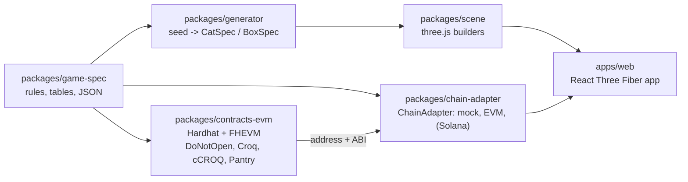
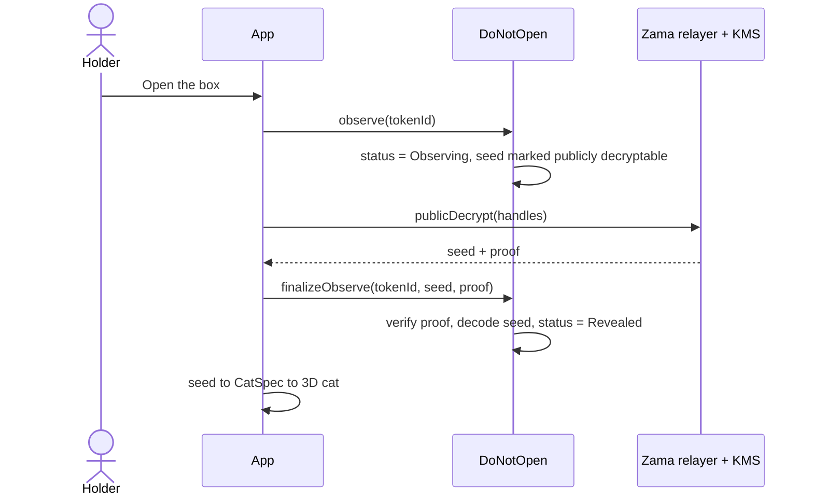
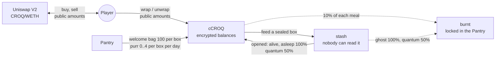

# DO NOT OPEN

A confidential NFT collection on the Zama Protocol (FHEVM). 10,000 sealed boxes. Each
holds a cat whose state and traits are drawn and stored encrypted on-chain, so nobody,
the deployer included, knows what is inside until a box is observed.

Players feed the boxes with croquettes (CROQ), a game currency with encrypted balances.
The croquettes pile up in a stash nobody can read; when the box is opened, the cat
decides whether the holder gets them back.

Target: Ethereum Sepolia, then mainnet, then Solana once Zama ships SVM support.

## Status

| Phase | Scope                                                                 | State       |
| ----- | --------------------------------------------------------------------- | ----------- |
| 1     | Game spec, generator, art direction, sealed box + shake, five cats    | **Done**    |
| 2     | Contract: mint, shake, observe, proveAlive, ACL, mock tests, CLI demo | **Done**, live on Sepolia |
| 3     | duel, entangle, feed, paidShake and their 3D effects                  | **Done**, live on Sepolia |
| 4     | EVM chain adapter, full frontend on Sepolia, offscreen metadata render| **Done**    |
| 5     | Full docs, Solana porting map, audit checklist                        | **Done**    |
| CROQ  | Croquette economy: CROQ + cCROQ, Pantry, Uniswap pool, 10,000 boxes   | **Done**, live on Sepolia |

## Layout



Portable: `game-spec`, `generator`, `scene`, `apps/web`. Chain-specific:
`contracts-evm` and the adapter implementations. The frontend only ever talks to the
`ChainAdapter` interface: `apps/web` does not depend on ethers, viem or the Relayer SDK.

## Run it

```bash
pnpm install
pnpm test        # generator, chain adapter, and 80 contract tests on the FHEVM mock
pnpm typecheck
pnpm dev         # http://localhost:5173: home page; the game is at /app.html (mock mode, no chain)
```

The same app on Sepolia, against the live contract and Zama's relayer:

```bash
VITE_CHAIN_MODE=sepolia pnpm dev     # or open http://localhost:5173/app.html?chain=sepolia
```

You need a browser wallet with a little Sepolia ETH. `?chain=mock` and `?chain=sepolia`
switch modes without restarting.

Token metadata (JSON, a 3D render and an SVG fallback per token):

```bash
pnpm --filter @dno/web render:metadata                    # fixtures
pnpm --filter @dno/web render:metadata --source sepolia   # every minted token
```

Requires Node 20+ and pnpm 9. Copy `.env.example` to `.env` when a phase needs secrets.
No private key is ever committed.

## How a box is opened

Every reveal follows this shape: a request on-chain, a decryption off-chain, a proof
back on-chain. There is no decryption callback on the current protocol.



The other mechanics are in [`docs/FLOWS.md`](docs/FLOWS.md).

## Croquettes

Two tokens: **CROQ**, a plain ERC-20 that any market can list, and **cCROQ**, its
confidential ERC-7984 wrapper, which is what the game uses. 20,000,000 CROQ were minted
once at deployment; nothing can mint more.



| Share | CROQ |
| --- | --- |
| Game reserve (Pantry, pays the purr) | 10,000,000 |
| Welcome bags (Pantry, 100 per box) | 1,000,000 |
| Market liquidity (Uniswap V2) | 4,000,000 |
| Treasury | 5,000,000 |

The rules, what leaks and the costs are in [`docs/CROQ.md`](docs/CROQ.md).

## Live on Sepolia

| Contract | Address |
| --- | --- |
| `DoNotOpen` (10,000 boxes) | [`0x880D284333F4001Bfd199899f8243D78b486e077`](https://sepolia.etherscan.io/address/0x880D284333F4001Bfd199899f8243D78b486e077) |
| `DoNotOpenConfig` | [`0xe2Ce2fC413aE3cf9d0CAF663eb7B357689bF9D1A`](https://sepolia.etherscan.io/address/0xe2Ce2fC413aE3cf9d0CAF663eb7B357689bF9D1A) |
| `Croq` (CROQ) | [`0x72Fc0E0654f268A0785f92D63450c813cAFDfD10`](https://sepolia.etherscan.io/address/0x72Fc0E0654f268A0785f92D63450c813cAFDfD10) |
| `ConfidentialCroq` (cCROQ) | [`0xa89c19228261EAc5Fa48f544238d04fBC115393c`](https://sepolia.etherscan.io/address/0xa89c19228261EAc5Fa48f544238d04fBC115393c) |
| `Pantry` | [`0x8a58e2Cc6E11A3CC108612cfc6677A425Ff49882`](https://sepolia.etherscan.io/address/0x8a58e2Cc6E11A3CC108612cfc6677A425Ff49882) |
| CROQ/WETH pair, Uniswap V2 | [`0x645D0d391F088895272b200aa6E187aCd00F270d`](https://sepolia.etherscan.io/address/0x645D0d391F088895272b200aa6E187aCd00F270d) |

The earlier 5,000-box deployments are superseded. None of these contracts has been
audited. See [`docs/AUDIT_CHECKLIST.md`](docs/AUDIT_CHECKLIST.md) for what is open
before a mainnet deployment.

## Read next

The site opens on a cartoon home page at `/` (source `apps/web/src/home`): the pitch in four steps, a box to shake until a random cat jumps out, and every kind of cat on a three.js turntable. The app carries its own illustrated manual at `/docs.html` (the "Manual" tag in the
navigation): the seed, the flows and the package layout as interactive three.js diagrams.
Its source is `apps/web/src/docs`.

For the reference documents, start at [`docs/README.md`](docs/README.md). In short:

- [`docs/ARCHITECTURE.md`](docs/ARCHITECTURE.md): packages, data flow, 3D pipeline
- [`docs/DATA_MODEL.md`](docs/DATA_MODEL.md): what is encrypted, who can read what, ACL on transfer
- [`docs/FLOWS.md`](docs/FLOWS.md): sequence diagrams for every mechanic
- [`docs/CROQ.md`](docs/CROQ.md): the croquette economy, its two tokens and its market
- [`docs/SOLANA_PORTING.md`](docs/SOLANA_PORTING.md): the porting map
- [`docs/AUDIT_CHECKLIST.md`](docs/AUDIT_CHECKLIST.md): checks done and findings open
- [`docs/DESIGN.md`](docs/DESIGN.md): art direction, effect catalogue, performance budget
- [`docs/ZAMA_NOTES.md`](docs/ZAMA_NOTES.md): verified FHEVM versions and deviations from the brief
- [`assets/BLENDER_TODO.md`](assets/BLENDER_TODO.md): asset backlog and specs
