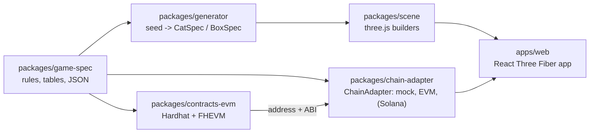

# DO NOT OPEN

A confidential NFT collection on the Zama Protocol (FHEVM). 5,000 sealed boxes. Each
holds a cat whose state and traits are drawn and stored encrypted on-chain, so nobody,
the deployer included, knows what is inside until a box is observed.

Target: Ethereum Sepolia, then mainnet, then Solana once Zama ships SVM support.

## Status

| Phase | Scope                                                                 | State       |
| ----- | --------------------------------------------------------------------- | ----------- |
| 1     | Game spec, generator, art direction, sealed box + shake, five cats    | **Done**    |
| 2     | Contract: mint, shake, observe, proveAlive, ACL, mock tests, CLI demo | **Done**, live on Sepolia |
| 3     | duel, entangle, feed, paidShake and their 3D effects                  | **Done**, live on Sepolia |
| 4     | EVM chain adapter, full frontend on Sepolia, offscreen metadata render| **Done**    |
| 5     | Full docs, Solana porting map, audit checklist                        | Next        |

## Layout



Portable: `game-spec`, `generator`, `scene`, `apps/web`. Chain-specific:
`contracts-evm` and the adapter implementations. The frontend only ever talks to the
`ChainAdapter` interface: `apps/web` does not depend on ethers, viem or the Relayer SDK.

## Run it

```bash
pnpm install
pnpm test        # generator 24, chain adapter 12, contracts 53 on the FHEVM mock
pnpm typecheck
pnpm dev         # http://localhost:5173, mock mode, no chain
```

The same app on Sepolia, against the live contract and Zama's relayer:

```bash
VITE_CHAIN_MODE=sepolia pnpm dev     # or open http://localhost:5173/?chain=sepolia
```

You need a browser wallet with a little Sepolia ETH. `?chain=mock` and `?chain=sepolia`
switch modes without restarting.

Token metadata (JSON, a 3D render and an SVG fallback per token):

```bash
pnpm --filter @dno/web render:metadata                    # fixtures
pnpm --filter @dno/web render:metadata --source sepolia   # every minted token
```

Requires Node 20+ and pnpm 9. Copy `.env.example` to `.env` when a phase needs secrets.
No private key is ever committed.

## Read next

- [`docs/DESIGN.md`](docs/DESIGN.md) — art direction, effect catalogue, performance budget
- [`docs/ZAMA_NOTES.md`](docs/ZAMA_NOTES.md) — verified FHEVM versions and where the protocol differs from the original brief
- [`packages/contracts-evm/README.md`](packages/contracts-evm/README.md) — contracts, cost per function, deploy and CLI
- [`packages/chain-adapter/README.md`](packages/chain-adapter/README.md) — the `ChainAdapter` interface and its three implementations
- [`packages/game-spec/README.md`](packages/game-spec/README.md) — seed layout, odds, rarity formula
- [`assets/BLENDER_TODO.md`](assets/BLENDER_TODO.md) — assets that need modelling (none yet)
