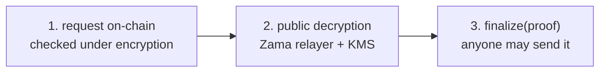
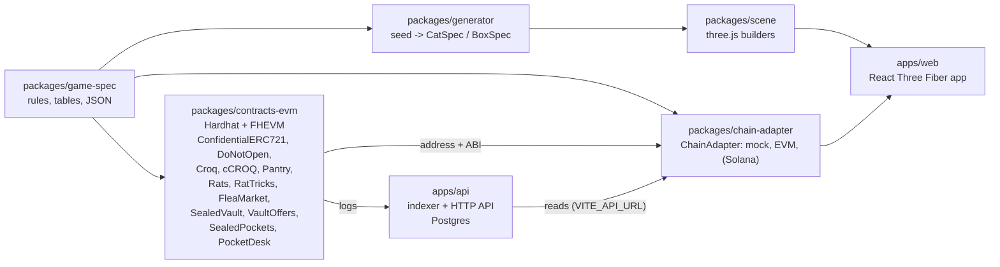

<div align="center">

# DO NOT OPEN

**Confidential NFTs on the Zama Protocol (FHEVM): owners, balances and contents encrypted on-chain.**

[](https://do-not-open.app)
[](https://game.do-not-open.app)
[](https://vault.do-not-open.app)
[](#on-sepolia)
[](docs/AUDIT_CHECKLIST.md)

[Overview](#overview) · [The game](#the-game) · [The sealed vault](#the-sealed-vault) ·
[Run it](#run-it) · [On Sepolia](#on-sepolia) · [All the docs](#all-the-docs)

</div>

<table>
<tr>
<td width="50%" valign="top">

### 🐈 The game

10,000 sealed boxes, each with a cat nobody has seen, the deployer included. Shake them, feed
them, duel them, open them. Who holds what is encrypted.

**[Play](https://game.do-not-open.app)** · [Manual](https://game.do-not-open.app/docs) ·
**[Developer docs → `docs/GAME.md`](docs/GAME.md)**

</td>
<td width="50%" valign="top">

### 🔐 The sealed vault

Put any NFT in a box whose holder is encrypted, and your tokens in a pocket. Take the NFT out,
sell it on Seaport, accept an offer, lend its rights, or pay anyone from your pocket, without
your address showing.

**[Open the vault](https://vault.do-not-open.app)** · [Docs](https://vault.do-not-open.app/docs) ·
**[Developer docs → `docs/VAULT.md`](docs/VAULT.md)**

</td>
</tr>
</table>

## Overview

DO NOT OPEN is two products on one foundation: a **Confidential ERC-721**
(`ConfidentialERC721`), an NFT whose owners are encrypted with Zama's fully homomorphic
encryption. Nothing on it exposes an owner, transfers never revert on ownership, and an
account finds its own tokens by decrypting its own transfer receipts. See
[`docs/HIDDEN_OWNERS.md`](docs/HIDDEN_OWNERS.md).

- **[The game](#the-game)** builds a collection on it: 10,000 boxes whose cats, owners,
  balances and sale count are encrypted.
- **[The sealed vault](#the-sealed-vault)** builds a second one that wraps any NFT, so its
  holder disappears from the chain until they take it out, and pockets that do the same for
  tokens: who paid whom, and how much, stays encrypted.

Target: Ethereum Sepolia, then mainnet, then Solana once Zama ships SVM support.

Live at [do-not-open.app](https://do-not-open.app) (on Sepolia until the mainnet launch): the
home page and the project's docs there, the game on [game.do-not-open.app](https://game.do-not-open.app),
the sealed vault on [vault.do-not-open.app](https://vault.do-not-open.app), each with its docs at
`/docs`. The same on [testnet.do-not-open.app](https://testnet.do-not-open.app) (`game.testnet.`,
`vault.testnet.`); the API answers at `api.do-not-open.app`. Domains and DNS in
[`deploy/README.md`](deploy/README.md#domains).

### Every reveal has the same shape

There is no decryption callback in the current protocol, so whatever is revealed (a cat, a
vault request, a sale) goes the same way, and nothing reverts on ownership: a request by
someone who does not hold the token settles `Refused` and decrypts to zeros.



The game's version is drawn step by step in [`docs/GAME.md`](docs/GAME.md#how-a-box-is-opened),
the vault's in [`docs/VAULT.md`](docs/VAULT.md#a-request-take-out-list-take-down-collect-accept-an-offer-delegate).
The protocol's details are in [`docs/ZAMA_NOTES.md`](docs/ZAMA_NOTES.md).

### Status of the platform

| Part | Scope | State |
| --- | --- | --- |
| Chain adapter and frontend | EVM chain adapter, full frontend on Sepolia, offscreen metadata render | **Done** |
| Docs | Full docs, Solana porting map, audit checklist | **Done** |
| Hidden owners | Confidential ERC-721, hidden mint quantity, sale milestones, game actions checked under encryption | **Done**, live on Sepolia |
| Boarding page | `/apply`, in the home page's dark theme: a sealed box behind its encryption shield (probes cannot read the passenger; once boarded, the player sees their own handle), Sign in with X, five quick tasks on X (declared), the mainnet list's points, a wallet bonus and a referral link with a printable boarding pass; linked from the home page's bar (API migrations 16 to 18) | **Done**; Sign in with X waits for `X_CLIENT_ID` on the server |

The game's rows are [under the game](#status-of-the-game), the vault's [under the vault](#status-of-the-vault).

### Layout



| Package | What it is |
| --- | --- |
| [`packages/game-spec`](packages/game-spec/README.md) | Every game number in one JSON file: traits, odds, score, economy |
| `packages/generator` | A seed turned into a cat or a box spec, plain JSON |
| `packages/scene` | three.js builders for cats, boxes and rats, no React |
| [`packages/contracts-evm`](packages/contracts-evm/README.md) | The contracts, the game's and the vault's, with their tests and deploy |
| [`packages/chain-adapter`](packages/chain-adapter/README.md) | The `ChainAdapter` interface, its mock and its EVM implementation |
| `apps/web` | The site: home page, game, studio, vault, boarding, docs |
| [`apps/api`](apps/api/README.md) | The indexer and the HTTP API |
| [`apps/admin`](apps/admin/README.md) | The team's password-protected admin site |

The backend, `apps/api`, indexes the protocol into Postgres and serves the app's reads, so
visitors do not each hit a public RPC; it runs on its own server (one indexer and several API
replicas behind Caddy, load-tested with k6 on every API pull request into `main`), the site stays
on Vercel. See [`deploy/README.md`](deploy/README.md) and [`loadtest/README.md`](loadtest/README.md).

Portable: `game-spec`, `generator`, `scene`, `apps/web`. Chain-specific: `contracts-evm` and the
adapter implementations. The frontend only ever talks to the `ChainAdapter` interface: `apps/web`
does not depend on ethers, viem or the Relayer SDK.

### Run it

```bash
pnpm install
pnpm test        # generator, chain adapter, API, and 335 contract tests on the FHEVM mock
pnpm typecheck
pnpm dev         # http://localhost:5173: home page; the game at /app, the vault at /vault (mock mode, no chain)
```

Against Sepolia and Zama's relayer: `VITE_CHAIN_MODE=sepolia pnpm dev`, or `?chain=sepolia` in
the URL. What a player needs there is in [`docs/GAME.md`](docs/GAME.md#play-on-sepolia), the
vault's local walkthrough in [`docs/VAULT.md`](docs/VAULT.md#run-it).

Requires Node 20+ and pnpm 9. Copy `.env.example` to `.env` when a phase needs secrets. No private
key is ever committed.

<details>
<summary><b>The site: hosts, prerendering, sharing tags, analytics</b></summary>

The site opens on the home page at `/` (source `apps/web/src/secure`): the sealed vault first, in a
dark, security-minded theme, and the game as a small corner at the end. Its bar's "Docs" leads
straight to the vault's docs (`/docs` on `vault.`, source `apps/web/src/vault/docs`), which share
that theme with the project's docs (`/docs` on the bare domain, source `apps/web/src/project`): both
are laid out by `apps/web/src/docs/DocShell.tsx` and styled by `apps/web/src/secure/docs.css`. The
game carries its own manual in the game's look ([more](docs/GAME.md#the-manual)).

The home page, the manual, the studio and the boarding page are prerendered at build time, one file
per language (`apps/web/scripts/prerender.mts`, run by `pnpm build`), with their title,
description, canonical, `hreflang`, Open Graph, Twitter and JSON-LD tags; `src/site.ts` holds the
site's address and paths. The same script writes `sitemap.xml` from their canonical URLs, on every
host (the bare domain, `game.`, `vault.`) and in every language, plus the vault's page, whose
sharing tags are in `vault.html` itself; `public/robots.txt` points at it, and `vercel.json` serves
clean URLs, sends `/fr/app` (and `/es/app`, `/it/app`) to `/app?lang=…`, and marks the testnet
site, the game and the render pages `noindex`. The social cards (`og.png` for the game's manual and
the studio, `og-vault.png` for the home page, the project's and the vault's pages and boarding) and
app icons come from `pnpm --filter @dno/web render:og`. Vercel Web Analytics counts page views
without cookies, and every URL is stripped of its query string first (`src/analytics.ts`), so a
`?box=` link never ties a visitor to a token.

</details>

## The game

> **[→ Read the game's developer docs: `docs/GAME.md`](docs/GAME.md)** · [Play it](https://game.do-not-open.app) · [Its manual](https://game.do-not-open.app/docs)

10,000 sealed boxes. Each holds a cat whose state and traits are drawn and stored encrypted
on-chain. Who holds which box, how many boxes an account holds and how many were sold are
encrypted too; only milestones of the sale are announced. The sale stops at 9,000 boxes, the last
1,000 are the mainnet whitelist's gifts. Prices are in USDC, paid in cUSDC, Zama's confidential
USDC.

| | Where to read more |
| --- | --- |
| 📦 **Open a box**: request, decryption, proof | [How a box is opened](docs/GAME.md#how-a-box-is-opened) |
| 🧭 **Every mechanic**: mint, shake, feed, duel, entangle, gifts… | [The mechanics, one link each](docs/GAME.md#every-mechanic) |
| 🍪 **Croquettes**: CROQ and cCROQ, meals, the weigh-in | [Croquettes](docs/GAME.md#croquettes), then [`docs/CROQ.md`](docs/CROQ.md) |
| 🐀 **The studio and the rats**: drawn for free or from a prompt, with secret powers | [The studio and the rats](docs/GAME.md#the-studio-and-the-rats) |
| 🏷️ **The flea market**: boxes, cats and rats between players, secret offers | [The flea market](docs/GAME.md#the-flea-market) |
| 🧪 **Play on Sepolia**: wallet, test USDC, the bureau de change | [Play on Sepolia](docs/GAME.md#play-on-sepolia) |
| 📜 **The contracts and their addresses** | [The game's contracts](#the-games-contracts) |

### Status of the game

| Phase | Scope                                                                 | State       |
| ----- | --------------------------------------------------------------------- | ----------- |
| 1     | Game spec, generator, art direction, sealed box + shake, five cats    | **Done**    |
| 2     | Contract: mint, shake, observe, proveAlive, ACL, mock tests, CLI demo | **Done**, live on Sepolia |
| 3     | duel, entangle, feed, paidShake and their 3D effects                  | **Done**, live on Sepolia |
| CROQ  | Croquette economy: CROQ + cCROQ, Pantry, a CROQ-only Uniswap V3 pool locked for good, 10,000 boxes | **Done**, live on Sepolia |
| Weight | Meals eaten whole, 20/60/20 split, daily cap, weigh-in, builds, sickness | **Done**, live on Sepolia |
| Duel shelf | Boxes put up for a duel, open to any box or reserved for one, holding proven at posting, 7 days on the shelf | **Done**, live on Sepolia |
| Release form | Terms of play initialed clause by clause and signed with the wallet (EIP-191, free) before playing on mainnet, filed by the API (`POST /v1/terms`); on Sepolia a notice says what a redeployment keeps instead | **Done** |
| Studio | `/studio`: a random procedural rat for free in the browser, rats from a prompt (cartoon sketch, then a 3D model) through AI services paid in USDC packs (`StudioPacks`) | **Done**, live on Sepolia |
| Rats | Adopt a studio rat (`Rats`, ERC-721, 1 or 3 USDC, capped at 700 free and 300 AI rats, 5 per wallet, the rats left shown on the home page and in the studio), 3 CROQ a day from the `RatPantry`, sniffing boxes through the paid shake, "My rats" in the game | **Done**, live on Sepolia (the pantry waits for its CROQ) |
| Rat powers | Each rat draws a secret power at its mint (1 cheaper sniffs, 2 blocks one trait, 3 all five); a rat set on a box for 3 days shields it from strangers or jams its holder, decided under encryption (`RatTricks`, the collection's shake guard) | **Live** on Sepolia since 2026-10-08 |
| Flea market | Players sell each other sealed boxes, cats and rats in cUSDC (`FleaMarket`): an asking price that is public, or a secret offer only the buyer and the seller can read; 2.5% to the treasury; "Flea market" in the game's menu | **Live** on Sepolia since 2026-10-08 |
| Duel ranking + allow list | Boxes ranked by duels won, a gold, silver or bronze rosette on the top three, and a mainnet allow list players claim with a free signature, scored from public facts only (API migration 15) | **Done** |
| Whitelist gifts | Each seated wallet collects its class's gift once (`WhitelistGifts`): an encrypted draw of cCROQ, a box minted free out of the 1,000 the sale leaves (`DoNotOpen.gift`), a free rat (`Rats.gift`), against a Merkle root of (wallet, tier) | **Done**, live on Sepolia since 2026-10-08 (root not set yet) |

## The sealed vault

> **[→ Read the vault's developer docs: `docs/VAULT.md`](docs/VAULT.md)** · [Open the vault](https://vault.do-not-open.app) · [Its docs](https://vault.do-not-open.app/docs)

Next to the game, the same encryption hides who holds any NFT, and who pays whom with tokens.
`SealedVault` takes an NFT of an
allowed collection (a free test collection on test networks) and gives its depositor a box, a
Confidential ERC-721 of its own whose holder is encrypted, sent in the same transaction to a few
decoys so even the depositor is not its obvious holder. Every request on a box is asked with an
encrypted key the holder's wallet derives from one signature, not with an address, so the API's
relayer can send it and the holder's address shows on none. 2.5% of each sale goes to the
treasury. Tokens go in pockets: `SealedPockets` holds cUSDC under a key rather than an address,
so sending it to another pocket, buying a box with it (through `PocketDesk`) or taking it out says
nothing public about who paid whom, or how much.

| What a holder can do | Where to read more |
| --- | --- |
| 📥 **Seal an NFT** in a box, sent to decoys at the same time | [Deposit](docs/VAULT.md#deposit) |
| 🔑 **Ask with a key**, not an address: requests never lock a box, and expire after a day | [A box and its key](docs/VAULT.md#a-box-and-its-key), [a request](docs/VAULT.md#a-request-take-out-list-take-down-collect-accept-an-offer-delegate) |
| 🏪 **List it on Seaport 1.5**, the vault as the seller, any Seaport marketplace fills it | [Seaport: list, fill, sync, collect](docs/VAULT.md#seaport-list-fill-sync-collect) |
| 🤝 **Accept a buyer's WETH offer**, posted on the on-chain board `VaultOffers` | [Accepting an offer](docs/VAULT.md#accepting-an-offer) |
| 🪪 **Name a delegate** in delegate.xyz, so airdrops and token gates still reach you | [Delegation](docs/VAULT.md#delegation) |
| 🤫 **Sell the box privately** for a cUSDC price only the two sides read | [Private sale](docs/VAULT.md#private-sale) |
| 🎁 **Give the box**, and make its key yours | [Give a box](docs/VAULT.md#give-a-box-and-make-its-key-yours) |
| 👛 **Keep tokens in a pocket**: put cUSDC in, send it pocket to pocket, take it out, nothing public says who paid whom | [Pockets](docs/VAULT.md#pockets) |
| 🛒 **Pay for a box from a pocket**, and cash a private sale into one | [With the vault's boxes](docs/VAULT.md#with-the-vaults-boxes) |
| 👁️ **What leaks**, and what never does | [What is public, what is not](docs/VAULT.md#what-is-public-what-is-not) |
| ⚙️ The relayer, the team's view, the decisions, the limits, the costs | [Relayer](docs/VAULT.md#the-relayer) · [Team](docs/VAULT.md#what-the-team-sees) · [Decisions](docs/VAULT.md#decisions) · [Limits](docs/VAULT.md#limits) · [Cost](docs/VAULT.md#cost) |
| 📜 **The contracts and their addresses** | [The vault's contracts](#the-vaults-contracts) |

Public: the deposit, the NFT in each box, Seaport listings, offers and who made them, a box's
delegate, where an NFT or a sale's ETH goes. Never public: who holds a box (even right after the
deposit, with decoys), its key, a private sale's price and whether it went through, a pocket's
balance, an amount it moved, which pocket of a set moved. The page is
`/vault`, laid out as a marketplace that fits the screen (the collection's numbers, tabs to
explore, find your boxes, your pocket, seal an NFT, read private sales and what leaks, filters
on the side, each box's page in a dialog). Every action plays on a stage with its own animation, its steps
and its transactions (block, gas, explorer link); folded away, or left behind when the visitor
goes to another page of the site, it shows at the foot of the page. The header carries the
wallet's balances, live (ETH, WETH, USDC, and cUSDC decrypted for its holder alone); a click on
the address opens its profile (copy, explorer, its boxes, switch wallet, disconnect). Addresses
and NFTs link to Etherscan, and to OpenSea where it shows the chain (mainnet: OpenSea has no
testnet any more).

### Status of the vault

| Part | Scope | State |
| --- | --- | --- |
| Sealed vault | `/vault`: any NFT of an allowed collection in a box whose holder is encrypted (`SealedVault`, a Confidential ERC-721 of its own); taken out, listed on Seaport with the vault as the seller, sold to a buyer's WETH offer the holder accepts (`VaultOffers`, also an on-chain offer board), or sold privately for an encrypted cUSDC price; meanwhile the NFT's rights (airdrops, token gates) lent to a wallet through delegate.xyz; every request asked with a key and sent by the API's relayer; 2.5% to the treasury; followed on the team's admin site, in Grafana and in Discord alerts; the Warden, a chat on the home page and the vault's that answers from their docs | **Live** on Sepolia since 2026-10-08, redeployed twice on 2026-10-09: requests no longer lock a box and a deposit sends decoys (block 11876345), then accepted offers and delegation (`SealedVault` block 11876575, `VaultOffers` 11876574, its test NFT kept) |
| Pockets | "My pocket" on `/vault`: cUSDC in a pocket locked by a key rather than an address (`SealedPockets`), put in from a wallet, sent pocket to pocket, taken out to any address, each action naming the real pocket among decoys and settled under encryption with no decryption; a private sale offered to a pocket and bought with it (`PocketDesk`: an ask with one public bit, then the purchase; the box then held by the desk with the buyer's key); a sale's cUSDC cashed into the seller's pocket; relayed by the API; the home page's story alternates an NFT and tokens | **Live** on Sepolia since 2026-10-09 (`SealedPockets` block 11877902, `PocketDesk` 11877903); `smoke:pockets` passed there |

## On Sepolia

The current contracts, deployed on 2026-10-08 (blocks 11869530 to 11869590, `DoNotOpen` at
11869550) for the whitelist's free gift boxes: a new `DoNotOpenConfig` (the sale's milestones,
now ending at 9,000), a new `DoNotOpen` (the free `gift` path for `WhitelistGifts`, 1,000 boxes
kept outside the sale), the new `BoxMetadata`, and everything bound to the collection again:
its hooks, its `Pantry` and a fresh croquette economy (new CROQ, cCROQ, pool, locker and
`RatPantry`: the old Pantry's 11,000,000 CROQ reserve could not be moved and the deployer held
4,075,000), `RatTricks`, `WhitelistGifts` and the flea market. `Rats`, the credits, the studio
packs and the USDC ramp were kept. The deployer `0x590891F269720001435004A1089cAB5b2c20029A`
owns every contract and is the treasury and the rebater of power-1 sniffs (until 2026-10-07 the
owner was `0x6a18cFC3fAeef453B295B12246d40a82593b3208`):

### The game's contracts

Shared with the vault: USDC, cUSDC, `UsdcRamp` and `DecryptionCredits`. The game's docs: [`docs/GAME.md`](docs/GAME.md).

| Contract | Address |
| --- | --- |
| `DoNotOpen` (Confidential ERC-721, 10,000 boxes: 9,000 for sale, 1,000 for the whitelist's gifts; every shake through `RatTricks`) | [`0x6e3B93f16D108a6a4A415D119d8374C2490954d1`](https://sepolia.etherscan.io/address/0x6e3B93f16D108a6a4A415D119d8374C2490954d1) |
| `DoNotOpenConfig` (the rules and the sale's milestones) | [`0xAA0932bf78b00f051EDA275f433C3E5269F36683`](https://sepolia.etherscan.io/address/0xAA0932bf78b00f051EDA275f433C3E5269F36683) |
| `BoxMetadata` (the boxes' token URIs, `https://api.do-not-open.app/metadata/`) | [`0x2Be2563562f0e6Fb5B31a85322ab4E0411df2645`](https://sepolia.etherscan.io/address/0x2Be2563562f0e6Fb5B31a85322ab4E0411df2645) |
| `DoNotOpenHooks` (rules for the confidential marketplace) | [`0x4E39e95F2129E10Dd615ff4D8e1fE753BBb7c485`](https://sepolia.etherscan.io/address/0x4E39e95F2129E10Dd615ff4D8e1fE753BBb7c485) |
| `Croq` (CROQ) | [`0x765A56A1949baDd2Fc4c04c59c4eCfb464fFfB7C`](https://sepolia.etherscan.io/address/0x765A56A1949baDd2Fc4c04c59c4eCfb464fFfB7C) |
| `ConfidentialCroq` (cCROQ) | [`0xbC7704F737FC4492FC3964449c80b4D7c77479b9`](https://sepolia.etherscan.io/address/0xbC7704F737FC4492FC3964449c80b4D7c77479b9) |
| `Pantry` | [`0xe867E3009C61B943776823a97b3C66A89Bb66a23`](https://sepolia.etherscan.io/address/0xe867E3009C61B943776823a97b3C66A89Bb66a23) |
| `LiquidityLocker` (holds position #233324 for good) | [`0x704811b4091C6A7E37dAb7a104A80300986Bf058`](https://sepolia.etherscan.io/address/0x704811b4091C6A7E37dAb7a104A80300986Bf058) |
| CROQ/USDC pool, Uniswap V3, 1% fee | [`0x2A830D9F11D67B8Ac11Dc70AEbc34bEE750cC811`](https://sepolia.etherscan.io/address/0x2A830D9F11D67B8Ac11Dc70AEbc34bEE750cC811) |
| USDC (Zama's `USDCMock`, anyone can mint) | [`0x9b5Cd13b8eFbB58Dc25A05CF411D8056058aDFfF`](https://sepolia.etherscan.io/address/0x9b5Cd13b8eFbB58Dc25A05CF411D8056058aDFfF) |
| cUSDC (Zama's `cUSDCMock`) | [`0x7c5BF43B851c1dff1a4feE8dB225b87f2C223639`](https://sepolia.etherscan.io/address/0x7c5BF43B851c1dff1a4feE8dB225b87f2C223639) |
| `UsdcRamp` (ETH in, USDC or cUSDC out, 0.3% fee) | [`0x02382AC8a24462FD830753Ca7e49E12486A65638`](https://sepolia.etherscan.io/address/0x02382AC8a24462FD830753Ca7e49E12486A65638) |
| `DecryptionCredits` (0.01 USDC a credit) | [`0x1d1848a72Ffd06e71161537472BFD6D903616511`](https://sepolia.etherscan.io/address/0x1d1848a72Ffd06e71161537472BFD6D903616511) |
| `StudioPacks` (Starter 2 USDC, Litter 8 USDC) | [`0x41596e7311A7408BC1871B9b93be82ef6DDfB5f6`](https://sepolia.etherscan.io/address/0x41596e7311A7408BC1871B9b93be82ef6DDfB5f6) |
| `Rats` (ERC-721: 1 USDC a free rat, 3 an AI rat, each with an encrypted power) | [`0x441F9fe3B8333515Bc7B295E06C14948057b2cF6`](https://sepolia.etherscan.io/address/0x441F9fe3B8333515Bc7B295E06C14948057b2cF6) |
| `RatPantry` (3 CROQ a rat a day, 7 days at most) | [`0xa8C6850eB99f89aB1DA9714Cd073B454Bb6E1850`](https://sepolia.etherscan.io/address/0xa8C6850eB99f89aB1DA9714Cd073B454Bb6E1850) |
| `RatTricks` (sniffs, shields and jams; DoNotOpen's guard) | [`0x1E722B5d8581AA71DE6bAf523a95FDB3917B765f`](https://sepolia.etherscan.io/address/0x1E722B5d8581AA71DE6bAf523a95FDB3917B765f) |
| `WhitelistGifts` (the whitelist's gifts, DoNotOpen's and Rats' giver, 425,000 cCROQ; root not set yet) | [`0x09D2382E4E6d15Efa324d89f8c5E39437e0e405a`](https://sepolia.etherscan.io/address/0x09D2382E4E6d15Efa324d89f8c5E39437e0e405a) |
| `FleaMarket` (boxes, cats and rats between players, 2.5% fee) | [`0xF16bEF038c27C4cE9E7469500B46e1CA60E76F92`](https://sepolia.etherscan.io/address/0xF16bEF038c27C4cE9E7469500B46e1CA60E76F92) |

### The vault's contracts

Seaport 1.5 (`0x00000000000000ADc04C56Bf30aC9d3c0aAF14dC`), the WETH OpenSea uses on Sepolia (`0x7b79995e5f793A07Bc00c21412e50Ecae098E7f9`) and delegate.xyz's registry (`0x00000000000000447e69651d841bD8D104Bed493`) are not ours. The vault's docs: [`docs/VAULT.md`](docs/VAULT.md).

| Contract | Address |
| --- | --- |
| `SealedVault` (any NFT, its holder encrypted; Seaport 1.5 as the vault, listings and accepted WETH offers, delegate.xyz delegation, 2.5% fee; owner and treasury `0x5908…029A`) | [`0xE22509e741233072aFF4e0c6B56d5e3De8018262`](https://sepolia.etherscan.io/address/0xE22509e741233072aFF4e0c6B56d5e3De8018262) (since 2026-10-09, block 11876575; before it [`0x27CA3698A34b53900047cD1D0856B954a695C79D`](https://sepolia.etherscan.io/address/0x27CA3698A34b53900047cD1D0856B954a695C79D), 2026-10-09, no offers nor delegation, and [`0x8B07846CaB181E1D010D2a9E39d7FDF60087fb18`](https://sepolia.etherscan.io/address/0x8B07846CaB181E1D010D2a9E39d7FDF60087fb18), 2026-10-08, whose requests locked the box) |
| `VaultOffers` (the vault's on-chain offer board; fills the offers the vault accepts) | [`0x750d5B8E8A0f55b8E1F74bA3387B59cc8080f9E2`](https://sepolia.etherscan.io/address/0x750d5B8E8A0f55b8E1F74bA3387B59cc8080f9E2) |
| `SealedPockets` (cUSDC in pockets locked by a key; owner `0x5908…029A`) | [`0xAfEc56C76B8682A5FcDCf061fD3e703fD75Be00C`](https://sepolia.etherscan.io/address/0xAfEc56C76B8682A5FcDCf061fD3e703fD75Be00C) |
| `PocketDesk` (buys private sales out of pockets, holds what it bought) | [`0x0939D713429FCD1c5AF9589b121a8F77C49F759b`](https://sepolia.etherscan.io/address/0x0939D713429FCD1c5AF9589b121a8F77C49F759b) |
| `VaultTestNFT` (free test NFTs the vault takes) | [`0xf72Eb38f816B1B8Effa8B6036C0BA6A38D6d6f9b`](https://sepolia.etherscan.io/address/0xf72Eb38f816B1B8Effa8B6036C0BA6A38D6d6f9b) |

Deployed with `SEPOLIA_GAS_PRICE=20000000 pnpm --filter @dno/contracts-evm exec hardhat deploy
--network sepolia --maxfee 50000000 --priorityfee 2000000`, then `export:sepolia`: a 0.3 gwei
cap asked 0.0144 ETH up front for `DoNotOpen`'s ~40M gas while the deployer held 0.0107. The
public RPC's nonce lag interrupted it once at `RatTricks`; running it again resumed it.

CROQ trades through Uniswap's own V3 contracts on Sepolia: `SwapRouter02`
`0x3bFA4769FB09eefC5a80d6E87c3B9C650f7Ae48E`, `QuoterV2`
`0xEd1f6473345F45b75F8179591dd5bA1888cf2FB3`, `NonfungiblePositionManager`
`0x1238536071E1c677A632429e3655c799b22cDA52`.

<details>
<summary><b>Earlier deployments, replaced and kept for the record</b></summary>

The contracts of 2026-10-07 (blocks 11862300 to 11862351), for the rats' powers and tricks,
replaced where the free gift boxes redeployed them (`Rats`, the credits, the studio packs and
the ramp are still the current ones). `smoke:rats` passed against them:

| Contract | Address |
| --- | --- |
| `DoNotOpen` | [`0x7b246695614Cc49A500bC8057345181689c82d52`](https://sepolia.etherscan.io/address/0x7b246695614Cc49A500bC8057345181689c82d52) |
| `DoNotOpenConfig` | [`0xf6589be5E6F9dE6174cdBD9C0Ef182079a2bC7F8`](https://sepolia.etherscan.io/address/0xf6589be5E6F9dE6174cdBD9C0Ef182079a2bC7F8) |
| `DoNotOpenHooks` | [`0x194585DD7B1e009694D760618C76c1ee48e37798`](https://sepolia.etherscan.io/address/0x194585DD7B1e009694D760618C76c1ee48e37798) |
| `Croq` | [`0x176f24a7ab07210E8306C4331104BC9a0d145a53`](https://sepolia.etherscan.io/address/0x176f24a7ab07210E8306C4331104BC9a0d145a53) |
| `ConfidentialCroq` | [`0xa9de609cC7FD4D264cb5B30Ef2c41e4297bC9964`](https://sepolia.etherscan.io/address/0xa9de609cC7FD4D264cb5B30Ef2c41e4297bC9964) |
| `Pantry` | [`0x4e62259E4FFb05224b8Ef64dD4E45826651EB72F`](https://sepolia.etherscan.io/address/0x4e62259E4FFb05224b8Ef64dD4E45826651EB72F) |
| `LiquidityLocker` (position #233286) | [`0x13B2636a1De5Ad3922aF6D499a290e8911F4e772`](https://sepolia.etherscan.io/address/0x13B2636a1De5Ad3922aF6D499a290e8911F4e772) |
| `CroqUsdcPool` | [`0xC2EA76E3c3107512A229936FfbD91cD297D40847`](https://sepolia.etherscan.io/address/0xC2EA76E3c3107512A229936FfbD91cD297D40847) |
| `RatPantry` | [`0xC13432AF43dDC738fa0a591CE3499BaF0DA5E450`](https://sepolia.etherscan.io/address/0xC13432AF43dDC738fa0a591CE3499BaF0DA5E450) |
| `RatTricks` | [`0x44B2006E63Af469e5470eD5Fc2A6307117d22d0D`](https://sepolia.etherscan.io/address/0x44B2006E63Af469e5470eD5Fc2A6307117d22d0D) |
| `WhitelistGifts` | [`0xD244389bF81C38803c94957a1e6B5694eEeA678b`](https://sepolia.etherscan.io/address/0xD244389bF81C38803c94957a1e6B5694eEeA678b) |
| `FleaMarket` | [`0x4E9fC2Cb042d7Bd49B559Ad3e1110c200d7081C1`](https://sepolia.etherscan.io/address/0x4E9fC2Cb042d7Bd49B559Ad3e1110c200d7081C1) |

The contracts of 2026-10-03 (block 11836238), with the security review's fixes and decoy
transfers, replaced. Owned by `0x6a18cFC3fAeef453B295B12246d40a82593b3208`; `Rats` and
`RatPantry` were added 2026-10-05, `FleaMarket` the same day (block 11849253). `smoke:sepolia`,
`smoke:croq` and a box sent with three decoys passed against them:

| Contract | Address |
| --- | --- |
| `DoNotOpen` | [`0x816a39b04e0672B4746A5B696E14145F4F852d37`](https://sepolia.etherscan.io/address/0x816a39b04e0672B4746A5B696E14145F4F852d37) |
| `DoNotOpenConfig` | [`0xf4589d1d91Df3a0A98E7C6E79f6CaFCdbdc8203D`](https://sepolia.etherscan.io/address/0xf4589d1d91Df3a0A98E7C6E79f6CaFCdbdc8203D) |
| `DoNotOpenHooks` | [`0x2861240671f6a46522297427FE2BF59F2f9C1074`](https://sepolia.etherscan.io/address/0x2861240671f6a46522297427FE2BF59F2f9C1074) |
| `Croq` | [`0x142ADF07aEcdd0D1c915bBCa574B1A9EBDd91308`](https://sepolia.etherscan.io/address/0x142ADF07aEcdd0D1c915bBCa574B1A9EBDd91308) |
| `ConfidentialCroq` | [`0x358E932457A2F19B20BF49264875E94432941D81`](https://sepolia.etherscan.io/address/0x358E932457A2F19B20BF49264875E94432941D81) |
| `Pantry` | [`0x7Df443562BD787A56b1026aD91cFa0A8E91E7d9d`](https://sepolia.etherscan.io/address/0x7Df443562BD787A56b1026aD91cFa0A8E91E7d9d) |
| `LiquidityLocker` (position #233138) | [`0x85b827d5F40C15F0842F48C830B956cf8C5Da108`](https://sepolia.etherscan.io/address/0x85b827d5F40C15F0842F48C830B956cf8C5Da108) |
| `CroqUsdcPool` | [`0xc1eFDaC0c240F9BbCE8788E18427666310E267ce`](https://sepolia.etherscan.io/address/0xc1eFDaC0c240F9BbCE8788E18427666310E267ce) |
| `UsdcRamp` | [`0xaa3B58D5B4Eb66d455b4099588D3aC76dF329AA1`](https://sepolia.etherscan.io/address/0xaa3B58D5B4Eb66d455b4099588D3aC76dF329AA1) |
| `DecryptionCredits` | [`0x300cc9CE50003750fC052bfEf3ee87fFE9B1534e`](https://sepolia.etherscan.io/address/0x300cc9CE50003750fC052bfEf3ee87fFE9B1534e) |
| `StudioPacks` | [`0x672cf76a68d4f181387B59caA1813eC425c1354C`](https://sepolia.etherscan.io/address/0x672cf76a68d4f181387B59caA1813eC425c1354C) |
| `Rats` | [`0x138f8F6aae87f3762C9d03Cbad3048Bb3EF31264`](https://sepolia.etherscan.io/address/0x138f8F6aae87f3762C9d03Cbad3048Bb3EF31264) |
| `RatPantry` | [`0x1334d72fC60cBedcF409d6583F0Ec009c285E75B`](https://sepolia.etherscan.io/address/0x1334d72fC60cBedcF409d6583F0Ec009c285E75B) |
| `FleaMarket` | [`0xb5c799bF626e70DcE6804BDef06199661cDc8665`](https://sepolia.etherscan.io/address/0xb5c799bF626e70DcE6804BDef06199661cDc8665) |

The CROQ-only V3 market contracts (2026-10-02, block 11830294), replaced:

| Contract | Address |
| --- | --- |
| `DoNotOpen` | [`0x5eBaA496783146f712B9c075f8a6fd56cb612C6F`](https://sepolia.etherscan.io/address/0x5eBaA496783146f712B9c075f8a6fd56cb612C6F) |
| `DoNotOpenConfig` | [`0x6909f7C5ebE00592F28Ab3597914d30D8b746976`](https://sepolia.etherscan.io/address/0x6909f7C5ebE00592F28Ab3597914d30D8b746976) |
| `DoNotOpenHooks` | [`0xb891e9A343ccC18C070aB0b73341FF38f6D2E66B`](https://sepolia.etherscan.io/address/0xb891e9A343ccC18C070aB0b73341FF38f6D2E66B) |
| `Croq` (CROQ) | [`0xbedb039CB104bD8e60A5eD7844fCE7961d0451F7`](https://sepolia.etherscan.io/address/0xbedb039CB104bD8e60A5eD7844fCE7961d0451F7) |
| `ConfidentialCroq` (cCROQ) | [`0x5b4af5b2Eb99ec3615721a4fBfb7baF5BC8b7952`](https://sepolia.etherscan.io/address/0x5b4af5b2Eb99ec3615721a4fBfb7baF5BC8b7952) |
| `Pantry` | [`0xf506832ab27DF17ece72924502537ecCf7586CDB`](https://sepolia.etherscan.io/address/0xf506832ab27DF17ece72924502537ecCf7586CDB) |
| `LiquidityLocker` (position #233099) | [`0xCA7Eee59de903F9b6bfab466667131Fb58403BF3`](https://sepolia.etherscan.io/address/0xCA7Eee59de903F9b6bfab466667131Fb58403BF3) |
| CROQ/USDC pool, Uniswap V3 | [`0x399Dc7af546154998D302d0b3B312750DA962100`](https://sepolia.etherscan.io/address/0x399Dc7af546154998D302d0b3B312750DA962100) |
| `UsdcRamp` | [`0x2754B8568a3402f828DDAa1715F8290CDa498aAb`](https://sepolia.etherscan.io/address/0x2754B8568a3402f828DDAa1715F8290CDa498aAb) |
| `DecryptionCredits` | [`0xfBF4E4bC2558Be1227d6feBbE80299064291d3B1`](https://sepolia.etherscan.io/address/0xfBF4E4bC2558Be1227d6feBbE80299064291d3B1) |

The contracts with the duel shelf (2026-10-02, block 11828557), replaced. They were owned
by `0x590891F269720001435004A1089cAB5b2c20029A`:

| Contract | Address |
| --- | --- |
| `DoNotOpen` | [`0xB8e3b2238eF5D5782A661c406acc928895938fBa`](https://sepolia.etherscan.io/address/0xB8e3b2238eF5D5782A661c406acc928895938fBa) |
| `DoNotOpenHooks` | [`0x684974FE67084A8cF94e6096fDcbc774892f560a`](https://sepolia.etherscan.io/address/0x684974FE67084A8cF94e6096fDcbc774892f560a) |
| `Croq` (CROQ) | [`0xF4d9CE55b52417e503617186e923E1c0713c53b5`](https://sepolia.etherscan.io/address/0xF4d9CE55b52417e503617186e923E1c0713c53b5) |
| `ConfidentialCroq` (cCROQ) | [`0x4f7415781ceef5C6A0C036A7B8813B7F49634bF9`](https://sepolia.etherscan.io/address/0x4f7415781ceef5C6A0C036A7B8813B7F49634bF9) |
| `Pantry` | [`0x28aC2bc964AfAAa10f51bf485C59D2C9CF6bC8Ed`](https://sepolia.etherscan.io/address/0x28aC2bc964AfAAa10f51bf485C59D2C9CF6bC8Ed) |
| CROQ/USDC pair, Uniswap V2 (LP tokens burnt) | [`0x7C117CA5f1f0d57Bcc9810E216aa6238799E43d2`](https://sepolia.etherscan.io/address/0x7C117CA5f1f0d57Bcc9810E216aa6238799E43d2) |

The end-to-end smoke tests (`pnpm --filter @dno/chain-adapter smoke:sepolia` and
`smoke:croq`) ran against the deployments before it through the real coprocessor, relayer
and KMS; `smoke:sepolia` ran again against it, the duel shelf included.

The hidden-owner contracts before the duel shelf (2026-10-01, block 11822985), replaced:

| Contract | Address |
| --- | --- |
| `DoNotOpen` | [`0xDdC71FeBA832c961770F59d0be4B0b3ae536707B`](https://sepolia.etherscan.io/address/0xDdC71FeBA832c961770F59d0be4B0b3ae536707B) |
| `Pantry` | [`0x084C50597D83ab89D62F5FA4245A4a4e9909A77D`](https://sepolia.etherscan.io/address/0x084C50597D83ab89D62F5FA4245A4a4e9909A77D) |
| `Croq` (CROQ) | [`0x5ebF858ff01d40D8cbC707B8d1F873099F5a11E2`](https://sepolia.etherscan.io/address/0x5ebF858ff01d40D8cbC707B8d1F873099F5a11E2) |

The previous version, an ERC-721 with public owners, kept for the record:

| Contract | Address |
| --- | --- |
| `DoNotOpen` (10,000 boxes) | [`0xe8f699eEBc22767413A9edBb48826B10D3117f61`](https://sepolia.etherscan.io/address/0xe8f699eEBc22767413A9edBb48826B10D3117f61) |
| `DoNotOpenConfig` | [`0xa5D7870f643537b85A575Ab716446fdb6F022780`](https://sepolia.etherscan.io/address/0xa5D7870f643537b85A575Ab716446fdb6F022780) |
| `Croq` (CROQ) | [`0x183B74906673283f7Fe3272103989A357Cf88522`](https://sepolia.etherscan.io/address/0x183B74906673283f7Fe3272103989A357Cf88522) |
| `ConfidentialCroq` (cCROQ) | [`0x7598484e5DDdada766ab19Cd7d0dD42d17Dd4F06`](https://sepolia.etherscan.io/address/0x7598484e5DDdada766ab19Cd7d0dD42d17Dd4F06) |
| `Pantry` | [`0x20755493eF05C954BdC2e970b0437B12AE19d01e`](https://sepolia.etherscan.io/address/0x20755493eF05C954BdC2e970b0437B12AE19d01e) |
| CROQ/USDC pair, Uniswap V2 | [`0xDc7Ed9F6ffd2993350BDc2c563E42036C5a53B43`](https://sepolia.etherscan.io/address/0xDc7Ed9F6ffd2993350BDc2c563E42036C5a53B43) |
| USDC (Zama's `USDCMock`, anyone can mint) | [`0x9b5Cd13b8eFbB58Dc25A05CF411D8056058aDFfF`](https://sepolia.etherscan.io/address/0x9b5Cd13b8eFbB58Dc25A05CF411D8056058aDFfF) |
| cUSDC (Zama's `cUSDCMock`) | [`0x7c5BF43B851c1dff1a4feE8dB225b87f2C223639`](https://sepolia.etherscan.io/address/0x7c5BF43B851c1dff1a4feE8dB225b87f2C223639) |
| `UsdcRamp` (ETH in, USDC or cUSDC out, 0.3% fee) | [`0x20FB2d7f2d3fb249924ce3871255bb417670ba50`](https://sepolia.etherscan.io/address/0x20FB2d7f2d3fb249924ce3871255bb417670ba50) |
| ETH/USDC pair, Uniswap V2 (seeded for the ramp) | [`0x58151722a43de9a7A850dF12f6D9924B19E50F8D`](https://sepolia.etherscan.io/address/0x58151722a43de9a7A850dF12f6D9924B19E50F8D) |


</details>

The earlier ETH-priced and 5,000-box deployments are superseded. None of these contracts has been
audited. See [`docs/AUDIT_CHECKLIST.md`](docs/AUDIT_CHECKLIST.md) for what is open
before a mainnet deployment.

## All the docs

Players and anyone curious read the docs in the app: the game's manual at
[game.do-not-open.app/docs](https://game.do-not-open.app/docs), the vault's at
[vault.do-not-open.app/docs](https://vault.do-not-open.app/docs), the project's at
[do-not-open.app/docs](https://do-not-open.app/docs). The documents below are for developers; the
index is [`docs/README.md`](docs/README.md).

| | Document | What it answers |
| --- | --- | --- |
| 🐈 | [`docs/GAME.md`](docs/GAME.md) | **The game's hub**: every mechanic, opening a box, croquettes, the studio and the rats, the flea market, playing on Sepolia |
| 🔐 | [`docs/VAULT.md`](docs/VAULT.md) | **The vault's hub**: any NFT with its holder hidden, keys, Seaport, offers, delegation, private sales, what leaks |
| 🧱 | [`docs/ARCHITECTURE.md`](docs/ARCHITECTURE.md) | Packages, data flow, 3D pipeline |
| 🕶️ | [`docs/HIDDEN_OWNERS.md`](docs/HIDDEN_OWNERS.md) | Encrypted owners, hidden mint quantity, milestones, what leaks, what it costs |
| 🗂️ | [`docs/DATA_MODEL.md`](docs/DATA_MODEL.md) | What is encrypted, who can read what, ACL on transfer |
| 🔁 | [`docs/FLOWS.md`](docs/FLOWS.md) | Sequence diagrams for every mechanic, the game's and the vault's |
| 🍪 | [`docs/CROQ.md`](docs/CROQ.md) | The croquette economy, its two tokens and its market |
| 🌉 | [`docs/SOLANA_PORTING.md`](docs/SOLANA_PORTING.md) | The porting map |
| 🛡️ | [`docs/AUDIT_CHECKLIST.md`](docs/AUDIT_CHECKLIST.md) | Checks done and findings open |
| 🎨 | [`docs/DESIGN.md`](docs/DESIGN.md) | Art direction, effect catalogue, performance budget |
| 🧬 | [`docs/ZAMA_NOTES.md`](docs/ZAMA_NOTES.md) | Verified FHEVM versions and deviations from the brief |
| 🧀 | [`assets/BLENDER_TODO.md`](assets/BLENDER_TODO.md) | Asset backlog and specs |
| 🚀 | [`deploy/README.md`](deploy/README.md) | The server, domains, monitoring |
