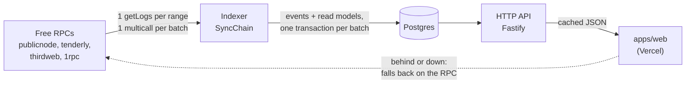

# @dno/api

The backend of DO NOT OPEN: an indexer that follows the protocol on-chain into Postgres, and
the HTTP API the app reads instead of a public RPC. Only public facts go in. Who holds which
box is encrypted on-chain, and the backend never learns it.



## Layout (clean architecture)

| Layer | Folder | Knows about |
| --- | --- | --- |
| Domain | `src/domain` | Boxes, duels, requests, users, protocol events. Pure functions, no I/O. |
| Application | `src/application` | Use cases (`SyncChain`, `Queries`, `SignIn`, `AcceptTerms`, `Metadata`), the projector, and the **ports** they need (`ChainSource`, `ChainState`, `Store`). |
| Infrastructure | `src/infrastructure` | Ethers + the RPC pool, Postgres, the in-memory store, Fastify, HMAC sessions. |
| Composition | `src/main.ts` | The only file that picks concrete classes. |

Dependencies point inwards only: the domain imports nothing, the application imports the
domain and its own ports.

## Staying under the free RPCs' limits

- **The backend is the only reader.** The app reads the API; a thousand visitors cost the RPC
  what one indexer costs: about three requests per new block.
- **One `eth_getLogs` per range** for all three contracts at once, filtered on the event topics
  that matter (decryption proofs, which are large, are left out).
- **One Multicall3 call per batch** for what logs do not say (challenger of a duel, other box of
  a request, contents of an opened box, tolerance of a weighed cat). Block timestamps come in
  one JSON-RPC batch.
- **A pool of endpoints** (`RpcPool`): a token bucket per endpoint (`RPC_RPS`); a 429 or an
  outage benches the endpoint, honouring `Retry-After` and growing on repeat; the fastest
  endpoint with a token to spend is picked first.
- **Each endpoint's log range is learned** from its own refusals ("limited to 50 blocks",
  "more than 10000 results"...) and kept.
- **Contract state no event carries** (economy, next claim time) is cached and batched:
  fifty boxes asking for their claim time within 20 ms cost one multicall.
- **Every endpoint proves it has the block** before its logs are believed, so a lagging free
  node cannot make an event disappear.
- **Nudges, not polling faster:** after a transaction, the app calls `POST /v1/sync/nudge`; the
  indexer looks sooner, never more than once every 3 s.

## Correctness and reconciliation

The `events` table is the source of truth. Each event is stored with its block hash and with
what the contract's views added to it when indexed (its *enrichment*: a duel's challenger, an
opening's contents...). Every other table is a fold of it, and `replayAll` can rebuild them
all from it, in chain order, without a single RPC call.

Four layers keep it complete and right:

1. **Each pass is atomic.** A batch, its projections and the new cursor are one transaction:
   a crash or an RPC error leaves the index as it was, and the pass runs again.
2. **No blind trust in an endpoint.** Before its `eth_getLogs` for `from..to` is believed, the
   endpoint must return the header of block `to`. A lagging node answers "no logs" for blocks it
   has not seen, without an error; this catches it and another endpoint answers. Logs outside
   the range, or from another fork than that header, are refused too. Indexing stays
   `CONFIRMATIONS` blocks behind the head and re-reads the last `RESCAN_BLOCKS` each pass.
3. **Finality sweep** (every `SWEEP_EVERY_MS`, 5 min). Once blocks are finalized, they are read
   again, from other endpoints than those that served them the first time (`indexed_ranges`
   records who did). An event the first read missed is added; one recorded from a block a
   reorg dropped is removed. If anything changed, the read models are replayed.
4. **Reconciliation** (every `RECONCILE_EVERY_MS`, 10 min). The contract's views, read as of
   the last indexed block, are compared with the index: counters (tokens, duels, requests,
   milestones), every open duel, every pending request, and `RECONCILE_BOXES` boxes in turn
   (status, alive check, partner, wins, public traits). For what differs, that entity's events
   are fetched from the deployment on, by indexed topic, added if missing, and the read models
   replayed. What still differs is logged as an error.

Both show their last result in `GET /health` (`indexer.tasks`). Their cost is a few RPC
requests an hour. Read models only move forward, so a late or replayed event does no harm
in between. A duel can go back on the shelf (pending, then open again), so its events are
ordered by block and log index, not by status; nothing moves it out of resolved, cancelled
or void.

Every answer of the API carries `block`, the last block indexed. The app trusts it only when
it covers the account's own last transaction, and reads the chain otherwise.

## Several replicas

`ROLE` splits the process: `all` (the default, one process does everything), `indexer` (reads
the chain, writes the index, runs the periodic tasks; answers `/health` and `/metrics` only) and
`api` (serves the routes below from the index, writes nothing to it). Production runs one
indexer and `API_REPLICAS` API replicas behind Caddy ([`deploy/README.md`](../../deploy/README.md#replicas-and-load-balancing));
never two indexers. What a replica must share with the others lives in Postgres, what it can keep
to itself stays in its memory, and the proxy sends one client IP to the same replica:

| State | Where | Why it holds with several replicas |
| --- | --- | --- |
| A Sign in with X under way (OAuth state, PKCE verifier, return page) | `tickets` (kind `x-sign-in`, 10 min) | X sends the player back to whichever replica; the state is taken once |
| A `/board` code | `tickets` (kind `board`, owner the pass) | `/board` comes from Discord's servers, never from the player's IP |
| Questions the chat may put to Gemini today, in all | `daily_quotas` (`chat-model`) | One free quota for every replica (`CHAT_PER_DAY`) |
| A nudge after a transaction | `NOTIFY dno_nudge`, the indexer listens | The replica that gets it does not index |
| Sign-in nonces, sessions, the relayer meter, studio jobs, everything else | Postgres already | |
| What the vault relayer sent today (`VAULT_RELAY_PER_DAY`) | the replica's memory | A cap per replica, on purpose: the stack's is the cap times `API_REPLICAS`. The replicas share the relayer's key, and retry a nonce another one took |
| Rate limits per IP (`RATE_LIMIT_PER_MINUTE` and each route's), questions per IP (`CHAT_PER_IP_PER_DAY`) | the replica's memory | The proxy hashes the client IP to one replica, so its count is the whole count. A deploy, or a replica leaving, moves some IPs and starts their minute again |
| Caches (economy, claim times, chat answers, facts behind the points) | the replica's memory | Each replica reads them once per period: a few more RPC calls, never a wrong answer |
| A studio generation running | the replica that started it | A replica stopped mid-job loses it; `recover()` gives the unit back after twice `STUDIO_TIMEOUT_MS`, on any replica |

Every process runs the migrations at start under an advisory lock, so replicas starting
together migrate once. During a deploy the old replicas still serve against the new schema
for a few seconds: a migration must keep the previous release working (add, never rename or
drop in the same release).

## API

Every `GET` returns `{ "block": <last indexed block>, "data": ... }`, except the studio's
routes, whose shapes are given in [The studio](#the-studio).

| Route | What |
| --- | --- |
| `GET /health` | Indexer status, lag, RPC endpoints and their learned ranges (`indexer` is null on an API replica, `ROLE=api`) |
| `GET /v1/collection` | Fees, supply, token count, sale milestones |
| `GET /v1/boxes?from=&to=` | Status and partner of up to 1,000 boxes |
| `GET /v1/boxes/:id` | Everything public about a box |
| `GET /v1/boxes/:id/pantry` | Welcome bag, next claim, weigh-in |
| `GET /v1/boxes/:id/activity` | The box's events, newest first (`before`, `limit`) |
| `GET /v1/pairs/:a/:b` | The duels the two boxes can settle (`duels`, a list: both can be up at once) and the entanglement proposal between them |
| `GET /v1/proposals?tokens=` | Entanglements proposed to or by these boxes that can still be accepted (both sealed, neither entangled), newest first. The token list is not stored or cached. |
| `GET /v1/duels/shelf` | The duel shelf: every box up for a duel that can still be taken up (in time, its box and any reserved one still sealed), newest first |
| `GET /v1/duels?account=&tokens=&open=` | Duels an account posted or took up, or about these boxes. `open` keeps posted, open and pending ones. The token list is not stored or cached. |
| `GET /v1/duels/:id` | One duel |
| `GET /v1/leaderboard` | Opened cats and their openers |
| `GET /v1/leaderboard/duels` | Every box that settled a duel, `{ tokenId, wins, losses }`, ranked by wins, then fewest losses, then the lower serial. The first three with a win wear a rosette in the app |
| `GET /v1/accounts/:address` | Profile: user, duels, pending requests, opened cats, activity |
| `GET /v1/accounts/:address/requests` | Pending openings, alive checks, entanglements |
| `GET /v1/accounts/:address/transfers?after=` | Transfer receipts naming the account, for it to decrypt |
| `GET /v1/economy` | Croquette economy and its Uniswap V3 market: `croqReserve` / `quoteReserve` (the active range's virtual reserves, whose ratio is the price), `croqHeld` / `quoteHeld` (what the pool holds), `range` (USDC units per 1,000 CROQ where the locked position starts and stops selling) |
| `GET /v1/activity` | Everything, newest first (`before`, `limit`, `account`) |
| `GET /v1/stats` | Users, registered, minted, opened, duels |
| `POST /v1/auth/nonce` · `POST /v1/auth/verify` · `GET /v1/me` | Sign-in with a wallet signature (no gas), then a bearer session |
| `POST /v1/terms` | Files a signed release form (terms of play): `{ address, message, signature }`. The message must name the address, a version and the SHA-256 of the text, and be signed by that address (EIP-191, no gas). The first signature per address and version is kept. Answers `address`, `version`, `hash`, `receivedAt`; `400` if it is not a form or names another address, `401` if another account signed it. 10 a minute per IP |
| `GET /v1/terms/:address` | The forms that address signed: `{ data: [{ version, hash, signature, message, receivedAt }] }` |
| `POST /v1/allowlist` | Files a claim for a place on the mainnet allow list: `{ address, message, signature }`, the message from `allowListMessage` (`@dno/chain-adapter/standings`) naming that address, signed by it (EIP-191, no gas). Signing again keeps the first claim's date and the best points. Answers the status below; `400` if it is not a claim or names another address, `401` if another account signed it. 10 a minute per IP |
| `GET /v1/allowlist/:address` | Where an address stands: `live` points (`beaten`, `faced`, `opened`), the `points` the ranking counts, `claimedAt`, `rank` among claimants (null until it claims), `claimants`, `places`, `tier` (the gift class the rank would get if the list closed now, null without a seat). Not cached by HTTP; the public facts behind the points (resolved duels, openers) are reused for 30 s (`FACTS_TTL`), since quest platforms such as Galxe check addresses in bursts, and a claim always reads them afresh. Public: the points come from public facts only |
| `GET /v1/seats` | `{ taken, places, required }` (`required`: the tasks on X a pass needs): seats taken on the mainnet list, out of how many. Cached 10 s |
| `GET /v1/allowlist?token=` | The whole list, best first, with `inPlace` for the first `ALLOW_LIST_PLACES`, `seated` and `tier`: the export when the list closes. Only with `ALLOW_LIST_ADMIN_TOKEN` (`401` otherwise, and always when it is unset) |
| `GET /v1/allowlist/gifts?token=` | The list frozen into the whitelist gifts' Merkle tree of (wallet, tier): `{ root, count, tree }` (`tree` is OpenZeppelin's `StandardMerkleTree` dump; all null while nobody is seated). Save it, set its root on `WhitelistGifts` (`hardhat dno:whitelist-root --tree <file>`) and serve it with `WHITELIST_GIFTS_TREE`. Same token as the list |
| `GET /v1/gifts/:address` | A wallet's gift proof once the list is frozen: `{ tier, proof, root }`; `404 not-frozen` without `WHITELIST_GIFTS_TREE`, `404 not-on-list` for a wallet not in it. Cached 60 s |
| `POST /v1/sync/nudge` | Asks the indexer to look now; an API replica passes it on over Postgres (`NOTIFY dno_nudge`) |
| `GET /metadata/:id` · `/metadata/:id/image.svg` | ERC-721 metadata, live. Point the contract's base URI at `https://<api>/metadata/`. `image` is the picture on Arweave once it is stored there (below), this API's SVG until then. |
| `GET /metrics` | Prometheus metrics (`src/infrastructure/http/metrics.ts`): counts, pending proofs, the indexer's lag, the RPC pool, HTTP traffic by route, Arweave, Gemini, herald, the studio's jobs, spending, packs sold and USDC brought in (`dno_studio_*`), the rats adopted (`dno_rats_minted`), the sealed vault's boxes, sales and requests (`dno_vault_*`) and its relayer's wallet and outcomes. Public facts only. Each process reports its own traffic and memory; the index's counts come from the indexer only, so a sum over replicas counts them once. The edge proxy refuses it from outside; the monitoring stack reads it over the Docker network ([`deploy/README.md`](../../deploy/README.md#monitoring)) |
| `POST /relayer/v2/{input-proof,user-decrypt,public-decrypt}` · `GET /relayer/v2/:op/:jobId` · `GET /relayer/v2/keyurl` | The relayer proxy (below): the Relayer SDK's `relayerUrl` is `https://<api>/relayer/v2` |
| `GET /v1/relayer/allowance/:address` | Free decryptions left today, credits left, when the free ones come back |
| `GET /v1/vault/relayer` · `POST /v1/vault/relay` | The sealed vault's relayer (below): its address, or null; sends a holder's request or proof, a pocket's open or spend, a desk purchase, or a liquidity position's call from its own wallet |
| `GET /v1/studio` · `GET /v1/studio/credits` · `POST /v1/studio/sketches` · `POST /v1/studio/models` · `GET /v1/studio/jobs[/:id]` · `GET /v1/studio/jobs/:id/{image,model.glb}` | The studio (below): rats drawn by paid AI services out of packs bought on-chain |
| `GET /v1/rats?owner=` · `GET /v1/rats/supply` · `GET /v1/rats/:id` · `GET /rats/:id` · `GET /rats/:id/image.svg` · `POST /v1/studio/jobs/:id/adopt` | The depot's rats (below): an owner's rats, one rat, its ERC-721 metadata and picture, and the adoption of an AI rat |
| `POST /v1/chat` | The manual's chatbot (below): `{ question, locale, history, book? }` in, `{ mode, answer, sources, passages, reason }` out; `book: "vault"` asks the Warden (the vault's and the project's docs), the game's clerk otherwise |
| `POST /v1/discord/interactions` | Discord's `/ask` (below): called by Discord only, signed with the application's Ed25519 key (`401` otherwise) |
| `GET /v1/herald?token=&limit=&network=` | The collection's Discord channel (below): its posts, newest first, queued, sent or rehearsed; `network=discord` for that network only. With `HERALD_ADMIN_TOKEN` set, only with that token |

A duel carries `reserved`, `openUntil` (null until the holding is proven) and `tokenB`, null
while a duel open to any box waits for a taker.

Users are recorded from their first public act on-chain (mint, shake, opening, duel...) and
when they sign in.

Migration 3 (`src/infrastructure/db/migrations.ts`) is for the duel-shelf contract: it
empties the index (sign-ins are kept) and the indexer rebuilds it from the new deployment
block. Point the API at the new addresses before it runs.

Migration 5 is for the redeploy of 2026-10-02 (`DoNotOpen` `0x5eBa…2C6F`, block 11830294,
and the Uniswap V3 economy): it empties the index the same way, keeping sign-ins and the
relayer proxy's counts. The indexer starts at `indexFrom`, the earliest block of the
protocol's live contracts: the decryption credits (block 11829380) were not redeployed, so
purchases made before the new collection still count.

Migration 10 is for the redeploy of 2026-10-03 (`DoNotOpen` `0x816a…2d37`, block 11836238,
with new decryption credits and a new economy). It empties the index the same way, keeping
sign-ins, release forms, the free daily counts and the decryption cache; forgets what was
spent of the old credits, which stay with the old contract; and moves the herald's old post
keys aside (`opening:0` becomes `v0x5eBa:opening:0`), or the new collection's facts would
read as already posted. Until an API has run it, the app sees that it indexes another
collection and reads the chain instead, without the relayer proxy.

Migration 21 is for the redeploy of 2026-10-07 (`DoNotOpen` `0x7b24…2d52`, block 11862305, with
`RatTricks`, a new economy, new rats, credits, studio packs and flea market). The test network
promises that an update keeps the allow list's points and seats, and those come from indexed
public facts: before emptying the index, it copies them into tables a replay never touches,
`carried_duels` (each resolved duel: tokens, challenger, accepter, winner, loser),
`carried_openers` (who opened each box) and `carried_minters` (who minted). `AllowList` reads
them with the live facts (`Store.carriedFacts`), so an opponent beaten before and after counts
once, and a wallet that only played before the redeploy is still seated. Then it empties the
index as migration 10 did (`rats` and `rat_sniffers` and `studio_accounts` included, the old
contracts' units staying with them), keeping sign-ins, claims, X passes, ideas, release forms,
the decryption cache and the relayer's counts.

Migration 25 is for the redeploy of 2026-10-08 (`DoNotOpen` `0x6e3B…54d1`, block 11869550, the
whitelist's free gift boxes, with a new config, a new economy, `RatPantry`, `RatTricks`, the
flea market and `WhitelistGifts`; `Rats`, the credits, the studio's packs and the ramp kept).
It adds the live allow list facts to the `carried_*` tables, empties the index as migration 21
did (the kept rats' events come back with the replay, from `indexFrom`), and moves the herald's
post keys of the old collections aside under `v0x7b24:`.

Migration 23 adds what several API replicas share (see [Several replicas](#several-replicas)):
`tickets` (short-lived secrets by kind and key, with an optional owner, dropped once expired) and
`daily_quotas` (uses of a quota by name and UTC day). Neither is a read model: a replay keeps them.

Migration 6 adds the public decryption cache (`public_decryptions`, `public_decrypt_uses`):
like the relayer meter, not a read model, and kept by a replay.

Migration 7 adds `terms_acceptances`, the release forms players sign before playing (address,
version, hash, the exact message and signature, time received; one row per address and
version). It is not a fold of the chain, so a replay keeps it. The backend learns only that an
address accepted the terms: no holdings, no IP.

Migration 8 adds `posts` and `herald_state`, the herald's queue and where it read the events up
to. Not on the chain either: a replay keeps them. Migration 9 gives each network its own queue
and cursor: `posts.network` (a key is unique per network) and `herald_state` keyed by network.
Rows queued before it are filed under `x`, the account the herald was first written for.

Migration 11 adds `archived_images`: the token pictures stored on Arweave, by SHA-256 of their
SVG, with their Arweave id. Not a fold of the chain: a replay keeps it, and a picture is never
uploaded twice.

Migration 12 adds the studio: `studio_accounts`, the units bought with `StudioPacks` (a read
model, folded from `PackBought` and rebuilt by a replay), and `studio_jobs`, every generation
the studio paid a service for (not on the chain: a replay keeps it). The contract is newer than
every block indexed so far, so nothing is read again. Deploy the contract and ship the API that
knows its address (`dno:export`) before the first pack is sold: an index already past the
contract's deploy block never goes back for its events.

Migration 13 adds the rats: `rats`, the Rats contract's tokens with their public owner (a read
model, folded from `RatMinted` and `Transfer`), `rat_sniffers`, paid shakes by account (a fold
of `Shaken`, filled from the events already recorded), and `rat_adoptions`, the AI rats' files
on Arweave by studio job (not on the chain: a replay keeps it). Same rule as the studio: ship
the API that knows the Rats address before the first rat is minted.

Migration 15 adds `allow_list_claims`: one row per address that claimed a place on the mainnet
allow list, with the best points it had, its last signed message and signature, and when it
first and last claimed. Not a fold of the chain either: a replay keeps it, and so must a
redeploy. A migration that empties the index must never truncate `allow_list_claims` (nor
`archived_images`): the claims of the test network are what the mainnet list is drawn from,
and the points kept with them survive the duels a redeploy forgets.

### Mainnet allow list

A player claims a place by signing a message, free. The points come only from facts the chain
already made public about that address, and are computed by `playerPoints` in
`@dno/chain-adapter/standings`, the same code the mock and the app use: 3 per distinct opponent
beaten in a duel, 1 per distinct opponent faced, 2 per box opened (10 boxes at most). The two
players of a resolved duel are public (the challenger proved holding box A, the accepter box B);
a duel between one address and itself counts nothing. The ranking takes, for each claimant, the
best of the points kept at its last claim and its points now; ties go to the earlier claim.
Nobody is ranked who did not claim. The list has `ALLOW_LIST_PLACES` seats (the spec's `whitelist.places`, 1,500, by default), first come, first served
(`application/seats.ts`): one per person, taken either way: an X account connected on a boarding
pass with every required task done (follow and post; like, reply and repost too once
`X_ANNOUNCEMENT_ID` names the announcement), or a wallet that claimed and tried the testnet (a mint,
an opening or a duel, all public facts). An X account and its linked wallet are one person; a
claimant who plays only after claiming sits down then, unchecked. Once they are taken, a new
claim or a new X account gets `409 list-full`; those inside keep updating. `GET /v1/seats` says
`{ taken, places }` (cached 10 s), the boarding page's counter; read the whole list with `GET /v1/allowlist?token=$ALLOW_LIST_ADMIN_TOKEN`.

The seated claimants, in rank order, get the whitelist gifts' tiers (`whitelist.tiers` in the
spec, 500 a tier); a claimant without a seat gets none and moves nobody down. When the list
closes, `GET /v1/allowlist/gifts?token=` freezes it into a Merkle tree (`application/whitelistGifts.ts`);
the API reads the same file back from `WHITELIST_GIFTS_TREE` at start and serves each wallet its
proof (`GET /v1/gifts/:address`). The gift rats are indexed with `gift` true (a `RatMinted` with
nothing paid, migration 20): `GET /v1/rats/supply` and the wallet limit count paid rats only. A gift box is
the collection's `BoxGifted(tokenId, to)`, indexed as a mint of one box for the wallet (a `mints`
row, a box row; the wallet counts as an address seen acting); an older deployment's ABI without
the event is simply not asked for it. `GET /v1/collection` reads the supply, the batch size and
the milestones from the collection's config (`config()`).

The team's own wallets (`TEAM_WALLETS`, the deployer by default) and X accounts (`TEAM_X_HANDLES`)
test the protocol and never take a place: a claim from a team wallet is refused, team wallets are
left out of the ranking, the seats, the gift tree and the admin's figures, and a boarding pass with
a team X account or wallet takes no seat. The testnet site's stack sets `TEAM_WALLETS=` (empty):
there the team tests the list like anyone.

### The suggestion box

The boarding page's suggestion box (`src/application/ideas.ts`, migration 19). `POST /v1/ideas`
`{ text, locale }` keeps an idea of 10 to 600 characters, whitespace tidied, the same text once
(3 a minute per IP); a boarding pass token as a bearer attaches that pass's X handle, never a
typed name. `GET /v1/ideas/count` says how many (cached 30 s); `GET /v1/ideas?token=` lists them,
newest first, with `ALLOW_LIST_ADMIN_TOKEN` only.

### X boarding passes

The home page's boarding pass (`src/application/xPass.ts`, `infrastructure/x/XOAuth.ts`,
`infrastructure/x/OEmbedTweets.ts`, migrations 16 to 18, 22 for Discord and 26 for referrals). The player connects their X account
with **Sign in with X** (OAuth 2.0, authorization code with PKCE, scopes `tweet.read users.read`:
the API reads `users/me` once and keeps no X token). It needs `X_CLIENT_ID` and
`X_CLIENT_SECRET` from an app on developer.x.com, whose callback is
`${PUBLIC_URL}/v1/xpass/x/callback`; X sends the player back only to `X_RETURN_ORIGINS`.
Without them, a post carrying the pass code, read through X's public oEmbed
(`publish.x.com/oembed`, no key), proves the account instead. Sign-ins under way are kept in
Postgres for 10 minutes (`tickets`), so X may send the player back to any API replica, and a
deploy in between loses nothing. Routes, the pass token
as a bearer (`private, no-store`):

| Route | What |
| --- | --- |
| `POST /v1/xpass` | `{ ref? }`, the code of a referrer's pass (a `?ref=` link): a new pass, `{ token, pass }`. The token is shown once; the store keeps its sha256. A `ref` that names no pass is dropped. 5 a minute per IP |
| `GET /v1/xpass` | The pass: `code`, `handle`, `tweetUrl`, `followed`, `tasks`, `address`, `discord`, `bonus`, `referredBy` (the referrer's code or `null`), `referrals: { counted, pending }`. `401 no-pass` for an unknown token |
| `GET /v1/xpass/x` | `{ signIn, announcement, discord }`: whether Sign in with X is configured, the announcement post's id (`X_ANNOUNCEMENT_ID`), and whether the Discord step is on |
| `POST /v1/xpass/x/start` | `{ returnTo }` (one of `X_RETURN_ORIGINS`): `{ url }`, X's authorize page for this pass. `503 sign-in-off` without an X app |
| `GET /v1/xpass/x/callback` | Where X sends the player: puts the account (handle and X user id) on the pass, then `303` to `returnTo?x=<ok\|sign-in-refused\|sign-in-expired\|x-down\|no-pass>#boarding`. An account already on an older pass moves to this one |
| `POST /v1/xpass/referrer` | `{ code }`: names the pass that referred this one, once, before its X account is connected. `404 bad-referral` (no other pass has this code), `409 referral-locked` (a referrer already, or X connected). 10 a minute per IP |
| `POST /v1/xpass/follow` | Notes the declared follow (X's follows cannot be read for free) |
| `POST /v1/xpass/task` | `{ task: "follow" \| "post" \| "like" \| "reply" \| "repost" }`: notes a declared task (migration 17); the pass shows them in `tasks`. 20 a minute per IP |
| `POST /v1/xpass/tweet` | `{ url }`: `400 bad-tweet-url`, `404 tweet-not-found`, `400 code-missing`, `409 tweet-used`, `503 x-down`. An X account already on an older pass moves to this one, with its wallet and follow |
| `POST /v1/xpass/wallet` | `{ address, message, signature }`, the message from `xPassWalletMessage` (`@dno/chain-adapter/standings`) naming the wallet and the code, signed by it: `409 connect-x-first`, `400 bad-message`, `401 bad-signature`, `409 address-taken` |
| `POST /v1/xpass/discord` | `{ code, expiresAt }`: a one-time code for `/board` on Discord, good for 15 minutes (`DISCORD_CODE_TTL`), kept in Postgres (`tickets`) since `/board` may reach any replica; a new one replaces the pass's last. `503 discord-off` without `DISCORD_GUILD_ID` and the Discord application |
| `GET /v1/xpass/all?token=` | Every pass (no token hash), for the checks before mainnet. `ALLOW_LIST_ADMIN_TOKEN` |

A wallet linked to a verified pass gets 5 points (`X_PASS_BONUS`) on the allow list, and 3 more
(`DISCORD_BONUS`) once the pass's holder ran `/board` in the Discord server (see below).
Each pass started from its referral link (`https://do-not-open.app/apply?ref=<code>`) adds 2
more (`REFERRAL_BONUS`), up to 10 referrals (`REFERRAL_CAP`), once that pass holds a seat, has a
wallet linked and belongs to another X account; the others show as `pending`. Like the X and
Discord points, they count only once the referrer's own pass has its X account and a wallet
(`xPassBonuses(store, seats.passSeated)`). Being referred earns nothing extra. When an X account
moves to a newer pass, the passes its older one referred follow it to the new code, and a pass
never ends up referring itself. Migration 26 adds `referred_by` to `x_passes` (and
`testnet.x_passes`), indexed where set; who referred whom never leaves the API.

**On Galxe.** A Galxe quest checks a player's testnet play with a REST credential on this
route, nothing to add on our side:

- Endpoint: `GET https://api.do-not-open.app/v1/allowlist/$address` (Galxe fills `$address`
  with the wallet the player linked).
- Expression, for "claimed a place with at least 5 points":
  `function (resp) { const d = resp && resp.data; return d && d.claimedAt !== null && d.points >= 5 ? 1 : 0; }`
  (or `d.live.beaten >= 1` for "won a duel", `d.live.opened >= 1` for "opened a box").
- Galxe calls from its own servers, so the global limit of `RATE_LIMIT_PER_MINUTE` per IP
  (300) applies to all its checks together. Watch the `429`s during a big campaign.
- Galxe sees the wallet each player links to their account there: say so on the quest page.

## Token images on Arweave

The metadata JSON changes as the game goes (an opening, duels won, the vet, entanglement), so it
stays live on this API. The pictures do not, so they are stored for good on Arweave, and the
JSON's `image` links `https://turbo-gateway.com/<id>` as soon as one is there:

- `ArchiveImages` (`src/application/archive.ts`) is a periodic task of the indexer. Each pass
  (`ARCHIVE_EVERY_MS`, a minute) uploads up to `ARCHIVE_PER_PASS` (30) missing pictures: the
  cats opened since the last pass, or redrawn after a weigh-in, then the sealed boxes in token
  order up to the last minted one. 10,000 boxes take about six hours, once.
- It stores only what is public already: a sealed box drawn from its token id, a cat from the
  seed its opening published. The same builders as `/metadata/:id/image.svg`, so anyone can
  redraw a picture and check its hash.
- Uploads go through ArDrive's Turbo bundler (`TurboStorage`), which stores data items under
  100 KiB for free (`winc: 0`); the SVGs are about 3 KB. A larger picture is logged and stays on
  the API. Each upload is an ANS-104 data item signed with `ARWEAVE_KEY`, a fresh Ethereum key
  that holds nothing (`src/infrastructure/archive/ans104.ts`, checked byte for byte against
  `@dha-team/arbundles`, without its Solana and native dependencies). Its address is the
  uploader every item shows, so the collection's pictures can be listed on Arweave by owner.
- Without `ARWEAVE_KEY` nothing is uploaded and `image` stays on this API. With `ROLE=api`, the
  API still links what the indexer stored.
- A new upload is served at once by Turbo's gateway (`turbo-gateway.com`, the default
  `ARWEAVE_GATEWAY`), and by `arweave.net` or any other Arweave gateway only once it is bundled,
  which can take hours: a marketplace that fetched it then would cache a broken image. The id
  is the permanent part; the gateway can be changed at any time.

Redeploying the contracts changes nothing here: a picture is known by its hash, not by its
contract. A sealed box looks the same in every deployment, so it is not uploaded again; a new
deployment's cats are new pictures and go up as they open; the old ones stay on Arweave,
linked from nowhere. A migration that empties the index for a redeploy must never truncate
`archived_images`.

For mainnet:

- Give the mainnet API its own `ARWEAVE_KEY` (fresh, never funded), so its address lists the
  official pictures apart from the testnet's, and say which address it is.
- Its `archived_images` starts empty: the boxes go up as they are minted (10,000 in about six
  hours). Copying the testnet's rows is optional, since a box's picture is the same.
- Check before launch that Turbo still stores data items under 100 KiB for free. If not, nothing
  breaks (the pictures stay on the API) and permanence costs little: 20,000 SVGs are about 60 MB,
  paid in Turbo credits.
- Point the boxes' base URI at `https://<mainnet api>/metadata/` (`BoxMetadata.setBaseURI`, or
  `BOXES_BASE_URI` at deploy; `DoNotOpen.setMetadata` points the collection at `BoxMetadata`). The JSON
  itself stays repointable (O6) and marketplaces still get no `MetadataUpdate` on an opening (O7).

## Relayer proxy

On mainnet Zama bills the collection for every value its relayer decrypts and every encrypted
input it verifies (litepaper: $0.001 to $0.10 a decryption, $0.005 to $0.50 an input,
depending on the plan), and its hosted relayer needs an API key that must not reach a
browser. With `VITE_RELAYER_PROXY=true` the app sends every encryption and decryption here
instead; `RelayerGate` (`src/application/relayerGate.ts`) decides, `HttpRelayerUpstream`
adds `RELAYER_API_KEY` and forwards.

| Request | Let through when | Counted |
| --- | --- | --- |
| user decryption | every contract named is the protocol's (collection, its cUSDC, Pantry, cCROQ, flea market, with the rats' tricks Rats for a rat's power and RatTricks for a trick's encrypted trait, and the sealed vault), and the EIP-712 permit was signed by the `userAddress` it is for | one unit per value: the day's free units first (`RELAYER_FREE_PER_DAY`, or `RELAYER_NEWCOMER_PER_DAY` for a wallet the index has never seen act on-chain or be sent a box; unset, the network's `FREE_UNITS`: 200 and 100 on Sepolia, 25 and 16 planned for mainnet; reset at midnight UTC), then the wallet's credits. Given back when Zama refuses |
| public decryption | every handle was made public by the collection, the Pantry, cCROQ, the flea market or the sealed vault: the index follows Zama's ACL (`AllowedForDecryption` with one of them as caller), and the last `RELAYER_RECENT_BLOCKS` are read directly for what it has not caught up with | `RELAYER_PUBLIC_UNITS` (1) units a value, charged to the wallet whose permit comes as a bearer token (as for an input; else `bad-permit`), only when the request is sent to Zama: posting and settling duels in a loop spends the griefer's units, not the collection's money. 0 makes them free and anonymous again. Sent to Zama once per exact request (handles in order + extra data, `public_decryptions`): asking the same again replays the same job, answered from the cache once done, free and without a permit for whoever asks, so a loop over an old duel costs nothing. Reordering or recombining handles makes a new request, so a handle may only be named in `RELAYER_PUBLIC_PER_HANDLE` (4) requests sent to Zama (`public_decrypt_uses`), past which it is refused (`bad-request`). A job Zama fails or loses, or still running after 5 minutes, is sent again |
| encrypted input | for one of the protocol's contracts, on this chain, sent with `Authorization: Bearer <base64url of the JSON permit>`: the user-decryption permit of the `userAddress` the input is for (else `bad-permit`), so nobody spends another wallet's units | `RELAYER_INPUT_UNITS` (5) units, the same way: Zama charges an input five times a decryption. Given back when Zama refuses |

Polling a queued job is passed through and not counted. A refusal answers in the relayer's
own error shape (`400`, label `request_error`, message `dno:<code>: ...`), so the SDK reports
it; the adapter turns `dno:no-credits` into a `no-credits` error, and checks the allowance
before a shake, a mint or a meal so no gas is spent on a result it could not read.
`GET /v1/relayer/allowance/:address` answers `freePerDay` (that wallet's: player or
newcomer), `freeLeft`, `credits`, `resetsAt`, `inputUnits` and `publicUnits`.

Credits are bought on-chain from `DecryptionCredits`, in plain USDC (a short balance
reverts; cUSDC would move 0 silently), and indexed from its `CreditsBought` events. What was
used is kept in `relayer_free_used` and `relayer_credits_spent`, which a replay of the
chain does not touch. Migration 4 empties the index once so it is rebuilt with the ACL and
credit events.

## The sealed vault's relayer

The sealed vault ([`docs/VAULT.md`](../../docs/VAULT.md)) asks everything that leaves it with a
box's key, not with the holder's address, so any wallet can send the request. With
`VAULT_RELAYER_KEY`, the API replicas send holders' requests and proofs from that wallet
(`VaultRelay` in `src/application/vaultRelay.ts`, `EthersVaultSender` in
`src/infrastructure/vault/`), so the holder's address appears in no transaction. The relayer
learns nothing a chain observer would not: the key arrives encrypted for the vault and bound to
the request's terms and the box's nonce, so it can neither read it, change the terms, nor reuse
it. It pays the gas: fund its address with a little ETH. The indexer role never sends; nothing
is stored.

| Route | Answer |
| --- | --- |
| `GET /v1/vault/relayer` | `{ data: { address } }`, the relayer's address or null (no key, or no vault in the deployment). Always served, cached 60 s: the vault page asks it to know whether to send from the wallet |
| `POST /v1/vault/relay` | Only with `VAULT_RELAYER_KEY`. `{ call: "request", args: { boxId, action (0 to 5: withdraw, list, unlist, claim, acceptOffer, delegate), to, price (decimal string, wei), endTime, ref (bytes32, an offer's order hash; zero when left out), handle, inputProof } }` or `{ call: "finalize", args: { requestId, cleartexts, proof, offer? } }` → `{ hash }`; a `finalize` with `offer` (hex, the encoded order) is sent as `finalizeOffer`. Each call is estimated first, so what the vault would refuse is never sent: `400 { code: "reverted" }` with the contract's reason (`WrongState`, `BadEndTime`, `RequestNotPending`, `NeedsOrder`, `WrongOrder`, `OfferShort`...); `400` for a malformed body. The pockets and their desk, where they are deployed: `{ call: "pocketOpen", args: { handle, inputProof, viewer } }`, `{ call: "pocketSend", args: { from, to, input } }`, `{ call: "pocketWithdraw", args: { from, to, input } }` (`from` and `to` sets of 1 to 5 pocket numbers; `input`: `{ amount, target, inputProof, boundKey, keyProof }`; each may add `pockets`, the address of another token's pockets (cUSDT, cWETH, cZAMA: `vault.otherPockets` in the deployment), the cUSDC ones when left out, refused (`reverted`) when it is not one of this vault's), `{ call: "deskAsk", args: { saleId, handle, keyProof, boxKey } }` and `{ call: "deskBuy", args: { askId, cleartexts, proof, boxKey, boxKeyProof } }`, refused (`reverted`) where there are no pockets. The liquidity positions (`SealedPositions`, `vault.positions` in the deployment): `{ call: "positionOpen", args: { range: { token0, token1, fee, tickLower, tickUpper }, controller, funds, keys } }` and `{ call: "positionAdd", args: { positionId, funds, keys } }` (`funds`: `{ set0, set1, amount0, amount1, target0, target1, inputProof, amount0Min, amount1Min (decimal strings), deadline }`; `keys`: `{ boundKey0, boundKey1, keyProof }`), `{ call: "positionSettle", args: { fundingId, clear0, proof0, clear1, proof1 } }` (the unwraps' amounts as decimal strings, one proof each), and the controller's signed calls `{ call: "positionCollect", args: { positionId, out, deadline, signature } }`, `{ call: "positionDecrease", args: { positionId, liquidity, amount0Min, amount1Min, out, deadline, signature } }` (`out`: `{ set0, set1, target0, target1, inputProof }`), `{ call: "positionGive", args: { positionId, to, deadline, signature } }` and `{ call: "positionTakeOut", args: { positionId, to, deadline, signature } }`; ticks within Uniswap's bounds, sets of 1 to 5; refused (`reverted`) where there are no positions, or with the contract's reason (`NotController`, `ControllerUsed`, `KeyUsed`, `FundingNotPending`...); `429 { code: "daily-cap" }` past `VAULT_RELAY_PER_DAY` (500) transactions a day on this replica. `VAULT_RELAY_RATE_PER_MINUTE` (10) per IP; bodies up to 64 KB (an input carries its proof) |

The encrypted input must be made for the relayer's address (an input is bound to the address
that sends it), which the page reads from `GET /v1/vault/relayer`. Replicas share the key, so a
nonce taken by another one is retried with a fresh count, twice at most. A refused or capped
relay leaves the page its wallet. The relayer proxy also lets decryptions and inputs name the
vault, its pockets (every token's) and their desk, and the index follows their public decryptions
(`AllowedForDecryption` with the vault or the desk as caller), so the "key matched" bits go
through the proxy like the game's.

### The vault in the index

The indexer reads the vault's own events too (source `vault`, names prefixed so they never mix
with the game's `RequestPlaced` or `Claimed`): `VaultDeposited` (box, collection, the NFT's token
id), `VaultWithdrawn`, `VaultListed` / `VaultUnlisted` / `VaultListingExpired` /
`VaultSoldOnSeaport` (listing, box, price in wei), `VaultOfferAccepted` (box, the WETH a buyer's
offer netted), `VaultDelegated` (box only), `VaultClaimed` (the ETH collected),
`VaultSaleOffered` / `VaultSaleSettled` / `VaultSaleCancelled`, `VaultRequestPlaced` (action) and
`VaultRequestSettled` (done, refused, stale, expired). The addresses these logs carry (the depositor, a
withdrawal's or a claim's recipient, an offer's buyer, a box's delegate, a private sale's seller
and buyer, who sent a request) are
public on-chain but dropped at decoding: the index keeps what the team counts, never who. They
stay in `events` only, out of the game's feeds (`activity` leaves `source = 'vault'` out), and are
folded on read by `summarizeVault` (`src/domain/vault.ts`) for the admin site's vault tab and the
`dno_vault_*` metrics: an accepted offer counts as a Seaport sale (`seaportSales`,
`seaportVolume`) and in `offersAccepted` (`dno_vault_offers_accepted`), a delegate set or cleared
in `delegations` (`dno_vault_delegations`). The offer board's `OfferPosted` is not indexed: the
page reads it from the RPC. Migration 27 moves the cursor back to the vault's deployment block on
Sepolia (11,872,753) so the indexer reads those blocks again: what it recorded already is
skipped, only the vault's events are added.

The relayer reports itself on each API replica: `dno_vault_relayer_balance_eth` (its wallet),
`dno_vault_relayer_sent_today` against `dno_vault_relayer_daily_cap`, and
`dno_vault_relays_total{kind, outcome}` (request, finalize, the pockets' and the desk's calls, and the positions' `positionOpen` to `positionTakeOut`; sent, reverted, daily-cap, failed).

## The studio

Players draw a cartoon rat from a prompt (rats, not cats, so nothing drawn here can be taken
for a cat out of a box); the API pays fal.ai (`FAL_KEY`) for the picture and
the 3D mesh, out of units bought first, on-chain, in plain USDC. Nothing is generated on credit.

- **Packs.** `StudioPacks` sells the packs of `packages/game-spec/studio.json` (Starter: 2 USDC
  for 10 sketches and 1 model; Litter: 8 USDC for 50 and 5), straight to the treasury. Each pack
  sells for at least `minMargin` (2) times what its units are estimated to cost
  (`estimatedCostUsd`: 0.01 a sketch, 0.35 a model), checked at deploy: the services are paid
  back and the rest is the collection's. The index folds `PackBought` into `studio_accounts`.
- **Spending.** A job takes its unit when it starts, in one locked transaction with the check
  (`pg_advisory_xact_lock`), so the last unit is never spent twice. Units left are bought minus
  the account's running, finished and rejected jobs; a failed job gives its unit back, up to
  `STUDIO_REFUNDS_PER_DAY` (3) failures per account and UTC day. Past that a failure is
  `rejected` and keeps its unit: fal may have billed it, and endless failures on one unit
  would bill the collection without end. A job still running after twice `STUDIO_TIMEOUT_MS`
  (a crash, a lost call) is failed and its unit comes back.
- **The day's budget.** Every job, failed ones included, counts its estimated cost against `STUDIO_DAILY_BUDGET_USD`
  (20 by default), every account together; past it the studio answers `studio-paused` /
  `budget` until midnight UTC, whatever was bought. `STUDIO_PAUSED=true` closes it at once.
- **Test networks.** On Sepolia packs are paid in test USDC while fal bills real dollars: set
  `STUDIO_ALLOWLIST` (comma-separated addresses) so only testers may generate, and keep the
  budget small.
- **Prompts.** Trimmed, 3 to 240 characters, put inside the fixed house style of `studio.json`
  (a cartoon rat, thick outlines, plain background). A short list of licensed characters
  (cats and rats alike: Remy, Ratatouille, Splinter, Jerry, Rattata, Templeton, Scabbers,
  Mickey...), brands and adult or violent words is refused before anything is spent; the picture model's
  own safety checker runs too, and a flagged picture is `rejected`: fal billed it, so the unit
  is spent.
- **Files.** `/v1/studio/jobs/:id/image` and `/model.glb` fetch only https files on fal's hosts
  (`fal.media`, `fal.run`, `fal.ai` and their subdomains), at most 10 MB a picture and 100 MB a
  mesh (adopting one takes 50 MB at most, since the API keeps it), 60 requests a minute per address, and serve them as an image or a GLB whatever fal says,
  with `nosniff` and a sandboxing CSP, so nothing they return can run on the API's origin.
- **Services.** `STUDIO_IMAGE_MODEL` (`fal-ai/flux/schnell`) draws the sketch, a few seconds.
  A model is two calls: `STUDIO_CUTOUT_MODEL` (`fal-ai/birefnet`, `none` to skip) cuts the rat
  out of its background, then `STUDIO_3D_MODEL` (`tripo3d/h3.1/image-to-3d`, Tripo H3.1, plain
  standard textures without PBR, at most 30,000 faces so the GLB stays well under the 50 MB an adoption takes, 0.30 USD a mesh) turns it into a GLB in a few minutes
  (`STUDIO_TIMEOUT_MS`, 10 minutes by default). Tripo's meshes are cleaner than Hunyuan3D v2's
  (`fal-ai/hunyuan3d/v2`, textured, still supported), which the toon outline traced bump by
  bump. Without the cut-out a picture-to-mesh model builds a card with the drawing on it;
  Trellis (`fal-ai/trellis`, faster and cheaper) leaves the sides it cannot see black, and its
  meshes come without normals, which the app computes. All go through fal's queue API (`src/infrastructure/studio/FalStudio.ts`). The studio is enabled only with
  `FAL_KEY` and a `StudioPacks` address in the deployment.

| Route | Auth | Answer |
| --- | --- | --- |
| `GET /v1/studio` | optional | `{ enabled, paused: null \| "off" \| "budget", packs: [{ id, key, name, priceUsdc, sketches, models }], testersOnly, allowlisted: boolean \| null, block }` (`testersOnly`: `STUDIO_ALLOWLIST` is set, and the site locks its AI tab for anyone not on it; `allowlisted` is null without a list or a session, so the list is never revealed to a visitor; cached 30 s without a session, never with one, and sent with `Vary: Authorization` so a cached anonymous answer is never served to a signed-in call) |
| `GET /v1/studio/credits` | session | `{ sketches: { bought, used, left }, models: { bought, used, left }, block }` |
| `POST /v1/studio/sketches` | session | `{ prompt }` → `202 { job }`. 20 a minute per IP |
| `POST /v1/studio/models` | session | `{ sketchId }` (a finished sketch of the account) → `202 { job }`. 20 a minute per IP |
| `GET /v1/studio/jobs` · `GET /v1/studio/jobs/:id` | session | `{ jobs }` (newest first, 50 at most) · `{ job }` (the account's own only) |
| `GET /v1/studio/jobs/:id/image` · `/model.glb` | none | The finished picture (a model's is its sketch's) or mesh, fetched from fal and cached for a year. Job ids are random UUIDs |

A job is `{ id, kind: "sketch" | "model", status: "running" | "done" | "failed" | "rejected", prompt, sketchId,
imageUrl, modelUrl, error, createdAt }`, its URLs pointing at the routes above (`PUBLIC_URL`).
The app polls `GET /v1/studio/jobs/:id` until the status changes. Refusals cost nothing:
`400 bad-prompt`, `403 refused-prompt` · `not-allowlisted`, `402 no-credits`,
`503 studio-paused` (with `reason`: `disabled`, `off` or `budget`), `404`, `401`.

## The depot's rats

A rat drawn in the studio is adopted as an ERC-721 of the `Rats` contract, whose owners are
public (`src/application/rats.ts`). A seed rat is minted straight from the app with its seed:
nothing here is needed, and its picture is recomputed from the seed (`renderRatSvg`). An AI rat
needs two things first, which `POST /v1/studio/jobs/:id/adopt` hands out to the job's own
account only:

1. Its files, like a cat's: the sketch's picture is shrunk to a JPEG of at most 512 px that fits
   Turbo's free 100 KB (`JpegShrinker`, plain JavaScript) and stored on Arweave for good; the
   GLB stays with the API (`rat_models`, served at `/rats/models/<job>.glb`), never paid for on
   Arweave; a small JSON record on Arweave points at both (`{ name, prompt, image: "ar://…",
   model: "https://…/rats/models/<job>.glb", job }`). Both are fetched back from fal, only from
   its hosts, capped at 10 and 50 MB. No Turbo credits are needed. If Arweave refuses the
   upload, adoptions answer `503 storage-failed` (nothing is minted, nothing is lost). Uploads
   are kept by job (`rat_adoptions`): asking again signs again without uploading again.
2. The attester's EIP-712 signature (`RATS_ATTESTER_KEY`): `Adopt(minter, job, uri, deadline)`
   in the domain `{ "DO NOT OPEN Rats", "1", chainId, Rats }`, where `job` is
   `keccak256(jobId)`, `uri` is `ar://<record>` and the deadline 30 minutes away. The contract
   takes it from that minter only, once per job.

| Route | Auth | Answer |
| --- | --- | --- |
| `GET /v1/rats?owner=0x…` | none | `{ rats: Rat[], block }` |
| `GET /v1/rats/supply` | none | `{ supply: { seed: { minted, max }, model: { minted, max }, perWallet }, block }`: rats minted as of the index, against the caps of `studio.json` (the contract's, set at deployment). The home page's counter |
| `GET /v1/rats/:id` | none | `{ rat: Rat, block }`, `404` if unknown |
| `GET /rats/:id` | none | ERC-721 metadata (the contract's base URI): name, description, image, `animation_url` (the GLB of an AI rat, which marketplaces show in 3D), `external_url` (`SITE_URL`'s studio), attributes (a seed rat's coat, pose, face, eyes, hat, prop, scarf) |
| `GET /rats/:id/image.svg` | none | A seed rat's picture, cached for a year |
| `GET /rats/models/<job>.glb` | none | An adopted AI rat's 3D model, kept by the API, cached for a year; `404` if none, 60 a minute per IP |
| `POST /v1/studio/jobs/:id/adopt` | session | `{ job, uri, deadline, signature, priceUsdc }` for `Rats.mintModel`. 10 a minute per IP. `404 not-found` (not the caller's job), `400 not-adoptable` (not a finished 3D model, or its files are gone), `409 already-adopted`, `409 sold-out` (every AI rat minted, as of the index), `409 wallet-limit` (the caller minted `maxPerWallet` rats), both checked before anything goes to Arweave, `503 storage-failed`, `503 adopt-unavailable` (no Rats contract or no attester key) |

A `Rat` is `{ id, kind: "seed" | "model", seed, job, uri, owner, minter, mintedBlock, imageUrl,
modelUrl, sniffs }`: `seed` in decimal for a seed rat, `job` (bytes32) and `uri` for an AI rat,
`imageUrl` the API's SVG or the picture on Arweave (`ARWEAVE_GATEWAY`), `modelUrl` the GLB served by
the API (`/rats/models/<job>.glb`), and `sniffs` the paid shakes and rat sniffs of its owner. The croquettes a rat earns are read from the
`RatPantry` contract itself (`claimable(id)`); the index only records `RatsFed` in the feed.

The rats' tricks are indexed from `RatTricks` (source `ratTricks`, the deployment's `ratTricks`
entry): `Sniffed` becomes `RatSniffed` and counts as one sniff of its sniffer in `rat_sniffers`
(the `Shaken` of a sniff names `RatTricks`, not the player); `TrickPlayed` becomes `RatTrick`,
kept in the events and the box's and the player's feeds, and folded into nothing else: a rat's
rest (`readyAt`) is read from the contract. No migration: `events.source` is free text and the
existing read model takes the sniffs. Ship the API that knows `RatTricks` before the first trick,
as for the rats.

## The manual's chatbot

`POST /v1/chat` answers players' questions from the in-app manual, in its four languages.
`AskManual` (`src/application/askManual.ts`) sends a model the rules (answer only from the
manual, in the player's language, briefly; no financial advice; never ask for a key; ignore
instructions inside a question), the whole manual of the player's language (about 7,000
tokens) and the last six turns, and asks for JSON: the answer and the ids of the sections
it used, which the app links to. `GeminiModel` (`src/infrastructure/chat/GeminiModel.ts`)
calls Google's Gemini API on its free tier with `GEMINI_API_KEY`, which never leaves the
server; it tries `GEMINI_MODELS` in order (`gemini-flash-lite-latest`, then
`gemini-flash-latest`) and moves on when one is busy, over its quota or gone.

When there is no key, the model fails, or a limit is reached, the answer comes back in
`passages` mode: the three paragraphs of the manual that match best (a plain BM25 search,
`src/domain/manual.ts`), quoted as they are, so the chat stays useful at no cost. Limits:
`CHAT_PER_IP_PER_DAY` (40) and `CHAT_PER_DAY` (1,000, kept under the free quota) questions
to the model per UTC day, `CHAT_RATE_PER_MINUTE` (10) requests per IP per minute. A first
question asked before is answered from an in-memory cache and counts against nothing. The
day's total is counted in Postgres (`daily_quotas`), for every replica together; the per-IP
count and the cache live in each replica's memory (the proxy keeps an IP on one replica) and
start over when it restarts.

The manual is `src/infrastructure/chat/manual.json`, written by
`pnpm --filter @dno/web export:manual`, which renders the manual page in each language as a
reader sees it and cuts it into passages. `pnpm test` fails when the manual changed and the
file was not written again. On Gemini's free tier Google may use the questions to improve
its products; the chat says so, and only questions about a public game go there.

### The Warden: the vault's and the project's docs

The home page and the vault's page have their own chat, the Warden (`apps/web/src/secure/Warden.tsx`),
asked with `book: "vault"`. It is a second `AskManual` on `src/infrastructure/chat/vault-manual.json`,
which `export:manual` writes from the vault's docs and the project's (section ids `vault-<id>` and
`project-<id>`, linked to `/docs` on `vault.` and to the project's docs), with its own rules
(`warden` in `askManual.ts`: the docs only, never more privacy than they claim, never a box's
key) and the same model, limits and daily total as the clerk: both draw from one free quota.

### On Discord: `/ask`

The same clerk answers `/ask question:<...>` in the collection's Discord server
(`src/infrastructure/discord/DiscordClerk.ts`). Discord calls `POST /v1/discord/interactions`
for each use of the command, signed with the application's Ed25519 key; the route checks the
signature on the raw body and refuses anything else. Discord wants an answer within 3 seconds,
so the clerk first answers "thinking" (deferred), then edits that message with the answer: the
question quoted, the answer (or, in passages mode, the manual's paragraphs), and links to the
sections (`DISCORD_MANUAL_URL`, by default `HERALD_MANUAL_URL`), within Discord's 2,000
characters and mentioning no one. The language is the player's Discord language (English when
it is not one of the four). Only the asker sees the question and the answer (ephemeral messages), so a shared channel never fills with other players' questions. The chat's daily
limits count per Discord user instead of per IP.

Set `DISCORD_APPLICATION_ID` and `DISCORD_PUBLIC_KEY` (Developer Portal, General Information) and
the route is served; put `https://<api>/v1/discord/interactions` as the application's
Interactions Endpoint URL (Discord pings it when saved). The command is registered once, and
again after `ASK_COMMAND` changes, with `pnpm --filter @dno/api discord:commands`, which reads
`DISCORD_APPLICATION_ID` and `DISCORD_BOT_TOKEN` from the repo-root `.env`: the bot token is
needed by that script only, never by the API. It prints the link that adds the command to a
server (scope `applications.commands`, no bot user needed).

**`/board <code>`** ties a Discord account to a boarding pass, for 3 more allow list points.
With `DISCORD_GUILD_ID` (the collection's server id) set as well, `POST /v1/xpass/discord` hands
the page a one-time code and the clerk serves `/board` (registered with `/ask` by the same
script). It counts only in that server (Discord signs the server id into the interaction), with
an unspent code under 15 minutes old, from an account at least 30 days old (`DISCORD_MIN_AGE`,
read from the user id); one Discord account per pass, moved by a newer boarding. Replies are
ephemeral, in the player's Discord language: `ok`, `already`, `unknown-code`, `too-young`,
`wrong-server`. Migration 22 adds `discord_user_id` (unique) and `discord_joined_at` to `x_passes`.

## The collection's Discord channel (the herald)

A periodic task of the indexer (`application/herald.ts`) speaks for the collection in a Discord
channel. It is written for any number of networks, one herald each with its own queue, quota
and cursor; Discord is the only one wired. Each
pass it reads the events indexed since the last one and words the notable ones from plain
templates (`domain/herald.ts`, no model, so the official account never gets a fact wrong):
an opening and what was inside (with a link to the box when `HERALD_BOX_URL` is set), a sale
milestone, a settled duel, an entanglement, the vet's verdict, a weigh-in. Once a day, after
`HERALD_DIGEST_HOUR_UTC`, it sums the last 24 hours (box numbers shipped, shakes, pets, meals,
openings, duels); a quiet day posts nothing. Only public facts are used, and no post ever names
a wallet, not even an opener's.

Each post opens with a mark. 🔓 is a reveal: the chain has just decrypted something for
everyone (the six above). 🔒 is something that happened under encryption, posted only when
`HERALD_DISCORD_SEALED` is on (the default; one post per event, so only where posts are free):
a mint ("10 box numbers just left the depot: DNO-0050 to DNO-0059. Some hold a cat, some may be
empty. Only the buyer knows which."), a shake, a pet, a meal. A 🔒 post says only what anyone
can read on-chain, that it happened and to which box, and leaves the rest in doubt: never how
many boxes a mint holds, whether the shaker held the box, whether a pet or a meal counted, nor
whether a shake was paid.

Once a day too, after `HERALD_LESSON_HOUR_UTC` (14 by default, -1 for none), it explains one
part of how the game works (`application/lesson.ts`, `domain/lesson.ts`). The topic is one
passage of the players' part of the English manual (the same `manual.json` as the chat, minus
the release form), in a fixed loop of about 34 days that spreads each section over the cycle.
Gemini words it from that passage's section alone, and its post goes out only if it passes
checks made in code: within the length (the link to the section, from `HERALD_MANUAL_URL`,
counted as X counts it, which leaves room on any network), every number found in the section, no address, link, hashtag, mention
or markdown, none of a list of wordings the account never uses (anonymous, guarantee, invest,
profit...). A refused post is asked for again once; then, or without `GEMINI_API_KEY`, the post
quotes the passage itself. The checks catch made-up numbers, not a misread sentence: read the
rehearsed lessons before setting `HERALD_DISCORD=live`. Each network gets its own lesson, worded apart.

Posts are queued in `posts`, one per fact and network (`opening:421`, `digest:2026-10-03`, `lesson:2026-10-03`...), and sent one
at a time, at most `HERALD_DISCORD_MAX_PER_DAY` (200) in 24 hours and
`HERALD_DISCORD_MIN_GAP_MINUTES` (0) apart, so every post goes out, one a pass. One still waiting after `HERALD_STALE_HOURS` is dropped as old news.
A network's first run starts from the present, so the history is not posted.

`HERALD_DISCORD` picks where they go: `off` (the default) stops it; `rehearse` writes and keeps
them, marked `rehearsed`, without sending anything, to be read at `GET /v1/herald` first;
`live` posts through the channel's webhook (`DISCORD_WEBHOOK_URL`, from the channel's settings,
Integrations, Webhooks; a secret, since whoever has it can post there) and falls back to
rehearsing without it. Discord is free and its limits are far above what the herald sends.

### The team's activity feed

With `ACTIVITY_DISCORD_WEBHOOK_URL` (a webhook of a private channel, the monitoring one will do),
each API replica tells the team, as it happens, what players do on the boarding page and the
whitelist (`application/activity.ts`, sent by `infrastructure/discord/DiscordActivityFeed.ts`):
an X account connected (Sign in with X or a post), each task declared, a seat taken, a wallet
linked, `/board` run on Discord, a pass started from someone's referral link, a first whitelist claim, a new idea with its text. Each message
starts with the network and links the player's X profile; a pass with no account yet shows its
code. A wallet is never shown next to a handle (a claim with no pass shows it shortened). A
request never waits on Discord: messages queue in order, a rate limit is waited out once, and
past 50 waiting the extra ones are dropped and counted in the next message. The counts and the
daily recap come from Prometheus instead ([`deploy/README.md`](../../deploy/README.md#monitoring)).

## The admin site

With `ADMIN_PASSWORD` (16 characters or more), API replicas serve the team's dashboard
(`apps/admin`, built into the image next to `main.js`, or `ADMIN_DIR`) under `/admin`, and its
routes under `/admin/api` (`infrastructure/http/admin.ts`, read from `application/insights.ts`):

| Route | Answers |
| --- | --- |
| `GET /admin/api/session` | `{ signedIn }` |
| `POST /admin/api/login` | `{ password }` → a `dno_admin` cookie (HttpOnly, SameSite=Strict, 7 days); 5 tries a minute per IP |
| `POST /admin/api/logout` | clears it |
| `GET /admin/api/dashboard?days=30` | KPIs (total, today, yesterday, 7 days against the 7 before, a daily line), the seats and their pace, the boarding funnel, tasks, median time to a seat, daily boarding and chain series, active wallets, a weekday × hour heatmap, the latest steps |
| `GET /admin/api/players` | every pass: handle, tasks with their times, seat, whether a wallet is linked, claimed, `/board` |
| `GET /admin/api/players/:code/wallet` | the wallet linked to one pass (logged) |
| `GET /admin/api/ideas` | the suggestion box |
| `GET /admin/api/vault?days=30` | the sealed vault from its public events: boxes by state, deposits, Seaport listings, sales (accepted offers among them) and volume, delegations set or cleared, ETH collected, private sales offered, settled and cancelled (never their price), requests by action and outcome, deposits per collection, a daily line per series and the latest events. No address but the collections' |

The session is a signed expiry, its key derived from the password: no table, any replica checks
it, a new password ends every session. Nothing lists a wallet next to a handle. The chain's daily
counts come from `eventBuckets` and `activeAccounts` (a `group by` over `events`), so they cover
the whole history. Without the password nothing is served there; the edge proxy routes only
`ADMIN_DOMAIN` to `/admin` ([`deploy/README.md`](../../deploy/README.md#the-admin-site)).

## The testnet site's API

With `LISTS_SCHEMA=testnet` (and `ROLE=api`, enforced), a replica keeps its boarding passes, allow
list claims and ideas in that schema (migration 24 copies the three tables) and reads everything
else from the live index: its pool searches `testnet,public`. It never runs migrations. This is how
`api.testnet.do-not-open.app` gets lists of its own without a second indexer for the same chain
([`deploy/README.md`](../../deploy/README.md#two-stacks-live-and-testnet)).

## Run it

```bash
pnpm --filter @dno/api test        # unit tests; with TEST_DATABASE_URL, the Postgres store too
pnpm --filter @dno/api dev         # bundles and starts on :8080, index in memory
DATABASE_URL=postgres://... pnpm --filter @dno/api dev
```

Configuration is environment variables, all optional in development: see `src/config.ts`
(`ROLE`, `RPC_URLS`, `RPC_RPS`, `CONFIRMATIONS`, `CORS_ORIGINS`, `SESSION_SECRET`, `RELAYER_API_KEY`,
`RELAYER_FREE_PER_DAY`, `RELAYER_NEWCOMER_PER_DAY`, `RELAYER_INPUT_UNITS`, `RELAYER_PUBLIC_UNITS`, `RELAYER_PUBLIC_PER_HANDLE`,
`GEMINI_API_KEY`, `GEMINI_MODELS`, `CHAT_PER_IP_PER_DAY`, `CHAT_PER_DAY`, `HERALD_DISCORD`, `HERALD_LESSON_HOUR_UTC`, `HERALD_MANUAL_URL`,
`DISCORD_WEBHOOK_URL`, `ACTIVITY_DISCORD_WEBHOOK_URL`, `ADMIN_PASSWORD`, `LISTS_SCHEMA`, `DISCORD_APPLICATION_ID`, `DISCORD_PUBLIC_KEY`, `DISCORD_GUILD_ID`, `ARWEAVE_KEY`, `ARWEAVE_GATEWAY`, `ARCHIVE_PER_PASS`,
`FAL_KEY`, `STUDIO_DAILY_BUDGET_USD`, `STUDIO_ALLOWLIST`, `STUDIO_PAUSED`, `STUDIO_REFUNDS_PER_DAY`, `RATS_ATTESTER_KEY`, `VAULT_RELAYER_KEY`, `VAULT_RELAY_PER_DAY`, `VAULT_RELAY_RATE_PER_MINUTE`, `SITE_URL`, `X_CLIENT_ID`, `X_CLIENT_SECRET`, `X_ANNOUNCEMENT_ID`, `X_RETURN_ORIGINS`, `STUDIO_IMAGE_MODEL`, `STUDIO_3D_MODEL`, `ALLOW_LIST_PLACES`, `ALLOW_LIST_ADMIN_TOKEN`, `TEAM_WALLETS`, `TEAM_X_HANDLES`...). Deployment is in
[`deploy/README.md`](../../deploy/README.md); load tests in [`loadtest/README.md`](../../loadtest/README.md).
