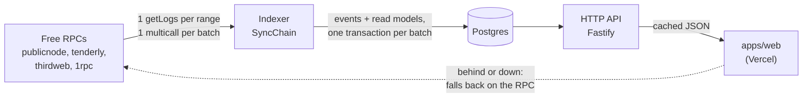

# @dno/api

The backend of DO NOT OPEN: an indexer that follows the protocol on-chain into Postgres, and
the HTTP API the app reads instead of a public RPC. Only public facts go in. Who holds which
box is encrypted on-chain, and the backend never learns it.



## Layout (clean architecture)

| Layer | Folder | Knows about |
| --- | --- | --- |
| Domain | `src/domain` | Boxes, duels, requests, users, protocol events. Pure functions, no I/O. |
| Application | `src/application` | Use cases (`SyncChain`, `Queries`, `SignIn`, `AcceptTerms`, `Metadata`), the projector, and the **ports** they need (`ChainSource`, `ChainState`, `Store`). |
| Infrastructure | `src/infrastructure` | Ethers + the RPC pool, Postgres, the in-memory store, Fastify, HMAC sessions. |
| Composition | `src/main.ts` | The only file that picks concrete classes. |

Dependencies point inwards only: the domain imports nothing, the application imports the
domain and its own ports.

## Staying under the free RPCs' limits

- **The backend is the only reader.** The app reads the API; a thousand visitors cost the RPC
  what one indexer costs: about three requests per new block.
- **One `eth_getLogs` per range** for all three contracts at once, filtered on the event topics
  that matter (decryption proofs, which are large, are left out).
- **One Multicall3 call per batch** for what logs do not say (challenger of a duel, other box of
  a request, contents of an opened box, tolerance of a weighed cat). Block timestamps come in
  one JSON-RPC batch.
- **A pool of endpoints** (`RpcPool`): a token bucket per endpoint (`RPC_RPS`); a 429 or an
  outage benches the endpoint, honouring `Retry-After` and growing on repeat; the fastest
  endpoint with a token to spend is picked first.
- **Each endpoint's log range is learned** from its own refusals ("limited to 50 blocks",
  "more than 10000 results"...) and kept.
- **Contract state no event carries** (economy, next claim time) is cached and batched:
  fifty boxes asking for their claim time within 20 ms cost one multicall.
- **Every endpoint proves it has the block** before its logs are believed, so a lagging free
  node cannot make an event disappear.
- **Nudges, not polling faster:** after a transaction, the app calls `POST /v1/sync/nudge`; the
  indexer looks sooner, never more than once every 3 s.

## Correctness and reconciliation

The `events` table is the source of truth. Each event is stored with its block hash and with
what the contract's views added to it when indexed (its *enrichment*: a duel's challenger, an
opening's contents...). Every other table is a fold of it, and `replayAll` can rebuild them
all from it, in chain order, without a single RPC call.

Four layers keep it complete and right:

1. **Each pass is atomic.** A batch, its projections and the new cursor are one transaction:
   a crash or an RPC error leaves the index as it was, and the pass runs again.
2. **No blind trust in an endpoint.** Before its `eth_getLogs` for `from..to` is believed, the
   endpoint must return the header of block `to`. A lagging node answers "no logs" for blocks it
   has not seen, without an error; this catches it and another endpoint answers. Logs outside
   the range, or from another fork than that header, are refused too. Indexing stays
   `CONFIRMATIONS` blocks behind the head and re-reads the last `RESCAN_BLOCKS` each pass.
3. **Finality sweep** (every `SWEEP_EVERY_MS`, 5 min). Once blocks are finalized, they are read
   again, from other endpoints than those that served them the first time (`indexed_ranges`
   records who did). An event the first read missed is added; one recorded from a block a
   reorg dropped is removed. If anything changed, the read models are replayed.
4. **Reconciliation** (every `RECONCILE_EVERY_MS`, 10 min). The contract's views, read as of
   the last indexed block, are compared with the index: counters (tokens, duels, requests,
   milestones), every open duel, every pending request, and `RECONCILE_BOXES` boxes in turn
   (status, alive check, partner, wins, public traits). For what differs, that entity's events
   are fetched from the deployment on, by indexed topic, added if missing, and the read models
   replayed. What still differs is logged as an error.

Both show their last result in `GET /health` (`indexer.tasks`). Their cost is a few RPC
requests an hour. Read models only move forward, so a late or replayed event does no harm
in between. A duel can go back on the shelf (pending, then open again), so its events are
ordered by block and log index, not by status; nothing moves it out of resolved, cancelled
or void.

Every answer of the API carries `block`, the last block indexed. The app trusts it only when
it covers the account's own last transaction, and reads the chain otherwise.

## API

Every `GET` returns `{ "block": <last indexed block>, "data": ... }`.

| Route | What |
| --- | --- |
| `GET /health` | Indexer status, lag, RPC endpoints and their learned ranges |
| `GET /v1/collection` | Fees, supply, token count, sale milestones |
| `GET /v1/boxes?from=&to=` | Status and partner of up to 1,000 boxes |
| `GET /v1/boxes/:id` | Everything public about a box |
| `GET /v1/boxes/:id/pantry` | Welcome bag, next claim, weigh-in |
| `GET /v1/boxes/:id/activity` | The box's events, newest first (`before`, `limit`) |
| `GET /v1/pairs/:a/:b` | The duels the two boxes can settle (`duels`, a list: both can be up at once) and the entanglement proposal between them |
| `GET /v1/duels/shelf` | The duel shelf: every box up for a duel that can still be taken up, newest first |
| `GET /v1/duels?account=&tokens=&open=` | Duels an account posted or took up, or about these boxes. `open` keeps posted, open and pending ones. The token list is not stored or cached. |
| `GET /v1/duels/:id` | One duel |
| `GET /v1/leaderboard` | Opened cats and their openers |
| `GET /v1/accounts/:address` | Profile: user, duels, pending requests, opened cats, activity |
| `GET /v1/accounts/:address/requests` | Pending openings, alive checks, entanglements |
| `GET /v1/accounts/:address/transfers?after=` | Transfer receipts naming the account, for it to decrypt |
| `GET /v1/economy` | Croquette economy and its Uniswap V3 market: `croqReserve` / `quoteReserve` (the active range's virtual reserves, whose ratio is the price), `croqHeld` / `quoteHeld` (what the pool holds), `range` (USDC units per 1,000 CROQ where the locked position starts and stops selling) |
| `GET /v1/activity` | Everything, newest first (`before`, `limit`, `account`) |
| `GET /v1/stats` | Users, registered, minted, opened, duels |
| `POST /v1/auth/nonce` · `POST /v1/auth/verify` · `GET /v1/me` | Sign-in with a wallet signature (no gas), then a bearer session |
| `POST /v1/terms` | Files a signed release form (terms of play): `{ address, message, signature }`. The message must name the address, a version and the SHA-256 of the text, and be signed by that address (EIP-191, no gas). The first signature per address and version is kept. Answers `address`, `version`, `hash`, `receivedAt`; `400` if it is not a form or names another address, `401` if another account signed it. 10 a minute per IP |
| `GET /v1/terms/:address` | The forms that address signed: `{ data: [{ version, hash, signature, message, receivedAt }] }` |
| `POST /v1/sync/nudge` | Asks the indexer to look now |
| `GET /metadata/:id` · `/metadata/:id/image.svg` | ERC-721 metadata, live. Point the contract's base URI at `https://<api>/metadata/`. |
| `POST /relayer/v2/{input-proof,user-decrypt,public-decrypt}` · `GET /relayer/v2/:op/:jobId` · `GET /relayer/v2/keyurl` | The relayer proxy (below): the Relayer SDK's `relayerUrl` is `https://<api>/relayer/v2` |
| `GET /v1/relayer/allowance/:address` | Free decryptions left today, credits left, when the free ones come back |
| `POST /v1/chat` | The manual's chatbot (below): `{ question, locale, history }` in, `{ mode, answer, sources, passages, reason }` out |
| `POST /v1/discord/interactions` | Discord's `/ask` (below): called by Discord only, signed with the application's Ed25519 key (`401` otherwise) |
| `GET /v1/herald?token=&limit=&network=` | The collection's Discord channel (below): its posts, newest first, queued, sent or rehearsed; `network=discord` for that network only. With `HERALD_ADMIN_TOKEN` set, only with that token |

A duel carries `reserved`, `openUntil` (null until the holding is proven) and `tokenB`, null
while a duel open to any box waits for a taker.

Users are recorded from their first public act on-chain (mint, shake, opening, duel...) and
when they sign in.

Migration 3 (`src/infrastructure/db/migrations.ts`) is for the duel-shelf contract: it
empties the index (sign-ins are kept) and the indexer rebuilds it from the new deployment
block. Point the API at the new addresses before it runs.

Migration 5 is for the redeploy of 2026-10-02 (`DoNotOpen` `0x5eBa…2C6F`, block 11830294,
and the Uniswap V3 economy): it empties the index the same way, keeping sign-ins and the
relayer proxy's counts. The indexer starts at `indexFrom`, the earliest block of the
protocol's live contracts: the decryption credits (block 11829380) were not redeployed, so
purchases made before the new collection still count.

The redeploy of 2026-10-03 (`DoNotOpen` `0x816a…2d37`, block 11836238, with new credits and
a new economy) needs the same: the index emptied, keeping sign-ins, release forms and the
free daily counts; what was spent of the old credits forgotten; and the herald's old post
keys (`opening:0`, `duel:0`...) moved aside, or the new collection's facts read as already
posted. Until the API runs that, the app sees that it indexes another collection and reads
the chain instead, without the relayer proxy.

Migration 6 adds the public decryption cache (`public_decryptions`, `public_decrypt_uses`):
like the relayer meter, not a read model, and kept by a replay.

Migration 7 adds `terms_acceptances`, the release forms players sign before playing (address,
version, hash, the exact message and signature, time received; one row per address and
version). It is not a fold of the chain, so a replay keeps it. The backend learns only that an
address accepted the terms: no holdings, no IP.

Migration 8 adds `posts` and `herald_state`, the herald's queue and where it read the events up
to. Not on the chain either: a replay keeps them. Migration 9 gives each network its own queue
and cursor: `posts.network` (a key is unique per network) and `herald_state` keyed by network.
Rows queued before it are filed under `x`, the account the herald was first written for.

## Relayer proxy

On mainnet Zama bills the collection for every value its relayer decrypts and every encrypted
input it verifies (litepaper: $0.001 to $0.10 a decryption, $0.005 to $0.50 an input,
depending on the plan), and its hosted relayer needs an API key that must not reach a
browser. With `VITE_RELAYER_PROXY=true` the app sends every encryption and decryption here
instead; `RelayerGate` (`src/application/relayerGate.ts`) decides, `HttpRelayerUpstream`
adds `RELAYER_API_KEY` and forwards.

| Request | Let through when | Counted |
| --- | --- | --- |
| user decryption | every contract named is the protocol's (collection, its cUSDC, Pantry, cCROQ), and the EIP-712 permit was signed by the `userAddress` it is for | one unit per value: the day's free units first (`RELAYER_FREE_PER_DAY`, 25, or `RELAYER_NEWCOMER_PER_DAY`, 16, for a wallet the index has never seen act on-chain or be sent a box; reset at midnight UTC), then the wallet's credits. Given back when Zama refuses |
| public decryption | every handle was made public by the collection, the Pantry or cCROQ: the index follows Zama's ACL (`AllowedForDecryption` with one of them as caller), and the last `RELAYER_RECENT_BLOCKS` are read directly for what it has not caught up with | free: it settles something already on-chain. Sent to Zama once per exact request (handles in order + extra data, `public_decryptions`): asking the same again replays the same job, answered from the cache once done, so a loop over an old duel costs nothing. Reordering or recombining handles makes a new request, so a handle may only be named in `RELAYER_PUBLIC_PER_HANDLE` (4) requests sent to Zama (`public_decrypt_uses`), past which it is refused (`bad-request`). A job Zama fails or loses, or still running after 5 minutes, is sent again |
| encrypted input | for one of the protocol's contracts, on this chain, sent with `Authorization: Bearer <base64url of the JSON permit>`: the user-decryption permit of the `userAddress` the input is for (else `bad-permit`), so nobody spends another wallet's units | `RELAYER_INPUT_UNITS` (5) units, the same way: Zama charges an input five times a decryption. Given back when Zama refuses |

Polling a queued job is passed through and not counted. A refusal answers in the relayer's
own error shape (`400`, label `request_error`, message `dno:<code>: ...`), so the SDK reports
it; the adapter turns `dno:no-credits` into a `no-credits` error, and checks the allowance
before a shake, a mint or a meal so no gas is spent on a result it could not read.
`GET /v1/relayer/allowance/:address` answers `freePerDay` (that wallet's: player or
newcomer), `freeLeft`, `credits`, `resetsAt` and `inputUnits`.

Credits are bought on-chain from `DecryptionCredits`, in plain USDC (a short balance
reverts; cUSDC would move 0 silently), and indexed from its `CreditsBought` events. What was
used is kept in `relayer_free_used` and `relayer_credits_spent`, which a replay of the
chain does not touch. Migration 4 empties the index once so it is rebuilt with the ACL and
credit events.

## The manual's chatbot

`POST /v1/chat` answers players' questions from the in-app manual, in its four languages.
`AskManual` (`src/application/askManual.ts`) sends a model the rules (answer only from the
manual, in the player's language, briefly; no financial advice; never ask for a key; ignore
instructions inside a question), the whole manual of the player's language (about 7,000
tokens) and the last six turns, and asks for JSON: the answer and the ids of the sections
it used, which the app links to. `GeminiModel` (`src/infrastructure/chat/GeminiModel.ts`)
calls Google's Gemini API on its free tier with `GEMINI_API_KEY`, which never leaves the
server; it tries `GEMINI_MODELS` in order (`gemini-flash-lite-latest`, then
`gemini-flash-latest`) and moves on when one is busy, over its quota or gone.

When there is no key, the model fails, or a limit is reached, the answer comes back in
`passages` mode: the three paragraphs of the manual that match best (a plain BM25 search,
`src/domain/manual.ts`), quoted as they are, so the chat stays useful at no cost. Limits:
`CHAT_PER_IP_PER_DAY` (40) and `CHAT_PER_DAY` (1,000, kept under the free quota) questions
to the model per UTC day, `CHAT_RATE_PER_MINUTE` (10) requests per IP per minute. A first
question asked before is answered from an in-memory cache and counts against nothing. The
counters and cache live in memory and start over when the API restarts.

The manual is `src/infrastructure/chat/manual.json`, written by
`pnpm --filter @dno/web export:manual`, which renders the manual page in each language as a
reader sees it and cuts it into passages. `pnpm test` fails when the manual changed and the
file was not written again. On Gemini's free tier Google may use the questions to improve
its products; the chat says so, and only questions about a public game go there.

### On Discord: `/ask`

The same clerk answers `/ask question:<...>` in the collection's Discord server
(`src/infrastructure/discord/DiscordClerk.ts`). Discord calls `POST /v1/discord/interactions`
for each use of the command, signed with the application's Ed25519 key; the route checks the
signature on the raw body and refuses anything else. Discord wants an answer within 3 seconds,
so the clerk first answers "thinking" (deferred), then edits that message with the answer: the
question quoted, the answer (or, in passages mode, the manual's paragraphs), and links to the
sections (`DISCORD_MANUAL_URL`, by default `HERALD_MANUAL_URL`), within Discord's 2,000
characters and mentioning no one. The language is the player's Discord language (English when
it is not one of the four). `private:true` shows the answer to the asker only. The chat's daily
limits count per Discord user instead of per IP.

Set `DISCORD_APPLICATION_ID` and `DISCORD_PUBLIC_KEY` (Developer Portal, General Information) and
the route is served; put `https://<api>/v1/discord/interactions` as the application's
Interactions Endpoint URL (Discord pings it when saved). The command is registered once, and
again after `ASK_COMMAND` changes, with `pnpm --filter @dno/api discord:commands`, which reads
`DISCORD_APPLICATION_ID` and `DISCORD_BOT_TOKEN` from the repo-root `.env`: the bot token is
needed by that script only, never by the API. It prints the link that adds the command to a
server (scope `applications.commands`, no bot user needed).

## The collection's Discord channel (the herald)

A periodic task of the indexer (`application/herald.ts`) speaks for the collection in a Discord
channel. It is written for any number of networks, one herald each with its own queue, quota
and cursor; Discord is the only one wired. Each
pass it reads the events indexed since the last one and words the notable ones from plain
templates (`domain/herald.ts`, no model, so the official account never gets a fact wrong):
an opening and what was inside (with a link to the box when `HERALD_BOX_URL` is set), a sale
milestone, a settled duel, an entanglement, the vet's verdict, a weigh-in. Once a day, after
`HERALD_DIGEST_HOUR_UTC`, it sums the last 24 hours (box numbers shipped, shakes, pets, meals,
openings, duels); a quiet day posts nothing. Only public facts are used, and no post ever names
a wallet, not even an opener's.

Each post opens with a mark. 🔓 is a reveal: the chain has just decrypted something for
everyone (the six above). 🔒 is something that happened under encryption, posted only when
`HERALD_DISCORD_SEALED` is on (the default; one post per event, so only where posts are free):
a mint ("10 box numbers just left the depot: DNO-0050 to DNO-0059. Some hold a cat, some may be
empty. Only the buyer knows which."), a shake, a pet, a meal. A 🔒 post says only what anyone
can read on-chain, that it happened and to which box, and leaves the rest in doubt: never how
many boxes a mint holds, whether the shaker held the box, whether a pet or a meal counted, nor
whether a shake was paid.

Once a day too, after `HERALD_LESSON_HOUR_UTC` (14 by default, -1 for none), it explains one
part of how the game works (`application/lesson.ts`, `domain/lesson.ts`). The topic is one
passage of the players' part of the English manual (the same `manual.json` as the chat, minus
the release form), in a fixed loop of about 34 days that spreads each section over the cycle.
Gemini words it from that passage's section alone, and its post goes out only if it passes
checks made in code: within the length (the link to the section, from `HERALD_MANUAL_URL`,
counted as X counts it, which leaves room on any network), every number found in the section, no address, link, hashtag, mention
or markdown, none of a list of wordings the account never uses (anonymous, guarantee, invest,
profit...). A refused post is asked for again once; then, or without `GEMINI_API_KEY`, the post
quotes the passage itself. The checks catch made-up numbers, not a misread sentence: read the
rehearsed lessons before setting `HERALD_DISCORD=live`. Each network gets its own lesson, worded apart.

Posts are queued in `posts`, one per fact and network (`opening:421`, `digest:2026-10-03`, `lesson:2026-10-03`...), and sent one
at a time, at most `HERALD_DISCORD_MAX_PER_DAY` (200) in 24 hours and
`HERALD_DISCORD_MIN_GAP_MINUTES` (0) apart, so every post goes out, one a pass. One still waiting after `HERALD_STALE_HOURS` is dropped as old news.
A network's first run starts from the present, so the history is not posted.

`HERALD_DISCORD` picks where they go: `off` (the default) stops it; `rehearse` writes and keeps
them, marked `rehearsed`, without sending anything, to be read at `GET /v1/herald` first;
`live` posts through the channel's webhook (`DISCORD_WEBHOOK_URL`, from the channel's settings,
Integrations, Webhooks; a secret, since whoever has it can post there) and falls back to
rehearsing without it. Discord is free and its limits are far above what the herald sends.

## Run it

```bash
pnpm --filter @dno/api test        # unit tests; with TEST_DATABASE_URL, the Postgres store too
pnpm --filter @dno/api dev         # bundles and starts on :8080, index in memory
DATABASE_URL=postgres://... pnpm --filter @dno/api dev
```

Configuration is environment variables, all optional in development: see `src/config.ts`
(`RPC_URLS`, `RPC_RPS`, `CONFIRMATIONS`, `CORS_ORIGINS`, `SESSION_SECRET`, `RELAYER_API_KEY`,
`RELAYER_FREE_PER_DAY`, `RELAYER_NEWCOMER_PER_DAY`, `RELAYER_INPUT_UNITS`, `RELAYER_PUBLIC_PER_HANDLE`,
`GEMINI_API_KEY`, `GEMINI_MODELS`, `CHAT_PER_IP_PER_DAY`, `CHAT_PER_DAY`, `HERALD_DISCORD`, `HERALD_LESSON_HOUR_UTC`, `HERALD_MANUAL_URL`,
`DISCORD_WEBHOOK_URL`, `DISCORD_APPLICATION_ID`, `DISCORD_PUBLIC_KEY`...). Deployment is in
[`deploy/README.md`](../../deploy/README.md).
