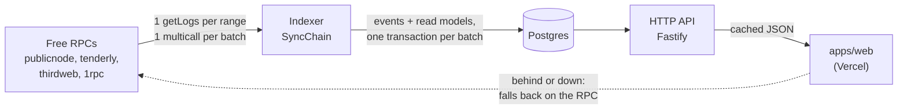

# @dno/api

The backend of DO NOT OPEN: an indexer that follows the protocol on-chain into Postgres, and
the HTTP API the app reads instead of a public RPC. Only public facts go in. Who holds which
box is encrypted on-chain, and the backend never learns it.



## Layout (clean architecture)

| Layer | Folder | Knows about |
| --- | --- | --- |
| Domain | `src/domain` | Boxes, duels, requests, users, protocol events. Pure functions, no I/O. |
| Application | `src/application` | Use cases (`SyncChain`, `Queries`, `SignIn`, `Metadata`), the projector, and the **ports** they need (`ChainSource`, `ChainState`, `Store`). |
| Infrastructure | `src/infrastructure` | Ethers + the RPC pool, Postgres, the in-memory store, Fastify, HMAC sessions. |
| Composition | `src/main.ts` | The only file that picks concrete classes. |

Dependencies point inwards only: the domain imports nothing, the application imports the
domain and its own ports.

## Staying under the free RPCs' limits

- **The backend is the only reader.** The app reads the API; a thousand visitors cost the RPC
  what one indexer costs: about three requests per new block.
- **One `eth_getLogs` per range** for all three contracts at once, filtered on the event topics
  that matter (decryption proofs, which are large, are left out).
- **One Multicall3 call per batch** for what logs do not say (challenger of a duel, other box of
  a request, contents of an opened box, tolerance of a weighed cat). Block timestamps come in
  one JSON-RPC batch.
- **A pool of endpoints** (`RpcPool`): a token bucket per endpoint (`RPC_RPS`); a 429 or an
  outage benches the endpoint, honouring `Retry-After` and growing on repeat; the fastest
  endpoint with a token to spend is picked first.
- **Each endpoint's log range is learned** from its own refusals ("limited to 50 blocks",
  "more than 10000 results"...) and kept.
- **Contract state no event carries** (economy, next claim time) is cached and batched:
  fifty boxes asking for their claim time within 20 ms cost one multicall.
- **Every endpoint proves it has the block** before its logs are believed, so a lagging free
  node cannot make an event disappear.
- **Nudges, not polling faster:** after a transaction, the app calls `POST /v1/sync/nudge`; the
  indexer looks sooner, never more than once every 3 s.

## Correctness and reconciliation

The `events` table is the source of truth. Each event is stored with its block hash and with
what the contract's views added to it when indexed (its *enrichment*: a duel's challenger, an
opening's contents...). Every other table is a fold of it, and `replayAll` can rebuild them
all from it, in chain order, without a single RPC call.

Four layers keep it complete and right:

1. **Each pass is atomic.** A batch, its projections and the new cursor are one transaction:
   a crash or an RPC error leaves the index as it was, and the pass runs again.
2. **No blind trust in an endpoint.** Before its `eth_getLogs` for `from..to` is believed, the
   endpoint must return the header of block `to`. A lagging node answers "no logs" for blocks it
   has not seen, without an error; this catches it and another endpoint answers. Logs outside
   the range, or from another fork than that header, are refused too. Indexing stays
   `CONFIRMATIONS` blocks behind the head and re-reads the last `RESCAN_BLOCKS` each pass.
3. **Finality sweep** (every `SWEEP_EVERY_MS`, 5 min). Once blocks are finalized, they are read
   again, from other endpoints than those that served them the first time (`indexed_ranges`
   records who did). An event the first read missed is added; one recorded from a block a
   reorg dropped is removed. If anything changed, the read models are replayed.
4. **Reconciliation** (every `RECONCILE_EVERY_MS`, 10 min). The contract's views, read as of
   the last indexed block, are compared with the index: counters (tokens, duels, requests,
   milestones), every open duel, every pending request, and `RECONCILE_BOXES` boxes in turn
   (status, alive check, partner, wins, public traits). For what differs, that entity's events
   are fetched from the deployment on, by indexed topic, added if missing, and the read models
   replayed. What still differs is logged as an error.

Both show their last result in `GET /health` (`indexer.tasks`). Their cost is a few RPC
requests an hour. Read models only move forward, so a late or replayed event does no harm
in between. A duel can go back on the shelf (pending, then open again), so its events are
ordered by block and log index, not by status; nothing moves it out of resolved, cancelled
or void.

Every answer of the API carries `block`, the last block indexed. The app trusts it only when
it covers the account's own last transaction, and reads the chain otherwise.

## API

Every `GET` returns `{ "block": <last indexed block>, "data": ... }`.

| Route | What |
| --- | --- |
| `GET /health` | Indexer status, lag, RPC endpoints and their learned ranges |
| `GET /v1/collection` | Fees, supply, token count, sale milestones |
| `GET /v1/boxes?from=&to=` | Status and partner of up to 1,000 boxes |
| `GET /v1/boxes/:id` | Everything public about a box |
| `GET /v1/boxes/:id/pantry` | Welcome bag, next claim, weigh-in |
| `GET /v1/boxes/:id/activity` | The box's events, newest first (`before`, `limit`) |
| `GET /v1/pairs/:a/:b` | The duels the two boxes can settle (`duels`, a list: both can be up at once) and the entanglement proposal between them |
| `GET /v1/duels/shelf` | The duel shelf: every box up for a duel that can still be taken up, newest first |
| `GET /v1/duels?account=&tokens=&open=` | Duels an account posted or took up, or about these boxes. `open` keeps posted, open and pending ones. The token list is not stored or cached. |
| `GET /v1/duels/:id` | One duel |
| `GET /v1/leaderboard` | Opened cats and their openers |
| `GET /v1/accounts/:address` | Profile: user, duels, pending requests, opened cats, activity |
| `GET /v1/accounts/:address/requests` | Pending openings, alive checks, entanglements |
| `GET /v1/accounts/:address/transfers?after=` | Transfer receipts naming the account, for it to decrypt |
| `GET /v1/economy` | Croquette economy, pool reserves |
| `GET /v1/activity` | Everything, newest first (`before`, `limit`, `account`) |
| `GET /v1/stats` | Users, registered, minted, opened, duels |
| `POST /v1/auth/nonce` · `POST /v1/auth/verify` · `GET /v1/me` | Sign-in with a wallet signature (no gas), then a bearer session |
| `POST /v1/sync/nudge` | Asks the indexer to look now |
| `GET /metadata/:id` · `/metadata/:id/image.svg` | ERC-721 metadata, live. Point the contract's base URI at `https://<api>/metadata/`. |

A duel carries `reserved`, `openUntil` (null until the holding is proven) and `tokenB`, null
while a duel open to any box waits for a taker.

Users are recorded from their first public act on-chain (mint, shake, opening, duel...) and
when they sign in.

Migration 3 (`src/infrastructure/db/migrations.ts`) is for the duel-shelf contract: it
empties the index (sign-ins are kept) and the indexer rebuilds it from the new deployment
block. Point the API at the new addresses before it runs.

## Run it

```bash
pnpm --filter @dno/api test        # unit tests; with TEST_DATABASE_URL, the Postgres store too
pnpm --filter @dno/api dev         # bundles and starts on :8080, index in memory
DATABASE_URL=postgres://... pnpm --filter @dno/api dev
```

Configuration is environment variables, all optional in development: see `src/config.ts`
(`RPC_URLS`, `RPC_RPS`, `CONFIRMATIONS`, `CORS_ORIGINS`, `SESSION_SECRET`...). Deployment is in
[`deploy/README.md`](../../deploy/README.md).
