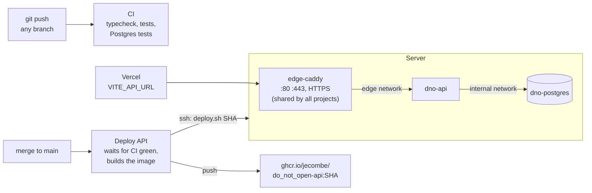

# Deployment

The site stays on Vercel. The backend (`apps/api` + Postgres) runs on one server with Docker,
deployed by GitHub Actions when a change that touches it reaches `main` (a merged PR), and
only once the whole CI is green on that commit: a red `main` deploys nothing.



## The server

- **`/opt/edge`**: the one Caddy that owns ports 80 and 443 and gets the certificates. Every
  project on the server goes through it: it imports `/opt/edge/sites/*.caddy`, one file per
  project, and its containers join the `edge` Docker network. To add another project, give it
  a service on the `edge` network with a unique alias, drop `sites/<project>.caddy` with
  `reverse_proxy <alias>:<port>`, then `docker exec edge-caddy caddy reload --config /etc/caddy/Caddyfile`.
- **`/opt/dno`**: this project. `docker-compose.yml`, `.env` (secrets, made by
  `bootstrap.sh`, never in git), `deploy.sh`, and nightly database dumps in `backups/`.
  Postgres is on an internal network only; no port of this project is published.

Ports to open on the server: **22** (SSH), **80** and **443** (TCP), and **443/UDP**
(HTTP/3, optional). Nothing else: Postgres and the API are not exposed.

## First time on a new server

```bash
scp deploy/bootstrap.sh ubuntu@SERVER:
ssh ubuntu@SERVER 'sudo bash bootstrap.sh <api-domain> "https://do-not-open.vercel.app,https://do-not-open-*.vercel.app"'
```

Without a domain, `<ip-with-dashes>.sslip.io` resolves to the server and gets a real
certificate. Then in GitHub, under Settings, Secrets and variables, Actions:

| Name | Kind | Value |
| --- | --- | --- |
| `DEPLOY_HOST` | secret | the server's IP |
| `DEPLOY_USER` | secret | `ubuntu` |
| `DEPLOY_SSH_KEY` | secret | a private key for CI only, its public half in the server's `authorized_keys` |
| `DEPLOY_KNOWN_HOSTS` | secret | `ssh-keyscan -t ed25519 SERVER` |
| `API_DOMAIN` | variable | the API's domain |

And in Vercel, `VITE_API_URL=https://<api-domain>`. Without it the site reads the RPC as before.

The manual's chatbot answers with Google's Gemini when `/opt/dno/.env` holds
`GEMINI_API_KEY=...` (a free key from https://aistudio.google.com/apikey, on a project with
no billing, so it can never cost anything), then `docker compose up -d api`. Without it, the
chat quotes the manual.

## By hand

```bash
ssh ubuntu@SERVER
cd /opt/dno
docker compose ps
docker compose logs -f api
curl -s https://<api-domain>/health | jq
docker compose exec postgres psql -U dno          # the database
```

A `logdno` shell function is normally set up in the local `~/.zshrc` to stream these logs from
your machine over SSH, without logging in by hand first:

```zsh
# ~/.zshrc
logdno () {
    local service="${1:-api}"
    local lines="${2:-200}"
    ssh vps_zama "cd /opt/dno && docker compose logs -f --tail ${lines} ${service}"
}
```

`logdno` follows the API, `logdno postgres` the database, `logdno api 500` the last 500 lines.
It relies on a `vps_zama` host in `~/.ssh/config` pointing at the server.

Rolling back is deploying an older image: `bash /opt/dno/deploy.sh ghcr.io/jecombe/do_not_open-api:<older-sha>`
(after `docker login ghcr.io`).

Starting the index over (it rebuilds from the chain in a minute or two):
`docker compose exec postgres psql -U dno -c 'drop schema public cascade; create schema public' && docker compose restart api`.
