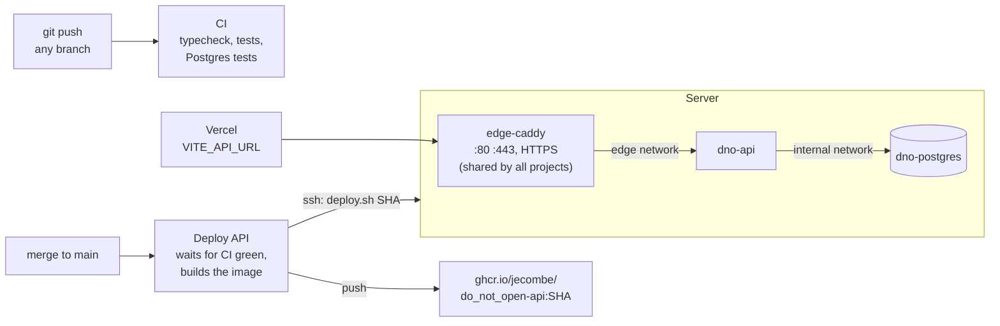

# Deployment

The site stays on Vercel. The backend (`apps/api` + Postgres) runs on one server with Docker,
deployed by GitHub Actions when a change that touches it reaches `main` (a merged PR), and
only once the whole CI is green on that commit: a red `main` deploys nothing.



## The server

- **`/opt/edge`**: the one Caddy that owns ports 80 and 443 and gets the certificates. Every
  project on the server goes through it: it imports `/opt/edge/sites/*.caddy`, one file per
  project, and its containers join the `edge` Docker network. To add another project, give it
  a service on the `edge` network with a unique alias, drop `sites/<project>.caddy` with
  `reverse_proxy <alias>:<port>`, then `docker exec edge-caddy caddy reload --config /etc/caddy/Caddyfile`.
- **`/opt/dno`**: this project. `docker-compose.yml`, `.env` (secrets, made by
  `bootstrap.sh`, never in git), `deploy.sh`, and nightly database dumps in `backups/`.
  Postgres is on an internal network only; no port of this project is published.

Ports to open on the server: **22** (SSH), **80** and **443** (TCP), and **443/UDP**
(HTTP/3, optional). Nothing else: Postgres and the API are not exposed.

## First time on a new server

```bash
scp deploy/bootstrap.sh ubuntu@SERVER:
ssh ubuntu@SERVER 'sudo bash bootstrap.sh api.do-not-open.app "https://do-not-open.app,https://www.do-not-open.app,https://testnet.do-not-open.app,https://do-not-open-*.vercel.app"'
```

Without a domain, `<ip-with-dashes>.sslip.io` resolves to the server and gets a real
certificate. Then in GitHub, under Settings, Secrets and variables, Actions:

| Name | Kind | Value |
| --- | --- | --- |
| `DEPLOY_HOST` | secret | the server's IP |
| `DEPLOY_USER` | secret | `ubuntu` |
| `DEPLOY_SSH_KEY` | secret | a private key for CI only, its public half in the server's `authorized_keys` |
| `DEPLOY_KNOWN_HOSTS` | secret | `ssh-keyscan -t ed25519 SERVER` |
| `API_DOMAIN` | variable | the API's domain |

And in Vercel, `VITE_API_URL=https://<api-domain>`. Without it the site reads the RPC as before.

The manual's chatbot answers with Google's Gemini when `/opt/dno/.env` holds
`GEMINI_API_KEY=...` (a free key from https://aistudio.google.com/apikey, on a project with
no billing, so it can never cost anything), then `docker compose up -d api`. Without it, the
chat quotes the manual.

The token images are stored for good on Arweave when `/opt/dno/.env` holds `ARWEAVE_KEY=0x...`:
a fresh Ethereum key made for this only (`node -e "console.log(require('ethers').Wallet.createRandom().privateKey)"`
from the repo, or any wallet's "create account"), never one with funds. Uploads under 100 KiB
are free on ArDrive's Turbo, so it never needs any. Then `docker compose up -d api`: about 30
images a minute go up, opened cats first, then every minted box. See
[`apps/api/README.md`](../apps/api/README.md#token-images-on-arweave).

The collection speaks in a Discord channel (see [`apps/api/README.md`](../apps/api/README.md#the-collections-discord-channel-the-herald)):
in the channel's settings, Integrations, Webhooks, create one and copy its URL, then add
`HERALD_DISCORD=live` and `DISCORD_WEBHOOK_URL=...` to `/opt/dno/.env` (`HERALD_DISCORD=rehearse`
first to read the posts at `https://<api-domain>/v1/herald?network=discord&token=...`, with
`HERALD_ADMIN_TOKEN` set; `HERALD_BOX_URL=https://<site>/app.html?box=` and
`HERALD_MANUAL_URL=https://<site>/docs.html` for links, the daily lesson worded with `GEMINI_API_KEY`). The manual's chatbot answers `/ask` in the server too: create an
application at https://discord.com/developers/applications, add its `DISCORD_APPLICATION_ID` and
`DISCORD_PUBLIC_KEY` to `/opt/dno/.env`, run `docker compose up -d api`, set the Interactions
Endpoint URL to `https://<api-domain>/v1/discord/interactions`, then, from a machine with the
repo and `DISCORD_BOT_TOKEN` in its `.env`, run `pnpm --filter @dno/api discord:commands` and open
the link it prints to add the command to the server. All in
[`apps/api/README.md`](../apps/api/README.md#on-discord-ask).

## Domains

| Name | Serves | DNS record |
| --- | --- | --- |
| `do-not-open.app` | the site (Vercel), mainnet once it launches, Sepolia until then | `A 76.76.21.21` |
| `www.do-not-open.app` | redirects to `do-not-open.app` (Vercel) | `CNAME cname.vercel-dns.com` |
| `testnet.do-not-open.app` | the site on Sepolia (Vercel) | `A 76.76.21.21` (a CNAME clashes with the registrar's mail records) |
| `api.do-not-open.app` | the API (`API_DOMAIN`) | `A` the server's IP |
| `api.testnet.do-not-open.app` | the same API for now (`API_ALIASES`) | `A` the server's IP |

Only one network runs today, so both site names are the same Vercel build and both API names
reach the same container. Remove the registrar's default parking records (`A` and `AAAA` on
each name) before adding these: Let's Encrypt tries IPv6 first and would fail on a parking
address. At the mainnet launch, `api.do-not-open.app` moves to a mainnet API, the testnet site
gets its own Vercel project with `VITE_API_URL=https://api.testnet.do-not-open.app`, and this
stack takes a per-network container name and Caddy file.

Every API name gets its own certificate from Caddy, and plain HTTP redirects to HTTPS. In
`/opt/dno/.env`:

```bash
API_DOMAIN=api.do-not-open.app
API_ALIASES=api.testnet.do-not-open.app        # space or comma separated
SIGN_IN_DOMAIN=do-not-open.app                 # the name shown in the sign-in message
CORS_ORIGINS=https://do-not-open.app,https://www.do-not-open.app,https://testnet.do-not-open.app,https://do-not-open-*.vercel.app
```

then `bash /opt/dno/deploy.sh <current image>` (or the next deploy) renders the Caddy file
and reloads the proxy. The GitHub variable `API_DOMAIN` is the name CI smoke-tests.

## By hand

```bash
ssh ubuntu@SERVER
cd /opt/dno
docker compose ps
docker compose logs -f api
curl -s https://<api-domain>/health | jq
docker compose exec postgres psql -U dno          # the database
```

A `logdno` shell function is normally set up in the local `~/.zshrc` to stream these logs from
your machine over SSH, without logging in by hand first:

```zsh
# ~/.zshrc
logdno () {
    local service="${1:-api}"
    local lines="${2:-200}"
    ssh vps_zama "cd /opt/dno && docker compose logs -f --tail ${lines} ${service}"
}
```

`logdno` follows the API, `logdno postgres` the database, `logdno api 500` the last 500 lines.
It relies on a `vps_zama` host in `~/.ssh/config` pointing at the server.

Rolling back is deploying an older image: `bash /opt/dno/deploy.sh ghcr.io/jecombe/do_not_open-api:<older-sha>`
(after `docker login ghcr.io`).

Starting the index over (it rebuilds from the chain in a minute or two):
`docker compose exec postgres psql -U dno -c 'drop schema public cascade; create schema public' && docker compose restart api`.
