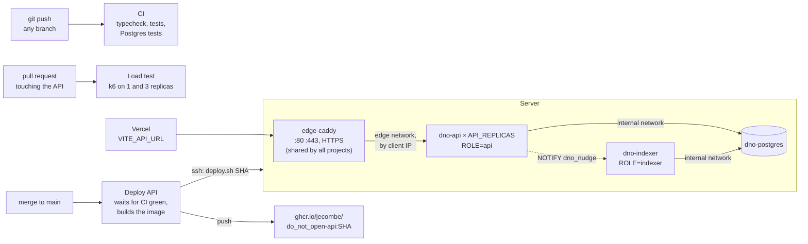

# Deployment

The site stays on Vercel. The backend (`apps/api` + Postgres) runs on one server with Docker,
deployed by GitHub Actions when a change that touches it reaches `main` (a merged PR), and
only once the whole CI is green on that commit: a red `main` deploys nothing.



## The server

- **`/opt/edge`**: the one Caddy that owns ports 80 and 443 and gets the certificates. Every
  project on the server goes through it: it imports `/opt/edge/sites/*.caddy`, one file per
  project, and its containers join the `edge` Docker network. To add another project, give it
  a service on the `edge` network with a unique alias, drop `sites/<project>.caddy` with
  `reverse_proxy <alias>:<port>`, then `docker exec edge-caddy caddy reload --config /etc/caddy/Caddyfile`.
- **`/opt/dno`**: this project. `docker-compose.yml`, `.env` (secrets, made by
  `bootstrap.sh`, never in git), `deploy.sh`, and nightly database dumps in `backups/`.
  Postgres is on an internal network only; no port of this project is published.

Ports to open on the server: **22** (SSH), **80** and **443** (TCP), and **443/UDP**
(HTTP/3, optional). Nothing else: Postgres and the API are not exposed.

## First time on a new server

```bash
scp deploy/bootstrap.sh ubuntu@SERVER:
ssh ubuntu@SERVER 'sudo bash bootstrap.sh api.do-not-open.app "https://do-not-open.app,https://www.do-not-open.app,https://testnet.do-not-open.app,https://do-not-open-*.vercel.app"'
```

Without a domain, `<ip-with-dashes>.sslip.io` resolves to the server and gets a real
certificate. Then in GitHub, under Settings, Secrets and variables, Actions:

| Name | Kind | Value |
| --- | --- | --- |
| `DEPLOY_HOST` | secret | the server's IP |
| `DEPLOY_USER` | secret | `ubuntu` |
| `DEPLOY_SSH_KEY` | secret | a private key for CI only, its public half in the server's `authorized_keys` |
| `DEPLOY_KNOWN_HOSTS` | secret | `ssh-keyscan -t ed25519 SERVER` |
| `API_DOMAIN` | variable | the API's domain |

And in Vercel, `VITE_API_URL=https://<api-domain>`. Without it the site reads the RPC as before.

The manual's chatbot answers with Google's Gemini when `/opt/dno/.env` holds
`GEMINI_API_KEY=...` (a free key from https://aistudio.google.com/apikey, on a project with
no billing, so it can never cost anything), then `bash /opt/dno/deploy.sh` (the running image again, replica by replica). Without it, the
chat quotes the manual.

The token images are stored for good on Arweave when `/opt/dno/.env` holds `ARWEAVE_KEY=0x...`:
a fresh Ethereum key made for this only (`node -e "console.log(require('ethers').Wallet.createRandom().privateKey)"`
from the repo, or any wallet's "create account"), never one with funds. Uploads under 100 KiB
are free on ArDrive's Turbo, so it never needs any. Then `bash /opt/dno/deploy.sh`: about 30
images a minute go up, opened cats first, then every minted box. See
[`apps/api/README.md`](../apps/api/README.md#token-images-on-arweave).

The studio draws rats with fal.ai when `/opt/dno/.env` holds `FAL_KEY=...` and the network's
deployment has a `StudioPacks` address (`dno:export` writes it), then `bash /opt/dno/deploy.sh`.
The key bills real dollars: `STUDIO_DAILY_BUDGET_USD` (20 by default) caps the estimated spend a
day, `STUDIO_PAUSED=true` closes the studio at once, and on Sepolia, where packs are paid in test
USDC, `STUDIO_ALLOWLIST=0x...,0x...` keeps generation to testers. Deploy `StudioPacks` and this
API before the first pack is sold. Grafana's "The studio" row shows it open or off, packs sold,
USDC brought in, the estimated AI cost and the margin, today's budget used, and jobs by status;
Discord is told when the budget passes 80% or runs out, when over 30% of an hour's generations
fail, when jobs pile up in fal's queue, when the studio is off with packs sold, and when the AI
has cost more than the packs brought in. See [`apps/api/README.md`](../apps/api/README.md#the-studio).

The rats need `RATS_ATTESTER_KEY=0x...` in `/opt/dno/.env` (a fresh key; its address is
`RATS_ATTESTER` when `Rats` is deployed) and `ARWEAVE_KEY`: an AI rat's picture is shrunk to a
free Arweave upload like a cat's, and its 3D model stays in Postgres (`rat_models`, in the
nightly dump), so no Turbo credits are needed. `SITE_URL=https://do-not-open.app` links the studio
from each rat's metadata. Ship the API that knows the `Rats` address before the first rat is
minted. See [`apps/api/README.md`](../apps/api/README.md#the-depots-rats).

The collection speaks in a Discord channel (see [`apps/api/README.md`](../apps/api/README.md#the-collections-discord-channel-the-herald)):
in the channel's settings, Integrations, Webhooks, create one and copy its URL, then add
`HERALD_DISCORD=live` and `DISCORD_WEBHOOK_URL=...` to `/opt/dno/.env` (`HERALD_DISCORD=rehearse`
first to read the posts at `https://<api-domain>/v1/herald?network=discord&token=...`, with
`HERALD_ADMIN_TOKEN` set; `HERALD_BOX_URL=https://<site>/app?box=` and
`HERALD_MANUAL_URL=https://<site>/docs` for links, the daily lesson worded with `GEMINI_API_KEY`). The manual's chatbot answers `/ask` in the server too: create an
application at https://discord.com/developers/applications, add its `DISCORD_APPLICATION_ID` and
`DISCORD_PUBLIC_KEY` to `/opt/dno/.env`, run `bash /opt/dno/deploy.sh`, set the Interactions
Endpoint URL to `https://<api-domain>/v1/discord/interactions`, then, from a machine with the
repo and `DISCORD_BOT_TOKEN` in its `.env`, run `pnpm --filter @dno/api discord:commands` and open
the link it prints to add the command to the server. All in
[`apps/api/README.md`](../apps/api/README.md#on-discord-ask).

## Replicas and load balancing

The API runs as `API_REPLICAS` replicas (2 by default, in `/opt/dno/.env`) with `ROLE=api`,
and one indexer with `ROLE=indexer`, all from the same image (`docker-compose.yml`). The
replicas share the alias `dno-api` on the `edge` network; Docker's DNS answers every one of
them, and the edge Caddy (`dno.caddy.template`) reads that list every 2 s:

- **One client IP, one replica** (`lb_policy client_ip_hash`). The rate limits and the chat's
  per-IP quota are counted in each process, and stay exact because an IP always lands on the
  same replica. What one replica starts and another may finish (a Sign in with X, a `/board`
  code, the chat's daily total, a nudge to the indexer) is shared through Postgres
  ([`apps/api/README.md`](../apps/api/README.md#several-replicas)).
- **A replica that refuses connections** is left out for 30 s, and the request tries another
  one for up to 5 s (a `GET` always; any method when the connection itself failed). Caddy does
  not run active health checks on DNS upstreams: `deploy.sh` checks each new replica itself.
- **Deploys drop no request.** `deploy.sh` starts the new replicas beside the old ones, waits
  until each answers `/health`, gives the proxy 5 s to see them, then stops the old ones, which
  finish what they hold (`SIGTERM`, up to 30 s). A new replica that never answers is removed and
  the old ones keep serving. The indexer is replaced last: indexing pauses a few seconds, nothing
  the public sees. During the overlap the old replicas run against the new schema, so a
  migration must keep the previous release working.
- **How many.** One Node process uses one core: a replica per core the server can spare, each
  capped at 512 MiB, plus the indexer's 512 MiB. `API_REPLICAS=3` in `/opt/dno/.env`, then
  `bash /opt/dno/deploy.sh`. Grafana's "API replicas" row says when one is full (its CPU near
  100%, its event loop lagging: the `ApiEventLoopBlocked` alert).
- **Measured, not guessed.** `.github/workflows/loadtest.yml` runs the same proxy settings in
  front of 1 and 3 replicas on every pull request that touches the API, and fails it when reads
  get slow ([`loadtest/README.md`](../loadtest/README.md)).

## Monitoring

`deploy/monitoring` is one stack for every network: Prometheus scrapes the `/metrics` of each
API replica and of the indexer over the `edge` network, found by DNS (`dno-api`, `dno-indexer`;
one job per network in `prometheus/prometheus.yml`, the mainnet one commented out until launch),
each labelled `role` (`api` or `indexer`), the server (node-exporter), its containers
(cAdvisor) and the public URLs (blackbox, one file per network in `prometheus/probes/`).
Every series carries `network` (`sepolia`, `mainnet`, or `server` for what they share).
Grafana shows two dashboards with a network picker, "Protocol" (collection, proofs waiting,
indexer, RPC pool, API replicas (up, traffic and p95 per replica, CPU, memory, event loop lag,
restarts, the image each runs), API traffic, Zama relayer calls, Arweave, Gemini, herald, the mainnet whitelist
(seats taken, boarding funnel, tasks on X, Sign in with X outcomes, ideas), the studio) and "Server and
URLs"; Alertmanager posts the alerts of `prometheus/alerts.yml` to a private Discord channel,
each titled with its network: a replica down (`ApiReplicaDown`, the others carry its traffic),
none left (`ApiNoReplica`), the indexer down (`IndexerDown`), a process restarting over and over
(`ApiRestarting`), a saturated replica (`ApiEventLoopBlocked`), among the others. The same
channel follows what players do (the `activity` group, posted with ✨ and no "resolved"
message): new boarding passes, X accounts connected, seats taken, whitelist claims, ideas, new
addresses, boxes sold and opened, duels, milestones, rats, studio packs and traffic spikes, each
compared with 15 minutes earlier and posted again every 30 minutes while it lasts; a 🗞️ recap of
the last 24 hours at 08:00 UTC, which also proves once a day that alerts still reach Discord; and
`SiteQuiet` when nobody has called the API for 6 hours. For each player by name (their X handle:
X connected, tasks, seat, wallet, `/board`, whitelist claim, idea), the API posts there itself
when `/opt/dno/.env` sets `ACTIVITY_DISCORD_WEBHOOK_URL` to the same webhook
([`apps/api/README.md`](../apps/api/README.md#the-teams-activity-feed)). Only Grafana is public, behind its own login; the edge proxy
answers `404` to `/metrics` from outside. About 1.2 GB of memory at most (limits in the compose
file), 5 GB of disk for 90 days of series.

To turn it on, once:

1. An A record `monitoring` → the server's IP (IONOS).
2. A webhook on a private Discord channel (channel settings, Integrations, Webhooks).
3. On the server, `/opt/dno/monitoring/.env` from `deploy/monitoring/.env.example`
   (`MONITORING_DOMAIN`, `GRAFANA_ADMIN_PASSWORD`, `ALERT_DISCORD_WEBHOOK_URL`), `chmod 600`.
4. The next deploy (or `bash /opt/dno/deploy.sh`) starts the stack and routes
   the domain; Grafana is at `https://<MONITORING_DOMAIN>`, folder "DO NOT OPEN".

CI copies `deploy/monitoring` on every deploy and reloads Prometheus and Alertmanager; the
`.env` stays on the server. Dashboards are written by `grafana/dashboards.py`. At mainnet
launch: uncomment the `dno-api-mainnet` job in `prometheus/prometheus.yml` and rename
`probes/mainnet.yml.example` (the mainnet replicas and indexer on the edge network as
`dno-api-mainnet` and `dno-indexer-mainnet`), and move the apex probe out of Sepolia.

## The admin site

`apps/admin` is the team's dashboard, on its own domain behind one password: the whitelist's
seats and pace, the boarding funnel (where people drop off), each day's figures with their week
over week change, the players by X handle (a linked wallet shown only on a click, which is
logged), the ideas, the chain's public activity and when players are around. The API image carries
the built app and serves it under `/admin` when `ADMIN_PASSWORD` is set; `dno-admin.caddy.template`
routes the domain there, and the public API's domain answers `404` to `/admin`. A session is a
signed cookie (7 days; a new password ends them all), and sign-in attempts are limited to 5 a
minute per IP. To turn it on, once:

1. An A record `admin` → the server's IP.
2. In `/opt/dno/.env`: `ADMIN_DOMAIN=admin.do-not-open.app` and `ADMIN_PASSWORD=` a long random
   one (`openssl rand -base64 24`), shared with the team.
3. `bash /opt/dno/deploy.sh` (or the next deploy): Caddy gets the certificate, the site is at
   `https://admin.do-not-open.app`.

It reads Postgres directly, so its history goes back to the first event, unlike Prometheus;
Grafana stays the place for the server and the API's health.

## Domains

| Name | Serves | DNS record |
| --- | --- | --- |
| `do-not-open.app` | the site (Vercel), mainnet once it launches, Sepolia until then | `A 76.76.21.21` |
| `www.do-not-open.app` | redirects to `do-not-open.app` (Vercel) | `CNAME cname.vercel-dns.com` |
| `testnet.do-not-open.app` | the site on Sepolia (Vercel) | `A 76.76.21.21` (a CNAME clashes with the registrar's mail records) |
| `api.do-not-open.app` | the API (`API_DOMAIN`) | `A` the server's IP |
| `api.testnet.do-not-open.app` | the same API for now (`API_ALIASES`) | `A` the server's IP |
| `admin.do-not-open.app` | the team's admin site (`ADMIN_DOMAIN`) | `A` the server's IP |
| `monitoring.do-not-open.app` | Grafana (`MONITORING_DOMAIN`) | `A` the server's IP |

Only one network runs today, so both site names are the same Vercel build and both API names
reach the same replicas. Remove the registrar's default parking records (`A` and `AAAA` on
each name) before adding these: Let's Encrypt tries IPv6 first and would fail on a parking
address. At the mainnet launch, `api.do-not-open.app` moves to a mainnet API, the testnet site
gets its own Vercel project with `VITE_API_URL=https://api.testnet.do-not-open.app`, and this
stack takes per-network aliases and a Caddy file.

Every API name gets its own certificate from Caddy, and plain HTTP redirects to HTTPS. In
`/opt/dno/.env`:

```bash
API_DOMAIN=api.do-not-open.app
API_ALIASES=api.testnet.do-not-open.app        # space or comma separated
SIGN_IN_DOMAIN=do-not-open.app                 # the name shown in the sign-in message
CORS_ORIGINS=https://do-not-open.app,https://www.do-not-open.app,https://testnet.do-not-open.app,https://do-not-open-*.vercel.app
```

then `bash /opt/dno/deploy.sh` (or the next deploy) renders the Caddy file
and reloads the proxy. The GitHub variable `API_DOMAIN` is the name CI smoke-tests.

## By hand

```bash
ssh ubuntu@SERVER
cd /opt/dno
docker compose ps
docker compose logs -f api          # every replica, each line prefixed with its container
docker compose logs -f indexer
curl -s https://<api-domain>/health | jq
docker compose exec postgres psql -U dno          # the database
```

A `logdno` shell function is normally set up in the local `~/.zshrc` to stream these logs from
your machine over SSH, without logging in by hand first:

```zsh
# ~/.zshrc
logdno () {
    local service="${1:-api}"
    local lines="${2:-200}"
    ssh vps_zama "cd /opt/dno && docker compose logs -f --tail ${lines} ${service}"
}
```

`logdno` follows the API replicas, `logdno indexer` the indexer, `logdno postgres` the database, `logdno api 500` the last 500 lines.
It relies on a `vps_zama` host in `~/.ssh/config` pointing at the server.

Rolling back is deploying an older image: `bash /opt/dno/deploy.sh ghcr.io/jecombe/do_not_open-api:<older-sha>`
(after `docker login ghcr.io`).

Each deploy keeps the running API image and the two before it on the server and deletes older
ones (every deploy pulls a new `:<sha>` tag, which `docker image prune` alone never removes). An
older rollback pulls its image again.

Starting the index over (it rebuilds from the chain in a minute or two):
`docker compose exec postgres psql -U dno -c 'drop schema public cascade; create schema public' && docker compose restart indexer api`.
