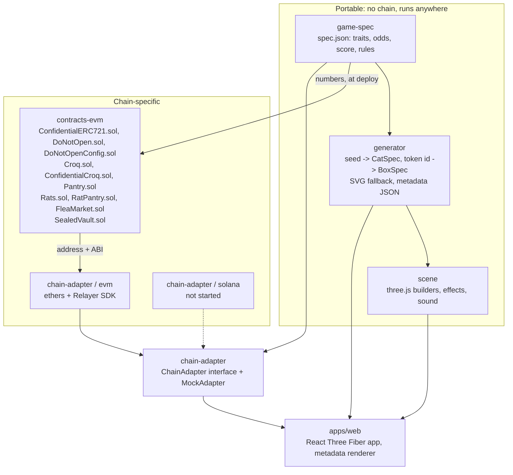
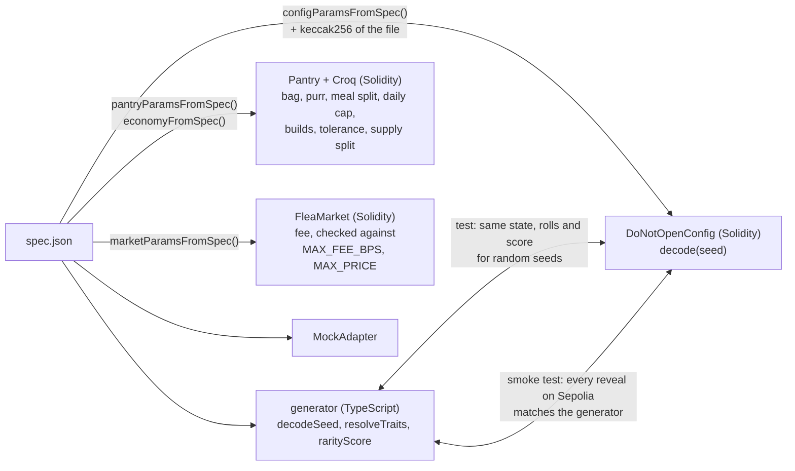
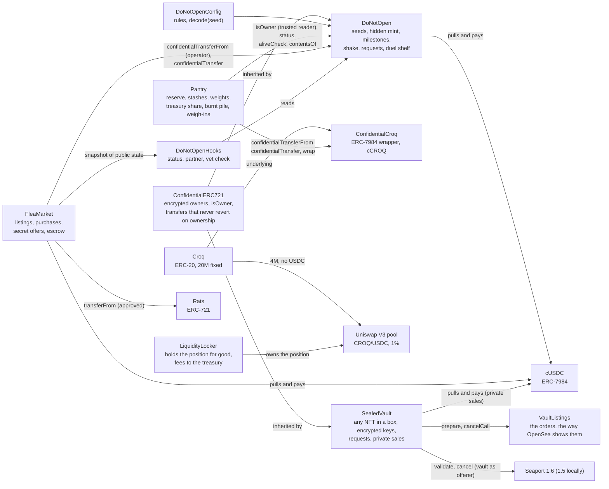
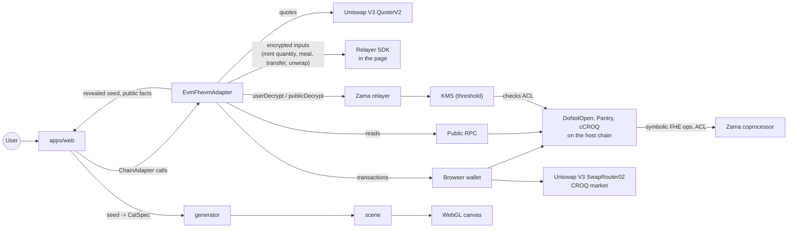
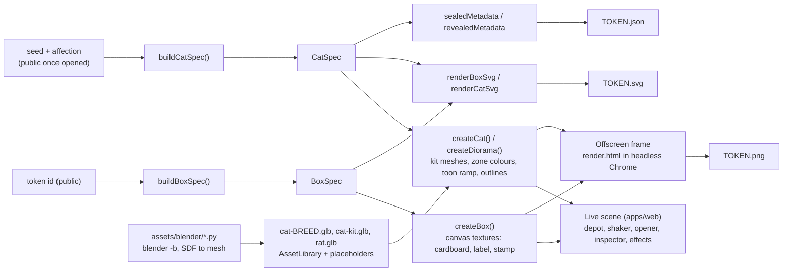
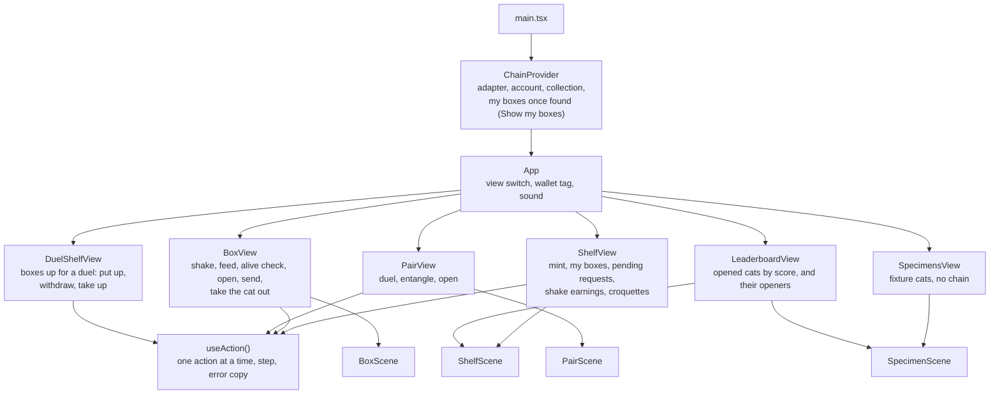

# Architecture

## Packages

| Package | Depends on | Must never depend on |
| --- | --- | --- |
| `game-spec` | nothing | anything |
| `generator` | `game-spec` | three.js, any chain library |
| `scene` | `generator`, three.js | React, any chain library |
| `contracts-evm` | `game-spec` (deploy and tests), `generator` (tests) | the web app |
| `chain-adapter` | `game-spec`, `generator` (mock only), ethers, Relayer SDK | three.js, React |
| `apps/web` | `chain-adapter`, `generator`, `scene`, React | ethers, viem, the Relayer SDK |

The last row is the portability rule of the project. It is checked the blunt way:
`apps/web/package.json` lists none of those libraries, so an import would not resolve.

## One source of truth

`packages/game-spec/spec.json` holds every number of the game, the croquette economy
included (the `economy` section). Three consumers read it and tests keep them in
agreement:

The config contract stores the hash of the spec file it was built from
(`specHash`), so anyone can check which rules a deployment runs. The Pantry keeps its
numbers as public immutables (`welcomeBag`, `purrMaxPerDay`, `mealsPerDay`,
`maxEatenPerDay`, `mealTreasuryBps`, `mealBurnBps`, `buildFloors()`, `sickMinWeight`...).

## Contracts

`DoNotOpen` knows the Pantry only as a trusted reader: the owner's `setTrustedReader`
lets it ask `isOwner(tokenId, account)`, an encrypted answer, about anyone. Nothing else
links them; the Pantry never writes to a box, and the economy could be replaced without
touching one. `ConfidentialERC721` is a reusable base, ERC-165 id `0x87ffe7a2`, described in
[HIDDEN_OWNERS.md](HIDDEN_OWNERS.md). The Pantry holds all its croquettes as one
cCROQ balance and splits it into encrypted buckets: the reserve, the treasury's
uncollected share, and the burnt pile. A cat's weight is a counter, not a bucket: the
croquettes it ate have already been split. See [CROQ.md](CROQ.md).

The `FleaMarket` is an ordinary holder to `DoNotOpen`: it moves a box only as the operator
its seller named (`setOperator`), and only to itself; then it holds the box in escrow like
anyone else, through its encrypted owner slot. It reads the box's public state through
`DoNotOpenHooks` and nothing else, and has no special role in `DoNotOpen` or `Rats`. See
[FLOWS.md](FLOWS.md#the-flea-market).

`SealedVault` is a second Confidential ERC-721, next to the game and linked to none of its
contracts: it inherits `ConfidentialERC721`, holds the NFTs of the collections its owner allows,
lists them on Seaport as their seller (the orders written and kept by `VaultListings` the way
OpenSea shows a contract's listing, so they show on opensea.io on mainnet), and settles private
sales in the same cUSDC. Each box
has an encrypted key, compared under encryption, so a request can come from any wallet. See
[VAULT.md](VAULT.md).

## Data flow at run time

Two things are worth noticing:

- The contract never sees a plaintext secret until a box is opened. It manipulates
  handles; the coprocessor does the arithmetic on ciphertexts.
- The secrets that come from users are the quantity of a mint and croquette amounts.
  The page encrypts them with the Relayer SDK and sends a ciphertext with an input
  proof; the contract never sees the number.
- Who holds a box is never read from the chain in the clear. The adapter replays the
  connected account's own `ConfidentialTransfer` receipts, decrypting their "moved" bits
  (one signature per visit), to find its boxes.
- The app never trusts the chain for the look of a cat. The chain reveals a seed; the
  generator turns it into a `CatSpec`. The chain also stores state, rolls and score, and
  the app compares them with what the generator derived (`catFromRevealed`).

## 3D pipeline

- **Specs are data.** `BoxSpec` and `CatSpec` are plain JSON-able objects. Anything that
  can read them can draw the token: three.js today, an SVG string, another engine later.
- **Builders return objects, not components.** Each returns `{ group, update(time),
  dispose() }`. The React app mounts them with `<primitive>`; the metadata page uses the
  same builders with no React at all.
- **Cats are assembled, not stored.** A cat is one head, two ears, one tail and one of
  five posed bodies from its breed's file, plus face parts and an accessory from a
  shared file, hung on named anchors. The files are generated by Blender scripts
  (`assets/BLENDER_TODO.md`) and hold shapes only: colours come from the `CatSpec`
  through zone masks stored in the vertex colours. `createCat` returns its group at
  once and fills it when the files have loaded; `ready` resolves then, and the metadata
  page waits for it.
- **Privacy rule.** A sealed box is drawn from its token id only. `buildBoxSpec` cannot
  see a seed, so no render, texture or metadata file of a sealed box can leak one.
- **Determinism.** Every random choice in a builder comes from `mulberry32` seeded by
  the spec. The metadata frame is taken at a fixed camera, size and time.
- **Degradation.** `detectQuality()` returns one of two tiers (shadows, post-processing,
  dust count, pixel ratio). `prefers-reduced-motion` shortens or removes every sequence.

See [DESIGN.md](DESIGN.md) for the art direction and the effect catalogue.

## The web app

`VITE_CHAIN_MODE` (or `?chain=` in the URL) picks the adapter. The menu's network tags (`chain/NetworkSwitch.tsx`) set `?chain=` and reload: an adapter belongs to one chain for the life of the page. In mock mode the EVM
adapter, ethers and the Relayer SDK are never downloaded: they sit behind a dynamic import.

The sealed vault has a page of its own, `vault.html` at `/vault` (`src/vault/VaultPage.tsx`,
its language from `?lang=` as in the game). It reaches the vault through the same adapter:
`ChainAdapter.vault()` returns a `VaultAdapter` (`MockVault` in mock mode, `EvmVault` on
Sepolia), or null where no vault is deployed.

The leaderboard ranks only what is public: opened cats by rarity score, and the players
who opened them (`Observed` names the opener, the only holder that is ever public). It
reads every `Observed` event through `openedCats()`, served by the backend's index
([`apps/api`](../apps/api/README.md)) when `VITE_API_URL` is set. `boxesOf` gets its receipts
from the index too, but only the account itself can decrypt them: the backend never knows
who holds what.

## The backend

`apps/api` follows the protocol's logs into Postgres and serves the app's reads (box lists,
leaderboard, the duel shelf and duels, pending requests, receipts, economy, token metadata),
so visitors do not each hit a public RPC. The EVM adapter reads it first and falls back on
the RPC when it is down, or behind the account's own last transaction. Duels are kept
there, so the shelf lists every box up for a duel, and an account finds its open duels
from any device. Deployment: [`deploy/README.md`](../deploy/README.md).

It is also the only way the app reaches Zama's relayer, which bills whoever holds the API
key. Its relayer proxy (`/relayer/v2`) keeps the key server-side, lets through only the
protocol's own decryptions and inputs, and counts each wallet's private decryptions against
a free daily allowance, then against the credits bought from `DecryptionCredits`. The
adapter keeps every value it decrypted, by handle, in the browser, so nothing is paid for
twice. Details: [`apps/api/README.md`](../apps/api/README.md#relayer-proxy).

It also runs the studio's generations (`/v1/studio`): it reads the packs bought from
`StudioPacks` out of the index, spends one unit before each call to the AI services (a
cartoon sketch of a rat from a prompt in the house style, then a 3D model from a sketch;
rats, not cats, so nothing drawn there passes for a cat out of a box), gives it
back if the service fails, and caps what the services cost in a day. The keys stay on the
server. Details: [`apps/api/README.md`](../apps/api/README.md).

The studio's rats can be adopted on-chain (`Rats`, a plain ERC-721, and `RatPantry`, their
daily CROQ). The API indexes them for "My rats", serves their metadata (`/rats/:id`, a seed
rat's picture rendered from its seed), and, for an AI rat, stores its picture on Arweave (a free upload, like a cat's), keeps its 3D model, and
signs the adoption with the attester key.

The API does not index the flea market yet: the EVM adapter reads its listings in pages
(`listings(from, count)`) and its offers (`offerInfo`) straight from the chain.

Nor does it index the sealed vault: the vault's adapter (`EvmVault`) reads its boxes and logs
from the RPC. The API's part there is the vault relayer (`POST /v1/vault/relay`, with
`VAULT_RELAYER_KEY`): it sends holders' requests and proofs from a wallet of its own, so the
holder's address shows on none, and learns nothing the chain does not show, since the key comes
encrypted and bound to the request's terms. Its relayer proxy decrypts for the vault too. See
[VAULT.md](VAULT.md#the-relayer).

It also runs the manual's chatbot, the depot clerk (`POST /v1/chat`): Google's Gemini, on
its free tier, answers from the whole manual of the player's language, with the key kept on
the server; without a model, or past the day's limits, the clerk quotes the manual's best
matching paragraphs instead. The manual reaches the API as a JSON export of the rendered
page (`apps/web/scripts/export-manual.mts`). In the web app the clerk is `src/chat/Clerk.tsx`:
a tab on the manual's edge, a link in the game's footer, and on the home page a tab with a
brass counter bell (`src/home/ClerkBell.tsx`) that the clerk rings a few times with a line in a
bubble, shown only when `VITE_API_URL` is set. Details: [`apps/api/README.md`](../apps/api/README.md#the-manuals-chatbot).

The backend also files the release form every player signs before playing (`POST /v1/terms`): the
wallet's EIP-191 signature on the terms, checked and kept as a record. That tells it an
address accepted the terms, nothing about what it holds. See
[FLOWS.md](FLOWS.md#release-form-before-the-first-box).

### Gaps against the original brief

- **No event subscription.** The brief's interface lists `subscribeEvents`. The adapter
  re-reads state after each action instead. Another holder's action (a duel taken
  up, a paid shake) shows up on the next read, not live.
- **Room props.** Rooms are a coloured floor and wall. See `assets/BLENDER_TODO.md`.
