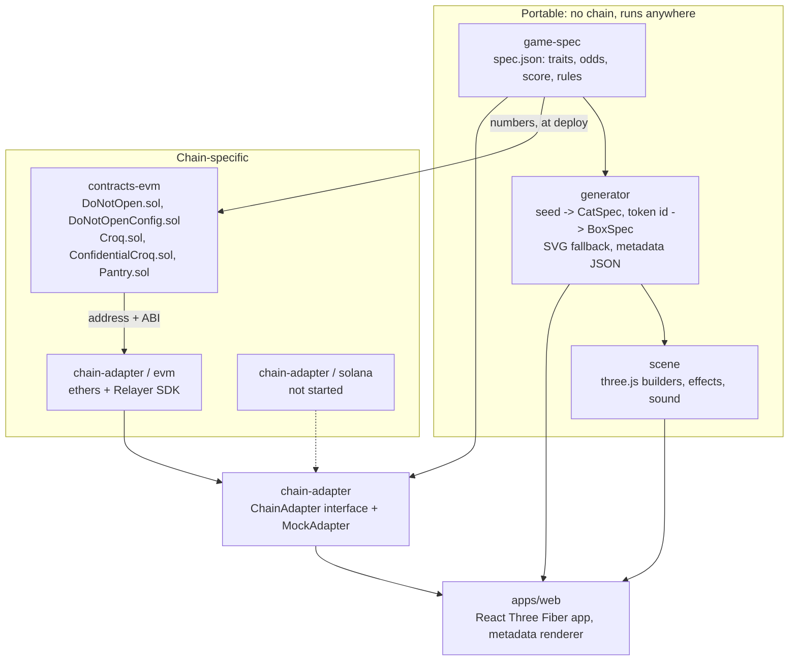
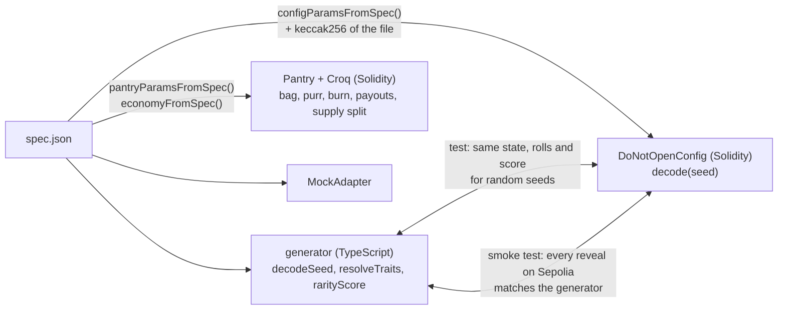
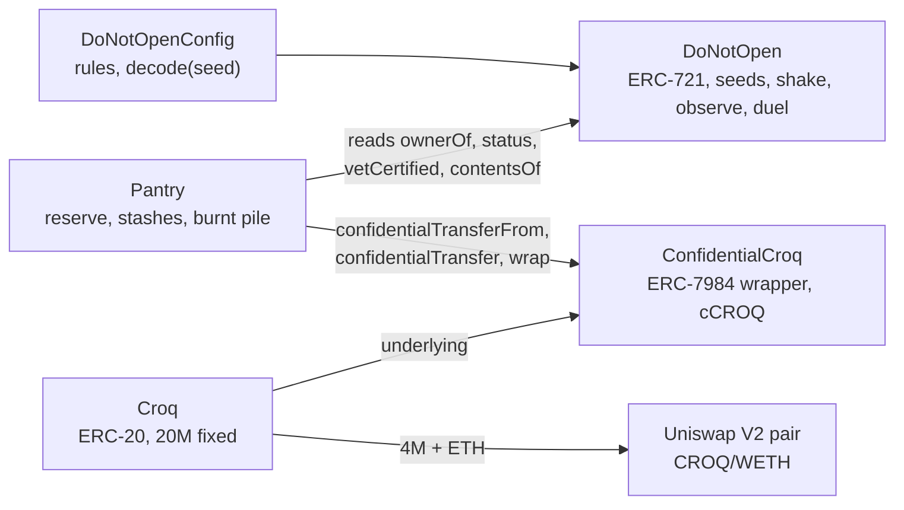
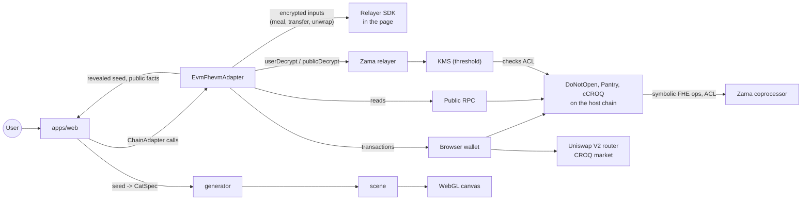
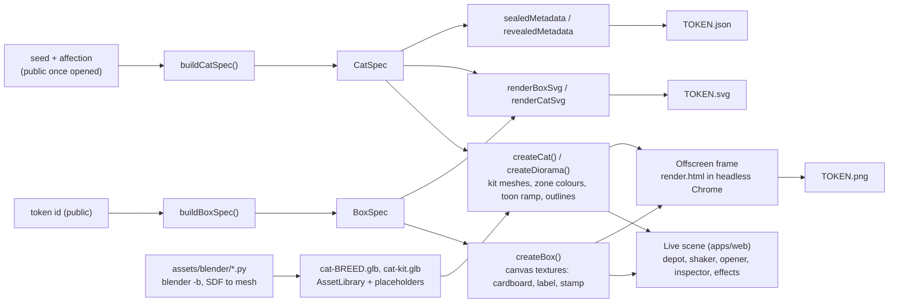
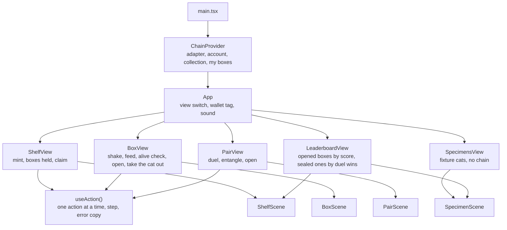

# Architecture

## Packages

| Package | Depends on | Must never depend on |
| --- | --- | --- |
| `game-spec` | nothing | anything |
| `generator` | `game-spec` | three.js, any chain library |
| `scene` | `generator`, three.js | React, any chain library |
| `contracts-evm` | `game-spec` (deploy and tests), `generator` (tests) | the web app |
| `chain-adapter` | `game-spec`, `generator` (mock only), ethers, Relayer SDK | three.js, React |
| `apps/web` | `chain-adapter`, `generator`, `scene`, React | ethers, viem, the Relayer SDK |

The last row is the portability rule of the project. It is checked the blunt way:
`apps/web/package.json` lists none of those libraries, so an import would not resolve.

## One source of truth

`packages/game-spec/spec.json` holds every number of the game, the croquette economy
included (the `economy` section). Three consumers read it and tests keep them in
agreement:

The config contract stores the hash of the spec file it was built from
(`specHash`), so anyone can check which rules a deployment runs. The Pantry keeps its
numbers as public immutables (`welcomeBag`, `purrMaxPerDay`, `mealBurnBps`,
`payoutBps(state)`...).

## Contracts

`DoNotOpen` does not know the Pantry exists. The economy was added next to it, and
could be replaced without touching a box. The Pantry holds all its croquettes as one
cCROQ balance and splits it into encrypted buckets: the reserve, one stash per box, and
the burnt pile. See [CROQ.md](CROQ.md).

## Data flow at run time

Two things are worth noticing:

- The contract never sees a plaintext secret until a box is opened. It manipulates
  handles; the coprocessor does the arithmetic on ciphertexts.
- Croquette amounts are the only secrets that come from users. The page encrypts them
  with the Relayer SDK and sends a ciphertext with an input proof; the contract never
  sees the number.
- The app never trusts the chain for the look of a cat. The chain reveals a seed; the
  generator turns it into a `CatSpec`. The chain also stores state, rolls and score, and
  the app compares them with what the generator derived (`catFromRevealed`).

## 3D pipeline

- **Specs are data.** `BoxSpec` and `CatSpec` are plain JSON-able objects. Anything that
  can read them can draw the token: three.js today, an SVG string, another engine later.
- **Builders return objects, not components.** Each returns `{ group, update(time),
  dispose() }`. The React app mounts them with `<primitive>`; the metadata page uses the
  same builders with no React at all.
- **Cats are assembled, not stored.** A cat is one head, two ears, one tail and one of
  five posed bodies from its breed's file, plus face parts and an accessory from a
  shared file, hung on named anchors. The files are generated by Blender scripts
  (`assets/BLENDER_TODO.md`) and hold shapes only: colours come from the `CatSpec`
  through zone masks stored in the vertex colours. `createCat` returns its group at
  once and fills it when the files have loaded; `ready` resolves then, and the metadata
  page waits for it.
- **Privacy rule.** A sealed box is drawn from its token id only. `buildBoxSpec` cannot
  see a seed, so no render, texture or metadata file of a sealed box can leak one.
- **Determinism.** Every random choice in a builder comes from `mulberry32` seeded by
  the spec. The metadata frame is taken at a fixed camera, size and time.
- **Degradation.** `detectQuality()` returns one of two tiers (shadows, post-processing,
  dust count, pixel ratio). `prefers-reduced-motion` shortens or removes every sequence.

See [DESIGN.md](DESIGN.md) for the art direction and the effect catalogue.

## The web app

`VITE_CHAIN_MODE` (or `?chain=` in the URL) picks the adapter. In mock mode the EVM
adapter, ethers and the Relayer SDK are never downloaded: they sit behind a dynamic import.

The leaderboard ranks only what is public: opened boxes by rarity score, sealed boxes
by duels won (a sealed box has no public score). It reads the 250 most recent boxes
one by one through `box()`; past that size it needs an indexer, like `boxesOf`.

### Gaps against the original brief

- **No event subscription.** The brief's interface lists `subscribeEvents`. The adapter
  re-reads state after each action instead. Another holder's action (a challenge, a
  paid shake) shows up on the next read, not live.
- **Room props.** Rooms are a coloured floor and wall. See `assets/BLENDER_TODO.md`.
