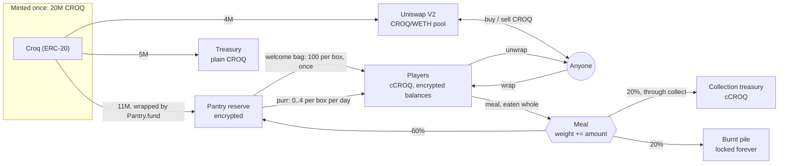
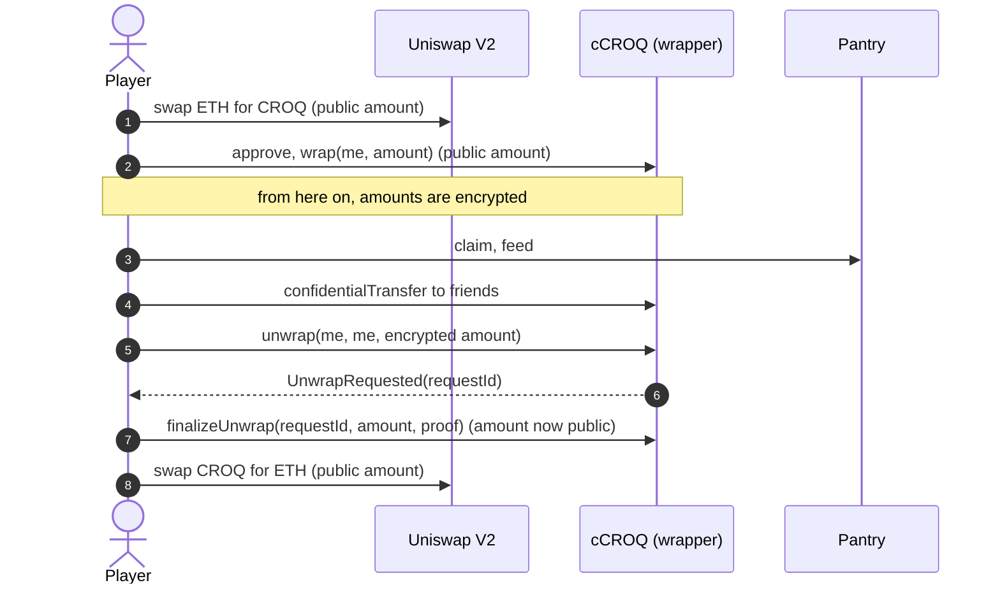
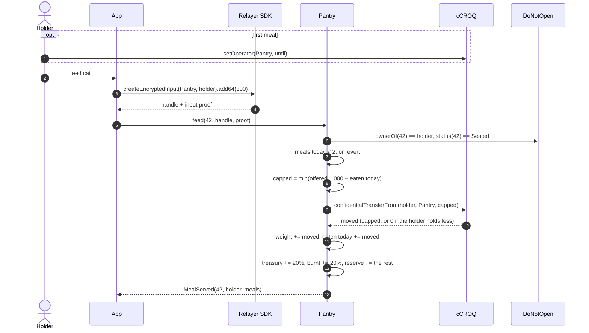
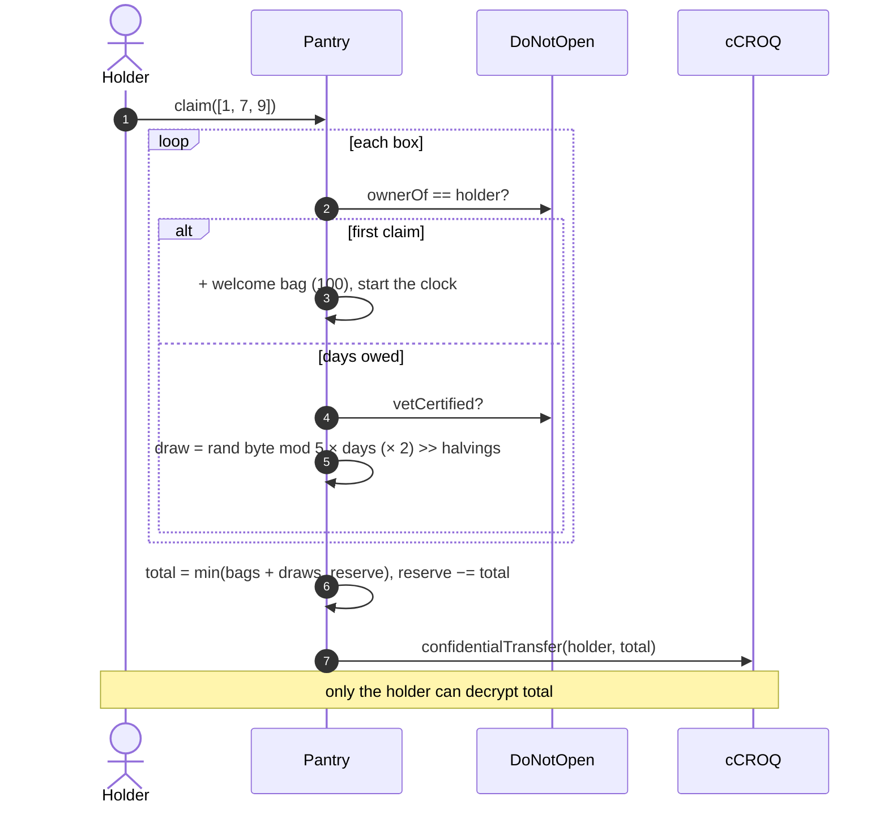
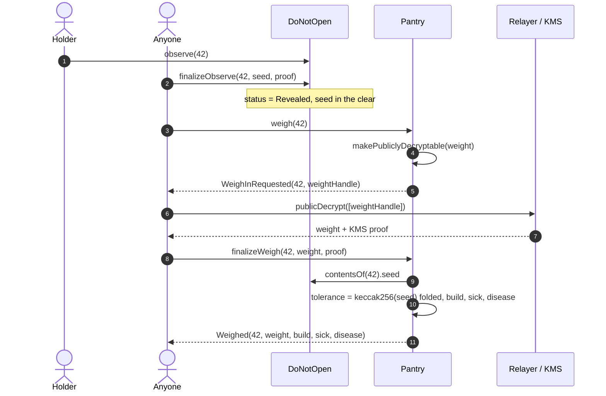
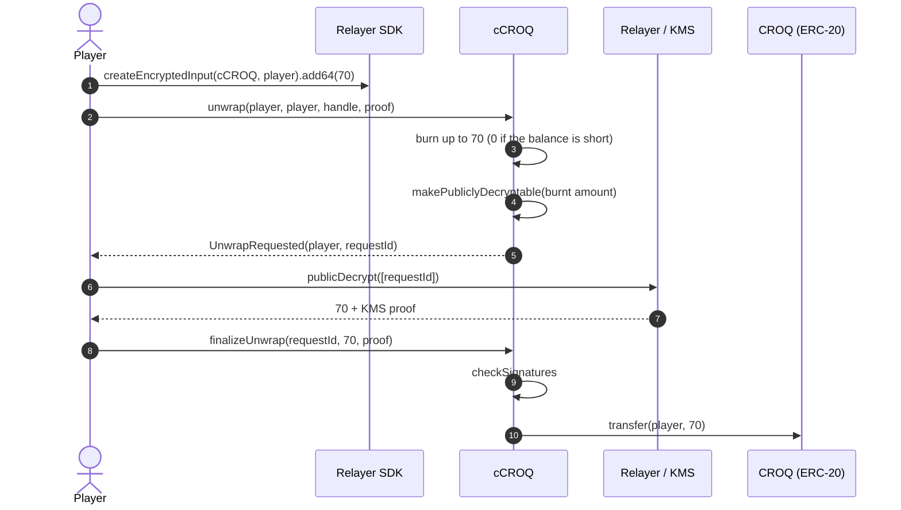

# Croquettes (CROQ)

The game currency of DO NOT OPEN. Holders feed their sealed cats croquettes, and the
cats eat them: each cat puts on a weight that nobody can read while the box is sealed.
Once the box is opened, the cat is weighed in public. Its weight sets its build, from
thin to huge, and past a tolerance of its own the cat is **sick**: an ultra-rare trophy.

Two gestures, two currencies:

| Gesture | Paid in | Hidden counter | At the reveal |
| --- | --- | --- | --- |
| Pet (`DoNotOpen.feed`) | ETH, to the collection | Affection | Golden accessory past the threshold |
| Meal (`Pantry.feed`) | cCROQ, eaten whole | Weight | Build, and sickness past the cat's tolerance |

Everything here runs next to `DoNotOpen` without changing it. The `Pantry` only reads
the box contract: `ownerOf`, `status`, `vetCertified` and `contentsOf`.

The numbers live in the `economy` section of
[`packages/game-spec/spec.json`](../packages/game-spec/spec.json). The deploy script and
the tests read them from there.

## Two tokens

| Token | Contract | Standard | Amounts | Used for |
| --- | --- | --- | --- | --- |
| **CROQ** | `Croq.sol` | ERC-20, 0 decimals | Public | Public markets, the treasury |
| **cCROQ** | `ConfidentialCroq.sol` | ERC-7984, OpenZeppelin `ERC7984ERC20Wrapper` | Encrypted (`euint64`) | Everything in the game |

There are two tokens because an AMM computes prices from reserves and amounts in the
clear. A token whose balances and transfer amounts are encrypted cannot sit in a
Uniswap pool. So CROQ is a plain ERC-20 that any market can list, and cCROQ is its
confidential twin. One CROQ wraps into one cCROQ (rate 1, since the token has no
decimals). Unwrapping goes the other way, through a public decryption of the amount.

The amount is visible when CROQ enters or leaves the game. Inside the game, every
balance, transfer, meal and weight is encrypted until the reveal.

One CROQ is one croquette. There are no decimals.

## Supply

The whole supply is minted once, in the `Croq` constructor. `Croq` has no mint
function, no owner and no pause. Nothing can create more.

**Total supply: 20,000,000 CROQ.**

| Share | Amount | Where it goes |
| --- | --- | --- |
| Game reserve | 10,000,000 (50%) | Wrapped into the Pantry. Pays the daily purr, and takes back 60% of every meal |
| Welcome bags | 1,000,000 (5%) | Wrapped into the Pantry. 100 × 10,000 boxes |
| Market liquidity | 4,000,000 (20%) | A CROQ/WETH pool on Uniswap V2 |
| Treasury | 5,000,000 (25%) | Kept by the collection owner as plain CROQ, for events and future liquidity |

`economyFromSpec()` in `packages/contracts-evm/lib/specParams.ts` refuses a spec whose
shares do not add up to the total, or whose welcome bags do not equal
`maxSupply × welcomeBag`.

The game reserve and the welcome bags enter the Pantry through `Pantry.fund(amount)`:
plain CROQ moves in, is wrapped, and the amount is added to the encrypted reserve.
Anyone can call `fund`. The amount is public, since it moves as a plain ERC-20 first.

The total supply is public. How much still circulates is not: burnt croquettes stay
locked in the Pantry under an encrypted total that nobody can read.

Meals carry croquettes back to the reserve, so the reserve does not only drain: as long
as the cats eat, the purr keeps paying.

## Where croquettes come from

### Welcome bag

**100 cCROQ per box, once.** It is paid on the box's first claim. It belongs to the box,
not to the wallet: a box that changes hands does not get a second bag, and minting more
wallets gives nothing more. Getting bags means holding boxes, and boxes cost ETH.

### Purr

Every box held purrs a little every day. The holder collects it with
`Pantry.claim(tokenIds)`.

| Rule | Value |
| --- | --- |
| Amount per box and per day | Encrypted draw in 0..4 |
| Vet Certified boxes | × 2 |
| Days one claim can collect | At most 7. Older days are lost |
| Halving | Every 365 days after the Pantry was deployed, the purr is halved |
| Ceiling | What is left in the reserve. Once it is empty, a claim pays 0 |
| Boxes per claim | At most 10 (`MAX_BOXES_PER_CLAIM`, to stay under the HCU limit) |

How a claim works, per box:

1. First claim: the welcome bag, and the purr clock starts.
2. Later claims: the whole days since the last claim are counted (at most 7). A box with
   no full day owed is skipped. A claim where every box is skipped reverts.
3. One encrypted draw in 0..4 per box, multiplied by the days owed, doubled if the box is
   Vet Certified, shifted right once per halving.
4. Everything is summed, capped by the encrypted reserve, and sent as **one**
   confidential transfer. Only the claimer can decrypt what arrived.

A part of a day that has started is kept: claiming after 2 days and 1 hour moves the
clock forward by exactly 2 days. When more than 7 days are owed, the clock is reset to
now.

The draw is one per box and per claim, multiplied by the days, not one per day. Two
claims of one day each give two independent draws; one claim of two days gives one draw
counted twice. The expected value is the same: 2 per box and per day in the first year.

At full activity (10,000 boxes claiming every day, none Vet Certified), the first year
pays about 7.3M, the second about 3.65M after the halving. The reserve of 10M runs out
during the second year at that pace. Real activity is lower. Either way the reserve,
not the formula, is the hard ceiling.

After 5 halvings the best possible purr (4 × 2 × 7 = 56) rounds to 0. From then on the
Pantry skips the FHE work and a claim only moves the clock.

The draw is a random byte modulo 5. 256 is not a multiple of 5, so 0 comes up 52 times
in 256 and the other values 51 times. The bias is accepted.

Nobody can know what a claim paid, including the claimer before the transaction. There
is nothing to simulate and nothing to retry on a bad day.

## Where croquettes go

### Meals

Only the **holder** feeds a **sealed** cat. The ETH-paid `feed` on `DoNotOpen` is
separate: it pets the cat (affection), a meal feeds it (weight).

1. The holder encrypts an amount in the browser with the Relayer SDK. The input proof
   is made for the Pantry and the holder.
2. `Pantry.feed(tokenId, encryptedAmount, inputProof)` cuts the amount down to what is
   left of the day's allowance, then pulls it from the holder's cCROQ. The holder must
   have made the Pantry an operator once (`cCroq.setOperator(pantry, until)`).
3. **The cat eats it all.** Its encrypted weight goes up by the amount, and the
   croquettes are split, all in FHE:

   | Share | Goes to |
   | --- | --- |
   | 20% | The collection's treasury, sent out by `collect()` |
   | 60% | Back to the game reserve, which pays the purr |
   | 20% | The burnt pile |

4. `meals[tokenId]` goes up by one. The event is `MealServed(tokenId, feeder, meals)`.
   There is no amount in it.

If the holder holds less than the (capped) offer, the transfer moves **0**. There is no
revert, and nothing on-chain tells it apart from a real meal. The meal is still
counted.

### Daily allowance

| Rule | Value |
| --- | --- |
| Meals per cat and per UTC day | 2. A third reverts with `NoMoreMealsToday` |
| Croquettes per cat and per UTC day | 1,000, however they are spread: 1 + 999, 500 + 500 or 1,000 at once |

The amount is encrypted, so the Pantry cannot revert on it: an offer past what is left
of the day is cut down to it, silently, and only what the cat ate leaves the wallet. The
holder can decrypt what their cat ate today (`eatenTodayHandle`), so the app can cap the
input.

The allowance belongs to the cat, not the wallet. More wallets do not feed a cat faster.

Only the holder feeds because of that limit: if anyone could, a stranger could fill a
cat's two meals with empty bowls every day, for the price of gas, and starve it.

### The weight

| Who | Can read it |
| --- | --- |
| The holder | No (they know what they fed, not what earlier holders did) |
| The public | No, until the box is opened and weighed |
| The deployer | No |

Nobody is allowed on a weight, because `FHE.allow` grants are permanent: a weight that
its holder could read would stay readable to every past holder after a sale.

### Weigh-in

Once `DoNotOpen` has finalised the reveal, **anyone** weighs the cat, once:

1. `Pantry.weigh(tokenId)` makes the weight publicly decryptable and emits
   `WeighInRequested(tokenId, weightHandle)`. A cat that never ate is weighed on the
   spot, with no FHE work.
2. Anyone fetches the cleartext and the KMS proof from the relayer and sends
   `finalizeWeigh(tokenId, weight, proof)`.

The Pantry then computes, in the clear:

- the **build**, the highest one the weight reaches;
- the cat's **tolerance**: `keccak256(seed)` folded into [300,000, 600,000);
- **sick** when the weight is at or past the tolerance, and then the disease, from other
  bits of the same hash.

| Build | Weight from | Score bonus |
| --- | --- | --- |
| Thin | 0 (never ate) | 0 |
| Normal | 1 | 0 |
| Chubby | 10,000 | +100 |
| Fat | 50,000 | +300 |
| Huge | 150,000 | +700 |
| **Sick** | the cat's tolerance, 300,000 to 600,000 | +2,000 on top of huge |

| Disease | Share of sick cats |
| --- | --- |
| Diabetic | 60% |
| Arthritic | 30% |
| Fatty liver | 10% |

The event is `Weighed(tokenId, weight, build, sick, disease)`. Sickness is a trophy: the
cat does not die of it, and its state from the reveal does not change.

The tolerance comes from the seed, which is encrypted until the box is opened, and by
then the cat can no longer eat. Nobody, the holder included, can feed a cat up to just
its tolerance: past 300,000 every meal is a bet that it is not enough yet.

### Calibration

The numbers are set so the builds stay rare for the life of the game, against a supply
of 20M:

| Build | Fastest, at 1,000 a day | Croquettes eaten | Share of the supply |
| --- | --- | --- | --- |
| Chubby | 10 days | 10,000 | 0.05% |
| Fat | 50 days | 50,000 | 0.25% |
| Huge | 150 days | 150,000 | 0.75% |
| Sick | 300 to 600 days | 300,000 to 600,000 | 1.5% to 3% |

- **The purr is not enough.** It pays about 2 a day per box in the first year: ~730 a year,
  less after each halving. Anything past normal is bought on the market.
- **A sick cat moves the market.** 300,000 croquettes is 7.5% of the pool's starting 4M,
  and buying it from a constant-product pool costs more with every croquette.
- **The fire is a hard ceiling.** Each sick cat burns at least 60,000. If every one of the
  20M croquettes were eventually burnt, at most ~333 cats could ever get sick; with a
  reserve that only lets croquettes out through the purr, the real number is far lower.
- **Time is the other ceiling.** No sick cat exists before day 300 of the game, whatever
  is spent.

### Treasury share

The treasury's 20% piles up in an encrypted bucket that only the treasury can read
(`treasuryShareHandle`). `collect()` sends it all to the treasury in one confidential
transfer. Anyone may call it; it always pays the treasury. The treasury address is set at
deployment (`COLLECTION_OWNER`, or the deployer) and cannot change.

### The burnt pile

"Burnt" means locked in the Pantry. No function moves the burnt pile. A real burn on
the wrapper would strand the same plain CROQ inside it anyway, at a higher FHE cost.
The running total is encrypted and nobody is allowed on it.

The Pantry's books always balance: its cCROQ balance equals the reserve, plus the
uncollected treasury share, plus the burnt pile (test: "keeps the books").

## Selling a fed box

The weight is keyed by token id, so it follows the cat to the new holder, and so does
the day's allowance. A buyer knows:

- how many meals it was served, which is public;
- that a cat can eat at most 1,000 a day, so the meal count and the days since the
  first meal bound its weight.

The buyer does not know the weight, and nobody knows the tolerance. The seller knows at
least what they fed it themselves. That asymmetry is part of the game.

The meal count is a weak signal: a meal of 0 counts too. A seller can inflate it for the
price of gas.

## The public market

A Uniswap V2 pool pairs CROQ with WETH on Sepolia. It was seeded at deployment with the
4M liquidity share and 0.02 Sepolia ETH (`LIQUIDITY_ETH`), which puts the opening price
at 0.000000005 ETH per CROQ. The price then comes from trades.

The LP tokens of the seed liquidity were sent to `0x000000000000000000000000000000000000dEaD`:
the pool's starting liquidity can never be withdrawn, by the deployer or anyone else.

On Sepolia none of this has a real value: Sepolia ETH is free. The project does not sell
CROQ and promises no value for it.

**Mainnet note.** Offering a token to the public, or seeding the market it trades on,
is regulated: in the EU it falls under MiCA (a white paper, and possibly more). Before
any mainnet deployment of the market side, get legal advice. A game currency that the
project never sells is the safest shape.

## Flows

### Feed

### Claim

### Weigh

### Unwrap

The unwrapped amount becomes public: it is about to move as a plain ERC-20 anyway.

## What leaks

Encrypted amounts do not make the game invisible. Public, for anyone reading the chain:

- who feeds which box, and how many times a day (`MealServed`);
- who claims, for which boxes, and when (`WelcomeBag`, `Purred`, `lastPurr`);
- every amount that crosses the border: wraps, unwraps, market trades, `fund`;
- the weight of every opened and weighed cat, and so the total its holders fed it;
- that a confidential transfer happened between two addresses.

Not public, for anyone:

- any balance, meal or purr amount, and the weight of a sealed cat;
- the reserve left, the treasury's uncollected share, and the total burnt;
- so, how much CROQ really circulates.

## Cost

Measured on the FHEVM mock with `fhevm.computeTransactionHCU`. The protocol limit is
20,000,000 HCU per transaction and 5,000,000 along the longest dependency chain.

| Function | FHE work | HCU |
| --- | --- | --- |
| `feed`, first meal of the day | input check, `min`, confidential `transferFrom`, two `mul` + `div` for the split, `sub`s and `add`s | ~2,790,000 |
| `feed`, second meal | the same, plus the `sub` from what was already eaten | ~3,180,000 |
| `claim` | per purring box: `randEuint8`, `rem`, cast, `mul`, `shr`, `add`; then `min`, `sub`, one transfer | ~680,000 per box; ~6.8M for 10 boxes (depth ~2.8M) |
| `claim` once the purr has halved to 0 | none | 0 |
| `weigh`, never fed | none | 0 |
| `weigh` + `finalizeWeigh` | one public decryption request, then plain arithmetic | ~0 |
| `collect` | one confidential transfer | ~590,000 |

Deployment gas on Sepolia: `Croq` 536k, `ConfidentialCroq` 2.49M, `Pantry` 2.20M,
`fund` 442k.

## Deployed on Sepolia

| Contract | Address |
| --- | --- |
| `Croq` | [`0x72Fc0E0654f268A0785f92D63450c813cAFDfD10`](https://sepolia.etherscan.io/address/0x72Fc0E0654f268A0785f92D63450c813cAFDfD10) |
| `ConfidentialCroq` | [`0xa89c19228261EAc5Fa48f544238d04fBC115393c`](https://sepolia.etherscan.io/address/0xa89c19228261EAc5Fa48f544238d04fBC115393c) |
| `Pantry` | [`0x8a58e2Cc6E11A3CC108612cfc6677A425Ff49882`](https://sepolia.etherscan.io/address/0x8a58e2Cc6E11A3CC108612cfc6677A425Ff49882) |
| CROQ/WETH pair (Uniswap V2) | [`0x645D0d391F088895272b200aa6E187aCd00F270d`](https://sepolia.etherscan.io/address/0x645D0d391F088895272b200aa6E187aCd00F270d) |
| Uniswap V2 router | `0xeE567Fe1712Faf6149d80dA1E6934E354124CfE3` |
| WETH | `0xfFf9976782d46CC05630D1f6eBAb18b2324d6B14` |

The Pantry reads `DoNotOpen` at `0x880D284333F4001Bfd199899f8243D78b486e077`.

**This Pantry runs the earlier rules** (stash and settlement). The weight rules need a new
Pantry (`pnpm --filter @dno/contracts-evm deploy:sepolia`, after removing the old
`Pantry` entry from `deployments/sepolia` so hardhat-deploy does not reuse it). The old Pantry has no withdrawal function: the CROQ funded into it stays
there.

## Tests

`packages/contracts-evm/test/Pantry.ts`, 30 tests on the FHEVM mock. They cover the
fixed supply, wrapping and unwrapping, every claim rule (bag per box, days, cap,
Vet Certified, halving, empty reserve), meals (holder only, the 20/60/20 split, two
meals a day, the 1,000 a day cap in one meal or spread, silent 0, nobody can read a
weight, operator and input checks), the treasury's `collect`, every build, sickness
past the seed's tolerance, a forged weight, and the bookkeeping invariant. Each
function's HCU budget is pinned.
