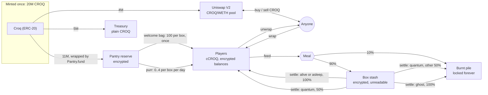
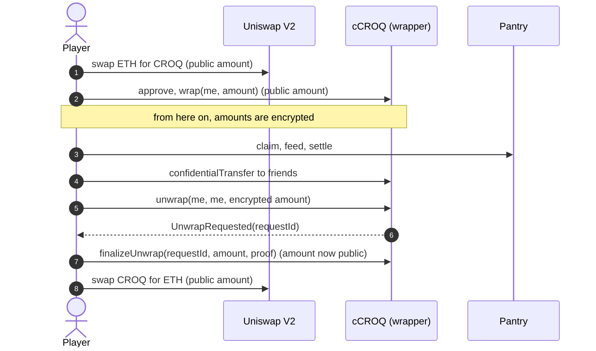
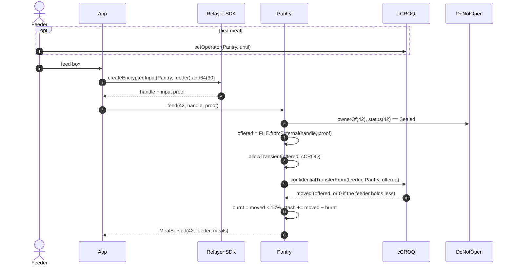
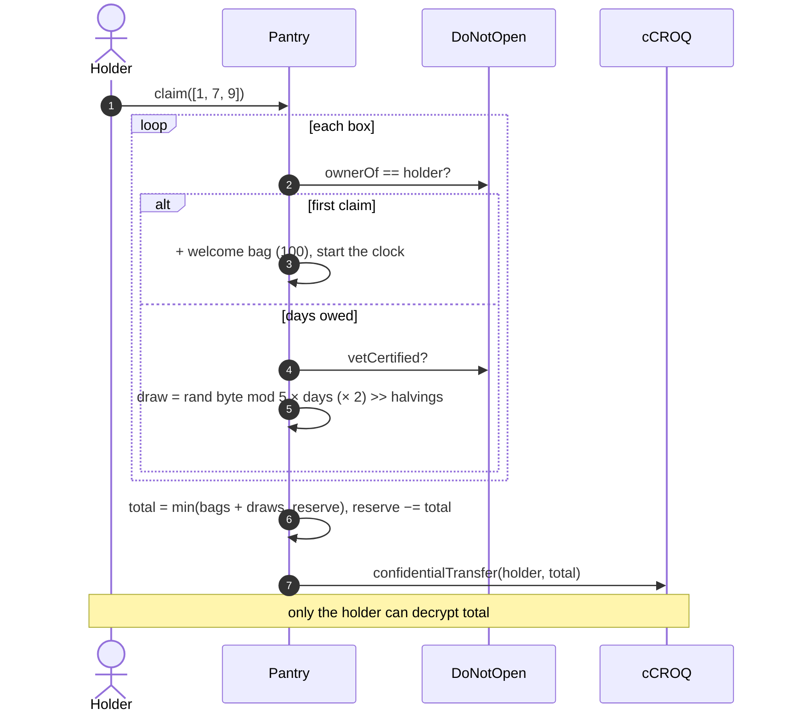
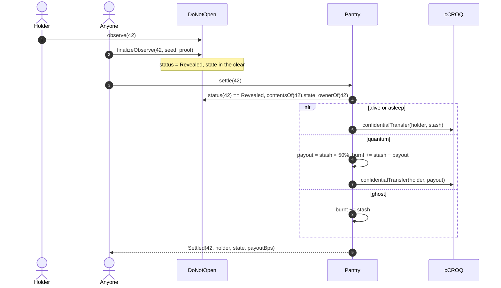
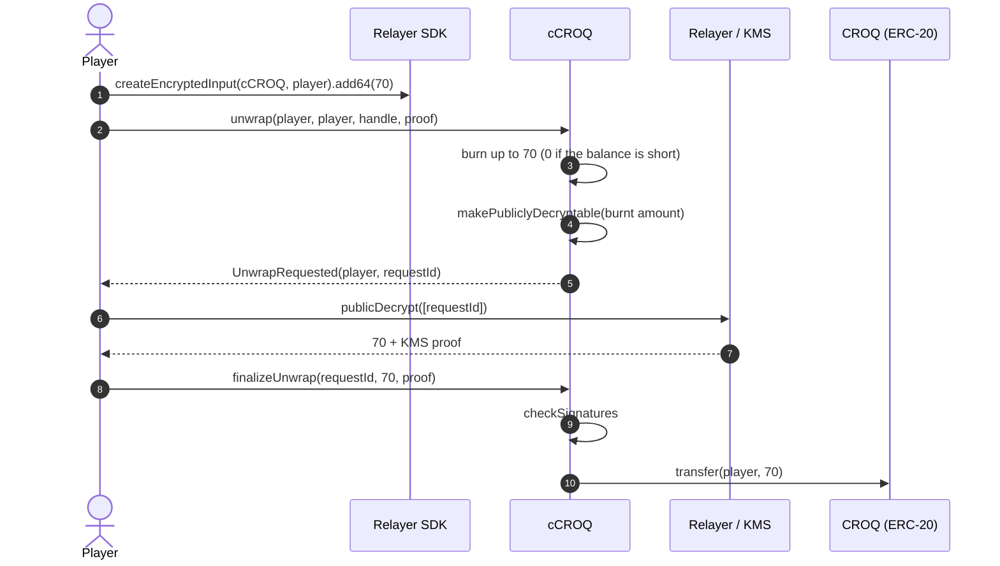

# Croquettes (CROQ)

The game currency of DO NOT OPEN. Players feed sealed boxes with croquettes. The
croquettes pile up in an encrypted stash that nobody can read or withdraw. When the box
is opened, the cat decides what happens to the stash.

Everything here runs next to `DoNotOpen` without changing it. The `Pantry` only reads
the box contract: `ownerOf`, `status`, `vetCertified` and `contentsOf`.

The numbers live in the `economy` section of
[`packages/game-spec/spec.json`](../packages/game-spec/spec.json). The deploy script and
the tests read them from there.

## Two tokens

| Token | Contract | Standard | Amounts | Used for |
| --- | --- | --- | --- | --- |
| **CROQ** | `Croq.sol` | ERC-20, 0 decimals | Public | Public markets, the treasury |
| **cCROQ** | `ConfidentialCroq.sol` | ERC-7984, OpenZeppelin `ERC7984ERC20Wrapper` | Encrypted (`euint64`) | Everything in the game |

There are two tokens because an AMM computes prices from reserves and amounts in the
clear. A token whose balances and transfer amounts are encrypted cannot sit in a
Uniswap pool. So CROQ is a plain ERC-20 that any market can list, and cCROQ is its
confidential twin. One CROQ wraps into one cCROQ (rate 1, since the token has no
decimals). Unwrapping goes the other way, through a public decryption of the amount.

The amount is visible when CROQ enters or leaves the game. Inside the game, every
balance, transfer, meal, stash and payout is encrypted.

One CROQ is one croquette. There are no decimals.

## Supply

The whole supply is minted once, in the `Croq` constructor. `Croq` has no mint
function, no owner and no pause. Nothing can create more.

**Total supply: 20,000,000 CROQ.**

| Share | Amount | Where it goes |
| --- | --- | --- |
| Game reserve | 10,000,000 (50%) | Wrapped into the Pantry. Pays the daily purr until it runs dry |
| Welcome bags | 1,000,000 (5%) | Wrapped into the Pantry. 100 × 10,000 boxes |
| Market liquidity | 4,000,000 (20%) | A CROQ/WETH pool on Uniswap V2 |
| Treasury | 5,000,000 (25%) | Kept by the collection owner as plain CROQ, for events and future liquidity |

`economyFromSpec()` in `packages/contracts-evm/lib/specParams.ts` refuses a spec whose
shares do not add up to the total, or whose welcome bags do not equal
`maxSupply × welcomeBag`.

The game reserve and the welcome bags enter the Pantry through `Pantry.fund(amount)`:
plain CROQ moves in, is wrapped, and the amount is added to the encrypted reserve.
Anyone can call `fund`. The amount is public, since it moves as a plain ERC-20 first.

The total supply is public. How much still circulates is not: burnt croquettes stay
locked in the Pantry under an encrypted total that nobody can read.

## Where croquettes come from

### Welcome bag

**100 cCROQ per box, once.** It is paid on the box's first claim. It belongs to the box,
not to the wallet: a box that changes hands does not get a second bag, and minting more
wallets gives nothing more. Getting bags means holding boxes, and boxes cost ETH.

### Purr

Every box held purrs a little every day. The holder collects it with
`Pantry.claim(tokenIds)`.

| Rule | Value |
| --- | --- |
| Amount per box and per day | Encrypted draw in 0..4 |
| Vet Certified boxes | × 2 |
| Days one claim can collect | At most 7. Older days are lost |
| Halving | Every 365 days after the Pantry was deployed, the purr is halved |
| Ceiling | What is left in the reserve. Once it is empty, a claim pays 0 |
| Boxes per claim | At most 10 (`MAX_BOXES_PER_CLAIM`, to stay under the HCU limit) |

How a claim works, per box:

1. First claim: the welcome bag, and the purr clock starts.
2. Later claims: the whole days since the last claim are counted (at most 7). A box with
   no full day owed is skipped. A claim where every box is skipped reverts.
3. One encrypted draw in 0..4 per box, multiplied by the days owed, doubled if the box is
   Vet Certified, shifted right once per halving.
4. Everything is summed, capped by the encrypted reserve, and sent as **one**
   confidential transfer. Only the claimer can decrypt what arrived.

A part of a day that has started is kept: claiming after 2 days and 1 hour moves the
clock forward by exactly 2 days. When more than 7 days are owed, the clock is reset to
now.

The draw is one per box and per claim, multiplied by the days, not one per day. Two
claims of one day each give two independent draws; one claim of two days gives one draw
counted twice. The expected value is the same: 2 per box and per day in the first year.

At full activity (10,000 boxes claiming every day, none Vet Certified), the first year
pays about 7.3M, the second about 3.65M after the halving. The reserve of 10M runs out
during the second year at that pace. Real activity is lower. Either way the reserve,
not the formula, is the hard ceiling.

After 5 halvings the best possible purr (4 × 2 × 7 = 56) rounds to 0. From then on the
Pantry skips the FHE work and a claim only moves the clock.

The draw is a random byte modulo 5. 256 is not a multiple of 5, so 0 comes up 52 times
in 256 and the other values 51 times. The bias is accepted.

Nobody can know what a claim paid, including the claimer before the transaction. There
is nothing to simulate and nothing to retry on a bad day.

## Where croquettes go

### Meals

Anyone can feed any **sealed** box, holder or not, like the ETH-paid `feed` on
`DoNotOpen`. The two are separate: a meal adds croquettes to the stash, `feed` adds
affection.

1. The player encrypts an amount in the browser with the Relayer SDK. The input proof
   is made for the Pantry and the player.
2. `Pantry.feed(tokenId, encryptedAmount, inputProof)` pulls that amount from the
   player's cCROQ. The player must have made the Pantry an operator once
   (`cCroq.setOperator(pantry, until)`).
3. **10% is burnt, 90% joins the box's stash.** All in FHE.
4. `meals[tokenId]` goes up by one. The event is `MealServed(tokenId, feeder, meals)`.
   There is no amount in it.

If the player holds less than they offered, the transfer moves **0**. There is no
revert, and nothing on-chain tells it apart from a real meal. The meal is still
counted.

### The stash

| Who | Can read it | Can withdraw it |
| --- | --- | --- |
| The holder | No | No |
| The feeder | No (only what they sent, from their own transfer) | No |
| The deployer | No | No |
| The Pantry | It computes on it | Only through `settle`, after the reveal |

Nobody is allowed on a stash, because `FHE.allow` grants are permanent. A stash that its
holder could read would stay readable to every past holder after a sale. So nobody gets
access, and the stash only grows until the box is opened.

That is what makes a sale honest: the seller cannot empty the cat just before listing
it.

### Settlement

Once `DoNotOpen` has finalised the reveal, **anyone** calls `Pantry.settle(tokenId)`,
once. The Pantry reads the state from `contentsOf(tokenId)`:

| State | Share of the stash paid to the holder | The rest |
| --- | --- | --- |
| Alive | 100% | |
| Asleep | 100%: the cat slept on the pile | |
| Ghost | 0% | Burnt: you were feeding a ghost all along |
| Quantum | 50% (rounded down) | Burnt |

The payout goes to whoever holds the box when `settle` runs. It is an encrypted cCROQ
transfer: only that holder can read the amount. The event
`Settled(tokenId, holder, state, payoutBps)` says which rule applied, never how much.

Who sends `settle` does not matter: the payout goes to the holder either way. A holder
who sells an opened box before it is settled sells the stash with it.

A box that was never fed settles without any FHE work.

### The burnt pile

"Burnt" means locked in the Pantry. No function moves the burnt pile. A real burn on
the wrapper would strand the same plain CROQ inside it anyway, at a higher FHE cost.
The running total is encrypted and nobody is allowed on it.

The Pantry's books always balance: its cCROQ balance equals the reserve, plus the open
stashes, plus the burnt pile (test: "keeps the books").

## Selling a fed box

A box carries its stash: the stash is keyed by token id, so it follows the box to the
new holder. A buyer knows two things:

- how many meals it was served, which is public;
- that the stash could not have been emptied.

The buyer does not know the amount. The cat may be a ghost that burns it all. A box
that duelled or was proven alive gives some hints, nothing more. The seller knows at
least what they fed it themselves. That asymmetry is part of the game.

The meal count is a weak signal: a meal of 0 counts too. A seller can inflate it for the
price of gas.

## The public market

A Uniswap V2 pool pairs CROQ with WETH on Sepolia. It was seeded at deployment with the
4M liquidity share and 0.02 Sepolia ETH (`LIQUIDITY_ETH`), which puts the opening price
at 0.000000005 ETH per CROQ. The price then comes from trades.

The LP tokens of the seed liquidity were sent to `0x000000000000000000000000000000000000dEaD`:
the pool's starting liquidity can never be withdrawn, by the deployer or anyone else.

On Sepolia none of this has a real value: Sepolia ETH is free. The project does not sell
CROQ and promises no value for it.

**Mainnet note.** Offering a token to the public, or seeding the market it trades on,
is regulated: in the EU it falls under MiCA (a white paper, and possibly more). Before
any mainnet deployment of the market side, get legal advice. A game currency that the
project never sells is the safest shape.

## Flows

### Feed

### Claim

### Settle

### Unwrap

The unwrapped amount becomes public: it is about to move as a plain ERC-20 anyway.

## What leaks

Encrypted amounts do not make the game invisible. Public, for anyone reading the chain:

- who feeds which box, and how many times (`MealServed`);
- who claims, for which boxes, and when (`WelcomeBag`, `Purred`, `lastPurr`);
- every amount that crosses the border: wraps, unwraps, market trades, `fund`;
- the outcome of each settlement: paid in full, half or burnt, since the state is
  public after the reveal;
- that a confidential transfer happened between two addresses.

Not public, for anyone:

- any balance, meal, purr, stash or payout amount;
- the reserve left, and the total burnt;
- so, how much CROQ really circulates.

## Cost

Measured on the FHEVM mock with `fhevm.computeTransactionHCU`. The protocol limit is
20,000,000 HCU per transaction and 5,000,000 along the longest dependency chain.

| Function | FHE work | HCU |
| --- | --- | --- |
| `feed` | input check, confidential `transferFrom`, `mul` + `div` for the burn, two `add` | ~2,152,000 |
| `claim` | per purring box: `randEuint8`, `rem`, cast, `mul`, `shr`, `add`; then `min`, `sub`, one transfer | ~680,000 per box; ~6.8M for 10 boxes (depth ~2.8M) |
| `claim` once the purr has halved to 0 | none | 0 |
| `settle`, never fed | none | 0 |
| `settle`, ghost | one `add` | ~162,000 |
| `settle`, alive or asleep | one transfer | ~586,000 |
| `settle`, quantum | `mul` + `div`, `sub`, `add`, one transfer | ~1,990,000 |

Deployment gas on Sepolia: `Croq` 536k, `ConfidentialCroq` 2.49M, `Pantry` 2.20M,
`fund` 442k.

## Deployed on Sepolia

| Contract | Address |
| --- | --- |
| `Croq` | [`0x72Fc0E0654f268A0785f92D63450c813cAFDfD10`](https://sepolia.etherscan.io/address/0x72Fc0E0654f268A0785f92D63450c813cAFDfD10) |
| `ConfidentialCroq` | [`0xa89c19228261EAc5Fa48f544238d04fBC115393c`](https://sepolia.etherscan.io/address/0xa89c19228261EAc5Fa48f544238d04fBC115393c) |
| `Pantry` | [`0x8a58e2Cc6E11A3CC108612cfc6677A425Ff49882`](https://sepolia.etherscan.io/address/0x8a58e2Cc6E11A3CC108612cfc6677A425Ff49882) |
| CROQ/WETH pair (Uniswap V2) | [`0x645D0d391F088895272b200aa6E187aCd00F270d`](https://sepolia.etherscan.io/address/0x645D0d391F088895272b200aa6E187aCd00F270d) |
| Uniswap V2 router | `0xeE567Fe1712Faf6149d80dA1E6934E354124CfE3` |
| WETH | `0xfFf9976782d46CC05630D1f6eBAb18b2324d6B14` |

The Pantry reads `DoNotOpen` at `0x880D284333F4001Bfd199899f8243D78b486e077`.

## Tests

`packages/contracts-evm/test/Pantry.ts`, 27 tests on the FHEVM mock. They cover the
fixed supply, wrapping and unwrapping, every claim rule (bag per box, days, cap,
Vet Certified, halving, empty reserve), meals (burn, silent 0, nobody can read a stash,
operator and input checks), every settlement state, resale, and the bookkeeping
invariant. Each function's HCU budget is pinned. The tests make the four states equally
likely with a config override, so every branch is reached with a handful of boxes.
