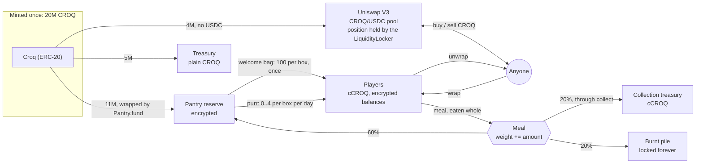
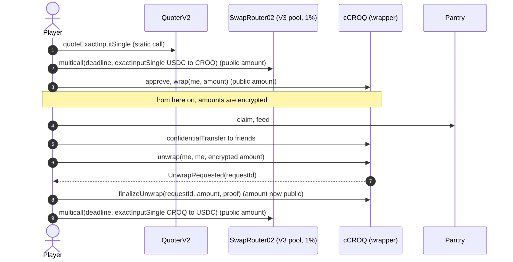
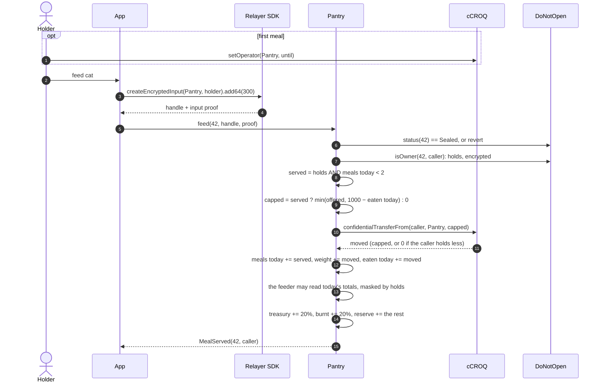
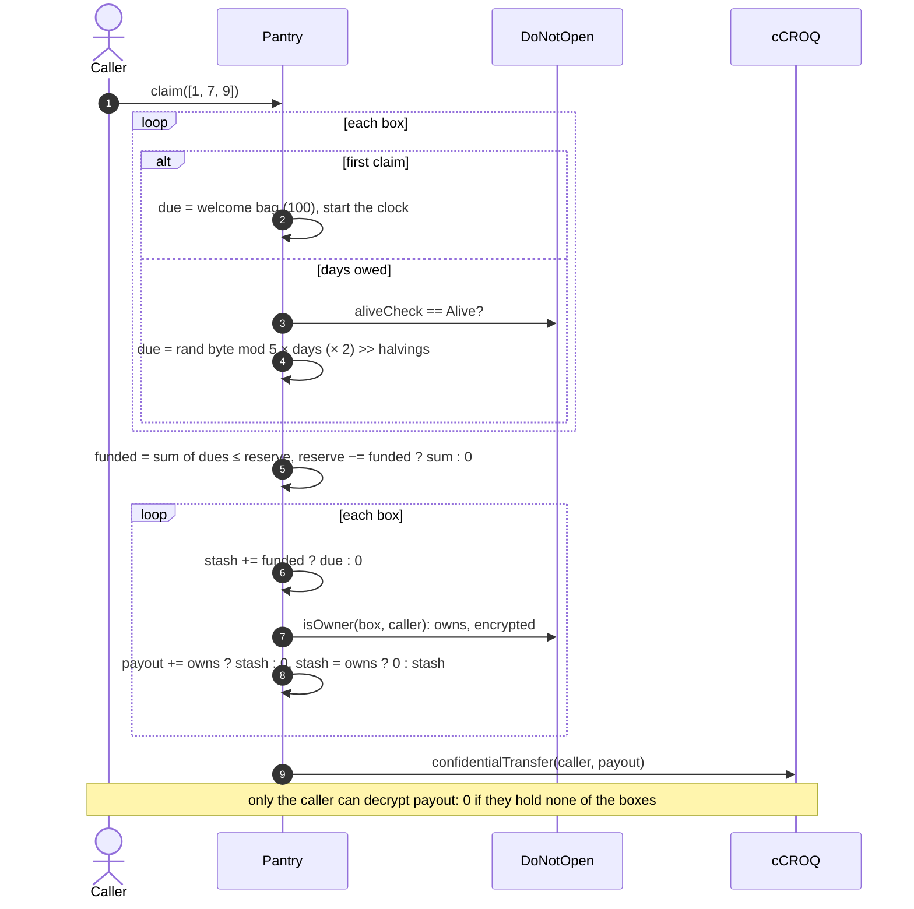
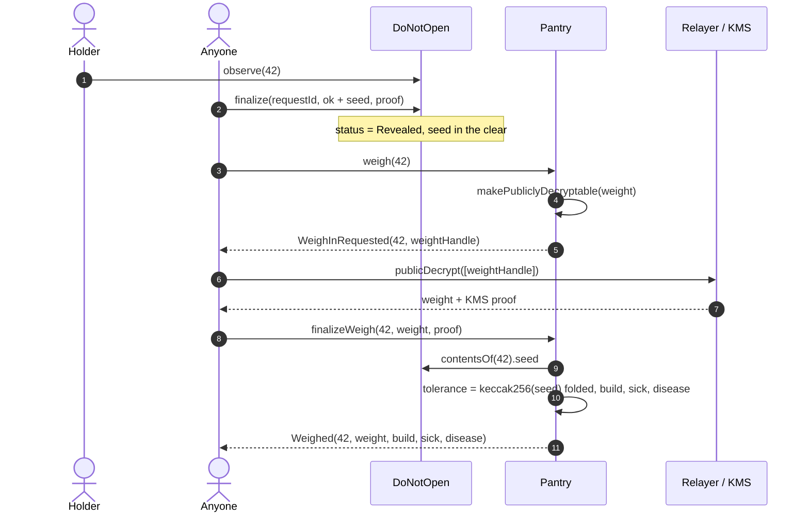
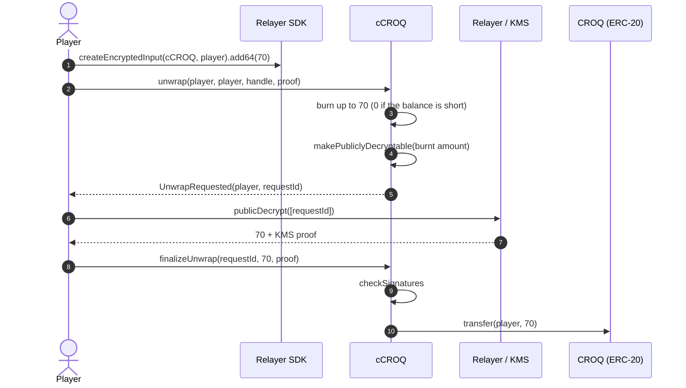

# Croquettes (CROQ)

The game currency of DO NOT OPEN. Holders feed their sealed cats croquettes, and the
cats eat them: each cat puts on a weight that nobody can read while the box is sealed.
Once the box is opened, the cat is weighed in public. Its weight sets its build, from
thin to huge, and past a tolerance of its own the cat is **sick**: an ultra-rare trophy.

Two gestures, two currencies:

| Gesture | Paid in | Hidden counter | At the reveal |
| --- | --- | --- | --- |
| Pet (`DoNotOpen.feed`) | cUSDC, to the collection | Affection | Golden accessory past the threshold |
| Meal (`Pantry.feed`) | cCROQ, eaten whole | Weight | Build, and sickness past the cat's tolerance |

Everything here runs next to `DoNotOpen` without writing to it. The `Pantry` only reads
the box contract: `status`, `aliveCheck` (1 is the vet's badge), `contentsOf`, and `isOwner`, the encrypted
"does this account hold this box", which `DoNotOpen` answers because its owner made the
Pantry a trusted reader (`setTrustedReader`). Who holds a box is encrypted (see
[HIDDEN_OWNERS.md](HIDDEN_OWNERS.md)), so every holder check here is encrypted too, and
none of them reverts.

The numbers live in the `economy` section of
[`packages/game-spec/spec.json`](../packages/game-spec/spec.json). The deploy script and
the tests read them from there.

## Two tokens

| Token | Contract | Standard | Amounts | Used for |
| --- | --- | --- | --- | --- |
| **CROQ** | `Croq.sol` | ERC-20, 0 decimals | Public | Public markets, the treasury |
| **cCROQ** | `ConfidentialCroq.sol` | ERC-7984, OpenZeppelin `ERC7984ERC20Wrapper` | Encrypted (`euint64`) | Everything in the game |

There are two tokens because an AMM computes prices from reserves and amounts in the
clear. A token whose balances and transfer amounts are encrypted cannot sit in a
Uniswap pool. So CROQ is a plain ERC-20 that any market can list, and cCROQ is its
confidential twin. One CROQ wraps into one cCROQ (rate 1, since the token has no
decimals). Unwrapping goes the other way, through a public decryption of the amount.

The amount is visible when CROQ enters or leaves the game. Inside the game, every
balance, transfer, meal and weight is encrypted until the reveal.

One CROQ is one croquette. There are no decimals.

## Supply

The whole supply is minted once, in the `Croq` constructor. `Croq` has no mint
function, no owner and no pause. Nothing can create more.

**Total supply: 20,000,000 CROQ.**

| Share | Amount | Where it goes |
| --- | --- | --- |
| Game reserve | 10,000,000 (50%) | Wrapped into the Pantry. Pays the daily purr, and takes back 60% of every meal |
| Welcome bags | 1,000,000 (5%) | Wrapped into the Pantry. 100 × 10,000 boxes |
| Market liquidity | 4,000,000 (20%) | A CROQ-only position in a CROQ/USDC Uniswap V3 pool, locked for good in the `LiquidityLocker` |
| Treasury | 5,000,000 (25%) | Kept by the collection owner as plain CROQ, for events and future liquidity |

Out of the treasury, 500,000 CROQ go to the `RatPantry` by a plain transfer, made by the deploy
itself in a full deployment (the economy script keeps them aside before handing the treasury to
the owner) (see
"The rats' croquettes" below): the studio's adopted rats are paid from it, not from the game
reserve.

The whitelist's gifts come out of the treasury too: at most 425,000 cCROQ (500 seats at most
500, 500 at most 250, 500 at most 100), wrapped to `WhitelistGifts` when it is deployed. Each
seated wallet draws its share at random in its tier's range, under encryption, and only it can
read how many (`whitelist` in `spec.json`; see [FLOWS.md](FLOWS.md#whitelist-gifts)). What is
not drawn goes back to the owner with `sweep` once the 30 days are over.

`economyFromSpec()` in `packages/contracts-evm/lib/specParams.ts` refuses a spec whose
shares do not add up to the total, or whose welcome bags do not equal
`maxSupply × welcomeBag`.

The game reserve and the welcome bags enter the Pantry through `Pantry.fund(amount)`:
plain CROQ moves in, is wrapped, and the amount is added to the encrypted reserve.
Anyone can call `fund`. The amount is public, since it moves as a plain ERC-20 first.

The total supply is public. How much still circulates is not: burnt croquettes stay
locked in the Pantry under an encrypted total that nobody can read.

Meals carry croquettes back to the reserve, so the reserve does not only drain: as long
as the cats eat, the purr keeps paying.

## Where croquettes come from

### Welcome bag

**100 cCROQ per box, once.** It is paid into the box on the box's first claim, whoever
asks, and its holder collects it. It belongs to the box, not to the wallet: a box that
changes hands does not get a second bag, and minting more wallets gives nothing more.
Getting bags means holding boxes, and boxes cost USDC. An id nobody holds (one of a mint's
empty ids) gets no bag and no purr: a mint of 0 boxes costs only gas, and its empty ids
would otherwise pour the reserve into stashes nobody can ever claim.

### Purr

Every box purrs a little every day, into the box. Its holder collects it with
`Pantry.claim(tokenIds)`.

| Rule | Value |
| --- | --- |
| Amount per box and per day | Encrypted draw in 0..4 |
| Vet Certified boxes | × 2 |
| Days one claim can collect | At most 7. Older days are lost |
| Halving | Every 365 days after the Pantry was deployed, the purr is halved |
| Ceiling | What is left in the reserve. A claim whose dues the reserve cannot cover pays nothing into its boxes |
| Boxes per claim | At most 10 (`MAX_BOXES_PER_CLAIM`, to stay under the HCU limit) |

How a claim works. Anyone may call it, for any boxes:

1. First claim of a box: its welcome bag is due, and the purr clock starts.
2. Later claims: the whole days since the last claim are counted (at most 7). A box with
   no full day owed adds nothing.
3. One encrypted draw in 0..4 per box, multiplied by the days owed, doubled if the box is
   Vet Certified, shifted right once per halving.
4. The dues are summed and compared with the encrypted reserve: if it covers them, each
   box's due goes into its encrypted **stash**; if not, nothing does (one `le`, not a
   `min` per box).
5. For each box, the caller takes the stash if they hold the box (`isOwner`), 0
   otherwise, and the rest stays in the box. Everything taken goes out as **one**
   confidential transfer. Only the claimer can decrypt what arrived.

A claim where no box owed anything and none had a stash reverts (`NothingToClaim`). A
claim never reverts on ownership: a stranger who claims for someone else's boxes only
moves their clocks and fills their stashes, and gets 0. So nobody can spend a holder's
day, and a claim says nothing about what the caller holds.

A part of a day that has started is kept: claiming after 2 days and 1 hour moves the
clock forward by exactly 2 days. When more than 7 days are owed, the clock is reset to
now.

The draw is one per box and per claim, multiplied by the days, not one per day. Two
claims of one day each give two independent draws; one claim of two days gives one draw
counted twice. The expected value is the same: 2 per box and per day in the first year.

At full activity (10,000 boxes claiming every day, none Vet Certified), the first year
pays about 7.3M, the second about 3.65M after the halving. The reserve of 10M runs out
during the second year at that pace. Real activity is lower. Either way the reserve,
not the formula, is the hard ceiling.

After 5 halvings the best possible purr (4 × 2 × 7 = 56) rounds to 0. From then on the
Pantry skips the FHE work and a claim only moves the clock.

The draw is a random byte modulo 5. 256 is not a multiple of 5, so 0 comes up 52 times
in 256 and the other values 51 times. The bias is accepted.

Nobody can know what a claim paid, including the claimer before the transaction. There
is nothing to simulate and nothing to retry on a bad day.

### The rats' croquettes

**3 plain CROQ per adopted rat per day**, from its mint, claimed by its current owner from
the `RatPantry`, at most 7 days kept between two claims. Plain CROQ, not cCROQ: a rat's owner
is public, so its earnings may be too; the bureau de change wraps them for the boxes. The
pantry gets 500,000 CROQ from the treasury by a plain transfer and has no owner: nothing
refills it but a transfer. While it is empty a claim reverts (`PantryEmpty`), so the days a
rat earned wait for the CROQ; when it runs low a claim pays what is left. A rat costs
at least 1 USDC, so farming croquettes with rats costs more than it brings at the market's
floor (0.001 USDC a CROQ: about 333 days to earn a seed rat's price back).

The rats are capped for good in the `Rats` contract: 700 seed rats and 300 AI rats, never
more, and one address mints 5 at most. With every rat adopted and claiming, the pantry pays
3,000 CROQ a day, so its 500,000 last about 167 days; longer in practice, since a rat left
alone more than 7 days earns nothing more. It was 10 CROQ a day with no cap before the
2026-10-04 redeployment: an unlimited mint would have emptied the fixed fund. The whitelist's
gifts add up to 1,000 free rats outside those caps (`maxGiftRats`): with every one of them
claiming too, the pantry lasts about 83 days, unless the treasury tops it up. Numbers in
`packages/game-spec/studio.json` (`rats.mint`, `rats.croquettes`).

## Where croquettes go

### Meals

Only the **holder** feeds a **sealed** cat. The USDC-paid `feed` on `DoNotOpen` is
separate: it pets the cat (affection), a meal feeds it (weight).

1. The holder encrypts an amount in the browser with the Relayer SDK. The input proof
   is made for the Pantry and the holder.
2. `Pantry.feed(tokenId, encryptedAmount, inputProof)` asks `isOwner` and checks the
   day's meal count, both encrypted. A meal that is served is cut down to what is left
   of the day's allowance, then pulled from the holder's cCROQ; a meal that is not
   (a stranger, a third meal) pulls 0. The holder must have made the Pantry an operator
   once (`cCroq.setOperator(pantry, until)`).
3. **The cat eats it all.** Its encrypted weight goes up by the amount, and the
   croquettes are split, all in FHE:

   | Share | Goes to |
   | --- | --- |
   | 20% | The collection's treasury, sent out by `collect()` |
   | 60% | Back to the game reserve, which pays the purr |
   | 20% | The burnt pile |

4. The day's encrypted meal count goes up by one if the meal was served. The event is
   `MealServed(tokenId, feeder)`: no amount, no count, and nothing about whether it was
   served.

If the holder holds less than the (capped) offer, the transfer moves **0**. There is no
revert, and nothing on-chain tells it apart from a real meal. The meal is still
counted.

### Daily allowance

| Rule | Value |
| --- | --- |
| Meals per cat and per UTC day | 2. A third moves 0, silently |
| Croquettes per cat and per UTC day | 1,000, however they are spread: 1 + 999, 500 + 500 or 1,000 at once |

The amount and the meal count are encrypted, so the Pantry cannot revert on them: an
offer past what is left of the day is cut down to it, silently, and only what the cat ate
leaves the wallet. A feeder can decrypt today's meals and croquettes eaten after their
own meal (`todayHandles(tokenId, feeder)`): the real figures if they hold the cat, zeros
otherwise. The app reads them (`pantryDay`) to cap the input.

The allowance belongs to the cat, not the wallet. More wallets do not feed a cat faster.

Only the holder's meals are served because of that limit: if anyone's were, a stranger
could fill a cat's two meals with empty bowls every day, for the price of gas, and starve
it. A stranger's meal uses none of the day's two.

### The weight

| Who | Can read it |
| --- | --- |
| The holder | No (they know what they fed, not what earlier holders did) |
| The public | No, until the box is opened and weighed |
| The deployer | No |

Nobody is allowed on a weight, because `FHE.allow` grants are permanent: a weight that
its holder could read would stay readable to every past holder after a sale.

### Weigh-in

Once `DoNotOpen` has finalised the reveal, **anyone** weighs the cat, once:

1. `Pantry.weigh(tokenId)` makes the weight publicly decryptable and emits
   `WeighInRequested(tokenId, weightHandle)`. A cat that never ate is weighed on the
   spot, with no FHE work.
2. Anyone fetches the cleartext and the KMS proof from the relayer and sends
   `finalizeWeigh(tokenId, weight, proof)`.

The Pantry then computes, in the clear:

- the **build**, the highest one the weight reaches;
- the cat's **tolerance**: `keccak256(seed)` folded into [300,000, 600,000);
- **sick** when the weight is at or past the tolerance, and then the disease, from other
  bits of the same hash.

| Build | Weight from | Score bonus |
| --- | --- | --- |
| Thin | 0 (never ate) | 0 |
| Normal | 1 | 0 |
| Chubby | 10,000 | +100 |
| Fat | 50,000 | +300 |
| Huge | 150,000 | +700 |
| **Sick** | the cat's tolerance, 300,000 to 600,000 | +2,000 on top of huge |

| Disease | Share of sick cats |
| --- | --- |
| Diabetic | 60% |
| Arthritic | 30% |
| Fatty liver | 10% |

The event is `Weighed(tokenId, weight, build, sick, disease)`. Sickness is a trophy: the
cat does not die of it, and its state from the reveal does not change.

The tolerance comes from the seed, which is encrypted until the box is opened, and by
then the cat can no longer eat. Nobody, the holder included, can feed a cat up to just
its tolerance: past 300,000 every meal is a bet that it is not enough yet.

### Calibration

The numbers are set so the builds stay rare for the life of the game, against a supply
of 20M:

| Build | Fastest, at 1,000 a day | Croquettes eaten | Share of the supply |
| --- | --- | --- | --- |
| Chubby | 10 days | 10,000 | 0.05% |
| Fat | 50 days | 50,000 | 0.25% |
| Huge | 150 days | 150,000 | 0.75% |
| Sick | 300 to 600 days | 300,000 to 600,000 | 1.5% to 3% |

- **The purr is not enough.** It pays about 2 a day per box in the first year: ~730 a year,
  less after each halving. Anything past normal is bought on the market.
- **A sick cat moves the market.** 300,000 croquettes is 7.5% of the pool's starting 4M,
  and buying it from the pool costs more with every croquette: the price climbs along the
  position's range.
- **The fire is a hard ceiling.** Each sick cat burns at least 60,000. If every one of the
  20M croquettes were eventually burnt, at most ~333 cats could ever get sick; with a
  reserve that only lets croquettes out through the purr, the real number is far lower.
- **Time is the other ceiling.** No sick cat exists before day 300 of the game, whatever
  is spent.

### Treasury share

The treasury's 20% piles up in an encrypted bucket that nobody can read, the treasury
included (`treasuryShareHandle`). `collect()` sends it all to the treasury in one
confidential transfer, at most once every 7 days (`COLLECT_INTERVAL`). Anyone may call it;
it always pays the treasury. Were the bucket readable after each meal, or collectable after
each one, the difference would tell the treasury who fed which cat and how much. The
treasury address is set at deployment (`COLLECTION_OWNER`, or the deployer) and cannot
change.

### The burnt pile

"Burnt" means locked in the Pantry. No function moves the burnt pile. A real burn on
the wrapper would strand the same plain CROQ inside it anyway, at a higher FHE cost.
The running total is encrypted and nobody is allowed on it.

The Pantry's books always balance: its cCROQ balance equals the reserve, plus the
uncollected treasury share, plus the burnt pile (test: "keeps the books").

## Selling a fed box

The weight is keyed by token id, so it follows the cat to the new holder, and so do the
day's allowance and whatever waits in its stash. A buyer knows:

- the `MealServed` events: how often someone tried to feed it, not whether those meals
  were served or what they moved;
- that a cat can eat at most 1,000 a day, so the days since the first meal bound its
  weight.

The buyer does not know the weight, and nobody knows the tolerance. The seller knows at
least what they fed it themselves. That asymmetry is part of the game.

The events are a weak signal: anyone can emit one for the price of gas.

## The public market

A Uniswap V3 pool pairs CROQ with USDC, the collection's own currency (Zama's `USDCMock` on
Sepolia), at the 1% fee tier. The creator put **no USDC** in it. The 4M liquidity share
went in as one *single-sided* position: a V3 position covers a price range, and one that
starts exactly at the pool's opening price holds only the token being sold. Buyers bring
all the USDC.

- **Range.** From 0.001 USDC per CROQ (`LIQUIDITY_START_PRICE`, rounded up to the next
  usable tick: 0.001012 on Sepolia) up to 1,000 times that (`LIQUIDITY_RANGE`): about
  1.004 USDC, where the last of the 4M goes. The fee tier is `LIQUIDITY_FEE` (10000, 1%).
  At the start a welcome bag is worth about 10 cents.
- **CROQ never sells below the start.** Selling only gives back USDC that buyers put in.
  The pool's price can drift below the range when a seller empties it, but nothing trades
  there: the next buyer crosses the gap for free and still pays at least the start price.
- **Until someone buys, nobody can sell.** The pool starts with no USDC, so a welcome bag
  finds nothing to sell into. The app says so ("nothing to get from the pool yet") instead
  of sending a swap that would revert.
- **Price.** Within the range, V3 trades like a constant-product pool on "virtual"
  reserves (L/√P and L·√P). The adapter and the API report those as `croqReserve` and
  `quoteReserve`, so the price and the price impact read the same way as before, and
  report what the pool really holds as `croqHeld` and `quoteHeld`, and the range as
  `range` (USDC units per 1,000 CROQ).

A player with no USDC can buy some with ETH through the site's ramp (see
[FLOWS.md](FLOWS.md#getting-usdc)). The app quotes with Uniswap's `QuoterV2` and swaps
through `SwapRouter02` (`exactInputSingle` inside a `multicall` with a deadline), with the
player's slippage tolerance under the quote.

### The liquidity locker

The position is an NFT of Uniswap's `NonfungiblePositionManager`. The deploy script mints
it to the deployer and hands it straight to `LiquidityLocker` with `safeTransferFrom`.
The locker:

- has no function that removes liquidity, moves a position out or burns one: the market
  stays open whoever owns the collection, the deployer included;
- accepts NFTs only from the position manager (anything else would be stuck), and lists
  what it holds (`positions()`, `Locked` events);
- lets anyone call `collect(positionId)`, which sends the trading fees the position
  earned (1% of every swap, in USDC and CROQ) to the `beneficiary`, the treasury. The
  liquidity itself does not move;
- lets its owner (`Ownable2Step`) change the beneficiary, and nothing else.

`lib/uniswapV3.ts` lays the position out (`planSingleSided`: ticks, opening price, CROQ on
the right side whatever the address order) and seeds it (`seedSingleSided`). It refuses
to seed a pool someone opened first at another price, since a position minted there could
need USDC or sell CROQ below the start. On Sepolia CROQ sorts after USDC, so it is the
pool's token1 and is sold as the raw price falls.

Before this, the market was a Uniswap V2 pool seeded with 4M CROQ and 4,000 USDC, its LP
tokens sent to `0x…dEaD`. Single-sided V3 needs no USDC from the creator, and the fees
come back to the project instead of being burnt with the LP tokens.

On Sepolia none of this has a real value: test USDC and Sepolia ETH are free. The project does not sell
CROQ and promises no value for it.

**Mainnet note.** Offering a token to the public, or seeding the market it trades on,
is regulated: in the EU it falls under MiCA (a white paper, and possibly more). Before
any mainnet deployment of the market side, get legal advice. A game currency that the
project never sells is the safest shape.

## Flows

### Feed

### Claim

### Weigh

### Unwrap

The unwrapped amount becomes public: it is about to move as a plain ERC-20 anyway.

## What leaks

Encrypted amounts do not make the game invisible. Public, for anyone reading the chain:

- who tries to feed which box, and when (`MealServed`), not whether the meal was
  served;
- who claims, for which boxes, and when (`Claimed`, `WelcomeBag`, `Purred`, `lastPurr`),
  not whether the caller holds any of them;
- every amount that crosses the border: wraps, unwraps, market trades, `fund`;
- the weight of every opened and weighed cat, and so the total its holders fed it;
- that a confidential transfer happened between two addresses.

Not public, for anyone:

- any balance, meal or purr amount, and the weight of a sealed cat;
- how many meals a cat had, and what waits in a box's stash;
- who holds a box;
- the reserve left, the treasury's uncollected share, and the total burnt;
- so, how much CROQ really circulates.

## Cost

Measured on the FHEVM mock with `fhevm.computeTransactionHCU`. The protocol limit is
20,000,000 HCU per transaction and 5,000,000 along the longest dependency chain. Gas and
HCU for every function, with what they mean in dollars, are in
[HIDDEN_OWNERS.md](HIDDEN_OWNERS.md#7-cost).

| Function | FHE work | HCU |
| --- | --- | --- |
| `feed` | holder check, meal count, input check, `min`, confidential `transferFrom`, the feeder's masked copies, two `mul` + `div` for the split, `sub`s and `add`s | ~3,680,000 (1.20M gas) |
| `claim`, 3 boxes | per box owed something: `isOwner(id, address(0))` and a `select`; per purring box: `randEuint8`, `rem`, cast, `mul`, `shr`, `add`; one `le` and `sub` on the reserve; per box with a stash: `isOwner`, two `select`s, `add`; one transfer | ~3.1M to ~5.0M (1.15M to 1.34M gas) |
| `claim`, 10 boxes | the same | ~14.8M |
| `weigh`, never fed | none | 0 |
| `weigh` + `finalizeWeigh` | one public decryption request, then plain arithmetic | ~0 |
| `collect` | one confidential transfer | ~590,000 |

Deployment gas on Sepolia: `Croq` 536k, `ConfidentialCroq` 2.49M, `Pantry` 2.20M,
`fund` 442k.

## Deployed on Sepolia

The economy of the current `DoNotOpen` (deployed 2026-10-08, block 11869550, for the
whitelist's free gift boxes), started fresh with it: the old `Pantry`'s 11,000,000 CROQ reserve
cannot leave it, a new `DoNotOpen` needs a new `Pantry`, and the deployer held only 4,075,000
CROQ.

| Contract | Address |
| --- | --- |
| `Croq` | [`0x765A56A1949baDd2Fc4c04c59c4eCfb464fFfB7C`](https://sepolia.etherscan.io/address/0x765A56A1949baDd2Fc4c04c59c4eCfb464fFfB7C) |
| `ConfidentialCroq` | [`0xbC7704F737FC4492FC3964449c80b4D7c77479b9`](https://sepolia.etherscan.io/address/0xbC7704F737FC4492FC3964449c80b4D7c77479b9) |
| `Pantry` | [`0xe867E3009C61B943776823a97b3C66A89Bb66a23`](https://sepolia.etherscan.io/address/0xe867E3009C61B943776823a97b3C66A89Bb66a23) |
| `LiquidityLocker` | [`0x704811b4091C6A7E37dAb7a104A80300986Bf058`](https://sepolia.etherscan.io/address/0x704811b4091C6A7E37dAb7a104A80300986Bf058) |
| `RatPantry` (the rats' croquettes, plain CROQ, 500,000) | [`0xa8C6850eB99f89aB1DA9714Cd073B454Bb6E1850`](https://sepolia.etherscan.io/address/0xa8C6850eB99f89aB1DA9714Cd073B454Bb6E1850) |
| `WhitelistGifts` (425,000 cCROQ for the whitelist's draws) | [`0x09D2382E4E6d15Efa324d89f8c5E39437e0e405a`](https://sepolia.etherscan.io/address/0x09D2382E4E6d15Efa324d89f8c5E39437e0e405a) |
| CROQ/USDC pool (Uniswap V3, 1%) | [`0x2A830D9F11D67B8Ac11Dc70AEbc34bEE750cC811`](https://sepolia.etherscan.io/address/0x2A830D9F11D67B8Ac11Dc70AEbc34bEE750cC811) |
| Position | #233324, ticks 69200 to 138200, 4,000,000 CROQ, 0 USDC (0.001012 to 1.004 USDC per CROQ) |
| Uniswap V3 factory | `0x0227628f3F023bb0B980b67D528571c95c6DaC1c` |
| `NonfungiblePositionManager` | `0x1238536071E1c677A632429e3655c799b22cDA52` |
| `SwapRouter02` | `0x3bFA4769FB09eefC5a80d6E87c3B9C650f7Ae48E` |
| `QuoterV2` | `0xEd1f6473345F45b75F8179591dd5bA1888cf2FB3` |

The treasury, and the locker's beneficiary and owner, is the deployer
`0x590891F269720001435004A1089cAB5b2c20029A` (until 2026-10-07 it was
`0x6a18cFC3fAeef453B295B12246d40a82593b3208`). It holds what the split leaves: the treasury's
5,000,000 CROQ, less the `RatPantry`'s 500,000 and the gifts' 425,000.

The one that read the `DoNotOpen` of the rats' powers and tricks (2026-10-07, block 11862305), replaced:

| Contract | Address |
| --- | --- |
| `Croq` | [`0x176f24a7ab07210E8306C4331104BC9a0d145a53`](https://sepolia.etherscan.io/address/0x176f24a7ab07210E8306C4331104BC9a0d145a53) |
| `ConfidentialCroq` | [`0xa9de609cC7FD4D264cb5B30Ef2c41e4297bC9964`](https://sepolia.etherscan.io/address/0xa9de609cC7FD4D264cb5B30Ef2c41e4297bC9964) |
| `Pantry` | [`0x4e62259E4FFb05224b8Ef64dD4E45826651EB72F`](https://sepolia.etherscan.io/address/0x4e62259E4FFb05224b8Ef64dD4E45826651EB72F) |
| `LiquidityLocker` (position #233286) | [`0x13B2636a1De5Ad3922aF6D499a290e8911F4e772`](https://sepolia.etherscan.io/address/0x13B2636a1De5Ad3922aF6D499a290e8911F4e772) |
| `RatPantry` | [`0xC13432AF43dDC738fa0a591CE3499BaF0DA5E450`](https://sepolia.etherscan.io/address/0xC13432AF43dDC738fa0a591CE3499BaF0DA5E450) |
| `WhitelistGifts` | [`0xD244389bF81C38803c94957a1e6B5694eEeA678b`](https://sepolia.etherscan.io/address/0xD244389bF81C38803c94957a1e6B5694eEeA678b) |
| CROQ/USDC pool (Uniswap V3, 1%) | [`0xC2EA76E3c3107512A229936FfbD91cD297D40847`](https://sepolia.etherscan.io/address/0xC2EA76E3c3107512A229936FfbD91cD297D40847) |

The one that read the `DoNotOpen` of the security review (2026-10-03, block 11836238), replaced:

| Contract | Address |
| --- | --- |
| `Croq` | [`0x142ADF07aEcdd0D1c915bBCa574B1A9EBDd91308`](https://sepolia.etherscan.io/address/0x142ADF07aEcdd0D1c915bBCa574B1A9EBDd91308) |
| `ConfidentialCroq` | [`0x358E932457A2F19B20BF49264875E94432941D81`](https://sepolia.etherscan.io/address/0x358E932457A2F19B20BF49264875E94432941D81) |
| `Pantry` | [`0x7Df443562BD787A56b1026aD91cFa0A8E91E7d9d`](https://sepolia.etherscan.io/address/0x7Df443562BD787A56b1026aD91cFa0A8E91E7d9d) |
| `LiquidityLocker` (position #233138) | [`0x85b827d5F40C15F0842F48C830B956cf8C5Da108`](https://sepolia.etherscan.io/address/0x85b827d5F40C15F0842F48C830B956cf8C5Da108) |
| `RatPantry` | [`0x1334d72fC60cBedcF409d6583F0Ec009c285E75B`](https://sepolia.etherscan.io/address/0x1334d72fC60cBedcF409d6583F0Ec009c285E75B) |
| CROQ/USDC pool (Uniswap V3, 1%) | [`0xc1eFDaC0c240F9BbCE8788E18427666310E267ce`](https://sepolia.etherscan.io/address/0xc1eFDaC0c240F9BbCE8788E18427666310E267ce) |

Its treasury was `0x6a18cFC3fAeef453B295B12246d40a82593b3208`. Deployment gas: `Croq` 533k,
`ConfidentialCroq` 2.46M, `Pantry` 3.25M, `fund` 442k, `LiquidityLocker` 559k.

The one that read the `DoNotOpen` of the CROQ-only V3 market (2026-10-02, block 11830294), replaced:

| Contract | Address |
| --- | --- |
| `Croq` | [`0xbedb039CB104bD8e60A5eD7844fCE7961d0451F7`](https://sepolia.etherscan.io/address/0xbedb039CB104bD8e60A5eD7844fCE7961d0451F7) |
| `ConfidentialCroq` | [`0x5b4af5b2Eb99ec3615721a4fBfb7baF5BC8b7952`](https://sepolia.etherscan.io/address/0x5b4af5b2Eb99ec3615721a4fBfb7baF5BC8b7952) |
| `Pantry` | [`0xf506832ab27DF17ece72924502537ecCf7586CDB`](https://sepolia.etherscan.io/address/0xf506832ab27DF17ece72924502537ecCf7586CDB) |
| `LiquidityLocker` | [`0xCA7Eee59de903F9b6bfab466667131Fb58403BF3`](https://sepolia.etherscan.io/address/0xCA7Eee59de903F9b6bfab466667131Fb58403BF3) |
| CROQ/USDC pool (Uniswap V3, 1%) | [`0x399Dc7af546154998D302d0b3B312750DA962100`](https://sepolia.etherscan.io/address/0x399Dc7af546154998D302d0b3B312750DA962100) |

The one that read the `DoNotOpen` with the duel shelf (2026-10-02, block 11828557), replaced:

| Contract | Address |
| --- | --- |
| `Croq` | [`0xF4d9CE55b52417e503617186e923E1c0713c53b5`](https://sepolia.etherscan.io/address/0xF4d9CE55b52417e503617186e923E1c0713c53b5) |
| `ConfidentialCroq` | [`0x4f7415781ceef5C6A0C036A7B8813B7F49634bF9`](https://sepolia.etherscan.io/address/0x4f7415781ceef5C6A0C036A7B8813B7F49634bF9) |
| `Pantry` | [`0x28aC2bc964AfAAa10f51bf485C59D2C9CF6bC8Ed`](https://sepolia.etherscan.io/address/0x28aC2bc964AfAAa10f51bf485C59D2C9CF6bC8Ed) |
| CROQ/USDC pair (Uniswap V2) | [`0x7C117CA5f1f0d57Bcc9810E216aa6238799E43d2`](https://sepolia.etherscan.io/address/0x7C117CA5f1f0d57Bcc9810E216aa6238799E43d2) |

The one that read the hidden-owner `DoNotOpen` before the duel shelf (2026-10-01), replaced:

| Contract | Address |
| --- | --- |
| `Croq` | [`0x5ebF858ff01d40D8cbC707B8d1F873099F5a11E2`](https://sepolia.etherscan.io/address/0x5ebF858ff01d40D8cbC707B8d1F873099F5a11E2) |
| `ConfidentialCroq` | [`0x58B4e70B877afF540796c3ec38b54C2C7834B804`](https://sepolia.etherscan.io/address/0x58B4e70B877afF540796c3ec38b54C2C7834B804) |
| `Pantry` | [`0x084C50597D83ab89D62F5FA4245A4a4e9909A77D`](https://sepolia.etherscan.io/address/0x084C50597D83ab89D62F5FA4245A4a4e9909A77D) |
| CROQ/USDC pair (Uniswap V2) | [`0x9E8C1e4D763F8Fc9CE3eD342a6C2103A5c51eF60`](https://sepolia.etherscan.io/address/0x9E8C1e4D763F8Fc9CE3eD342a6C2103A5c51eF60) |

The previous version, which checks `ownerOf` in the clear:

| Contract | Address |
| --- | --- |
| `Croq` | [`0x183B74906673283f7Fe3272103989A357Cf88522`](https://sepolia.etherscan.io/address/0x183B74906673283f7Fe3272103989A357Cf88522) |
| `ConfidentialCroq` | [`0x7598484e5DDdada766ab19Cd7d0dD42d17Dd4F06`](https://sepolia.etherscan.io/address/0x7598484e5DDdada766ab19Cd7d0dD42d17Dd4F06) |
| `Pantry` | [`0x20755493eF05C954BdC2e970b0437B12AE19d01e`](https://sepolia.etherscan.io/address/0x20755493eF05C954BdC2e970b0437B12AE19d01e) |
| CROQ/USDC pair (Uniswap V2) | [`0xDc7Ed9F6ffd2993350BDc2c563E42036C5a53B43`](https://sepolia.etherscan.io/address/0xDc7Ed9F6ffd2993350BDc2c563E42036C5a53B43) |
| Uniswap V2 router | `0xeE567Fe1712Faf6149d80dA1E6934E354124CfE3` |
| USDC (`USDCMock`) | `0x9b5Cd13b8eFbB58Dc25A05CF411D8056058aDFfF` |

The Pantry reads `DoNotOpen` at `0xe8f699eEBc22767413A9edBb48826B10D3117f61`.

Deployed on 2026-10-01 with the USDC-priced collection, so this Pantry runs the weight
rules. The earlier CROQ, cCROQ, Pantry and pool (`0x72Fc…dD10`, `0xa89c…393c`,
`0x8a58…9882`, `0x645D…270d`) are abandoned: a Pantry is tied to one collection and has
no withdrawal function, so the CROQ funded into the old one stays there.

## Tests

`packages/contracts-evm/test/Pantry.ts`, 32 tests on the FHEVM mock. They cover the
fixed supply, wrapping and unwrapping, every claim rule (bag per box into the box, a
stranger's claim, days, cap, Vet Certified, halving, empty reserve), the trusted-reader
gate, meals (a non-holder's meal served nothing, the 20/60/20 split, two meals a day,
the 1,000 a day cap in one meal or spread, silent 0, nobody can read a weight, operator
and input checks), the treasury's `collect`, every build, sickness past the seed's
tolerance, a forged weight, and the bookkeeping invariant. Each function's HCU budget is
pinned.
