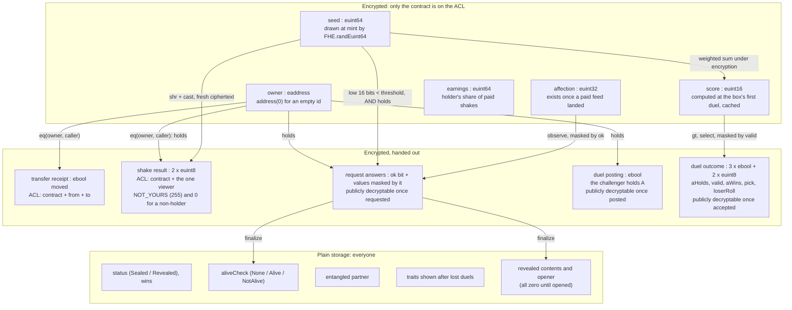
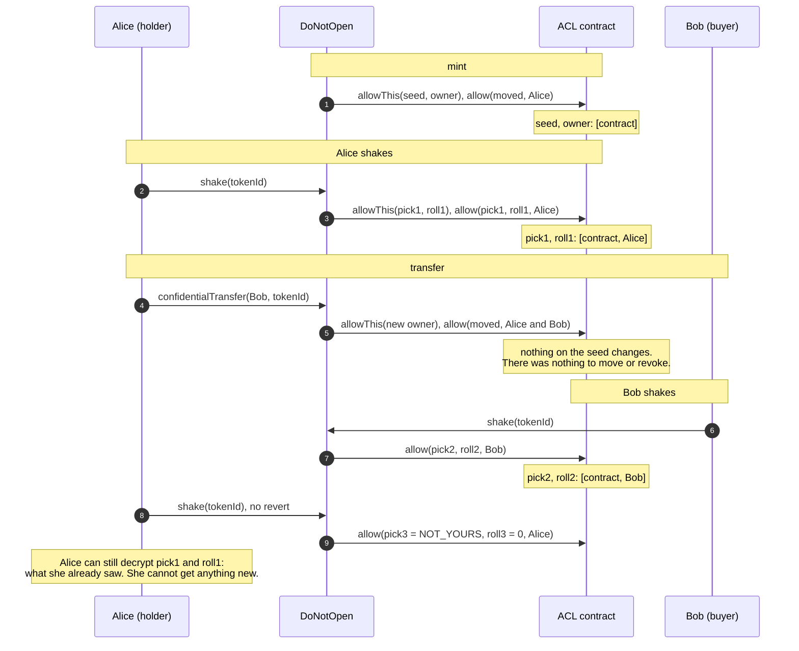

# Encrypted data model

## Per token

Per collection: the number sold (`euint16`, nobody on the ACL, capped at 10,000 under
encryption), the bit "the next milestone is reached" (publicly decryptable after each
mint), the cUSDC revenue (`euint64`, nobody on the ACL, the owner included: it learns the
revenue only as what `withdraw` pays, at most once a week). Public: `tokenCount` (ids
created, empty ones included) and `milestonesReached`. See [HIDDEN_OWNERS.md](HIDDEN_OWNERS.md).

The seed layout (from `game-spec`):

| Bits | Field | Used for |
| --- | --- | --- |
| 0 to 15 | state roll | alive / asleep / ghost / quantum, by threshold |
| 16 to 23, 24 to 31, 32 to 39, 40 to 47, 48 to 55 | breed, mood, accessory, broken thing, room | one byte each; a higher roll is a rarer variant |
| 56 to 63 | cosmetic | look only, never rarity |

State, traits and score are **not stored encrypted**. They are functions of the seed,
computed under encryption when a mechanic needs them and in plain Solidity once the seed
is public.

## Who can learn what

| Fact | Holder | Anyone else | How |
| --- | --- | --- | --- |
| Who holds a box | Yes, their own | No, unless the holder opens it or makes a request that succeeds | Encrypted owner; the holder replays their own `ConfidentialTransfer` receipts |
| How many boxes an account holds | Yes, their own | No: an upper bound at most (ids it minted, transfers naming it) | There is no `balanceOf` |
| How many boxes were sold | No | No | Encrypted counter; only milestones are announced |
| How many boxes one mint bought | The buyer | No: at most the `ids` it created | Encrypted quantity in `MintPlaced` |
| The seed, the state, the score | No | No | Only by opening the box, for everyone at once |
| One trait per shake | Yes, free, unlimited | Yes, by paying (`paidShake`) | User decryption of a fresh ciphertext. A free shake by a non-holder reads `NOT_YOURS` |
| Which trait a shake picked | The viewer only | No | The pick is encrypted too, and absent from the event |
| Whether it is alive | Everyone, if the holder asks | same | `proveAlive` publishes one bit, once per box. A request by a non-holder is refused and reveals nothing |
| That the challenger holds the box they put up for a duel | Everyone | same | `postDuel` publishes one bit; only a proven posting goes on the shelf |
| Who wins a duel, one trait of the loser | Everyone | same | Public decryption of five values: aHolds, valid, aWins, pick, loserRoll. The last three are zeros unless both boxes were held. "B is held" only shows when A was |
| The winner's trait in a duel | No | No | Selected away under encryption, never decryptable |
| That someone fed it | Everyone | same | `Fed(tokenId, feeder)`. Whether the fee was paid is not public, and the count is not kept |
| How much affection that earned | No | No | Each paid feed adds an encrypted draw in 0..3; an unpaid one adds 0 |
| What paid shakes earned the box | No | No | Encrypted; paid to whoever holds the box at `claimEarnings` |

Two deliberate consequences:

- **A holder who shakes enough learns all five traits.** A shake shows one of five at
  random, so about eleven shakes cover them. What stays hidden from the holder is the
  state (worth up to 1,000 of the 3,040 score points) and the affection.
- **Duels leak order.** Each duel publishes which of two boxes has the higher base score.
  Enough duels rank a set of boxes. That is the point of the mechanic, and the price of
  playing it.

## ACL lifecycle

`FHE.allow` grants are permanent on this protocol: there is no revoke. The design
therefore never grants anything durable that would need revoking. The owner itself is a
ciphertext only the contract may use.

| Event | ACL change | Why |
| --- | --- | --- |
| mint | contract on the seed and each owner; buyer on each receipt and on the quantity | The contract computes on them later; the buyer finds which ids are theirs |
| confidentialTransfer | contract on the new owner; both sides on the `moved` bit | The receipt is how each side tracks its boxes |
| confidentialTransferIf | same as `confidentialTransfer`; the caller's encrypted `really` is used once, for nobody to read | A decoy (`really` false) leaves the owner as it was |
| shake, paidShake | contract and viewer on two fresh ciphertexts | The relayer requires the contract on anything a user decrypts |
| feed | contract on the new affection | |
| paidShake, claimEarnings | contract on the box's earnings | |
| first duel | contract on the cached score | |
| `isOwner` | the account on the answer; the asking contract for the transaction | Only the account, its operators and trusted readers (the Pantry) may ask |
| proveAlive | "holds" and the alive bit become publicly decryptable | One bit, and that the caller held the box |
| acceptEntangle | "both hold" becomes publicly decryptable | |
| postDuel | "the caller holds A" becomes publicly decryptable | A duel is a public act |
| acceptDuel | five duel values become publicly decryptable | The last three masked by "both hold" |
| observe | "holds and paid", seed and affection (masked by it) become publicly decryptable | Irreversible, like the grant |

What a previous holder keeps after a sale: the traits they shook out, which no system
could make them forget, and the receipts that tell them the box left. What they lose: the
right to shake, open, duel or entangle: their attempts now do nothing.

A buyer should assume the seller knows all five traits. The buyer can level that for the
price of a few paid shakes before buying.

## Decryption credits

`DecryptionCredits` holds no funds and nothing encrypted: `bought[account]`, the credits
ever bought for an account, `price` (plain USDC per credit, at most 1 USDC, set by the
owner, from Zama's dollar price for one decryption: `dno:credit-price`) and `treasury`, where
payments go at once. A credit is one unit: a decrypted value, or a fifth of an encrypted input. What is spent is counted off-chain by
the API, which keeps three things in Postgres:

| Table | What | Rebuilt by a replay |
| --- | --- | --- |
| `credit_accounts` | credits bought, folded from `CreditsBought` | yes |
| `published_handles` | handles the protocol's contracts made public, from Zama's ACL | yes |
| `relayer_free_used`, `relayer_credits_spent` | free units used per account and UTC day, credits spent | no: not on the chain |

A purchase is public: it shows which account bought how many credits.

## Studio packs

`StudioPacks` holds no funds and nothing encrypted: `packs[id]` (a USDC price, so many
sketches and 3D models; a zero price is not for sale), `sketchesBought[account]` and
`modelsBought[account]`, and `treasury`, where payments go at once. The packs come from
[`packages/game-spec/studio.json`](../packages/game-spec/studio.json). What is spent is counted
off-chain by the API:

| Table | What | Rebuilt by a replay |
| --- | --- | --- |
| `studio_accounts` | sketches, models, packs and USDC paid per account, folded from `PackBought` | yes |
| `studio_jobs` | every generation: account, kind (`sketch`, `model`), status (`running`, `done`, `failed`, `rejected`), prompt, the sketch a model was made from, the service's file URL, the estimated cost in dollars, times | no: not on the chain |

Units left = bought − jobs `running`, `done` or `rejected` of that kind; a `failed` job gave
its unit back (at most `STUDIO_REFUNDS_PER_DAY` a day per account, after which a failure is
`rejected`), and a job still `running` after ten minutes is failed. The day's spend, checked
against `STUDIO_DAILY_BUDGET_USD`, is the sum of the estimated costs of every job of the day,
failed ones included: the service may have billed them. A purchase is public: it shows which account bought which pack. The prompts and
pictures stay in the API's database and at the AI service.

## Rats

`Rats` is an ERC-721: owners are public. Per rat it keeps its kind (a seed rat or an AI
rat), its mint time (the croquettes count from there) and its reference: the 64-bit seed, or
the studio job's `keccak256` (`tokenOfSeed`, `tokenOfJob` make each one adoptable once). An AI
rat's `uri` (an `ar://` record pointing at its picture on Arweave and its GLB on the API) is only in the `RatMinted`
event. It counts `seedMinted` and `modelMinted` against the immutable caps `maxSeedRats` (700)
and `maxModelRats` (300), and `mintedBy[address]` against `maxPerWallet` (5). The `giver` (the
whitelist's gifts) adopts free seed rats outside those caps and the wallet limit, counted in
`giftMinted` against `maxGiftRats` (1,000). Each rat also has `_power[rat]`, an `euint8` (1, 2 or
3) drawn at its mint and allowed to `Rats` and the minter; the bounds of the draw are the
immutables `_power1Below`, `_power2Below`, and `tricks` names the one contract allowed to compute
with it. `RatPantry` keeps `paidUntil[rat]` and the plain CROQ it holds.

`RatTricks` keeps, all encrypted unless said:

| Field | Type | Visibility | Meaning |
| --- | --- | --- | --- |
| `readyAt[rat]` | `uint64` | public | When the rat can play a trick again |
| `_shield[box]` | `{ euint64 mask, euint64 until, euint64 noise }` | nobody | Traits strangers read wrong (0xFF over each trait's byte of the seed), until when, and the fake rolls, one byte per trait |
| `_jam[box]` | `{ euint64 mask, euint64 until, euint64 noise }` (noise unused) | nobody | Traits the holder's shakes read `SCRAMBLED`, until when |
| `_sniffs[box][sniffer]` | `{ euint8 pick, euint8 roll }` | the sniffer | Their latest sniff of the box (`lastSniff`) |
| `sniffFee`, `sniffRebate`, `trickDuration`, `recharge` | `uint64` immutables | public | 2.5 cUSDC, 0.75 cUSDC, 3 days, 7 days |
| `rebater` | `address` | public | Whose cUSDC pays the power-1 rebates (the treasury) |

`DoNotOpen` keeps one more slot, `guard` (the `IShakeGuard` every shake passes through), set by
the owner.

The API keeps:

| Table | What | Rebuilt by a replay |
| --- | --- | --- |
| `rats` | token id, kind, ref, uri, current owner (follows `Transfer`), minter, mint block and time, `gift` (a `RatMinted` with nothing paid: outside the caps and the wallet limit; migration 20) | yes |
| `rat_sniffers` | paid shakes and rat sniffs per account, folded from `Shaken` and `RatSniffed`: a rat's "boxes sniffed" are its owner's | yes |
| `rat_adoptions` | an AI rat's Arweave ids (picture, record) by studio job, so a second adoption signs again without uploading again | no: not on the chain |
| `rat_models` | an AI rat's 3D model (GLB) by job, served at `/rats/models/<job>.glb`: kept here rather than paid for on Arweave, and in the nightly dump | no: not on the chain |

A seed rat's picture is rendered from its seed on request (`/rats/:id/image.svg`); nothing about
it is stored. `RatTrick` events stay in `events` (source `ratTricks`) and the feeds, folded into
nothing else.

## Flea market

`FleaMarket` keeps three maps, each with a public counter (`listingCount`, `purchaseCount`,
`offerCount`) and a view (`listingInfo`, `purchaseInfo`, `offerInfo`; `listings(from, count)`
pages through listings). Flows in [FLOWS.md](FLOWS.md#the-flea-market).

| Struct | Field | Type | Who can read it | Meaning |
| --- | --- | --- | --- | --- |
| `Listing` | `collection` | `Boxes` / `Rats` | public | A box (sealed, or a cat once opened) or a rat |
| | `status` | `None`, `Pending`, `Active`, `Sold`, `Cancelled`, `Refused` | public | `Pending`: a box on its way, waiting for the proof it arrived; `Refused`: it never did |
| | `seller`, `price`, `listedAt`, `tokenId` | `address`, `uint64`, `uint64`, `uint256` | public | The asking price is in cUSDC's smallest unit, 1 to `MAX_PRICE` (1,000,000 USDC) |
| | `snapshot` | `bytes32` | public | `DoNotOpenHooks`' hash of the box's public state at listing (status, partner, vet check); zero for a rat |
| | `arrived` | `ebool` | publicly decryptable | Boxes only: what the "maybe" transfer to the market moved |
| `Purchase` | `listingId`, `buyer`, `price` | plain | public | A purchase at the asking price, at the price of that moment |
| | `status` | `None`, `Pending`, `Done`, `Unpaid`, `Missed` | public | `Unpaid`: nothing was taken; `Missed`: paid, but the listing was sold, cancelled, repriced or changed first, refunded |
| | `paid` | `euint64` | the market, the buyer | What arrived from the buyer: the price or zero (all-or-nothing pull) |
| | `ok` | `ebool` | publicly decryptable | `paid == price` |
| `Offer` | `listingId`, `buyer` | plain | public | Who offered on what |
| | `status` | `None`, `Open`, `Accepted`, `Withdrawn` | public | |
| | `amount` | `euint64` | the market, the buyer, the listing's seller | The escrowed cUSDC, capped at `MAX_PRICE` under encryption; zero if the buyer held less |

Plus `treasury` and `feeBps` (public, set by the owner, `feeBps` at most `MAX_FEE_BPS`,
1,000), and the immutables `boxes`, `rats`, `confidentialUsdc`, `boxHooks`. The escrowed items
themselves are ordinary holdings: a box's encrypted owner slot names the market while it is
for sale, and a rat's `ownerOf` shows the market.

Events: `Listed(listingId, collection, tokenId, seller, price)`, `ListingSettled(listingId,
active)`, `Repriced(listingId, price)`, `ListingCancelled(listingId)`,
`PurchaseRequested(purchaseId, listingId, buyer, price)`, `PurchaseSettled(purchaseId,
status)`, `OfferMade(offerId, listingId, buyer)` (no amount), `OfferWithdrawn(offerId)`,
`OfferAccepted(offerId, listingId)`, `Sold(listingId, seller, buyer, price, byOffer)` (price 0
for a sale by offer), `FeeSet`, `TreasurySet`. The API does not index any of them yet.

| Fact | The parties | Anyone else | How |
| --- | --- | --- | --- |
| Who sells an active listing | Yes | Yes | `Listed`, and an active box listing proves the seller held it |
| A box listing that was refused | Yes | Yes, that it was refused | `ListingSettled(listingId, false)`: the caller did not hold the box then |
| The asking price | Yes | Yes | Plain storage and events |
| Whether a buyer at the asking price could pay | Yes | Yes | `ok` is decrypted in public; `PurchaseSettled` |
| Who bought | Yes | Yes | `Sold` |
| An offer's amount | The buyer and the seller | No | User decryption; `OfferMade` carries no amount |
| The price of a sale by offer, and its fee | The buyer and the seller (the treasury learns its fee as a cUSDC transfer) | No | `Sold` says price 0, `byOffer` true |
| Balances | Their account | No | cUSDC is ERC-7984 |
| What is inside a sealed box | No | No | Unchanged by a sale |

## Release forms

Before playing with a wallet (a visitor without one is asked nothing), a player signs the terms of play with their wallet (EIP-191, off-chain, no
gas; see [FLOWS.md](FLOWS.md#release-form-before-the-first-box)). Nothing is stored on-chain.
The API files the signature in Postgres when it is configured:

| Table | What | Rebuilt by a replay |
| --- | --- | --- |
| `terms_acceptances` | `address`, `version`, `hash` (SHA-256 of the English text), the exact `message` and `signature`, `received_at`; one row per address and version, the first signature kept | no: not on the chain, so `replayAll` leaves it alone |

The browser keeps its own record too (`localStorage` `dno.terms.<version>`: the initialed
clauses and the signatures by address). What this tells the backend: that an address
accepted a version of the terms, and when. Nothing about what it holds; no IP is stored.
`GET /v1/terms/:address` answers it to anyone.

## Duel ranking and the mainnet allow list

The duel ranking is not stored: it is a fold of the resolved duels (`duelStandings` in
`@dno/chain-adapter/standings`), by box: wins, then fewest losses, then the lower serial. The
first three with a win wear a rosette in the app. Nothing new is public: each `DuelResolved`
already names its winner and loser.

A player claims a place on the mainnet allow list by signing a message (EIP-191, off-chain, no
gas; see [FLOWS.md](FLOWS.md#mainnet-allow-list-claim)). The API files it:

| Table | What | Rebuilt by a replay |
| --- | --- | --- |
| `carried_duels`, `carried_openers`, `carried_minters` | the public facts of earlier test network deployments the points come from: each resolved duel (`token_a`, `token_b`, `challenger`, `accepter`, `winner`, `loser`), who opened each box (`address`), who minted (`address`, unique); copied by migration 21 before it emptied the index | no: a redeploy's carry-over, read with the live facts so points and seats survive it |
| `allow_list_claims` | `address`, the best `points` it had at a claim, its last `message` and `signature`, `claimed_at` (first claim), `updated_at`; one row per address | no: not on the chain, and kept by a redeploy, so the test network's claims and points survive it |

The points (`playerPoints`) count only public facts about the address: 3 per distinct opponent
beaten in a resolved duel, 1 per distinct opponent faced, 2 per box it opened (10 at most); a
duel against itself counts nothing. The ranking counts, for each claimant, the best of its kept
points and its points now; ties go to the earlier claim. What this tells the backend: that an
address asked for a place, and when. Nobody is ranked who did not ask.

### Whitelist gifts

Each claimant's `tier` (index into `whitelist.tiers`) is computed, never stored: the seated
claimants in rank order, 500 a tier. When the list closes, `GET /v1/allowlist/gifts?token=`
freezes it into OpenZeppelin's standard Merkle tree of `(address, uint8 tier)`; the API loads
that file back (`WHITELIST_GIFTS_TREE`) to serve proofs. On chain, `WhitelistGifts` keeps the
`root`, `closesAt`, the tiers (`croqMin`, `croqMax`, `box`, `rat`), `claimedCount` and per
wallet a `Gift`: claimed, tier, box id, rat id, and the `euint64` croquettes it drew (allowed to
the wallet and the contract only, by the cCROQ transfer).

### The suggestion box

| Table | What | Rebuilt by a replay |
| --- | --- | --- |
| `ideas` | `id`, `text` (unique), `handle` (from the player's own boarding pass, or null), `locale`, `created_at` | no: kept by a replay and a redeploy (migration 19); read by the team only |

### X boarding passes

| Table | What | Rebuilt by a replay |
| --- | --- | --- |
| `x_passes` | `id` (sha256 of the token the browser keeps), `code` (`DNO-` and six characters, in the post), `handle` and `x_user_id` once Sign in with X proved the account (or `handle` and `tweet_id` from a post carrying the code; migration 18 for `x_user_id`), `tweet_url`, `followed_at`, `posted_at`, `liked_at`, `replied_at`, `reposted_at` (the tasks, declared; migrations 17 and 18), `address` (the wallet the player linked by signing), `discord_user_id` and `discord_joined_at` (the Discord account that ran `/board` in the server with the pass's one-time code; migration 22), `created_at`, `verified_at`, `updated_at`; code, handle, X user id, tweet, address and Discord account each unique | no: not on the chain, kept by a redeploy like `allow_list_claims` (migration 16) |

A wallet linked to a verified pass gets `X_PASS_BONUS` (5) on top of its allow list points, and
`DISCORD_BONUS` (3) more once the pass's holder joined the Discord server (`bonus` in
`GET /v1/allowlist/:address`). The links X account ↔ wallet and Discord account ↔ wallet are
private to the API.

## Croquettes

The Pantry and cCROQ add encrypted amounts. Rules and flows are in [CROQ.md](CROQ.md).

### Pantry storage

| Storage | Type | Who is on the ACL | What it holds |
| --- | --- | --- | --- |
| `_reserve` | `euint64` | the Pantry only | Croquettes left for welcome bags and purrs; 60% of every meal comes back here |
| `_treasuryShare` | `euint64` | the Pantry only | 20% of every meal, until `collect` sends it to the treasury, at most once a week |
| `_burnt` | `euint64` | the Pantry only | Running total burnt: 20% of every meal. Never moved |
| `_weight[tokenId]` | `euint64` | the Pantry only, until `weigh` makes it public | Every croquette the cat ate, all holders together |
| `_eatenToday[tokenId]`, `_mealsToday[tokenId]` | `euint64`, `euint8` | the Pantry only | What the cat ate and how many meals it had on its last feeding day, for the daily limits |
| `_day[tokenId]` | `uint32` | plain | The UTC day those two counters are about |
| `_seen[tokenId][feeder]` | `{uint32 day, euint8 meals, euint64 eaten}` | the Pantry, the feeder | The day's totals after the feeder's last meal, masked to 0 if they did not hold the cat (`todayHandles`) |
| `_stash[tokenId]` | `euint64` | the Pantry only | Welcome bag and purrs paid into the box, waiting for its holder's claim |
| `lastPurr[tokenId]` | `uint64` | public | Last claim time; 0 until the welcome bag is paid (an empty id's bag is 0, but its clock moves too) |
| `lastCollected` | `uint64` | public | When the treasury last collected; `collect` waits `COLLECT_INTERVAL` (7 days) |
| `_weighIns[tokenId]` | `WeighIn` | public (`weighIn`) | Status, then the weight, build, sick, disease and tolerance in the clear |
| parameters | immutables | public | `treasury`, `welcomeBag`, `purrMaxPerDay`, `vetMultiplier`, `purrMaxDays`, `halvingPeriod`, `mealsPerDay`, `maxEatenPerDay`, `mealTreasuryBps`, `mealBurnBps`, `buildFloors()`, `sickMinWeight`, `sickWeightSpread`, disease bounds, `maxBoxesPerClaim`, `startedAt` |

`weightHandle`, `stashHandle`, `todayHandles`, `treasuryShareHandle`, `reserveHandle` and
`burntHandle` return handles. A handle is an identifier; only the accounts on its ACL
can decrypt it.

### cCROQ storage

OpenZeppelin `ERC7984`: one `euint64` balance per account, an encrypted total supply,
and operators (`setOperator(operator, until)`) instead of allowances. Each balance is
readable by its account. Each transfer amount is readable by its sender and recipient.

### Who can learn what

| Fact | The holder | Anyone else | How |
| --- | --- | --- | --- |
| A sealed cat's weight | No | No | Nobody is on the ACL until the reveal |
| An opened cat's weight, build, sickness | Yes, once weighed | Yes, once weighed | `weigh` makes it publicly decryptable; `finalizeWeigh` stores it in the clear |
| A cat's tolerance | Only after the reveal | Only after the reveal | `keccak256(seed)`; the seed is encrypted until then |
| That someone fed a box | Yes | Yes | `MealServed(tokenId, feeder)`; the contract does not say whether the feeder held it, but the app only feeds the caller's own boxes |
| How many meals a cat had today | Yes (`todayHandles`) | No | Encrypted counter; a non-holder's copy reads 0 |
| What a cat ate today | Yes (`todayHandles`) | No | Same |
| How much one meal moved | The feeder | No | The feeder is on the transferred amount |
| What waits in a box's stash | No, until they claim it | No | Pantry only |
| What a claim paid | The claimer | No | cCROQ allows the recipient on the transfer |
| The treasury's uncollected share | No | No | Pantry only; the treasury learns it as what `collect` pays, at most once a week |
| The reserve left, the total burnt | No | No | Pantry only |
| A cCROQ balance | Its account | No | `confidentialBalanceOf` + user decryption |
| Wrap, unwrap and market amounts | Yes | Yes | They move as a plain ERC-20 |
| USDC shielded or unshielded (cUSDC wrap, unwrap) | Yes | Yes | Same: plain USDC moves; an unshield decrypts its amount in public first |

Why nobody reads a sealed cat's weight, the holder included: `FHE.allow` cannot be
revoked. A weight readable by its holder would stay readable by every previous holder
after a sale, so a seller would always know more than the buyer. With nobody on the
ACL, the weight is as unknown to the seller as to the buyer, except for what each fed it.
A feeder's `_seen` copy is replaced at their next meal and expires with the day, so a
past holder reads nothing about days after they sold.

### On transfer

Nothing moves on the ACL. The weight, the day's allowance and the stash are keyed by
token id, so they follow the cat: a new holder cannot feed past what the cat already ate
today, and collects whatever earlier claims paid into the box and nobody took. The welcome
bag is per box: a box that changes hands keeps its `lastPurr`, and gets no second bag.
Paid-shake earnings stay in the box the same way, for whoever holds it at `claimEarnings`.
