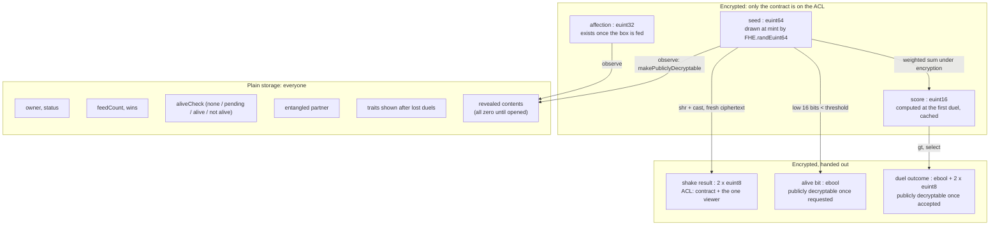
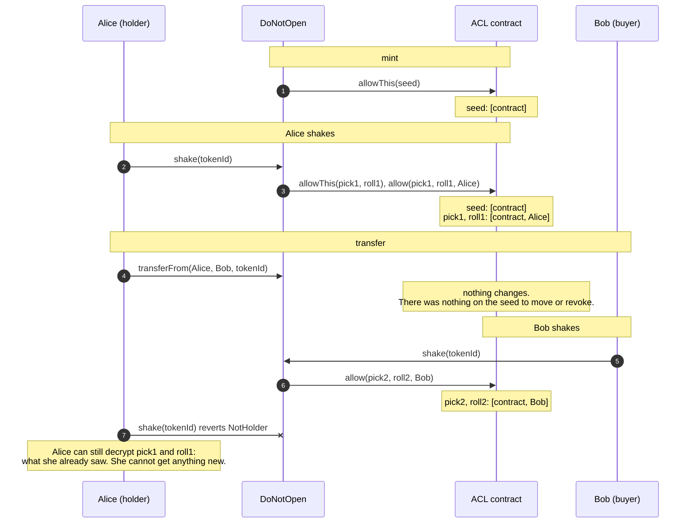

# Encrypted data model

## Per token

The seed layout (from `game-spec`):

| Bits | Field | Used for |
| --- | --- | --- |
| 0 to 15 | state roll | alive / asleep / ghost / quantum, by threshold |
| 16 to 23, 24 to 31, 32 to 39, 40 to 47, 48 to 55 | breed, mood, accessory, broken thing, room | one byte each; a higher roll is a rarer variant |
| 56 to 63 | cosmetic | look only, never rarity |

State, traits and score are **not stored encrypted**. They are functions of the seed,
computed under encryption when a mechanic needs them and in plain Solidity once the seed
is public.

## Who can learn what

| Fact | Holder | Anyone else | How |
| --- | --- | --- | --- |
| The seed, the state, the score | No | No | Only by opening the box, for everyone at once |
| One trait per shake | Yes, free, unlimited | Yes, by paying (`paidShake`) | User decryption of a fresh ciphertext |
| Which trait a shake picked | The viewer only | No | The pick is encrypted too, and absent from the event |
| Whether it is alive | Everyone, if the holder asks | same | `proveAlive` publishes one bit, once per box |
| Who wins a duel, one trait of the loser | Everyone | same | Public decryption of three values |
| The winner's trait in a duel | No | No | Selected away under encryption, never decryptable |
| How many times it was fed | Everyone | same | Plain counter |
| How much affection that earned | No | No | Each feed adds an encrypted draw in 0..3 |

Two deliberate consequences:

- **A holder who shakes enough learns all five traits.** A shake shows one of five at
  random, so about eleven shakes cover them. What stays hidden from the holder is the
  state (worth up to 1,000 of the 3,040 score points) and the affection.
- **Duels leak order.** Each duel publishes which of two boxes has the higher base score.
  Enough duels rank a set of boxes. That is the point of the mechanic, and the price of
  playing it.

## ACL lifecycle

`FHE.allow` grants are permanent on this protocol: there is no revoke. The design
therefore never grants anything durable that would need revoking.

| Event | ACL change | Why |
| --- | --- | --- |
| mint | contract allowed on the seed | The contract must compute on it later |
| shake, paidShake | contract and viewer allowed on two fresh ciphertexts | The relayer requires the contract on anything a user decrypts |
| feed | contract allowed on the new affection | |
| first duel | contract allowed on the cached score | |
| transfer | **none** | No holder is ever on the seed, the score or the affection |
| proveAlive | the alive bit becomes publicly decryptable | One bit, nothing else |
| acceptDuel | three duel values become publicly decryptable | |
| observe | seed and affection become publicly decryptable | Irreversible, like the grant |

What a previous holder keeps after a sale: the traits they shook out, which no system
could make them forget. What they lose: the right to shake, open, duel or entangle.

A buyer should assume the seller knows all five traits. The buyer can level that for the
price of a few paid shakes before buying.

## Croquettes

The Pantry and cCROQ add encrypted amounts. Rules and flows are in [CROQ.md](CROQ.md).

### Pantry storage

| Storage | Type | Who is on the ACL | What it holds |
| --- | --- | --- | --- |
| `_reserve` | `euint64` | the Pantry only | Croquettes left for welcome bags and purrs; 60% of every meal comes back here |
| `_treasuryShare` | `euint64` | the Pantry, the treasury | 20% of every meal, until `collect` sends it to the treasury |
| `_burnt` | `euint64` | the Pantry only | Running total burnt: 20% of every meal. Never moved |
| `_weight[tokenId]` | `euint64` | the Pantry only, until `weigh` makes it public | Every croquette the cat ate, all holders together |
| `_eatenToday[tokenId]` | `euint64` | the Pantry, the feeder | What the cat ate on its last feeding day, for the 1,000 a day cap |
| `_days[tokenId]` | `{uint32 day, uint8 meals}` | public (`mealsToday`) | The UTC day of the last meal and how many meals that day |
| `meals[tokenId]` | `uint32` | public | Meals served, including meals that moved 0 |
| `lastPurr[tokenId]` | `uint64` | public | Last claim time; 0 until the welcome bag is paid |
| `_weighIns[tokenId]` | `WeighIn` | public (`weighIn`) | Status, then the weight, build, sick, disease and tolerance in the clear |
| parameters | immutables | public | `treasury`, `welcomeBag`, `purrMaxPerDay`, `vetMultiplier`, `purrMaxDays`, `halvingPeriod`, `mealsPerDay`, `maxEatenPerDay`, `mealTreasuryBps`, `mealBurnBps`, `buildFloors()`, `sickMinWeight`, `sickWeightSpread`, disease bounds, `maxBoxesPerClaim`, `startedAt` |

`weightHandle`, `eatenTodayHandle`, `treasuryShareHandle`, `reserveHandle` and
`burntHandle` return handles. A handle is an identifier; only the accounts on its ACL
can decrypt it.

### cCROQ storage

OpenZeppelin `ERC7984`: one `euint64` balance per account, an encrypted total supply,
and operators (`setOperator(operator, until)`) instead of allowances. Each balance is
readable by its account. Each transfer amount is readable by its sender and recipient.

### Who can learn what

| Fact | The holder | Anyone else | How |
| --- | --- | --- | --- |
| A sealed cat's weight | No | No | Nobody is on the ACL until the reveal |
| An opened cat's weight, build, sickness | Yes, once weighed | Yes, once weighed | `weigh` makes it publicly decryptable; `finalizeWeigh` stores it in the clear |
| A cat's tolerance | Only after the reveal | Only after the reveal | `keccak256(seed)`; the seed is encrypted until then |
| How many meals a box had, and today | Yes | Yes | Plain counters |
| How much one meal moved | The feeder | No | The feeder is on the transferred amount |
| What a cat ate today | The feeder | No | The feeder is on `_eatenToday` |
| What a claim paid | The claimer | No | cCROQ allows the recipient on the transfer |
| The treasury's uncollected share | The treasury | No | The treasury is on `_treasuryShare` |
| The reserve left, the total burnt | No | No | Pantry only |
| A cCROQ balance | Its account | No | `confidentialBalanceOf` + user decryption |
| Wrap, unwrap and market amounts | Yes | Yes | They move as a plain ERC-20 |

Why nobody reads a sealed cat's weight, the holder included: `FHE.allow` cannot be
revoked. A weight readable by its holder would stay readable by every previous holder
after a sale, so a seller would always know more than the buyer. With nobody on the
ACL, the weight is as unknown to the seller as to the buyer, except for what each fed it.
Each `_eatenToday` handle is replaced by the next meal and reset on a new day, so a
feeder only ever reads what they fed themselves.

### On transfer

Nothing moves on the ACL. The weight and the day's allowance are keyed by token id, so
they follow the cat: a new holder cannot feed past what the cat already ate today. The welcome bag is per box: a box
that changes hands keeps its `lastPurr`, and its new holder gets no second bag.
