# Flows

Participants used throughout:

- **App**: the web app and its `EvmFhevmAdapter`.
- **Contract**: `DoNotOpen` on the host chain, a Confidential ERC-721 (see
  [HIDDEN_OWNERS.md](HIDDEN_OWNERS.md)).
- **Coprocessor**: executes the FHE operations the contract requests symbolically.
- **Relayer / KMS**: Zama's relayer in front of the threshold key management service.
- **cUSDC**: Zama's confidential USDC (ERC-7984), the only way to pay.
- **Market**: the flea market, `FleaMarket` (see [The flea market](#the-flea-market)).
- **Vault**: the sealed vault, `SealedVault`, next to the game (see [The sealed vault](#the-sealed-vault)).

Two things differ from the original brief in every flow:

- **There is no on-chain decryption callback** on the current protocol. A reveal is two
  transactions with an off-chain decryption in between, and the second transaction can
  be sent by anyone. See [ZAMA_NOTES.md](ZAMA_NOTES.md).
- **Nothing reverts on ownership.** Who holds a box is encrypted, so the contract checks
  it under encryption (`owner == caller`) and masks the result with it. Someone who does
  not hold the box gets nothing, and only they learn it.

## Release form (when a wallet connects)

On mainnet only (`termsRequired` in `apps/web/src/terms/terms.ts`): on Sepolia nothing is signed,
and a notice shown once when the game opens (`TestnetNotice`) says what a redeployment resets
(boxes, cats, croquettes, test tokens) and what it keeps (points, whitelist seats, X passes).

Before playing with a wallet on mainnet, every player signs the terms of play: the contracts are experimental and
could be exploited, the site is only a window onto assets that live on-chain, nothing is
custodial or refundable. The form (`apps/web/src/terms`) has one clause per line; the
player initials each, then the wallet signs a readable EIP-191 message naming the address,
the terms version and the SHA-256 of the full English text. It is free and sends no
transaction. Translations are for reading; the English text is what is signed.

```mermaid
sequenceDiagram
  participant U as Player
  participant App
  participant W as Wallet
  participant API
  U->>App: open /app (browse freely, nothing asked)
  U->>App: connect a wallet
  App->>App: local record for this version and wallet? then play
  App-->>U: Form DNO-1, 8 clauses
  U->>App: initial each clause
  U->>App: Sign with my wallet
  App->>W: personal_sign(message: address, version, SHA-256, summary, date)
  W-->>App: signature (no gas)
  alt API configured
    App->>API: POST /v1/terms {address, message, signature}
    API->>API: message names the address, version, hash; signer = address
    API->>API: file it (first signature per address and version kept)
    API-->>App: receivedAt: "Filed with the depot"
  else no API, or it fails
    App-->>U: "Kept in this browser" (play is not blocked)
  end
  App->>App: keep the record in localStorage (dno.terms.<version>)
  U->>App: Enter the warehouse
  Note over App,W: A new wallet, or a new terms version, asks again
```

Without a wallet nothing is asked: a visitor browses the depot, the shelf and the manual
freely, and the form comes up when a wallet that has not signed it connects. The form
can be closed ("Not now") or used to switch wallets ("Use another one" asks the wallet for
its account picker); while the connected wallet has not signed, every action (`useAction`)
opens the form again instead of running. The menu's "Terms of play" shows the form again with the
signature. In mock mode the signature is a stand-in, kept locally.

## Mint

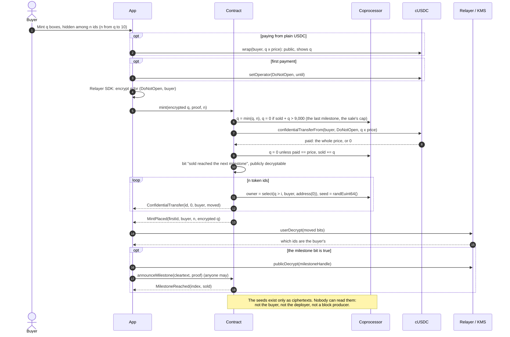

There is nothing to front-run: the value being drawn is not visible in the mempool, in
the transaction, or after it. A real id and an empty one look the same from outside:
same event, same seed draw, same storage. A buyer short of cUSDC, or a mint that would
pass the cap, gets 0 boxes and pays 0.

## Finding your boxes

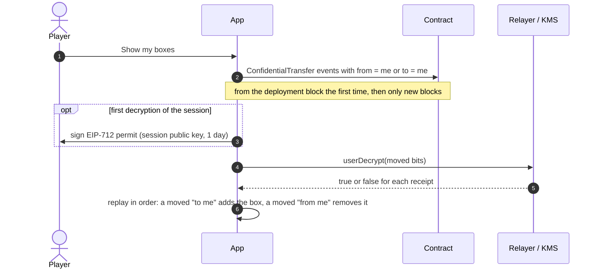

Nobody else can run this for an account: only `from` and `to` may decrypt a receipt.
Decoy transfers never move anything, so they change nothing in the replay.

## Shake (user decryption)

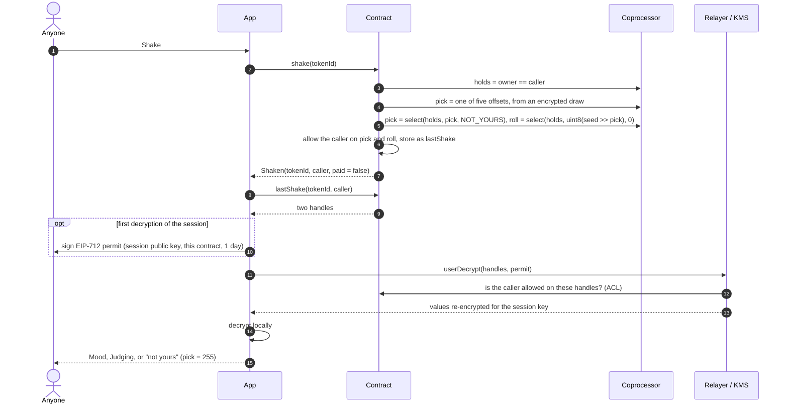

`paidShake` is the same flow for anyone, with a 2.5 cUSDC fee: the contract pulls the
fee, masks the result with "paid" instead of "holds", and adds 70% of a paid fee to the
box's encrypted earnings, unless nobody holds the box (an empty id): then the whole fee is
revenue, since nobody could ever claim that share. `claimEarnings(tokenIds)` pays the caller, for each listed box,
`select(isOwner, earnings, 0)`: the boxes they do not hold pay 0 and keep their earnings.
The app lists whole windows of ten ids (`claimWindows`), never the held boxes alone.

The event says a shake happened. It does not say which trait, nor whether the caller
held the box.

Every shake, free or paid, also passes through the collection's guard, `RatTricks`, before
anything is allowed to the caller: a rat may have shielded the box (paid shakes read a fake)
or jammed it (the holder's shakes read `SCRAMBLED`). See
[The rats' tricks](#the-rats-tricks-sniff-shield-jam).

## Feed

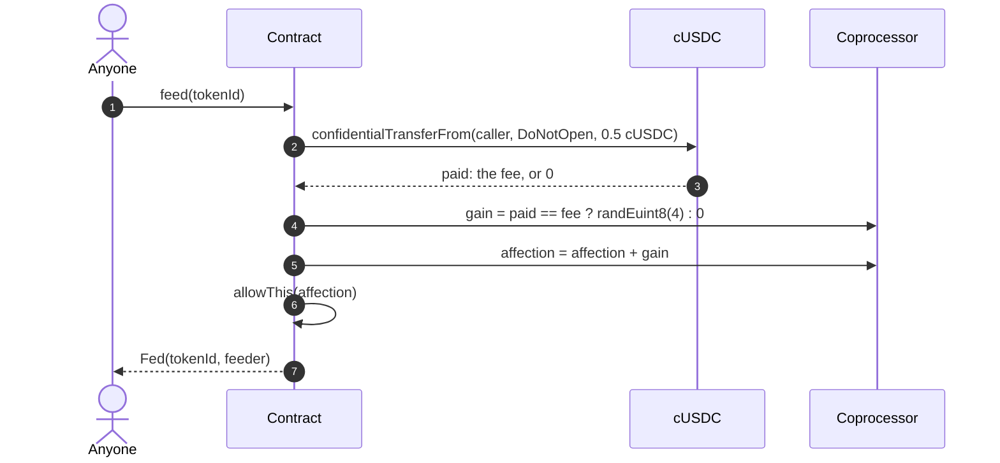

The amount is encrypted, and so is whether the fee was paid. The number of feeds is not
kept: an unpaid feed emits the same event and adds nothing. If every feed added exactly
1, a counter would give the affection away.

## Alive check (one public bit)

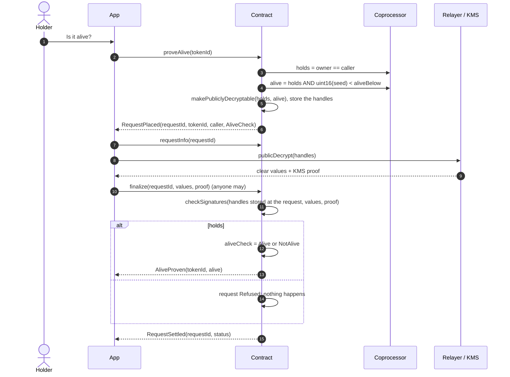

One answer per box. The answer is public whichever way it falls, and so is the fact that
the caller held the box. A refused request decrypts to "no" and "no": it says nothing
about the box.

## Open a box (public decryption)

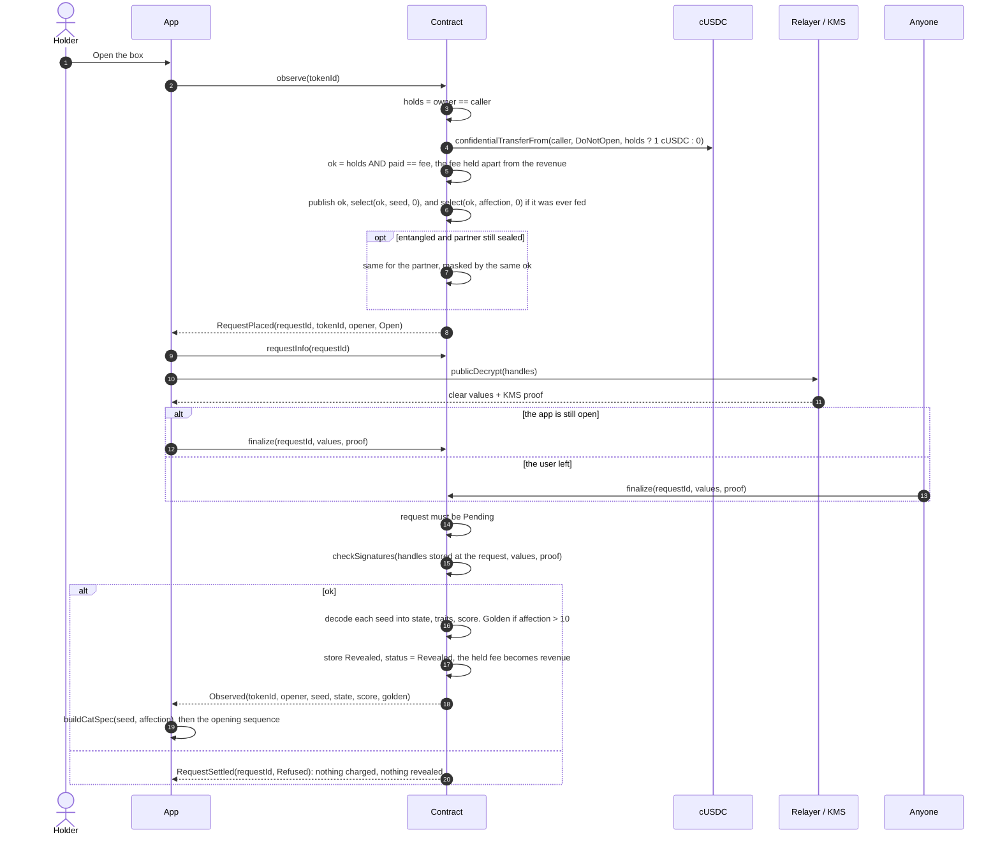

An unfed box publishes no affection: a public decryption refuses the same handle twice
in one request, and two unfed entangled boxes would publish two identical zeros. If the
box was opened meanwhile through its partner, the second opening refunds its fee. The fee
was held apart until then, so a refund never comes out of the revenue: after a withdrawal,
taking it from there would wrap the revenue around.

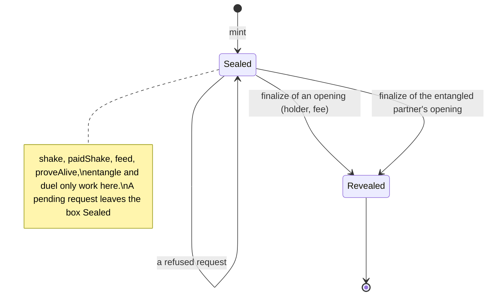

## Entangle

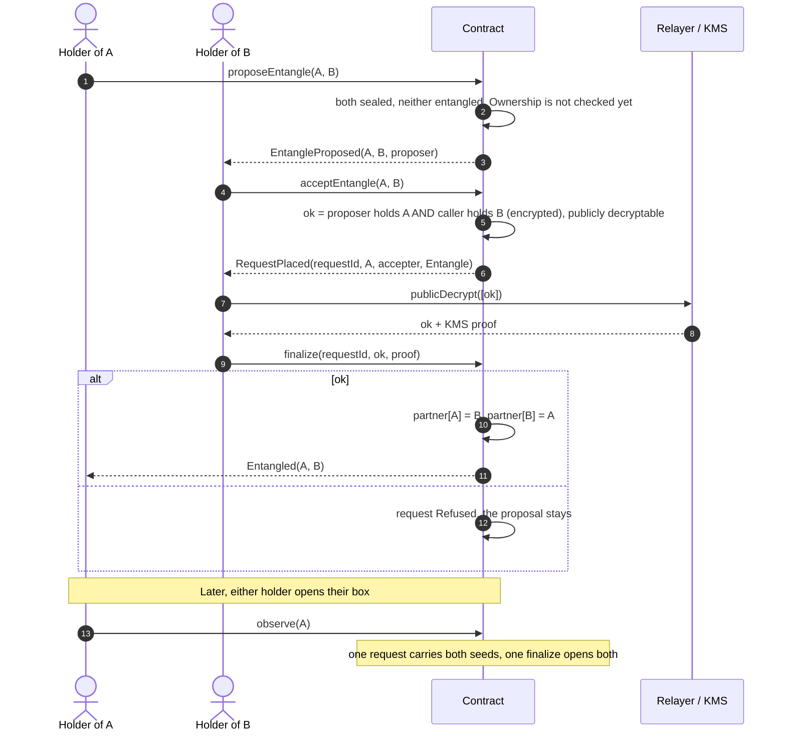

The link is permanent and follows the tokens when they are sold: whoever buys an
entangled box can have it opened by the partner's holder. A successful entanglement
makes public that both callers held their boxes.

## Duel

A duel takes four transactions: post, prove, take up, finalise. Box A goes on the duel
shelf, open to any sealed box or reserved for one box B, and anyone with a sealed box
can find it there.

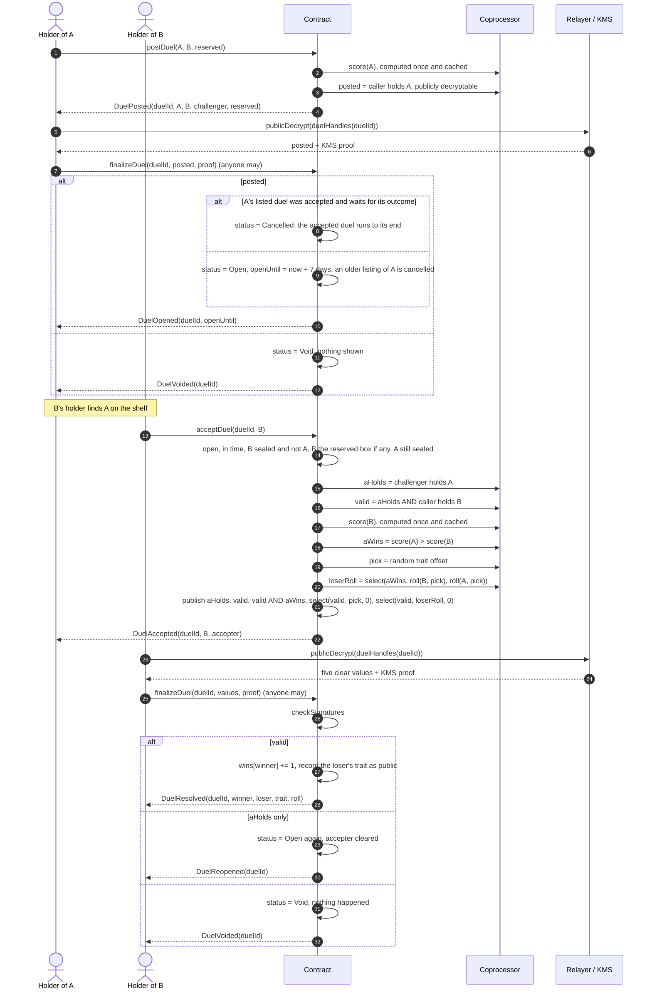

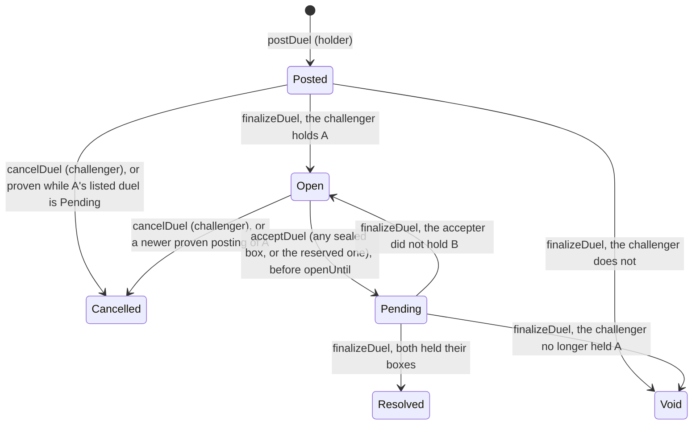

A box has one listing at a time: a newer proven posting of the same box cancels the
older one, unless that one was accepted and waits for its outcome. Then the new posting
gives way and ends `Cancelled` (the adapter reports `DuelPending`): the outcome is public as
soon as a duel is accepted, and a challenger who could cancel it would escape every loss. A proven duel can be taken up for 7 days (`DUEL_LIFETIME`); after that,
`acceptDuel` reverts with `DuelExpired`. A reserved duel only takes the named box
(`NotThisBox` otherwise); nobody can take up a duel with box A itself. Opening box A, or the
box a duel is reserved for, does not take the listing down on-chain, but `acceptDuel` then
reverts with `NotSealed`: the API and the adapter leave such listings off the shelf, and the
box page asks the challenger to withdraw a listed box before opening or giving it away (given
away, a taker would only get a void duel).

The loser's roll is chosen with an encrypted `select`, so the winner's roll for that
trait is never in a decryptable ciphertext. Ties go to B. The score compared is the base
score; the golden bonus only exists once a box is opened.

Posting makes public that the challenger holds A: the shelf only shows boxes their
challenger was proven to hold. At acceptance, "B is held" only shows when A was held. A
duel voided by its challenger publishes `aHolds = false` and four zeros: it says nothing
about the accepter. A duel whose accepter did not hold B publishes only that, and goes
back on the shelf, so nobody can clear the shelf with boxes they do not have.

### Duel ranking

Every `DuelResolved` names a winner and a loser. The leaderboard's Duels tab ranks the boxes by
wins, then fewest losses, then the lower serial (`duelStandings`); the first three with a win
wear a gold, silver or bronze rosette, pinned on the box in 3D. A box keeps its rosette sealed:
the ranking is by box, never by holder, and shows nothing the duels did not.

## Mainnet allow list claim

The best players of the test network get a place on the mainnet allow list. Points come only
from facts the chain already made public about the address: 3 per distinct opponent beaten in
a duel, 1 per distinct opponent faced, 2 per box opened (10 at most). A duel against yourself
counts nothing. Nothing is on-chain and nobody is ranked who did not claim.

```mermaid
sequenceDiagram
  participant U as Player
  participant App
  participant W as Wallet
  participant API
  U->>App: Leaderboard, Duels tab
  App->>API: GET /v1/allowlist/:address
  API-->>App: live points, rank (null until claimed), claimants, places
  U->>App: Claim my place
  App->>W: personal_sign("I, <address>, claim a place on the DO NOT OPEN mainnet allow list…")
  W-->>App: signature (no gas)
  App->>API: POST /v1/allowlist {address, message, signature}
  API->>API: message names the address; signer = address
  API->>API: points from resolved duels and openers (playerPoints)
  API->>API: keep max(kept points, points now), first claim date
  API-->>App: points, rank among claimants, places
  Note over API: A test network redeploy empties the index, not allow_list_claims
```

Signing again ("Update my points") keeps the first claim's date and the best points. When the
list closes, every claimant has a place, ranked by points. Seats are capped, first come, first
served (`ALLOW_LIST_PLACES`, the spec's `whitelist.places`, 1,500), and taken either way: an X account that did every boarding
task, or a wallet that claimed and tried the testnet (a mint, an opening or a duel). Once they are
gone nobody new sits down (`409 list-full`). The operator exports
them with `GET /v1/allowlist?token=`.

## Whitelist gifts

Every seated wallet gets a gift, set by its rank among the seated claimants (`whitelist.tiers` in
`spec.json`): ranks 1 to 500 fly First class (100 to 500 cCROQ, a box and a rat), 501 to 1,000
Business (50 to 250 cCROQ and a box), 1,001 to 1,500 Economy (20 to 100 cCROQ and a rat). While
the list is open, `GET /v1/allowlist/:address` says which `tier` the rank would get. When it
closes, the operator freezes it into a Merkle tree of (wallet, tier), sets the root on
`WhitelistGifts` and gives the same file to the API, which serves each wallet its proof. A seat
held by an X account whose wallet never claimed a place has no wallet to send a gift to.

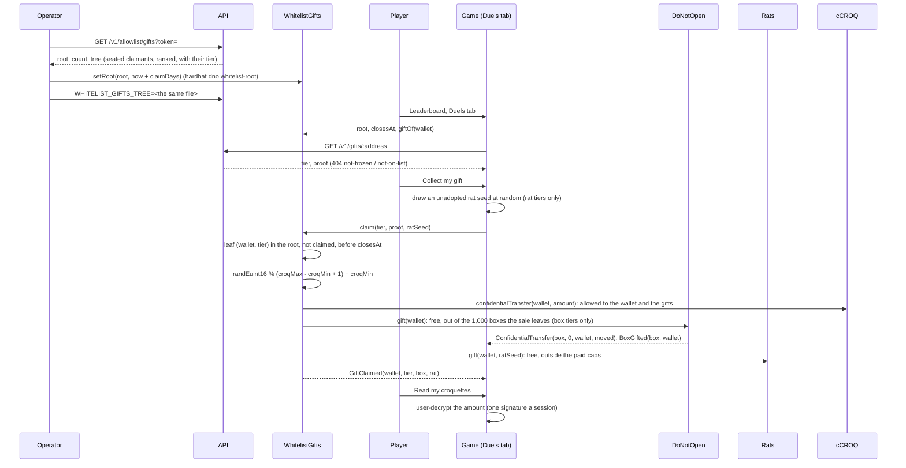

The croquettes come from the treasury (at most 425,000 cCROQ for 1,500 seats). The boxes are
minted free by `DoNotOpen.gift`, which only the collection's `giver` (`WhitelistGifts`) may call:
the sale stops at its last milestone, 9,000, and the 1,000 boxes between it and the 10,000 supply
are the gifts' (as many as the First class and Business seats). Nobody advances their price, a
sold-out sale never empties a gift, and they count in no milestone. The rats are free seed rats
outside the 700 + 300 paid ones (at most `maxGiftRats`, 1,000). A gift nobody collects is never
minted. The owner can correct the root until the first claim, and takes back the cCROQ left
with `sweep` once `claimDays` (30) are over.

## X boarding pass

The home page opens on a boarding pass: X first, the wallet as a bonus. The player signs in
with X (OAuth 2.0 with PKCE, read-only: the API reads who they are once and keeps no X token),
then does five quick tasks on X: post a boarding tweet, follow the account, like, reply to and
repost the announcement (`ANNOUNCEMENT_TWEET_ID` in `apps/web/src/links.ts`). X's posts,
follows, likes and reposts cannot be read without a paid API, so the player declares each one a
few seconds after opening it, and the team checks the list by hand before mainnet. Where the API
has no X app (`X_CLIENT_ID` unset), a post carrying the pass code, read through X's public oEmbed,
proves the account instead. A testnet player who never connects X keeps the points of the allow
list above.

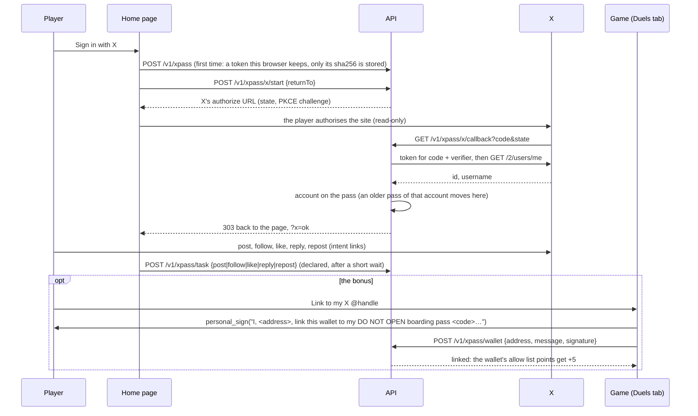

Each code, X account, post and wallet sits on one pass at most. The handle-to-wallet link stays
in the API: no route shows it but the token holder's own `GET /v1/xpass` and the operator's
`GET /v1/xpass/all?token=`.

### The Discord server

Joining the Discord server adds 3 points (`DISCORD_BONUS`) to the pass's wallet. Unlike the
tasks on X, it is proved: the page asks for a one-time code, the player runs `/board` with it in
the server, and Discord tells the API who ran it and where. The code works for 15 minutes and
once; the account must be at least 30 days old (its id says when it was made); one Discord
account boards one pass, and boarding a newer pass moves it there. Before mainnet, the team
checks that each account is still in the server.

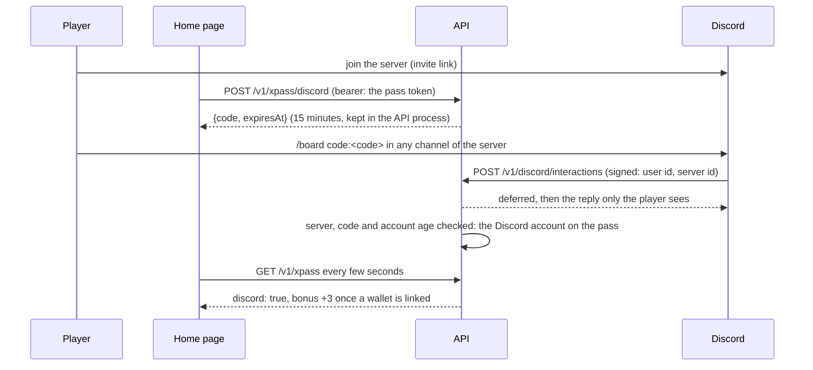

### Referrals

Each pass's code is its referral link: `https://do-not-open.app/apply?ref=<code>` (`/fr/apply`,
`/es/apply`, `/it/apply` in the other languages). A friend's pass started from it adds 2 points
(`REFERRAL_BONUS`) to the referrer's wallet, up to 10 friends (`REFERRAL_CAP`), once that pass
holds a seat, has a wallet linked and belongs to another X account; until then it shows as on the
way. The referrer's own pass needs its X account and a wallet for them to count, like its other
bonuses. Being referred earns nothing. A pass names its referrer once, before its X account is
connected; a code that names no pass is dropped, so a stale link never stops anyone boarding.
When an X account moves to a newer pass, the passes it referred follow it to the new code. Who
referred whom stays in the API. Once X is connected, the page also prints the boarding pass as a
1200×675 picture to post, with the referral link on it.

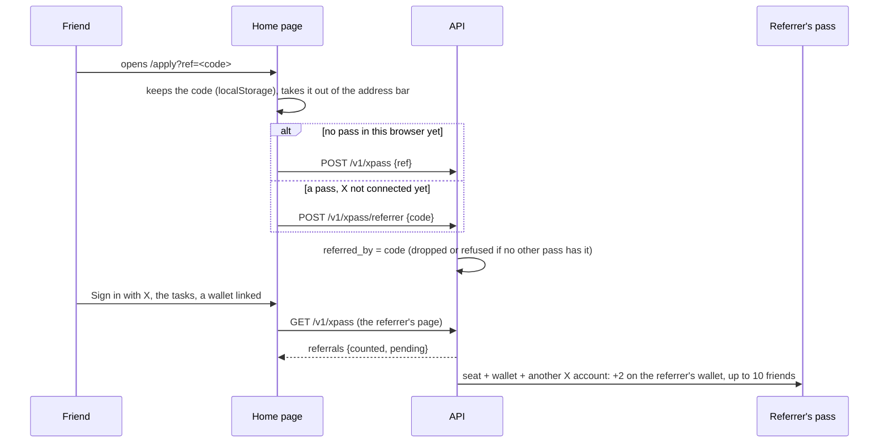

## Give a box away

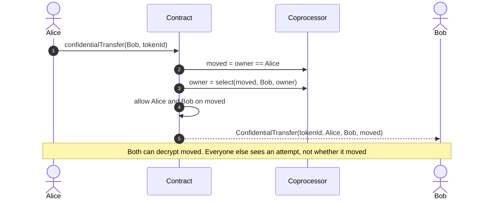

The transfer never reverts on ownership, so anyone can send decoys. An operator set with
`setOperator(operator, until)` may call `confidentialTransferFrom` for the holder; there
are no per-token approvals, they would name the owner. In the adapter: `sendBox`.

### With the holder's own decoys (optional)

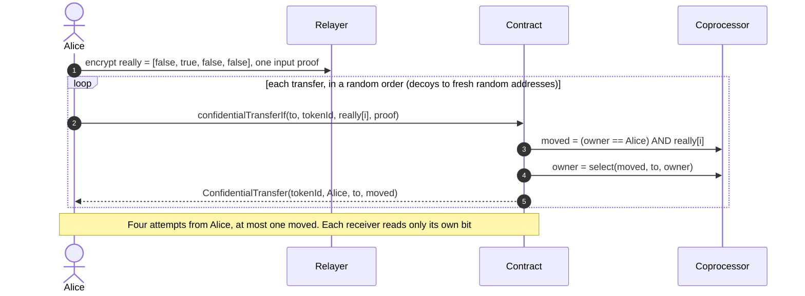

Once an opening, an alive check, an entanglement or a duel has shown that Alice held the
box, a plain transfer from her certainly moved it. With decoys nobody can tell which of the
four did, or whether any did. `sendBox(tokenId, to, { decoys: 3 })`; one transaction each.

## Paying

Every paid action (mint, feed, open, paid shake) takes cUSDC only, Zama's confidential
USDC (ERC-7984), pulled in the same transaction with `confidentialTransferFrom`; the
payer makes `DoNotOpen` an operator once (`setOperator`). A confidential transfer of more
than the payer holds does not revert: it moves 0. The contract never needs to know: what
the payment buys is masked by "paid" under encryption. A mint that was not paid creates
empty ids, an unpaid feed adds no affection, an unpaid paid shake reads `NOT_YOURS`, an
unpaid opening is refused.

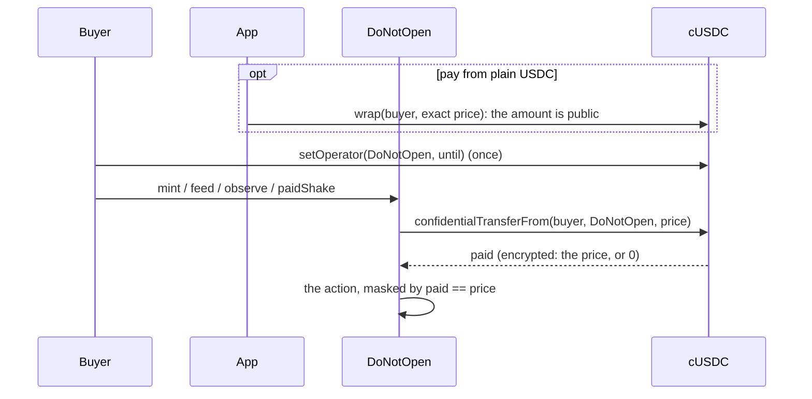

No amount is public, unless the buyer pays from plain USDC: shielding the exact price is a
public wrap, which tells everyone what was bought. The app says so and recommends shielding
a round amount ahead of time.

## Getting USDC

A player with no USDC has three ways in. On a test network, a faucet button mints test
USDC. Anywhere, `UsdcRamp.buy` swaps ETH for USDC on a public Uniswap V2 pool in one
transaction, keeping a fee of 0.3% of the ETH (set at deployment, never above 1%, withdrawn
by the owner); with `shield`, the ramp wraps the USDC and the buyer receives cUSDC in the
same transaction. And USDC already held is shielded as cUSDC by calling the cUSDC wrapper
directly, which costs nothing but gas: the site takes no fee on it. All of it happens in the
app's bureau de change (menu, Bureau de change); the wallet slip, the Pantry and the payment
notes only link to it with a pair already chosen. The router's `minOut` is the quote less
the player's slippage tolerance (1% by default, 0.01% to 50%, `slippageBps` 1 to 5000).

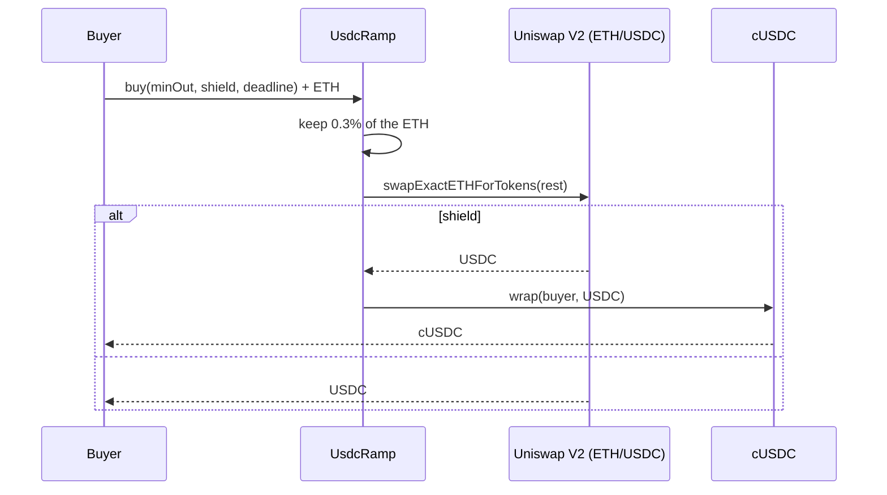

Every amount here is public: ETH in, USDC out, and the amount wrapped. cUSDC hides what
happens after.

### Unshield: cUSDC back to plain USDC

The way back is the cCROQ unwrap pattern on the cUSDC wrapper: the amount is encrypted in
the page, burnt under encryption, then decrypted in public so plain USDC can move. No fee.

```mermaid
sequenceDiagram
  autonumber
  actor P as Player
  participant C as cUSDC
  participant R as Relayer / KMS
  participant U as USDC (ERC-20)
  P->>P: encrypt n for (cUSDC, player)
  P->>C: unwrap(player, player, handle, proof)
  C->>C: burn up to n, makePubliclyDecryptable(burnt)
  C-->>P: UnwrapRequested(player, requestId)
  P->>R: publicDecrypt([requestId])
  R-->>P: n + KMS proof
  P->>C: finalizeUnwrap(requestId, n, proof)
  C->>U: transfer(player, n)
```

A short cUSDC balance burns 0 and pays out 0: `unshieldUsdc` returns 0 and the app says
nothing moved. The amount unshielded is public, like the amount shielded.

### The bureau de change: routes over several legs

Five tokens, and a direct leg only between some of them: ETH to USDC or to cUSDC (the
ramp), USDC to and from cUSDC (shield, unshield), USDC to and from CROQ (the market), CROQ
to and from cCROQ (wrap, unwrap). Nothing leads to ETH. Any other pair takes the shortest
chain of legs (`apps/web/src/chain/exchange.ts`), one transaction each, sent one after the
other.

```mermaid
flowchart LR
  ETH -- "ramp 0.3%" --> USDC
  ETH -- "ramp 0.3% + shield" --> cUSDC
  USDC <-- "shield / unshield" --> cUSDC
  USDC <-- "market" --> CROQ
  CROQ <-- "wrap / unwrap" --> cCROQ
```

Every token in the middle of a route is plain (USDC or CROQ), so each leg spends exactly
what the one before delivered, read as the difference in a public balance. A sealed balance
that falls short moves 0 without a revert; if a leg delivers nothing, the run stops and says
which token holds the funds. Minimum received compounds the slippage over every pool leg.

A route that ends in cUSDC from plain money (`rampShield`, or a last `shield`) can keep a
share as plain USDC, for [decryption credits](#decryptions-and-credits), which are bought in
plain USDC only: none, 5%, 10% or 20% (`localStorage` `dno.keepUsdc`). From ETH the ramp is
called twice, the kept share with `shield = false` first, then the rest sealed: two
transactions, the same 0.3%. From USDC, the shield seals only the rest. The bureau shows the
USDC kept and the credits its slippage floor buys at `DecryptionCredits.price`.

## Decryptions and credits

Zama bills whoever holds the relayer API key for every value its KMS decrypts and every
encrypted input it verifies; on mainnet that is the collection. So the app never talks to
Zama's relayer directly: it goes through the proxy in [`apps/api`](../apps/api/README.md#relayer-proxy),
which holds the key and counts, in units, what each wallet decrypts (one a value) and
encrypts (`RELAYER_INPUT_UNITS`, five an input: Zama charges an input five times a decryption).

```mermaid
sequenceDiagram
  participant U as Player
  participant App
  participant P as API proxy
  participant K as Zama relayer
  participant DC as DecryptionCredits
  App->>App: in the browser's cache? (a handle decrypts to the same value forever)
  App->>P: user-decrypt (handles, permit signed by the player)
  P->>P: our contracts only, signer = the account it is for
  alt free units left today, or credits
    P->>P: count: free units first, then credits
    P->>K: forward, with the API key
    K-->>App: values, re-encrypted for the session key
  else none left
    P-->>App: refused (dno:no-credits), nothing reaches Zama
    U->>DC: buy(account, credits, maxPrice): plain USDC to the treasury
    DC-->>P: CreditsBought, through the index
  end
  App->>P: input-proof (mint quantity, meal), Bearer = the same permit
  P->>P: our contracts only, permit signer = the input's userAddress
  P->>P: count 5 units, the same way, then forward to Zama
  App->>P: public-decrypt (an opening, a duel), Bearer = the same permit
  alt asked before, by anyone
    P-->>App: the same job, from the cache, free
  else first to ask
    P->>P: made public by our contracts? count 1 unit a value, then forward to Zama
  end
```

Public decryptions (an opening, an alive check, a duel, a milestone, a weigh-in, an
unwrap) go through the same proxy: it checks that one of the protocol's contracts made the
handles public (Zama's ACL logs it), and charges `RELAYER_PUBLIC_UNITS` (1) a value to the
wallet whose permit comes with the request, so posting and settling duels in a loop costs the
griefer its units, not the collection. A handle's value never changes, so each exact
request is sent to Zama once and replayed from the proxy's cache after, free for whoever
asks, and a handle may be named in at most `RELAYER_PUBLIC_PER_HANDLE` (4) requests sent
there. The adapter checks the allowance before a shake, a mint, a meal, an opening, an alive
check, an entanglement or a duel, so no gas is spent on a result that could not be read. A wallet
the index has never seen act gets a newcomer's allowance (16, one mint) instead of a
player's (25).

Credits are paid in plain USDC on purpose: `transferFrom` moves the whole price or
reverts, where a cUSDC payment that falls short moves 0 without a word.

## The studio

The studio (`/studio`) draws the depot's rats. Rats, not cats, on purpose: the cats only come
out of boxes, so nothing drawn in the studio can be taken for one. A random rat is free and
never leaves the browser: a procedural rat generator (`buildRatSpec` and `createRat`,
assembled from the Blender rat kit and drawn with the game's toon materials), no AI, no
wallet. A rat from a prompt goes through paid AI services, so it is paid for first, in packs
bought on-chain in plain USDC from `StudioPacks` (numbers in
[`packages/game-spec/studio.json`](../packages/game-spec/studio.json)): Starter, 2 USDC for 10
sketches and 1 3D model; Litter, 8 USDC for 50 and 5. A sketch is one cartoon picture of the
rat; a model turns one of the account's sketches into a 3D mesh, drawn in the browser with
the game's toon materials. Each pack sells for at least twice what its units are expected to
cost: the services are paid back and the rest goes to the treasury.

```mermaid
sequenceDiagram
  participant U as Player
  participant App
  participant SP as StudioPacks
  participant API
  participant AI as AI services
  U->>App: a random rat (free, procedural, in the browser)
  U->>SP: buy(account, packId, maxPrice): plain USDC to the treasury
  SP-->>API: PackBought, through the index: the account's sketches and models
  App->>API: sign in (wallet signature, no gas)
  App->>API: POST /v1/studio/sketches {prompt}
  API->>API: prompt checked, daily budget left, one sketch spent
  API->>AI: the prompt inside the rat house style
  AI-->>API: a cartoon picture
  App->>API: poll the job until done
  App->>API: POST /v1/studio/models {sketchId}
  API->>API: the sketch is the account's own, one model spent
  API->>AI: cut the rat out of its background, then picture to textured 3D (3 to 4 minutes)
  AI-->>API: a GLB mesh
  App->>App: the mesh, with the toon materials and outline
```

A unit is spent before the service is called, so nobody gets work they did not pay for, and
given back when the service fails or a job is still running after ten minutes, up to three
failures per account and day. Past that, and whenever the picture model's safety checker
refuses its own picture, the job is `rejected` and keeps its unit: the service was paid, and
otherwise one unit could make the collection pay for failures without end. Failed jobs count
against the day's budget for the same reason. The API
stops calling the services for the day once `STUDIO_DAILY_BUDGET_USD` would be passed, and,
when `STUDIO_ALLOWLIST` is set, only lets the listed wallets generate: on Sepolia packs are
paid in test USDC while the services cost real money. In mock mode the whole flow runs on a
local stand-in (a random procedural rat), with no API and no AI.

### Adopt a rat

A rat drawn in the studio is adopted by minting it in `Rats`, a plain ERC-721: rats are not
secret, their owners are public. A free rat is minted by its seed for 1 USDC, each seed once
(its look is recomputed from the seed, so nothing is stored). An AI rat costs 3 USDC and
needs the API first, which does as for the cats' pictures: it shrinks the rat's picture to a
free Arweave upload and stores it there for good, keeps the 3D model itself (no paid
storage), writes a small record on Arweave pointing at both, and signs the adoption for the
caller's address.

The supply is capped for good: 700 seed rats and 300 AI rats (`SoldOut` past either), and one
address mints 5 at most, both kinds together (`WalletLimit`; holding more, by transfer, is
fine). The app reads what is left (`seedMinted`, `modelMinted`, `mintedBy`) and refuses before
any approval; the API refuses to sign (`sold-out`, `wallet-limit`) before putting anything on
Arweave. The home page and the studio show the rats left, from `GET /v1/rats/supply`.

```mermaid
sequenceDiagram
  participant U as Player
  participant App
  participant API
  participant AR as Arweave
  participant R as Rats
  alt a free rat
    U->>R: mintSeed(seed, maxPrice): 1 USDC to the treasury (SoldOut past 700, WalletLimit past 5)
  else an AI rat
    App->>API: POST /v1/studio/jobs/:id/adopt (signed in)
    API->>API: the job is the caller's, a finished 3D model, not adopted yet, an AI rat left, the caller under 5
    API->>API: the GLB, kept by the API (served at /rats/models/<job>.glb)
    API->>AR: the picture shrunk under 100 KB, then a record of both (free uploads)
    API-->>App: uri, deadline, EIP-712 signature (minter = the caller)
    U->>R: mintModel(job, uri, deadline, signature, maxPrice): 3 USDC to the treasury
  end
  R-->>API: RatMinted, Transfer, through the index
  App->>API: GET /v1/rats?owner=…: "My rats"
```

### The rats' croquettes

Each rat earns 3 plain CROQ a day from its mint, paid by the `RatPantry` to whoever owns it,
at most 7 days kept between two claims ("Collect croquettes" claims every rat at once). The
pantry gets 500,000 CROQ from the treasury by a plain transfer and has no owner; while it is
empty a claim reverts, so no day is lost, and when it runs low a claim pays what is left.

### The rats' tricks: sniff, shield, jam

Every rat draws a secret power when it is minted (paid or gifted): `Rats` folds one encrypted
16-bit draw into 1, 2 or 3 with `studio.json`'s odds (55%, 30%, 15%) and allows it to the
minter. A buyer asks for it once with `allowPower` (the seller keeps reading it: an ACL grant is
never taken back). What the powers do lives in `RatTricks`:

| Power | Sniff | Trick |
| --- | --- | --- |
| 1, keen nose | 30% of the price back, encrypted | nothing: a bluff |
| 2, trait jammer | full price | blocks the one trait its holder picked (sent encrypted) |
| 3, total jammer | full price | blocks all five traits |

```mermaid
flowchart TD
  T["trick(rat, box, encrypted trait)"] --> R{rat resting?}
  R -- yes --> X[revert Recharging]
  R -- no --> E["effect = power 3: all traits, power 2: the picked trait, power 1: none (encrypted)"]
  E --> H{"caller holds the box? (encrypted)"}
  H -- yes --> S["SHIELD for 3 days: strangers' paid shakes and sniffs read a fake roll"]
  H -- no --> F{"box fully shielded?"}
  F -- yes --> N[nothing]
  F -- no --> J["JAM for 3 days: the holder's own shakes read SCRAMBLED"]
  S --> Z[rat rests 7 more days]
  J --> Z
  N --> Z
```

The chain only shows `TrickPlayed(rat, box, player, until, readyAt)`. Shield, jam or bluff, the
power and the trait are all decided by `select`s on ciphertexts: both slots (shield and jam) are
rewritten on every trick, and their end times are encrypted too, so even which slot changed
does not show.

```mermaid
sequenceDiagram
  autonumber
  actor U as Rat holder
  participant App
  participant T as RatTricks
  participant R as Rats
  participant C as DoNotOpen
  U->>App: Set it on box N (trait picked)
  App->>App: encrypt the trait for RatTricks and the wallet
  App->>T: trick(ratId, N, trait, inputProof)
  T->>R: ownerOf(ratId) == caller, then powerFor(ratId) (allowed for this tx only)
  T->>C: isOwner(N, caller) (RatTricks is a trusted reader)
  T->>T: effect, shield and jam slots rewritten under encryption
  T-->>App: TrickPlayed(ratId, N, caller, until, readyAt)
```

A sniff is a paid shake made by `RatTricks` for the rat's holder:

```mermaid
sequenceDiagram
  autonumber
  actor U as Rat holder
  participant App
  participant T as RatTricks
  participant C as DoNotOpen
  participant G as Treasury cUSDC
  U->>App: Sniff box N
  App->>T: sniff(ratId, N) (RatTricks is the caller's cUSDC operator)
  T->>T: pull 2.5 cUSDC from the caller (all or nothing)
  T->>C: paidShake(N): pulls 2.5 from RatTricks, 70% waits in the box for its holder
  C->>T: filter(N, paid, pick, roll): a shield swaps the roll for its fake
  C-->>T: pick, roll (allowed to RatTricks)
  T->>T: allow the caller on pick and roll, keep as lastSniff
  T->>G: confidentialTransferFrom(treasury, caller, power == 1 and paid ? 0.75 : 0)
  T-->>App: Sniffed(ratId, N, caller)
  App->>App: userDecrypt(lastSniff) with the collection's permit
```

`RatTricks` holds no cUSDC at rest, so an unpaid sniff leaves nothing for `DoNotOpen` to pull:
the shake reads `NOT_YOURS` and the treasury pays no rebate. The rebate is skipped altogether
while the treasury has not made `RatTricks` its cUSDC operator.

How a shake comes out of the guard:

```mermaid
flowchart LR
  P["pick, roll (from the seed)"] --> K{paid?}
  K -- "yes: a stranger, or a sniff" --> SH{"shield active and covers pick?"}
  SH -- yes --> FK["roll = the shield's fake for that trait (same every time)"]
  SH -- no --> OUT[as drawn]
  K -- "no: the holder's free shake" --> JM{"jam active and covers pick?"}
  JM -- yes --> SC["pick = SCRAMBLED (254), roll = 0"]
  JM -- no --> OUT
  FK --> M[masked by holds / paid, allowed to the caller]
  SC --> M
  OUT --> M
```

The app shows a scrambled shake as the `scrambled` problem ("someone's rat is jamming this
trait"): only the holder learns it. A holder who pays to shake their own shielded box reads the
fakes like anyone. Duels are not touched: the trait a loser shows is drawn inside `acceptDuel`,
not through the guard. The API counts `Sniffed` as a sniff of its sniffer (the `Shaken` of a
sniff names `RatTricks`).

## The flea market

`FleaMarket` sells boxes, cats (opened boxes) and rats between players, in cUSDC. It holds
what it sells: once listed, an item sits in the market's escrow until it is sold or taken
back. Two more participants:

- **Market**: `FleaMarket`.
- **Hooks**: `DoNotOpenHooks`, which reads a box's public state (status, entangled partner,
  vet check) and nothing else.

Before a first sale the seller lets the market move the item: `setOperator(market, until)`
on the boxes (the adapter asks for 365 days) or `setApprovalForAll(market, true)` on the rats.
A buyer makes the market their cUSDC operator, as for any payment. The adapter sends these
when they are missing. The market is on Sepolia at `0x4E9fC2Cb042d7Bd49B559Ad3e1110c200d7081C1` (since 2026-10-07; before it `0xb5c799bF626e70DcE6804BDef06199661cDc8665`); the API does not index it,
so the adapter reads listings (`listings(from, count)`) and offers (`offerInfo`) from the chain.

### List a box

A box's owner is encrypted, so the market cannot check it. It pulls the box with a "maybe"
transfer and proves the arrival with a public decryption, the same two steps as an opening.

```mermaid
sequenceDiagram
  autonumber
  actor S as Seller
  participant M as Market
  participant Hk as Hooks
  participant C as Contract
  participant Co as Coprocessor
  participant R as Relayer / KMS
  S->>M: list(Boxes, tokenId, price)
  M->>Hk: beforeList(tokenId): snapshot of the public state
  M->>C: confidentialTransferFrom(seller, market, tokenId) (as operator)
  C->>Co: moved = owner == seller, owner = select(moved, market, owner)
  M->>M: arrived = moved, publicly decryptable, status = Pending
  M-->>S: Listed(listingId, Boxes, tokenId, seller, price)
  S->>R: publicDecrypt(listingInfo(listingId).arrived)
  R-->>S: arrived + KMS proof
  S->>M: finalizeListing(listingId, arrived, proof) (anyone may)
  M->>M: checkSignatures on the stored handle
  alt arrived
    M->>M: status = Active
    M-->>S: ListingSettled(listingId, true)
  else
    M->>M: status = Refused, nothing moved
    M-->>S: ListingSettled(listingId, false)
  end
```

A rat is a plain ERC-721: `list(Rats, tokenId, price)` escrows it with `transferFrom` and
the listing is active at once (`Listed` and `ListingSettled(listingId, true)` in the same
transaction). Since the market holds an active box, a second listing of it, by the seller or
anyone, never arrives and settles `Refused`. In the adapter: `listItem`, which throws
`not-yours` on a refused box, and `finishListing` for a proof left unsent.

### Buy at the asking price

```mermaid
sequenceDiagram
  autonumber
  actor B as Buyer
  participant M as Market
  participant U as cUSDC
  participant Co as Coprocessor
  participant R as Relayer / KMS
  actor S as Seller
  B->>M: buy(listingId)
  M->>M: Active, not the seller's own, public state unchanged (else StateChanged)
  M->>U: confidentialTransferFrom(buyer, market, price)
  U->>Co: paid = price, or 0 if the balance is short (all-or-nothing)
  M->>Co: ok = paid == price, publicly decryptable
  M-->>B: PurchaseRequested(purchaseId, listingId, buyer, price)
  B->>R: publicDecrypt(purchaseInfo(purchaseId).ok)
  R-->>B: ok + KMS proof
  B->>M: finalizePurchase(purchaseId, ok, proof) (anyone may)
  M->>M: checkSignatures on the stored handle
  alt not ok
    M->>M: Unpaid: nothing arrived, nothing to send back
  else ok, listing still Active, same price, same public state
    M->>U: fee to the treasury, price - fee to the seller
    M->>B: deliver the item (confidentialTransfer or transferFrom)
    M-->>S: Sold(listingId, seller, buyer, price, false)
  else ok, but sold, cancelled, repriced or changed first
    M->>U: refund paid to the buyer
    M->>M: Missed
  end
  M-->>B: PurchaseSettled(purchaseId, status)
```

Nothing locks a listing: several purchases may wait on it, and the first one settled with
"paid" wins; the others settle `Missed` and are refunded in full. A buyer whose balance was
short only shows that much (`Unpaid`): nothing left their wallet. In the adapter: `buyListing`
(throws `unpaid` or `missed`), `finishPurchase` and `pendingPurchases`.

### Secret offer

```mermaid
sequenceDiagram
  autonumber
  actor B as Buyer
  participant M as Market
  participant U as cUSDC
  participant Co as Coprocessor
  participant R as Relayer / KMS
  actor S as Seller
  B->>B: encrypt amount for the market, in the page
  B->>M: makeOffer(listingId, amount, proof)
  M->>Co: wanted = min(amount, MAX_PRICE)
  M->>U: confidentialTransferFrom(buyer, market, wanted)
  U->>Co: escrowed = wanted, or 0 if the balance is short
  M->>M: allow escrowed to the market, the buyer and the seller only
  M-->>S: OfferMade(offerId, listingId, buyer) (no amount)
  S->>R: userDecrypt(offerInfo(offerId).amount)
  R-->>S: the amount, for the seller's eyes
  alt the seller accepts
    S->>M: acceptOffer(offerId)
    M->>M: Active, public state unchanged (else StateChanged)
    M->>Co: fee = escrowed * feeBps / 10000, encrypted
    M->>U: fee to the treasury, escrowed - fee to the seller
    M->>B: deliver the item
    M-->>S: OfferAccepted(offerId, listingId), Sold(listingId, seller, buyer, 0, true)
  else the buyer takes it back (any time while open)
    B->>M: withdrawOffer(offerId)
    M->>U: escrowed back to the buyer
    M-->>B: OfferWithdrawn(offerId)
  end
```

The amount never leaves the ciphertexts the buyer and the seller may read: `OfferMade` has no
amount, and a sale by offer emits `Sold` with price 0. An offer from a wallet that held less
escrows zero, and the seller sees it before accepting; the contract cannot tell them an offer
is worth it. Offers that lost (to another offer, to a purchase, or to a cancel) stay open
until their buyer withdraws them. In the adapter: `makeOffer`, `offers`, `offerAmounts` (one
user decryption), `acceptOffer`, `withdrawOffer`.

### Reprice, cancel, and a box that changes in escrow

`reprice(listingId, price)` (the seller) changes the asking price; purchases placed at the old
price settle `Missed` and are refunded. `cancelListing` (the seller) gives the item back;
pending purchases are refunded, open offers stay withdrawable. A box is sold in the public state
it was listed in: an entangled partner opened, say, and `buy` and `acceptOffer` revert
`StateChanged`, a pending purchase settles `Missed`, and the seller can only cancel. A box's
paid-shake earnings stay in it while it waits and go to whoever buys it.

```mermaid
stateDiagram-v2
  [*] --> Pending: list (box), maybe-transfer
  [*] --> Active: list (rat), escrowed
  Pending --> Active: finalizeListing, the box arrived
  Pending --> Refused: finalizeListing, the seller did not hold it
  Active --> Active: reprice (seller), pending purchases will be refunded
  Active --> Sold: finalizePurchase (paid, unchanged), or acceptOffer (seller)
  Active --> Cancelled: cancelListing (seller), the item goes back
```

```mermaid
stateDiagram-v2
  [*] --> PurchasePending: buy
  PurchasePending --> Done: paid, listing Active at that price and state
  PurchasePending --> Unpaid: not paid, nothing was taken
  PurchasePending --> Missed: paid, but sold, cancelled, repriced or changed first: refunded
```

What becomes public: the seller of an active listing (so selling a box shows you held it),
the asking price, the buyer of a sale, and for each purchase at the asking price whether the
buyer could pay. Never public: balances, offer amounts, the price of a sale by offer, what is
inside a sealed box.

## The sealed vault

`SealedVault` is not part of the game: any NFT of an allowed collection goes into a box whose
holder is encrypted, a Confidential ERC-721 of its own. Every box has an encrypted key; what
leaves the vault (the NFT, a Seaport listing, an accepted offer, a sale's ETH) and the box's
delegate in delegate.xyz are asked with the key, bound to the request's terms, so any wallet can
carry the request: the API's vault relayer, when there is one. The deposit, Seaport (list, fill,
sync, collect: the order written by `VaultListings` the way OpenSea shows a contract's listing,
Seaport 1.6 and OpenSea's conduit approved for the one token, its signed zone and fees on
mainnet, validated and cancelled by the vault itself), giving a box and making its key yours,
the state diagram, what leaks and why are in [VAULT.md](VAULT.md). The flows below are the ones with encryption in them, the two that
ride on a request (accepting an offer and delegating), and the pockets, where the vault holds
cUSDC under a key.

### A request: take out, list, take down, collect, accept an offer, delegate

```mermaid
sequenceDiagram
  autonumber
  actor H as Holder
  participant Rl as Relayer (API)
  participant V as Vault
  participant R as Relayer / KMS
  H->>H: encrypt key XOR requestHash(boxId, nonce, action, to, price, endTime, ref)
  H->>Rl: POST /v1/vault/relay {call: "request", args}
  Rl->>V: request(boxId, action, to, price, endTime, ref, boundKey, proof)
  V->>V: sync, state allows it (else revert); other waiting requests do not stop it
  V->>V: ok = (boundKey XOR requestHash(terms, nonce)) == key, publicly decryptable, pending += 1
  V-->>H: RequestPlaced(requestId, boxId, action, relayer)
  H->>R: publicDecrypt(requestInfo(requestId).ok)
  R-->>H: ok + KMS proof
  H->>Rl: POST /v1/vault/relay {call: "finalize", args}
  Rl->>V: finalize(requestId, ok, proof) (anyone may; finalizeOffer for an offer, below)
  alt not ok
    V->>V: Refused: nothing happens
  else ok, but the box changed first
    V->>V: Stale: nothing happens
  else ok
    V->>V: withdraw, list on Seaport, take down, send the ETH, or name the delegate: Done
  end
  V->>V: pending -= 1 (only once the action ran), and nonce += 1 if the key matched
  V-->>H: RequestSettled(requestId, status)
```

A relayer that changed a term, or replayed the input once its request settled, makes the vault
compare against another hash: `Refused`. A stranger's wrong key moves nothing, the nonce
included, and does not stop the holder's own request; while any request waits the box cannot
move, and anyone may `expire` a request a day after it was placed with no proof (`Expired`,
nothing runs, the nonce moves on). `ref` is the order hash of the offer an `AcceptOffer` names,
zero for every other action. See [VAULT.md](VAULT.md#a-request-take-out-list-take-down-collect-accept-an-offer-delegate). Without a relayer the wallet sends both, and its address shows. In the adapter:
`withdraw`, `list`, `unlist`, `claim`, `acceptOffer`, `delegate` (throw `not-yours` when refused, `missed` when stale).

### Accepting an offer

A buyer's offer is a plain Seaport order (WETH offered, the NFT asked for; Seaport 1.6 on
Sepolia and mainnet, 1.5 on a local node, signed for the version Seaport reports), posted to
the offer board `VaultOffers`. The holder accepts it with an `AcceptOffer` request (`to` the payout
address, `price` the least WETH it must net, `ref` its order hash); the order itself only comes
at `finalizeOffer`. On mainnet an offer made on opensea.io follows the same path: the page reads
it from the API (`GET /v1/vault/offers/:collection/:tokenId`, OpenSea's API behind it) instead
of the board, and asks the API the order with OpenSea's zone signature for `VaultOffers`
(`POST /v1/vault/offers/fulfillment`) right before `finalizeOffer`, as that signature lasts
minutes ([VAULT.md](VAULT.md#the-marketplaces-offers)).

```mermaid
sequenceDiagram
  autonumber
  actor B as Buyer
  participant O as VaultOffers
  participant S as Seaport 1.6 (1.5 locally)
  actor H as Holder
  participant V as Vault
  B->>B: wrap ETH, approve Seaport, sign the order (EIP-712)
  B->>O: post(order, signature)
  O->>S: validate: fillable with no signature from now on
  O-->>H: OfferPosted(collection, tokenId or ANY_TOKEN, orderHash, order)
  H->>V: request(AcceptOffer, to, least, ref = orderHash) ... publicDecrypt
  H->>V: finalizeOffer(requestId, ok, proof, abi.encode(order, criteriaProof))
  V->>O: inspect: orderHash == ref (else revert WrongOrder), alive, nets at least least
  alt not ok
    V->>V: Refused
  else the order is dead (cancelled, filled, ended, worth less)
    V->>V: Stale: the box stays
  else
    V->>V: a listed box is taken down first; the NFT to VaultOffers
    V->>O: fill: fulfillAdvancedOrder (1/units, criteria resolved to the box's token)
    O->>S: WETH in, the NFT to the buyer, WETH unwrapped
    O->>V: ETH (receive: Seaport or VaultOffers only)
    V->>V: less than least: revert OfferShort; fee to feesOwed, delegate cleared
    V-->>H: OfferAccepted(boxId, orderHash, buyer, amount)
    V->>V: proceeds to `to`: Claimed (Sold if `to` refuses ETH, for a Claim)
  end
```

A fill that only fails now (the buyer's WETH or allowance short) reverts and leaves the request
`Pending`: it can be tried again, or expired after a day. Plain `finalize` on an `AcceptOffer`
settles a wrong key `Refused` and reverts `NeedsOrder` when the key matched. With the relayer,
a `finalize` call carrying `offer` is sent as `finalizeOffer`. In the adapter: `offers`,
`makeOffer`, `cancelOffer`, `acceptOffer`.

### Delegation

```mermaid
sequenceDiagram
  autonumber
  actor H as Holder
  participant V as Vault
  participant D as delegate.xyz registry
  H->>V: request(Delegate, to = a wallet, or zero to clear) ... finalize
  V->>D: delegateERC721(old, collection, tokenId, 0, false) (if any)
  V->>D: delegateERC721(to, collection, tokenId, 0, true) (unless zero)
  V-->>H: Delegated(boxId, to)
```

The delegate is public. It is cleared when the NFT leaves (withdrawal, Seaport sale, accepted
offer) and kept when the box is transferred: whether a transfer moved is secret, and anyone may
send one that moves nothing. In the adapter: `delegate(boxId, wallet | null)`.

### Private sale

```mermaid
sequenceDiagram
  autonumber
  actor S as Seller
  participant V as Vault
  participant U as cUSDC
  actor B as Buyer
  S->>V: offerSale(boxId, buyer, encrypted price)
  V->>V: p = min(price, MAX_SALE_PRICE), allowed to the seller and the buyer only
  V-->>B: SaleOffered(saleId, boxId, seller, buyer) (no price)
  B->>B: userDecrypt the price, make the vault their cUSDC operator
  B->>V: acceptSale(saleId, buyer's key)
  V->>U: pull p from the buyer, all or nothing
  V->>V: moved = paid AND the seller holds the box: the box and the key go to the buyer
  V->>U: select(moved): price - fee to the seller, fee to the treasury, or everything back to the buyer
  V-->>B: SaleSettled(saleId) (moved readable by the two sides only)
```

Nothing is decrypted in public: a sale that went through and one that did not look the same.

### Pockets: send and take out

A pocket is cUSDC (or cUSDT, cWETH, cZAMA, each in its own pockets contract) under an encrypted
key ([VAULT.md](VAULT.md#pockets)). Every action names a set of pockets of the same token, the
real one among decoys; nothing is decrypted in public. Only cUSDC pockets buy private sales.

```mermaid
sequenceDiagram
  autonumber
  actor H as Holder's page
  participant R as Relayer
  participant P as SealedPockets
  participant U as cUSDC
  H->>H: encrypt amount + target, then key XOR spendHash(action, sets, destination, their handles)
  H->>R: send(from set, to set, inputs) or withdraw(from set, to, inputs)
  R->>P: the same, from its own wallet
  P->>P: refuse a bound key's handle already spent
  P->>P: each paying pocket: ok = key matches AND balance >= amount (AND target in the receiving set)
  P->>P: debit select(ok, amount, 0) from each; credit the total to the receiving pocket whose number = target
  P->>U: withdraw only: confidentialTransfer(to, the total)
  H->>H: the viewer user-decrypts the new balance
```

### Pockets: buying a private sale

```mermaid
sequenceDiagram
  autonumber
  actor S as Seller
  participant V as Vault
  participant D as PocketDesk
  actor H as Buyer's page
  participant K as Zama relayer + KMS
  participant P as SealedPockets
  S->>V: offerSale(boxId, desk, encrypted price)
  S->>D: reserve(saleId, pocket): its viewer may read the price
  H->>D: ask(saleId, key XOR buyHash(sale, pocket, box key handle), box key handle)
  D->>P: deskCheck(pocket, key, price): ok, made publicly decryptable
  H->>K: publicDecrypt(ok)
  H->>D: buy(askId, proof, box key encrypted for the vault with the desk as user)
  alt ok is false
    D->>D: ask Refused, the sale stays open
  else ok is true
    D->>P: deskTake: select(key and balance still hold, price, 0) to the desk
    D->>V: acceptSale(saleId, box key): pulls the price from the desk, all or nothing
    V->>V: moved = paid AND the seller holds the box; the box and key go to the desk
    D->>P: deskGive(pocket, the desk's balance: a refund, or 0)
    D->>D: ownerOf(box) = pocket + 1 if moved, readable by its viewer
  end
```

## Where the money goes

| Fee | Paid in | Goes to |
| --- | --- | --- |
| Mint (5 a box), open (1, once the box opens), pet (0.5) | cUSDC | `DoNotOpen`, withdrawn by the owner at most once a week; nobody can read the total before |
| Paid shake (2.5), or a rat's sniff | cUSDC | 70% waits in the box for its holder (`claimEarnings`), 30% to `DoNotOpen`; all of it to `DoNotOpen` for an empty id. A power-1 rat's sniff gets 0.75 back from the treasury's cUSDC (`RatTricks`' rebater), encrypted |
| Decryption credits (0.01 each on Sepolia; on mainnet Zama's dollar price for a decryption x 2) | plain USDC | the treasury address set in `DecryptionCredits`, at once |
| Studio packs (Starter 2, Litter 8) | plain USDC | the treasury address set in `StudioPacks`, at once; the AI services are paid from it |
| Adopting a rat (1 a free rat, 3 an AI rat) | plain USDC | the treasury address set in `Rats`, at once; Arweave storage of AI rats is paid from it |
| A flea market sale (2.5%, at most 10%) | cUSDC | the treasury address set in `FleaMarket`, at the sale; the rest to the seller. For a sale by offer the fee is computed encrypted and stays secret |
| A sealed vault sale (2.5%, at most 10%) | ETH on Seaport (a listing's `net`, what the buyer paid less OpenSea's and the creator's fees, which Seaport pays them straight; or an accepted WETH offer, unwrapped); cUSDC privately | Seaport: kept in `SealedVault` (`feesOwed`) and sent to its treasury by `sendFees`, which anyone may call; the rest waits in the box for the key's holder (an accepted offer pays it straight to the address the holder named). Private: to the treasury at the sale, computed encrypted |
| USDC ramp | 0.3% of the ETH | `UsdcRamp`, withdrawn by the owner |
| A croquette meal | cCROQ | 20% treasury (sent by `collect`, at most once a week), 20% burnt, 60% back to the reserve that pays the purr (`Pantry`) |

```mermaid
flowchart LR
  P[Players] -- "mint, open, pet" --> T[Treasury]
  P -- "paid shake" --> S{split}
  S -- 70% --> H[Box holder]
  S -- 30% --> T
  T -. "power-1 sniff rebate, 0.75" .-> P
  P -- "credits, plain USDC" --> T
  P -- "studio packs, plain USDC" --> T
  P -- "ramp, 0.3% of ETH" --> T
  P -- "flea market sale" --> F{split}
  F -- "2.5%" --> T
  F -- "the rest" --> SE[Seller]
  V[Sealed vault sales] -- "2.5%, ETH or cUSDC" --> T
  T -- "free daily decryptions" --> Z[Zama]
  T --> I[Indexer and API servers]
  T -- "sketches and 3D models" --> AI[AI services]
```

The treasury pays Zama for what players do not pay themselves: each wallet's free daily
units. Public decryptions are counted to the wallet that asks first.

## Croquettes

Rules and numbers are in [CROQ.md](CROQ.md). Two more participants:

- **Pantry**: holds the croquette reserve, the treasury's share and the burnt pile, and
  counts each cat's encrypted weight.
- **cCROQ**: the confidential token, an ERC-7984 wrapper around the plain ERC-20 CROQ.

### Buy and wrap, unwrap and sell

CROQ trades against USDC in a Uniswap V3 pool (1% fee) where one locked position sells
CROQ from 0.001 USDC up. The app quotes with Uniswap's `QuoterV2`, then swaps through
`SwapRouter02`, `exactInputSingle` wrapped in a `multicall` that carries a deadline.

```mermaid
sequenceDiagram
  autonumber
  actor P as Player
  participant Q as QuoterV2
  participant U as SwapRouter02
  participant C as CROQ (ERC-20)
  participant W as cCROQ
  P->>Q: quoteExactInputSingle(USDC, CROQ, amount, 1%) (static call)
  Q-->>P: CROQ out
  P->>U: multicall(deadline, [exactInputSingle(USDC, CROQ, amount, min)])
  U-->>P: CROQ (public)
  P->>C: approve(cCROQ, n)
  P->>W: wrap(player, n)
  W->>C: transferFrom(player, cCROQ, n)
  W->>W: mint n, encrypted, to the player
  Note over P,W: The player's balance is now readable by the player only
```

The way back is two steps, because the amount must be decrypted publicly before plain
tokens can move:

```mermaid
sequenceDiagram
  autonumber
  actor P as Player
  participant W as cCROQ
  participant R as Relayer / KMS
  participant C as CROQ (ERC-20)
  participant U as SwapRouter02
  P->>P: encrypt n for (cCROQ, player)
  P->>W: unwrap(player, player, handle, proof)
  W->>W: burn up to n, makePubliclyDecryptable(burnt)
  W-->>P: UnwrapRequested(player, requestId)
  P->>R: publicDecrypt([requestId])
  R-->>P: n + KMS proof
  P->>W: finalizeUnwrap(requestId, n, proof)
  W->>C: transfer(player, n)
  P->>U: multicall(deadline, [exactInputSingle(CROQ, USDC, n, min)])
```

If the balance was short, the burn moves 0 and the decrypted amount is 0. Anyone can
send `finalizeUnwrap`; the tokens go to the address set in the request.

The pool started with CROQ only. Until someone has bought, a sale finds no USDC: the
quoter reverts, the adapter quotes 0 and refuses the trade (`NoLiquidity`) instead of
sending a swap that would fail. CROQ never sells below the start price.

### The locked position and its fees

```mermaid
stateDiagram-v2
  [*] --> Planned: planSingleSided (ticks, opening price)
  Planned --> Opened: createAndInitializePoolIfNecessary
  Opened --> Refused: the pool already trades at another price
  Opened --> Minted: mint, CROQ only, to the deployer
  Minted --> Locked: safeTransferFrom to LiquidityLocker
  Locked --> Locked: collect(positionId), fees to the beneficiary
  Refused --> [*]
```

Anyone can call `LiquidityLocker.collect(positionId)`; the fees (1% of every swap, in
USDC and CROQ) always go to the beneficiary, the treasury. Nothing in the locker removes
liquidity or moves the position out.

### Claim the welcome bag and the purr

```mermaid
sequenceDiagram
  autonumber
  actor H as Anyone
  participant Pa as Pantry
  participant B as DoNotOpen
  participant Co as Coprocessor
  participant W as cCROQ
  H->>Pa: claim(tokenIds), at most 10
  loop each box
    alt never claimed
      Pa->>Pa: due = 100, lastPurr = now, WelcomeBag(tokenId)
    else whole days owed (at most 7)
      Pa->>B: aliveCheck(tokenId) (1: vet certified)
      Pa->>Co: due = randEuint8() mod 5, x days, x 2 if certified, >> halvings
    end
    Pa->>B: isOwner(tokenId, address(0)) (trusted reader)
    Pa->>Co: due = empty ? 0 : due
  end
  Pa->>Co: funded = sum of dues <= reserve, reserve -= funded ? sum : 0
  loop each box
    Pa->>Co: stash += funded ? due : 0
    Pa->>B: isOwner(tokenId, caller) (trusted reader)
    Pa->>Co: payout += select(owns, stash, 0), stash = select(owns, 0, stash)
  end
  Pa->>W: confidentialTransfer(caller, payout)
  Pa-->>H: Claimed(caller, boxes)
```

Welcome bags and purrs are paid into each box's encrypted stash, whoever calls; the
caller collects only the stashes of the boxes they hold. An id nobody holds (a mint's empty
ids) gets nothing: a 0-box mint costs only gas, and its empty ids would otherwise drain the
reserve into stashes nobody can ever claim. A claim never reverts on ownership, and the
contract treats a stranger's claim like a holder's. So the app never lists the caller's
boxes alone: it claims whole windows of ten ids (0-9, 10-19…), the same windows every time,
one transaction per window (`claimWindows`, HIDDEN_OWNERS.md §6).

The treasury's 20% of each meal sits in an encrypted bucket nobody can read, the treasury
included; `collect` sends it at most once a week, so the treasury only learns weekly sums.

### Feed croquettes

```mermaid
sequenceDiagram
  autonumber
  actor H as Holder
  participant App
  participant Pa as Pantry
  participant B as DoNotOpen
  participant W as cCROQ
  participant Co as Coprocessor
  opt first meal
    H->>W: setOperator(Pantry, until)
  end
  App->>App: Relayer SDK: encrypt n for (Pantry, holder)
  H->>Pa: feed(tokenId, handle, proof)
  Pa->>B: status(tokenId) == Sealed, or revert
  Pa->>B: isOwner(tokenId, caller) (trusted reader)
  Pa->>Co: served = holds AND meals today < 2
  Pa->>Co: capped = served ? min(offered, 1000 - eaten today) : 0
  Pa->>W: confidentialTransferFrom(caller, Pantry, capped)
  W-->>Pa: moved: capped, or 0 if the caller holds less
  Pa->>Co: meals today += served, eaten today += moved, weight += moved
  Pa->>Co: the feeder's copy: select(holds, meals, 0), select(holds, eaten, 0)
  Pa->>Co: treasury += 20%, burnt += 20%, reserve += the rest
  Pa-->>H: MealServed(tokenId, feeder)
```

The cUSDC-paid `DoNotOpen.feed` is the other gesture: it pets the cat (affection), and
anyone may do it.

### Weigh a cat

```mermaid
sequenceDiagram
  autonumber
  actor A as Anyone
  participant B as DoNotOpen
  participant Pa as Pantry
  participant R as Relayer / KMS
  Note over B: the box was observed and finalised: status Revealed
  A->>Pa: weigh(tokenId)
  alt never ate
    Pa->>Pa: record weight 0: thin
  else
    Pa->>Pa: makePubliclyDecryptable(weight)
    Pa-->>A: WeighInRequested(tokenId, weightHandle)
    A->>R: publicDecrypt([weightHandle])
    R-->>A: weight + proof
    A->>Pa: finalizeWeigh(tokenId, weight, proof)
    Pa->>Pa: checkSignatures
  end
  Pa->>B: contentsOf(tokenId).seed
  Pa->>Pa: tolerance = keccak256(seed) folded, build, sick and disease
  Pa-->>A: Weighed(tokenId, weight, build, sick, disease)
```

```mermaid
stateDiagram-v2
  [*] --> Growing: first meal
  Growing --> Growing: feed (holder, sealed, 2 meals and 1,000 a day)
  Growing --> Frozen: an opening is finalized (no more meals)
  Frozen --> Weighing: weigh (anyone, once)
  Weighing --> Weighed: finalizeWeigh (anyone)
  Frozen --> Weighed: weigh, if it never ate
  Weighed --> [*]
```

### Send croquettes to another player

`cCroq.confidentialTransfer(to, handle, proof)`, with the amount encrypted for
(cCROQ, sender). Both sides can decrypt the amount moved; nobody else can. A sender
who holds too little moves 0.

## What the app does when a step is interrupted

Every two-step action can be picked up later, by anyone:

| Left in | Shown in the app | Adapter call |
| --- | --- | --- |
| An opening, alive check or entanglement request `Pending` | The shelf lists the account's pending requests (`pendingRequests`); "Finish" | `finishRequest(requestId)`, or `finishObserve` / `finishProveAlive` for one box |
| Duel `Posted` (holding not proven) | Pair view: "Prove you hold it"; duel shelf: "Waiting for your proof", "Finish it" | `finishDuel` (returns null) |
| Duel `Pending` | "Reveal the result" | `finishDuel` (returns null for a void or reopened duel) |
| A milestone reached, not announced | Announced after the next mint through the app | `announceMilestone` |
| Box revealed, not weighed | "Weigh the cat" | `weigh` |
| Weigh-in pending | "Weigh the cat" | `weigh` (picks up the pending one: `finalizeWeigh`) |
| Flea market: a box listing `Pending` | The seller's stall marks it as on its way | `finishListing(listingId)` (throws `not-yours` when refused) |
| Flea market: a purchase `Pending` | Not shown yet | `finishPurchase(purchaseId)`; `pendingPurchases(account)` lists them |
| Sealed vault: a request `Pending` (the box cannot move; requests still go in) | The box says requests wait for their proof | Sending the box or accepting a private sale settles them first (`settlePending` in `EvmVault`): `finalize(requestId, …)` with the public decryption of `requestInfo(requestId).ok` (`finalizeOffer` with the order for an `AcceptOffer`, which stays `Pending` while a fill fails), or `expire(requestId)` a day after it was placed. Anyone may do either |

When the step after the first transaction fails (the decryption service is slow, the
user declines the proof's signature), the adapter marks the `ChainError` `resumable`,
and the app says the first transaction went through and where to finish it, so nobody
pays twice. When the transaction itself did its work and only reading the result back
failed (a mint, a shake), the error is marked `landed` and the app says not to send it
again.

### Errors, before and after the wallet

The EVM adapter plays every transaction against the read endpoint before the wallet
sees it (`estimateGas` through a signer that stops there). A refusal comes back with the
contract's own error name, which wallets often drop, and the account's balance is
checked against the gas: `insufficient-funds` carries what it holds and what it needs.
Nothing reaches the wallet in either case. What the dry run cannot tell (a busy
endpoint) is left to the wallet. Wallet and endpoint failures are sorted into
chain-neutral codes (`rejected`, `wallet-busy`, `wrong-network`, `insufficient-funds`,
`nonce`, `network`, `reverted` with its `reason`), and the app words each one with what
to try next: a faucet, the bureau de change, a stuck transaction to clear, the explorer link
of the failed transaction.
