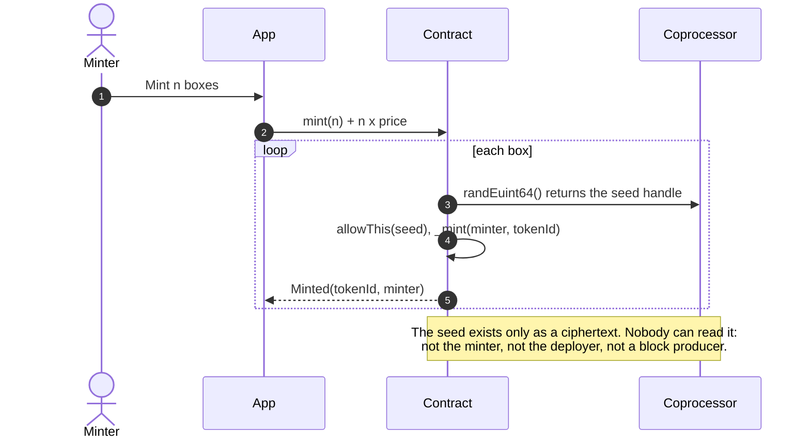
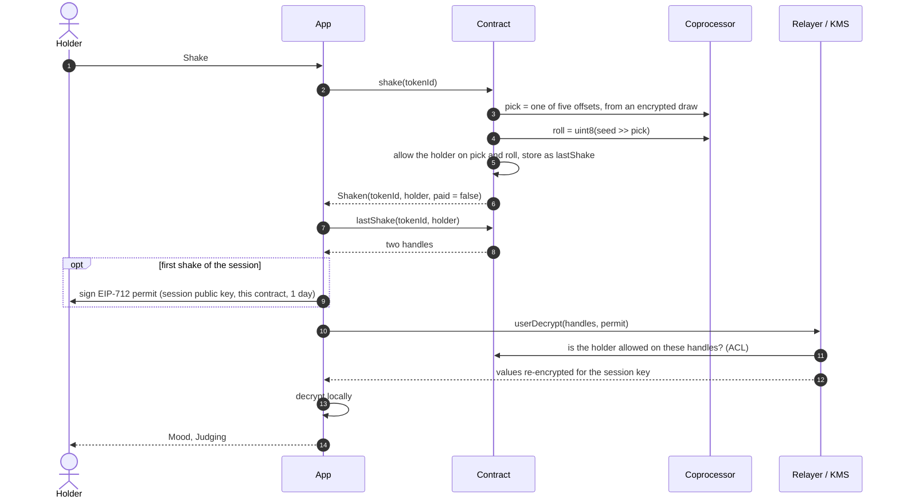
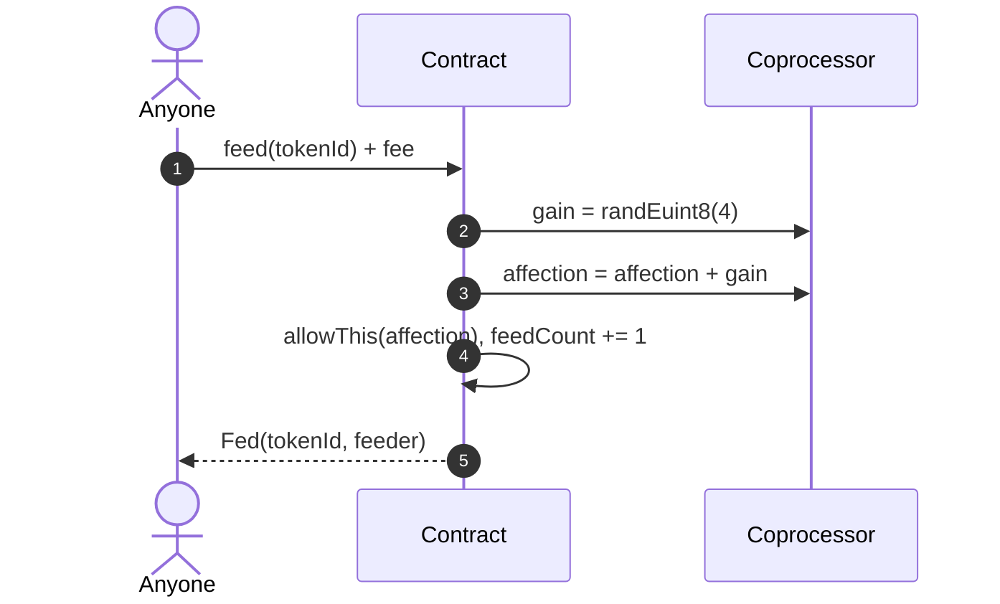
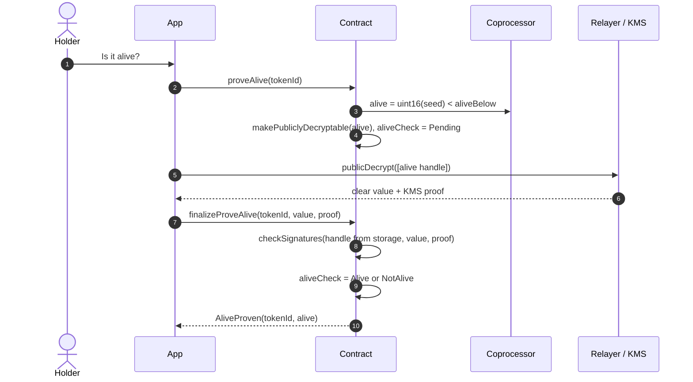
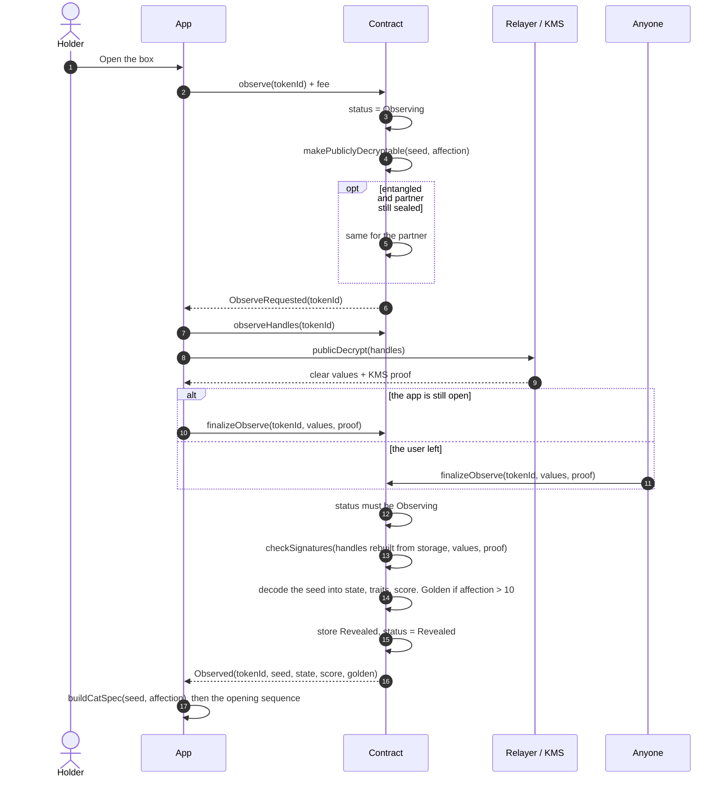
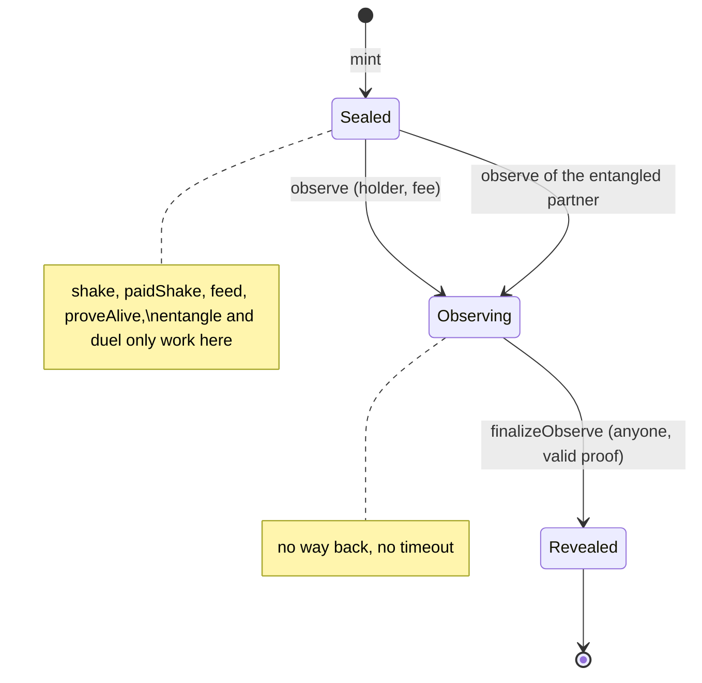
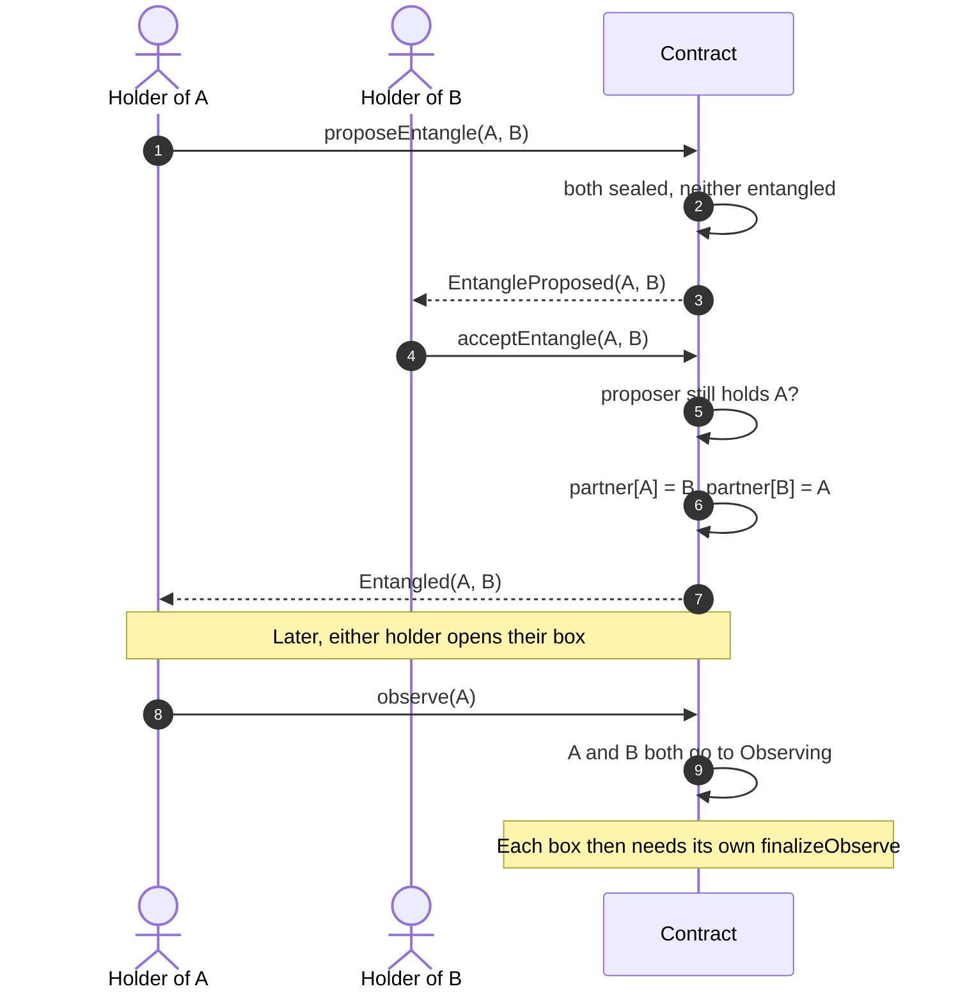
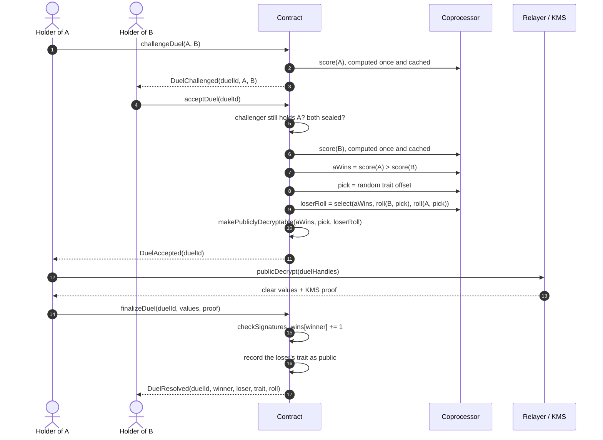
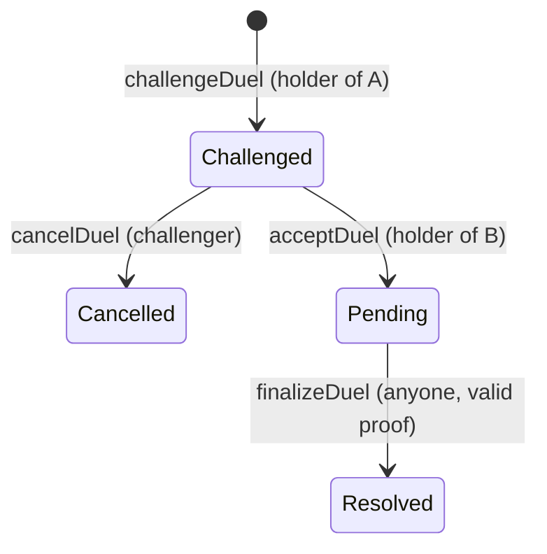

# Flows

Participants used throughout:

- **App**: the web app and its `EvmFhevmAdapter`.
- **Contract**: `DoNotOpen` on the host chain.
- **Coprocessor**: executes the FHE operations the contract requests symbolically.
- **Relayer / KMS**: Zama's relayer in front of the threshold key management service.

One thing differs from the original brief in every flow that reveals something: **there
is no on-chain decryption callback** on the current protocol. A reveal is two
transactions with an off-chain decryption in between, and the second transaction can be
sent by anyone. See [ZAMA_NOTES.md](ZAMA_NOTES.md).

## Mint

There is nothing to front-run: the value being drawn is not visible in the mempool, in
the transaction, or after it.

## Shake (user decryption)

`paidShake` is the same flow for a non-holder, with a fee: 70% is credited to the
holder (pulled later with `claim`), and only the payer is allowed on the result.

The event says a shake happened. It does not say which trait: the pick is encrypted.

## Feed

The count is public, the amount is not. If every feed added exactly 1, the counter would
give the affection away.

## Alive check (one public bit)

One request per box. The answer is public whichever way it falls.

## Open a box (public decryption)

## Entangle

No FHE operation is involved. The link is permanent and follows the tokens when they are
sold: whoever buys an entangled box can have it opened by the partner's holder.

## Duel

The loser's roll is chosen with an encrypted `select`, so the winner's roll for that
trait is never in a decryptable ciphertext. Ties go to B. The score compared is the base
score; the golden bonus only exists once a box is opened.

## What the app does when a step is interrupted

Every two-step action can be picked up later, by anyone:

| Left in | Shown in the app | Adapter call |
| --- | --- | --- |
| Box `Observing` | "Finish opening" | `finishObserve` |
| Alive check `Pending` | "Finish the check" | `finishProveAlive` |
| Duel `Pending` | "Reveal the result" | `finishDuel` |
