# Flows

Participants used throughout:

- **App**: the web app and its `EvmFhevmAdapter`.
- **Contract**: `DoNotOpen` on the host chain, a Confidential ERC-721 (see
  [HIDDEN_OWNERS.md](HIDDEN_OWNERS.md)).
- **Coprocessor**: executes the FHE operations the contract requests symbolically.
- **Relayer / KMS**: Zama's relayer in front of the threshold key management service.
- **cUSDC**: Zama's confidential USDC (ERC-7984), the only way to pay.

Two things differ from the original brief in every flow:

- **There is no on-chain decryption callback** on the current protocol. A reveal is two
  transactions with an off-chain decryption in between, and the second transaction can
  be sent by anyone. See [ZAMA_NOTES.md](ZAMA_NOTES.md).
- **Nothing reverts on ownership.** Who holds a box is encrypted, so the contract checks
  it under encryption (`owner == caller`) and masks the result with it. Someone who does
  not hold the box gets nothing, and only they learn it.

## Mint

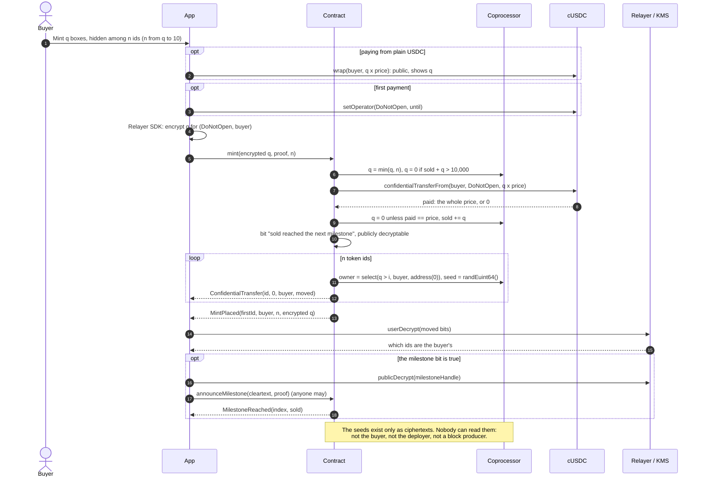
```mermaid
sequenceDiagram
  autonumber
  actor U as Buyer
  participant App
  participant C as Contract
  participant Co as Coprocessor
  participant K as cUSDC
  participant R as Relayer / KMS
  U->>App: Mint q boxes, hidden among n ids (n from q to 10)
  opt paying from plain USDC
    App->>K: wrap(buyer, q x price): public, shows q
  end
  opt first payment
    App->>K: setOperator(DoNotOpen, until)
  end
  App->>App: Relayer SDK: encrypt q for (DoNotOpen, buyer)
  App->>C: mint(encrypted q, proof, n)
  C->>Co: q = min(q, n), q = 0 if sold + q > 10,000
  C->>K: confidentialTransferFrom(buyer, DoNotOpen, q x price)
  K-->>C: paid: the whole price, or 0
  C->>Co: q = 0 unless paid == price, sold += q
  C->>C: bit "sold reached the next milestone", publicly decryptable
  loop n token ids
    C->>Co: owner = select(q > i, buyer, address(0)), seed = randEuint64()
    C-->>App: ConfidentialTransfer(id, 0, buyer, moved)
  end
  C-->>App: MintPlaced(firstId, buyer, n, encrypted q)
  App->>R: userDecrypt(moved bits)
  R-->>App: which ids are the buyer's
  opt the milestone bit is true
    App->>R: publicDecrypt(milestoneHandle)
    App->>C: announceMilestone(cleartext, proof) (anyone may)
    C-->>App: MilestoneReached(index, sold)
  end
  Note over C,Co: The seeds exist only as ciphertexts. Nobody can read them:<br/>not the buyer, not the deployer, not a block producer.
```

There is nothing to front-run: the value being drawn is not visible in the mempool, in
the transaction, or after it. A real id and an empty one look the same from outside:
same event, same seed draw, same storage. A buyer short of cUSDC, or a mint that would
pass the cap, gets 0 boxes and pays 0.

## Finding your boxes

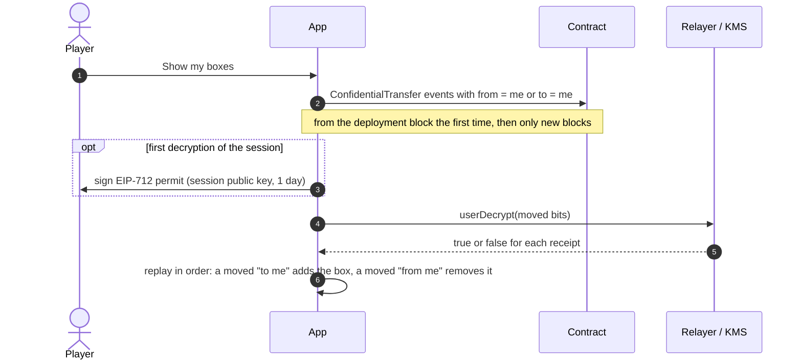
```mermaid
sequenceDiagram
  autonumber
  actor U as Player
  participant App
  participant C as Contract
  participant R as Relayer / KMS
  U->>App: Show my boxes
  App->>C: ConfidentialTransfer events with from = me or to = me
  Note over App,C: from the deployment block the first time, then only new blocks
  opt first decryption of the session
    App->>U: sign EIP-712 permit (session public key, 1 day)
  end
  App->>R: userDecrypt(moved bits)
  R-->>App: true or false for each receipt
  App->>App: replay in order: a moved "to me" adds the box, a moved "from me" removes it
```

Nobody else can run this for an account: only `from` and `to` may decrypt a receipt.
Decoy transfers never move anything, so they change nothing in the replay.

## Shake (user decryption)

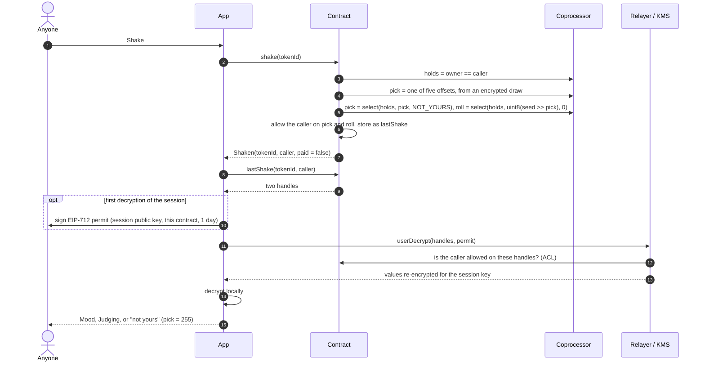
```mermaid
sequenceDiagram
  autonumber
  actor U as Anyone
  participant App
  participant C as Contract
  participant Co as Coprocessor
  participant R as Relayer / KMS
  U->>App: Shake
  App->>C: shake(tokenId)
  C->>Co: holds = owner == caller
  C->>Co: pick = one of five offsets, from an encrypted draw
  C->>Co: pick = select(holds, pick, NOT_YOURS), roll = select(holds, uint8(seed >> pick), 0)
  C->>C: allow the caller on pick and roll, store as lastShake
  C-->>App: Shaken(tokenId, caller, paid = false)
  App->>C: lastShake(tokenId, caller)
  C-->>App: two handles
  opt first decryption of the session
    App->>U: sign EIP-712 permit (session public key, this contract, 1 day)
  end
  App->>R: userDecrypt(handles, permit)
  R->>C: is the caller allowed on these handles? (ACL)
  R-->>App: values re-encrypted for the session key
  App->>App: decrypt locally
  App-->>U: Mood, Judging, or "not yours" (pick = 255)
```

`paidShake` is the same flow for anyone, with a 2.5 cUSDC fee: the contract pulls the
fee, masks the result with "paid" instead of "holds", and adds 70% of a paid fee to the
box's encrypted earnings. `claimEarnings(tokenIds)` pays the caller, for each listed box,
`select(isOwner, earnings, 0)`: the boxes they do not hold pay 0 and keep their earnings.

The event says a shake happened. It does not say which trait, nor whether the caller
held the box.

## Feed

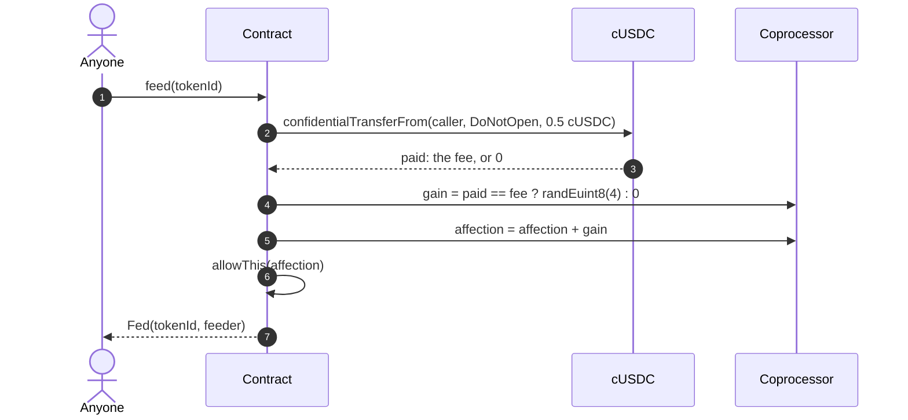
```mermaid
sequenceDiagram
  autonumber
  actor U as Anyone
  participant C as Contract
  participant K as cUSDC
  participant Co as Coprocessor
  U->>C: feed(tokenId)
  C->>K: confidentialTransferFrom(caller, DoNotOpen, 0.5 cUSDC)
  K-->>C: paid: the fee, or 0
  C->>Co: gain = paid == fee ? randEuint8(4) : 0
  C->>Co: affection = affection + gain
  C->>C: allowThis(affection)
  C-->>U: Fed(tokenId, feeder)
```

The amount is encrypted, and so is whether the fee was paid. The number of feeds is not
kept: an unpaid feed emits the same event and adds nothing. If every feed added exactly
1, a counter would give the affection away.

## Alive check (one public bit)

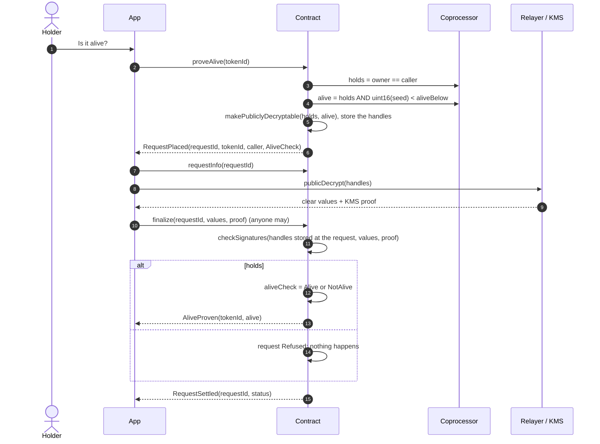
```mermaid
sequenceDiagram
  autonumber
  actor U as Holder
  participant App
  participant C as Contract
  participant Co as Coprocessor
  participant R as Relayer / KMS
  U->>App: Is it alive?
  App->>C: proveAlive(tokenId)
  C->>Co: holds = owner == caller
  C->>Co: alive = holds AND uint16(seed) < aliveBelow
  C->>C: makePubliclyDecryptable(holds, alive), store the handles
  C-->>App: RequestPlaced(requestId, tokenId, caller, AliveCheck)
  App->>C: requestInfo(requestId)
  App->>R: publicDecrypt(handles)
  R-->>App: clear values + KMS proof
  App->>C: finalize(requestId, values, proof) (anyone may)
  C->>C: checkSignatures(handles stored at the request, values, proof)
  alt holds
    C->>C: aliveCheck = Alive or NotAlive
    C-->>App: AliveProven(tokenId, alive)
  else
    C->>C: request Refused: nothing happens
  end
  C-->>App: RequestSettled(requestId, status)
```

One answer per box. The answer is public whichever way it falls, and so is the fact that
the caller held the box. A refused request decrypts to "no" and "no": it says nothing
about the box.

## Open a box (public decryption)

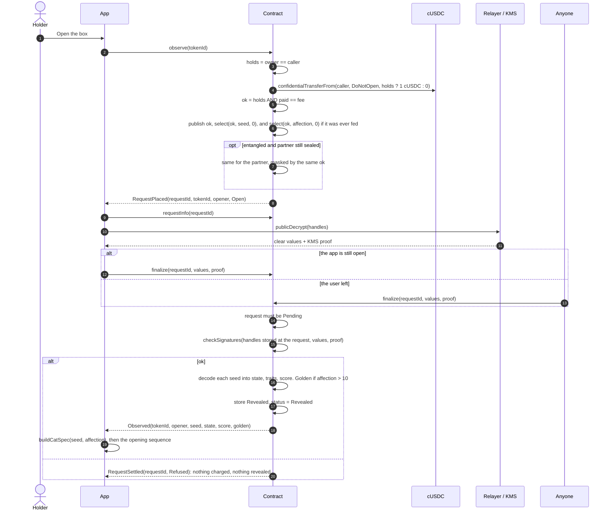
```mermaid
sequenceDiagram
  autonumber
  actor U as Holder
  participant App
  participant C as Contract
  participant K as cUSDC
  participant R as Relayer / KMS
  participant Any as Anyone
  U->>App: Open the box
  App->>C: observe(tokenId)
  C->>C: holds = owner == caller
  C->>K: confidentialTransferFrom(caller, DoNotOpen, holds ? 1 cUSDC : 0)
  C->>C: ok = holds AND paid == fee
  C->>C: publish ok, select(ok, seed, 0), and select(ok, affection, 0) if it was ever fed
  opt entangled and partner still sealed
    C->>C: same for the partner, masked by the same ok
  end
  C-->>App: RequestPlaced(requestId, tokenId, opener, Open)
  App->>C: requestInfo(requestId)
  App->>R: publicDecrypt(handles)
  R-->>App: clear values + KMS proof
  alt the app is still open
    App->>C: finalize(requestId, values, proof)
  else the user left
    Any->>C: finalize(requestId, values, proof)
  end
  C->>C: request must be Pending
  C->>C: checkSignatures(handles stored at the request, values, proof)
  alt ok
    C->>C: decode each seed into state, traits, score. Golden if affection > 10
    C->>C: store Revealed, status = Revealed
    C-->>App: Observed(tokenId, opener, seed, state, score, golden)
    App->>App: buildCatSpec(seed, affection), then the opening sequence
  else
    C-->>App: RequestSettled(requestId, Refused): nothing charged, nothing revealed
  end
```

An unfed box publishes no affection: a public decryption refuses the same handle twice
in one request, and two unfed entangled boxes would publish two identical zeros. If the
box was opened meanwhile through its partner, the second opening refunds its fee.

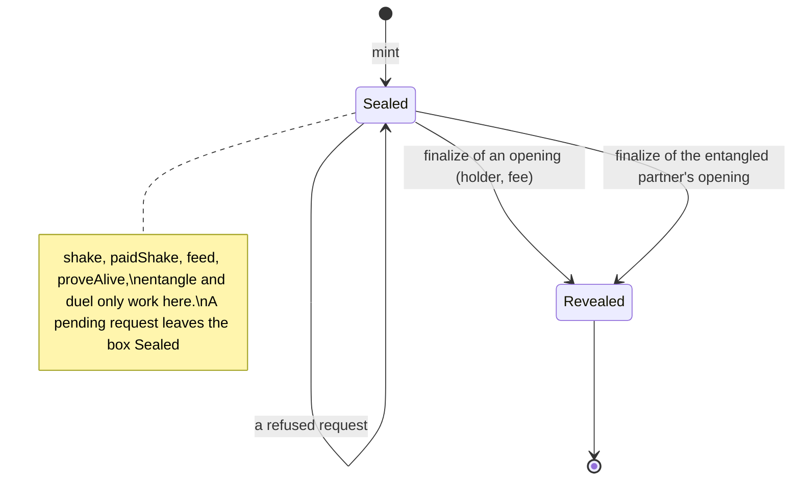
```mermaid
stateDiagram-v2
  [*] --> Sealed: mint
  Sealed --> Sealed: a refused request
  Sealed --> Revealed: finalize of an opening (holder, fee)
  Sealed --> Revealed: finalize of the entangled partner's opening
  Revealed --> [*]
  note right of Sealed: shake, paidShake, feed, proveAlive,\nentangle and duel only work here.\nA pending request leaves the box Sealed
```

## Entangle

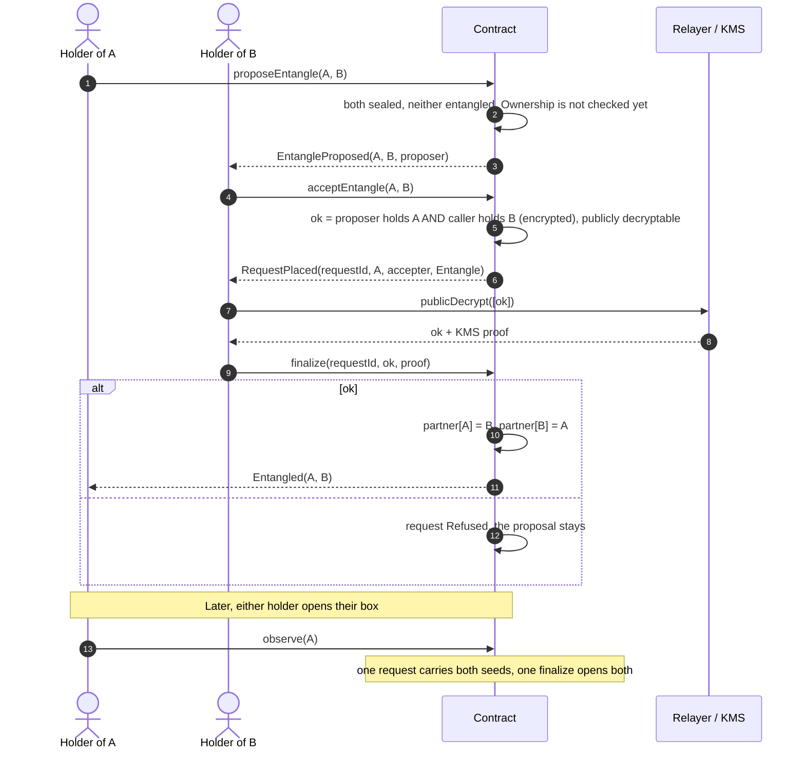
```mermaid
sequenceDiagram
  autonumber
  actor A as Holder of A
  actor B as Holder of B
  participant C as Contract
  participant R as Relayer / KMS
  A->>C: proposeEntangle(A, B)
  C->>C: both sealed, neither entangled. Ownership is not checked yet
  C-->>B: EntangleProposed(A, B, proposer)
  B->>C: acceptEntangle(A, B)
  C->>C: ok = proposer holds A AND caller holds B (encrypted), publicly decryptable
  C-->>B: RequestPlaced(requestId, A, accepter, Entangle)
  B->>R: publicDecrypt([ok])
  R-->>B: ok + KMS proof
  B->>C: finalize(requestId, ok, proof)
  alt ok
    C->>C: partner[A] = B, partner[B] = A
    C-->>A: Entangled(A, B)
  else
    C->>C: request Refused, the proposal stays
  end
  Note over A,C: Later, either holder opens their box
  A->>C: observe(A)
  Note over C: one request carries both seeds, one finalize opens both
```

The link is permanent and follows the tokens when they are sold: whoever buys an
entangled box can have it opened by the partner's holder. A successful entanglement
makes public that both callers held their boxes.

## Duel

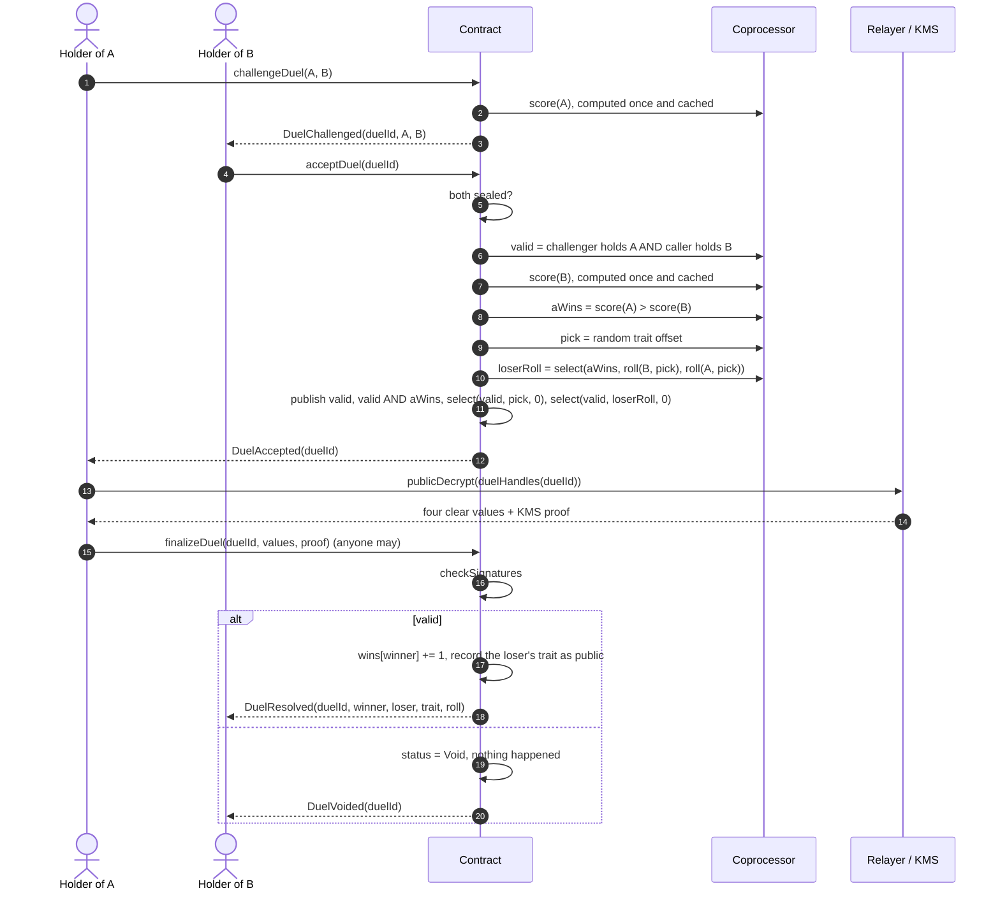
```mermaid
sequenceDiagram
  autonumber
  actor A as Holder of A
  actor B as Holder of B
  participant C as Contract
  participant Co as Coprocessor
  participant R as Relayer / KMS
  A->>C: challengeDuel(A, B)
  C->>Co: score(A), computed once and cached
  C-->>B: DuelChallenged(duelId, A, B)
  B->>C: acceptDuel(duelId)
  C->>C: both sealed?
  C->>Co: valid = challenger holds A AND caller holds B
  C->>Co: score(B), computed once and cached
  C->>Co: aWins = score(A) > score(B)
  C->>Co: pick = random trait offset
  C->>Co: loserRoll = select(aWins, roll(B, pick), roll(A, pick))
  C->>C: publish valid, valid AND aWins, select(valid, pick, 0), select(valid, loserRoll, 0)
  C-->>A: DuelAccepted(duelId)
  A->>R: publicDecrypt(duelHandles(duelId))
  R-->>A: four clear values + KMS proof
  A->>C: finalizeDuel(duelId, values, proof) (anyone may)
  C->>C: checkSignatures
  alt valid
    C->>C: wins[winner] += 1, record the loser's trait as public
    C-->>B: DuelResolved(duelId, winner, loser, trait, roll)
  else
    C->>C: status = Void, nothing happened
    C-->>B: DuelVoided(duelId)
  end
```

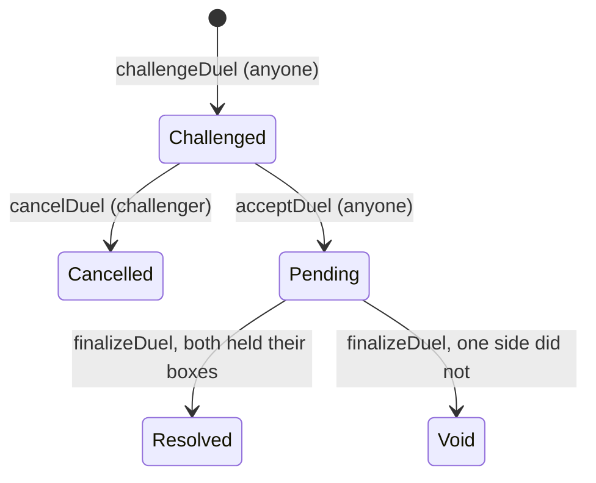
```mermaid
stateDiagram-v2
  [*] --> Challenged: challengeDuel (anyone)
  Challenged --> Cancelled: cancelDuel (challenger)
  Challenged --> Pending: acceptDuel (anyone)
  Pending --> Resolved: finalizeDuel, both held their boxes
  Pending --> Void: finalizeDuel, one side did not
```

The loser's roll is chosen with an encrypted `select`, so the winner's roll for that
trait is never in a decryptable ciphertext. Ties go to B. The score compared is the base
score; the golden bonus only exists once a box is opened. A void duel publishes four
zeros: it says nothing about either box.

## Give a box away

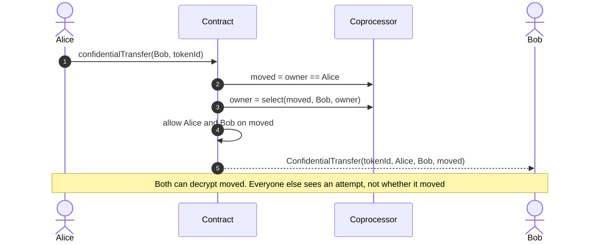
```mermaid
sequenceDiagram
  autonumber
  actor A as Alice
  participant C as Contract
  participant Co as Coprocessor
  actor B as Bob
  A->>C: confidentialTransfer(Bob, tokenId)
  C->>Co: moved = owner == Alice
  C->>Co: owner = select(moved, Bob, owner)
  C->>C: allow Alice and Bob on moved
  C-->>B: ConfidentialTransfer(tokenId, Alice, Bob, moved)
  Note over A,B: Both can decrypt moved. Everyone else sees an attempt, not whether it moved
```

The transfer never reverts on ownership, so anyone can send decoys. An operator set with
`setOperator(operator, until)` may call `confidentialTransferFrom` for the holder; there
are no per-token approvals, they would name the owner. In the adapter: `sendBox`.

## Paying

Every paid action (mint, feed, open, paid shake) takes cUSDC only, Zama's confidential
USDC (ERC-7984), pulled in the same transaction with `confidentialTransferFrom`; the
payer makes `DoNotOpen` an operator once (`setOperator`). A confidential transfer of more
than the payer holds does not revert: it moves 0. The contract never needs to know: what
the payment buys is masked by "paid" under encryption. A mint that was not paid creates
empty ids, an unpaid feed adds no affection, an unpaid paid shake reads `NOT_YOURS`, an
unpaid opening is refused.

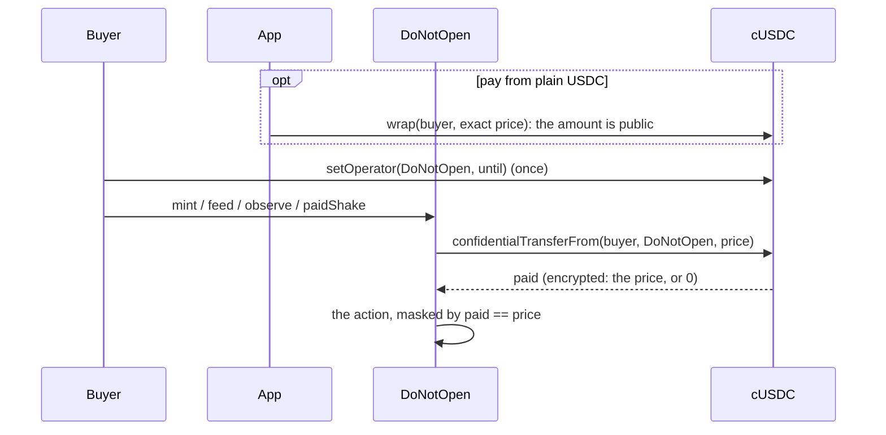
```mermaid
sequenceDiagram
  participant U as Buyer
  participant App
  participant D as DoNotOpen
  participant C as cUSDC
  opt pay from plain USDC
    App->>C: wrap(buyer, exact price): the amount is public
  end
  U->>C: setOperator(DoNotOpen, until) (once)
  U->>D: mint / feed / observe / paidShake
  D->>C: confidentialTransferFrom(buyer, DoNotOpen, price)
  C-->>D: paid (encrypted: the price, or 0)
  D->>D: the action, masked by paid == price
```

No amount is public, unless the buyer pays from plain USDC: shielding the exact price is a
public wrap, which tells everyone what was bought. The app says so and recommends shielding
a round amount ahead of time.

## Getting USDC

A player with no USDC has three ways in. On a test network, a faucet button mints test
USDC. Anywhere, `UsdcRamp.buy` swaps ETH for USDC on a public Uniswap V2 pool in one
transaction, keeping a fee of 0.3% of the ETH (set at deployment, never above 1%, withdrawn
by the owner); with `shield`, the ramp wraps the USDC and the buyer receives cUSDC in the
same transaction. And USDC already held is shielded as cUSDC by calling the cUSDC wrapper
directly, which costs nothing but gas: the site takes no fee on it.

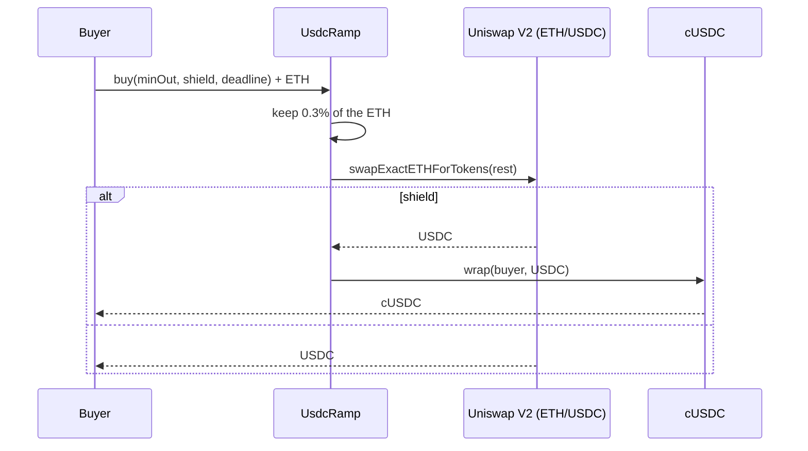
```mermaid
sequenceDiagram
  participant U as Buyer
  participant R as UsdcRamp
  participant X as Uniswap V2 (ETH/USDC)
  participant C as cUSDC
  U->>R: buy(minOut, shield, deadline) + ETH
  R->>R: keep 0.3% of the ETH
  R->>X: swapExactETHForTokens(rest)
  alt shield
    X-->>R: USDC
    R->>C: wrap(buyer, USDC)
    C-->>U: cUSDC
  else
    X-->>U: USDC
  end
```

Every amount here is public: ETH in, USDC out, and the amount wrapped. cUSDC hides what
happens after.

## Croquettes

Rules and numbers are in [CROQ.md](CROQ.md). Two more participants:

- **Pantry**: holds the croquette reserve, the treasury's share and the burnt pile, and
  counts each cat's encrypted weight.
- **cCROQ**: the confidential token, an ERC-7984 wrapper around the plain ERC-20 CROQ.

### Buy and wrap, unwrap and sell

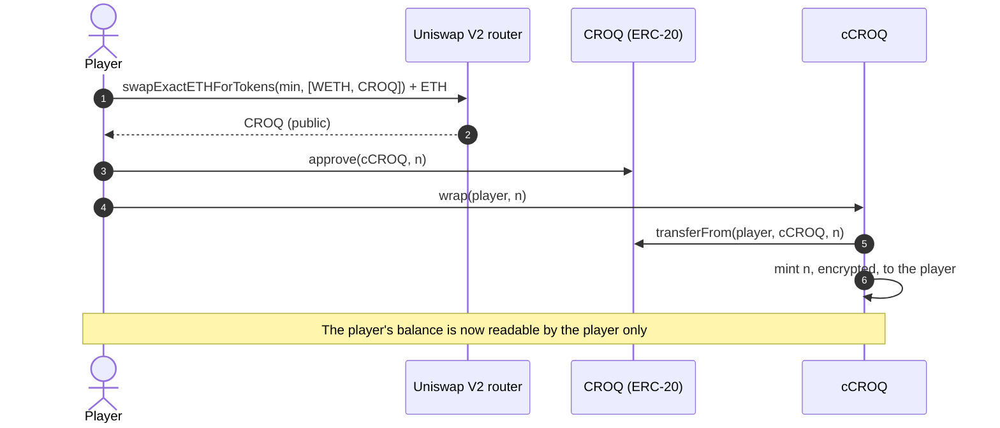
```mermaid
sequenceDiagram
  autonumber
  actor P as Player
  participant U as Uniswap V2 router
  participant C as CROQ (ERC-20)
  participant W as cCROQ
  P->>U: swapExactETHForTokens(min, [WETH, CROQ]) + ETH
  U-->>P: CROQ (public)
  P->>C: approve(cCROQ, n)
  P->>W: wrap(player, n)
  W->>C: transferFrom(player, cCROQ, n)
  W->>W: mint n, encrypted, to the player
  Note over P,W: The player's balance is now readable by the player only
```

The way back is two steps, because the amount must be decrypted publicly before plain
tokens can move:

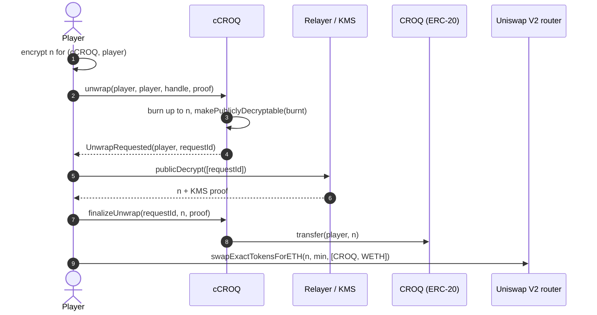
```mermaid
sequenceDiagram
  autonumber
  actor P as Player
  participant W as cCROQ
  participant R as Relayer / KMS
  participant C as CROQ (ERC-20)
  participant U as Uniswap V2 router
  P->>P: encrypt n for (cCROQ, player)
  P->>W: unwrap(player, player, handle, proof)
  W->>W: burn up to n, makePubliclyDecryptable(burnt)
  W-->>P: UnwrapRequested(player, requestId)
  P->>R: publicDecrypt([requestId])
  R-->>P: n + KMS proof
  P->>W: finalizeUnwrap(requestId, n, proof)
  W->>C: transfer(player, n)
  P->>U: swapExactTokensForETH(n, min, [CROQ, WETH])
```

If the balance was short, the burn moves 0 and the decrypted amount is 0. Anyone can
send `finalizeUnwrap`; the tokens go to the address set in the request.

### Claim the welcome bag and the purr

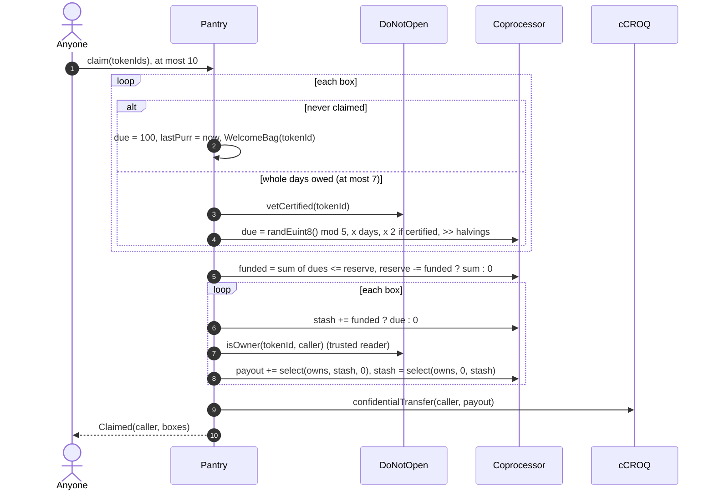
```mermaid
sequenceDiagram
  autonumber
  actor H as Anyone
  participant Pa as Pantry
  participant B as DoNotOpen
  participant Co as Coprocessor
  participant W as cCROQ
  H->>Pa: claim(tokenIds), at most 10
  loop each box
    alt never claimed
      Pa->>Pa: due = 100, lastPurr = now, WelcomeBag(tokenId)
    else whole days owed (at most 7)
      Pa->>B: vetCertified(tokenId)
      Pa->>Co: due = randEuint8() mod 5, x days, x 2 if certified, >> halvings
    end
  end
  Pa->>Co: funded = sum of dues <= reserve, reserve -= funded ? sum : 0
  loop each box
    Pa->>Co: stash += funded ? due : 0
    Pa->>B: isOwner(tokenId, caller) (trusted reader)
    Pa->>Co: payout += select(owns, stash, 0), stash = select(owns, 0, stash)
  end
  Pa->>W: confidentialTransfer(caller, payout)
  Pa-->>H: Claimed(caller, boxes)
```

Welcome bags and purrs are paid into each box's encrypted stash, whoever calls; the
caller collects only the stashes of the boxes they hold. A claim never reverts on
ownership, and says nothing about what the caller holds.

### Feed croquettes

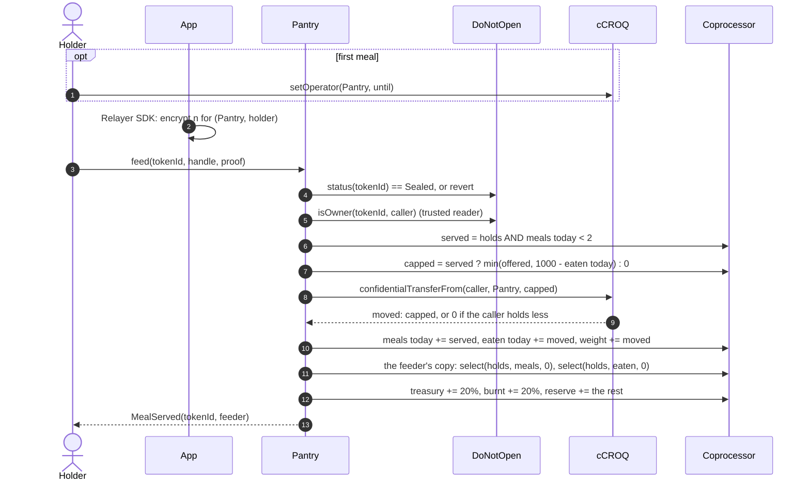
```mermaid
sequenceDiagram
  autonumber
  actor H as Holder
  participant App
  participant Pa as Pantry
  participant B as DoNotOpen
  participant W as cCROQ
  participant Co as Coprocessor
  opt first meal
    H->>W: setOperator(Pantry, until)
  end
  App->>App: Relayer SDK: encrypt n for (Pantry, holder)
  H->>Pa: feed(tokenId, handle, proof)
  Pa->>B: status(tokenId) == Sealed, or revert
  Pa->>B: isOwner(tokenId, caller) (trusted reader)
  Pa->>Co: served = holds AND meals today < 2
  Pa->>Co: capped = served ? min(offered, 1000 - eaten today) : 0
  Pa->>W: confidentialTransferFrom(caller, Pantry, capped)
  W-->>Pa: moved: capped, or 0 if the caller holds less
  Pa->>Co: meals today += served, eaten today += moved, weight += moved
  Pa->>Co: the feeder's copy: select(holds, meals, 0), select(holds, eaten, 0)
  Pa->>Co: treasury += 20%, burnt += 20%, reserve += the rest
  Pa-->>H: MealServed(tokenId, feeder)
```

The cUSDC-paid `DoNotOpen.feed` is the other gesture: it pets the cat (affection), and
anyone may do it.

### Weigh a cat

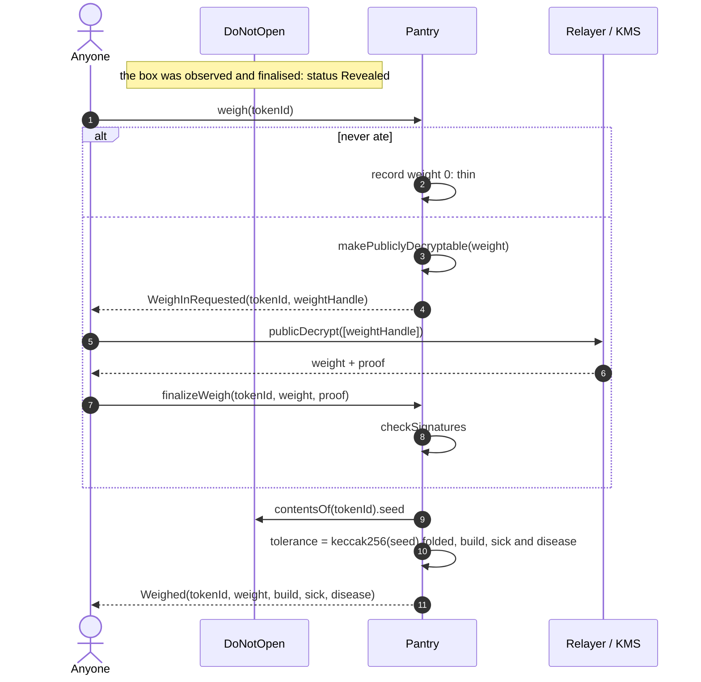
```mermaid
sequenceDiagram
  autonumber
  actor A as Anyone
  participant B as DoNotOpen
  participant Pa as Pantry
  participant R as Relayer / KMS
  Note over B: the box was observed and finalised: status Revealed
  A->>Pa: weigh(tokenId)
  alt never ate
    Pa->>Pa: record weight 0: thin
  else
    Pa->>Pa: makePubliclyDecryptable(weight)
    Pa-->>A: WeighInRequested(tokenId, weightHandle)
    A->>R: publicDecrypt([weightHandle])
    R-->>A: weight + proof
    A->>Pa: finalizeWeigh(tokenId, weight, proof)
    Pa->>Pa: checkSignatures
  end
  Pa->>B: contentsOf(tokenId).seed
  Pa->>Pa: tolerance = keccak256(seed) folded, build, sick and disease
  Pa-->>A: Weighed(tokenId, weight, build, sick, disease)
```

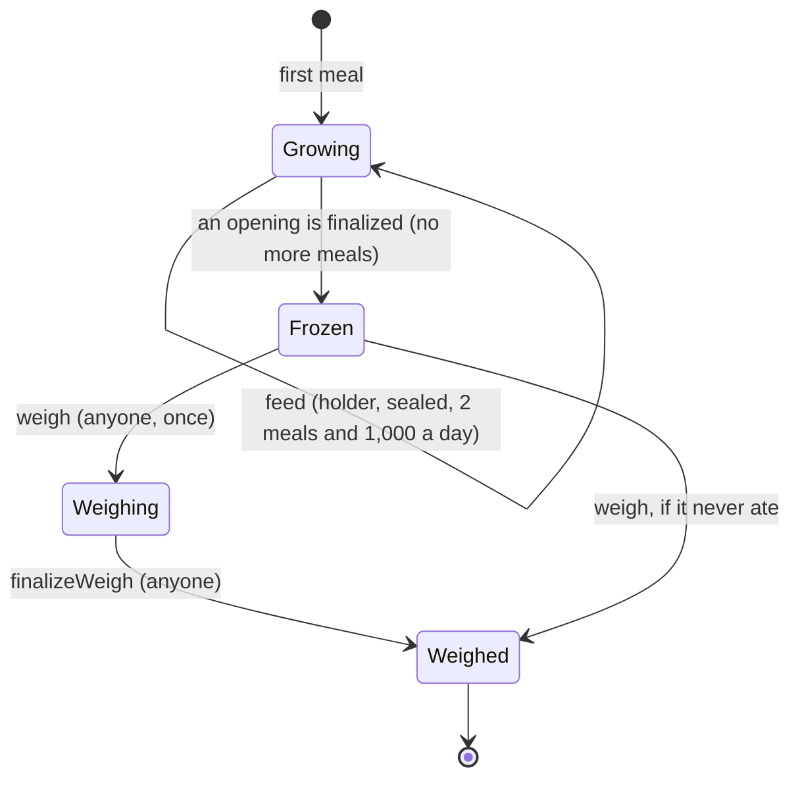
```mermaid
stateDiagram-v2
  [*] --> Growing: first meal
  Growing --> Growing: feed (holder, sealed, 2 meals and 1,000 a day)
  Growing --> Frozen: an opening is finalized (no more meals)
  Frozen --> Weighing: weigh (anyone, once)
  Weighing --> Weighed: finalizeWeigh (anyone)
  Frozen --> Weighed: weigh, if it never ate
  Weighed --> [*]
```

### Send croquettes to another player

`cCroq.confidentialTransfer(to, handle, proof)`, with the amount encrypted for
(cCROQ, sender). Both sides can decrypt the amount moved; nobody else can. A sender
who holds too little moves 0.

## What the app does when a step is interrupted

Every two-step action can be picked up later, by anyone:

| Left in | Shown in the app | Adapter call |
| --- | --- | --- |
| An opening, alive check or entanglement request `Pending` | The shelf lists the account's pending requests (`pendingRequests`); "Finish" | `finishRequest(requestId)`, or `finishObserve` / `finishProveAlive` for one box |
| Duel `Pending` | "Reveal the result" | `finishDuel` (returns null for a void duel) |
| A milestone reached, not announced | Announced after the next mint through the app | `announceMilestone` |
| Box revealed, not weighed | "Weigh the cat" | `weigh` |
| Weigh-in pending | "Weigh the cat" | `weigh` (picks up the pending one: `finalizeWeigh`) |
