# Flows

Participants used throughout:

- **App**: the web app and its `EvmFhevmAdapter`.
- **Contract**: `DoNotOpen` on the host chain.
- **Coprocessor**: executes the FHE operations the contract requests symbolically.
- **Relayer / KMS**: Zama's relayer in front of the threshold key management service.

One thing differs from the original brief in every flow that reveals something: **there
is no on-chain decryption callback** on the current protocol. A reveal is two
transactions with an off-chain decryption in between, and the second transaction can be
sent by anyone. See [ZAMA_NOTES.md](ZAMA_NOTES.md).

## Mint

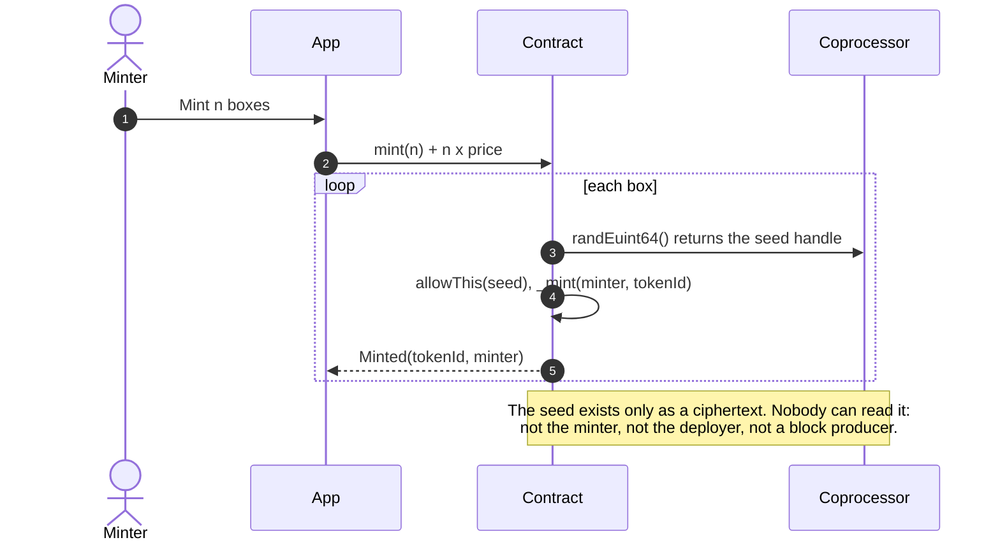

There is nothing to front-run: the value being drawn is not visible in the mempool, in
the transaction, or after it.

## Shake (user decryption)

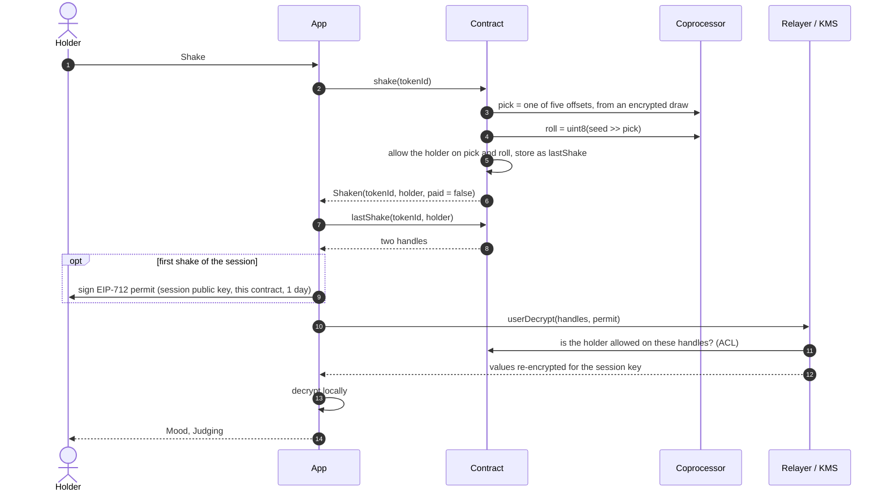

`paidShake` is the same flow for a non-holder, with a fee: 70% is credited to the
holder (pulled later with `claim`), and only the payer is allowed on the result.

The event says a shake happened. It does not say which trait: the pick is encrypted.

## Feed

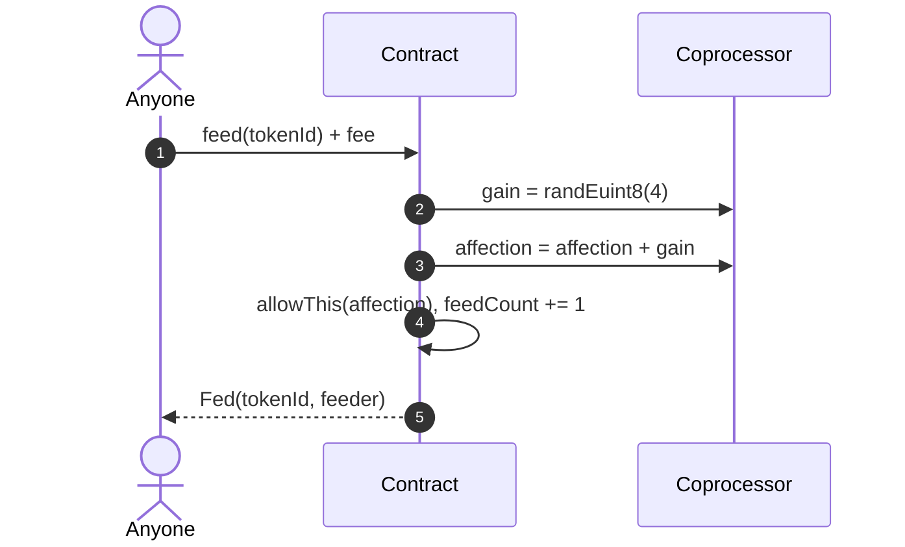

The count is public, the amount is not. If every feed added exactly 1, the counter would
give the affection away.

## Alive check (one public bit)

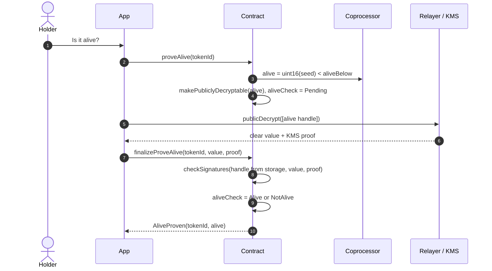

One request per box. The answer is public whichever way it falls.

## Open a box (public decryption)

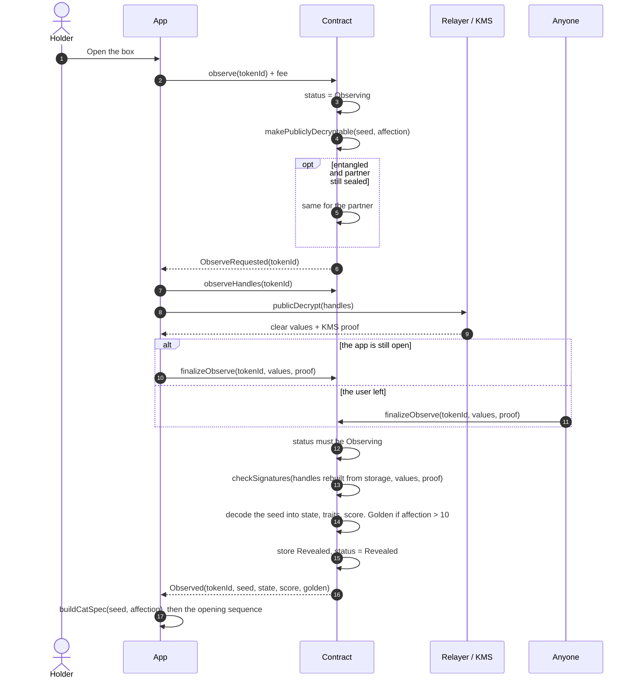

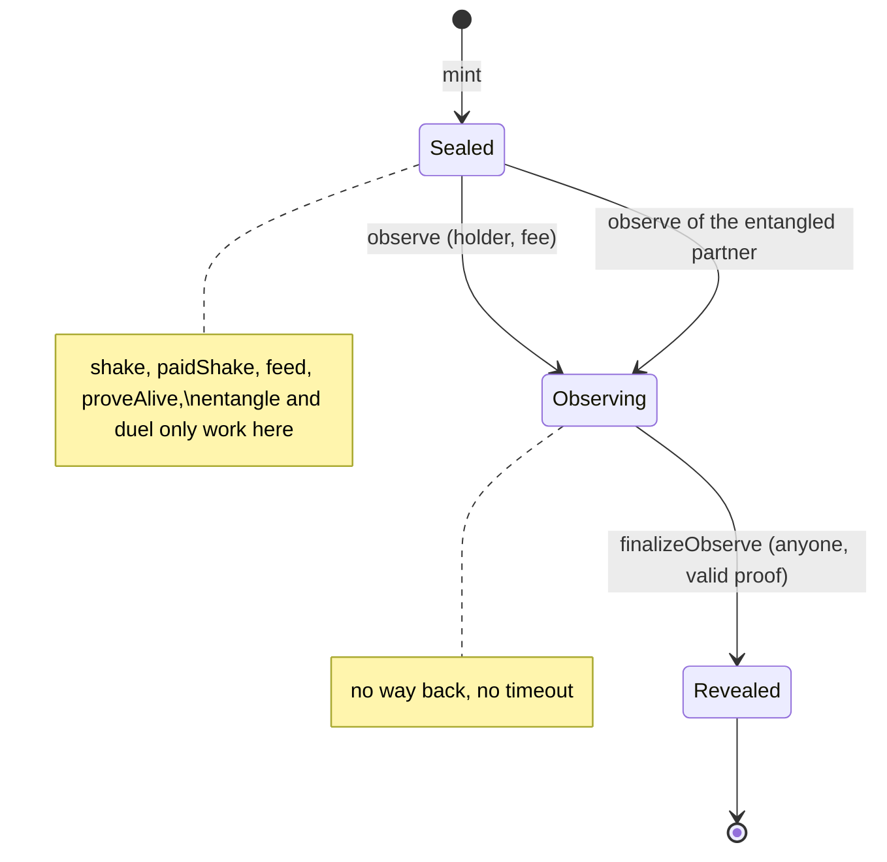

## Entangle

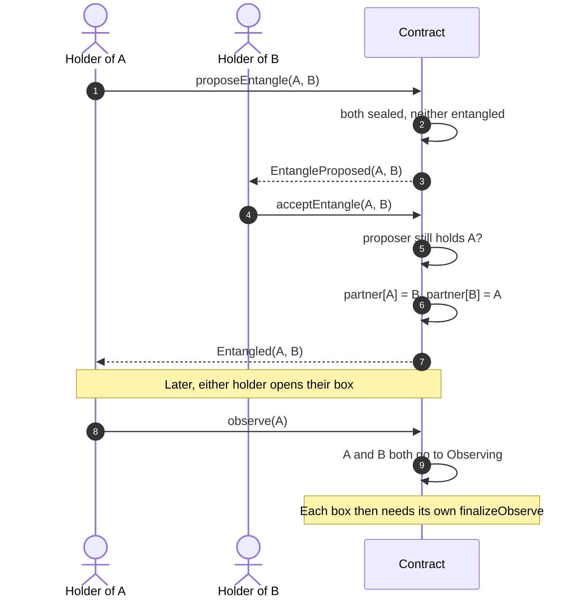

No FHE operation is involved. The link is permanent and follows the tokens when they are
sold: whoever buys an entangled box can have it opened by the partner's holder.

## Duel

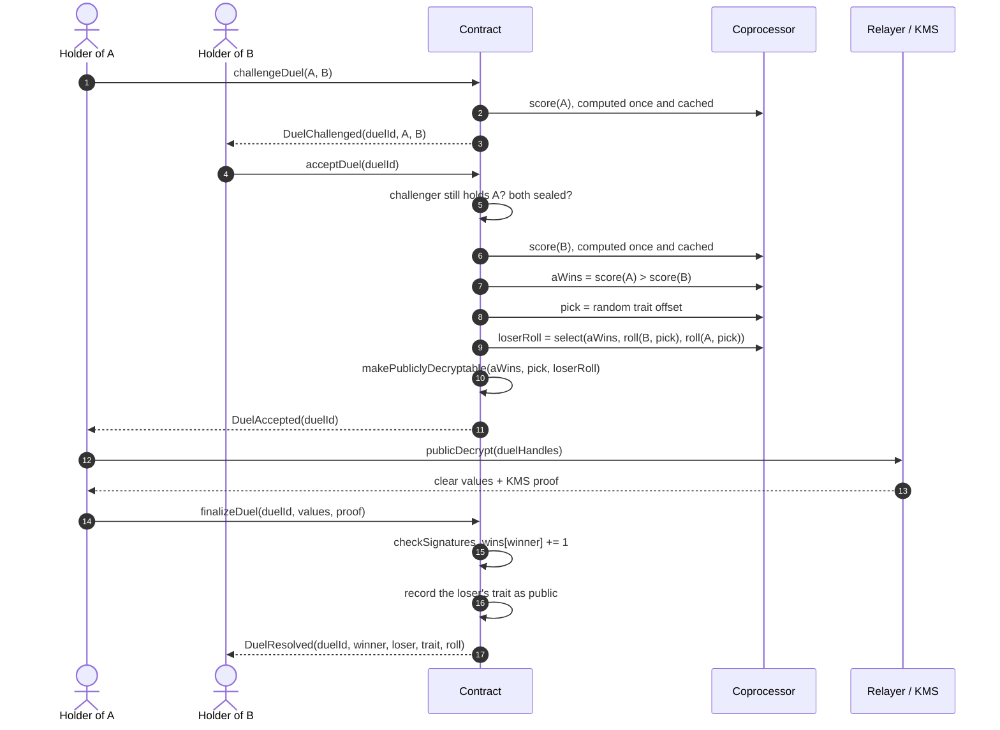

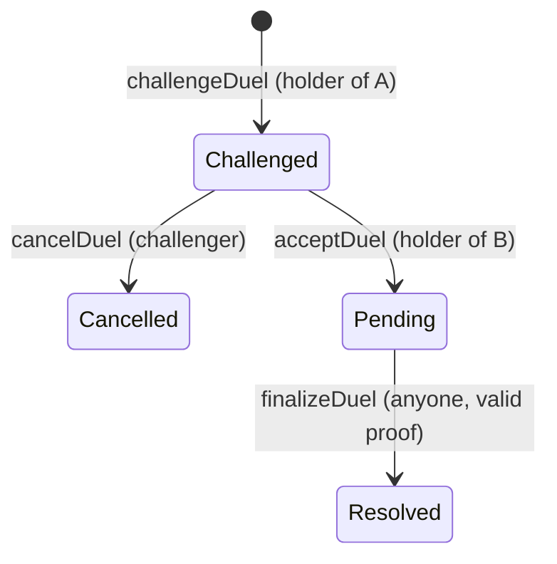

The loser's roll is chosen with an encrypted `select`, so the winner's roll for that
trait is never in a decryptable ciphertext. Ties go to B. The score compared is the base
score; the golden bonus only exists once a box is opened.

## Croquettes

Rules and numbers are in [CROQ.md](CROQ.md). Two more participants:

- **Pantry**: holds the croquette reserve, the treasury's share and the burnt pile, and
  counts each cat's encrypted weight.
- **cCROQ**: the confidential token, an ERC-7984 wrapper around the plain ERC-20 CROQ.

### Buy and wrap, unwrap and sell

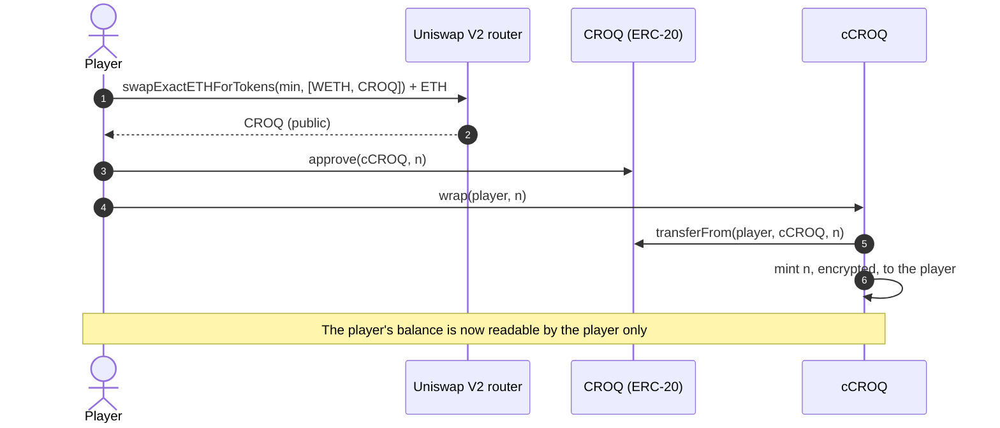

The way back is two steps, because the amount must be decrypted publicly before plain
tokens can move:

```mermaid
sequenceDiagram
  autonumber
  actor P as Player
  participant W as cCROQ
  participant R as Relayer / KMS
  participant C as CROQ (ERC-20)
  participant U as Uniswap V2 router
  P->>P: encrypt n for (cCROQ, player)
  P->>W: unwrap(player, player, handle, proof)
  W->>W: burn up to n; makePubliclyDecryptable(burnt)
  W-->>P: UnwrapRequested(player, requestId)
  P->>R: publicDecrypt([requestId])
  R-->>P: n + KMS proof
  P->>W: finalizeUnwrap(requestId, n, proof)
  W->>C: transfer(player, n)
  P->>U: swapExactTokensForETH(n, min, [CROQ, WETH])
```

If the balance was short, the burn moves 0 and the decrypted amount is 0. Anyone can
send `finalizeUnwrap`; the tokens go to the address set in the request.

### Claim the welcome bag and the purr

```mermaid
sequenceDiagram
  autonumber
  actor H as Holder
  participant Pa as Pantry
  participant B as DoNotOpen
  participant Co as Coprocessor
  participant W as cCROQ
  H->>Pa: claim(tokenIds), at most 10
  loop each box
    Pa->>B: ownerOf(tokenId) == holder
    alt never claimed
      Pa->>Pa: bags += 100, lastPurr = now
    else whole days owed (at most 7)
      Pa->>B: vetCertified(tokenId)
      Pa->>Co: randEuint8() mod 5, × days, × 2 if certified, >> halvings
    end
  end
  Pa->>Co: total = min(bags + draws, reserve); reserve -= total
  Pa->>W: confidentialTransfer(holder, total)
  Pa-->>H: WelcomeBag(tokenId, holder) per new box, Purred(holder, boxes)
```

### Feed croquettes

```mermaid
sequenceDiagram
  autonumber
  actor H as Holder
  participant App
  participant Pa as Pantry
  participant W as cCROQ
  participant Co as Coprocessor
  opt first meal
    H->>W: setOperator(Pantry, until)
  end
  App->>App: Relayer SDK: encrypt n for (Pantry, holder)
  H->>Pa: feed(tokenId, handle, proof)
  Pa->>Pa: caller holds the box, box is Sealed, fewer than 2 meals today
  Pa->>Co: offered = fromExternal(handle, proof)
  Pa->>Co: capped = min(offered, 1000 - eaten today)
  Pa->>W: confidentialTransferFrom(holder, Pantry, capped)
  W-->>Pa: moved: capped, or 0 if the holder holds less
  Pa->>Co: weight += moved; eaten today += moved
  Pa->>Co: treasury += 20%; burnt += 20%; reserve += the rest
  Pa-->>H: MealServed(tokenId, holder, meals)
```

The ETH-paid `DoNotOpen.feed` is the other gesture: it pets the cat (affection), and
anyone may do it.

### Weigh a cat

```mermaid
sequenceDiagram
  autonumber
  actor A as Anyone
  participant B as DoNotOpen
  participant Pa as Pantry
  participant R as Relayer / KMS
  Note over B: the box was observed and finalised: status Revealed
  A->>Pa: weigh(tokenId)
  alt never ate
    Pa->>Pa: record weight 0: thin
  else
    Pa->>Pa: makePubliclyDecryptable(weight)
    Pa-->>A: WeighInRequested(tokenId, weightHandle)
    A->>R: publicDecrypt([weightHandle])
    R-->>A: weight + proof
    A->>Pa: finalizeWeigh(tokenId, weight, proof)
    Pa->>Pa: checkSignatures
  end
  Pa->>B: contentsOf(tokenId).seed
  Pa->>Pa: tolerance = keccak256(seed) folded; build; sick and disease
  Pa-->>A: Weighed(tokenId, weight, build, sick, disease)
```

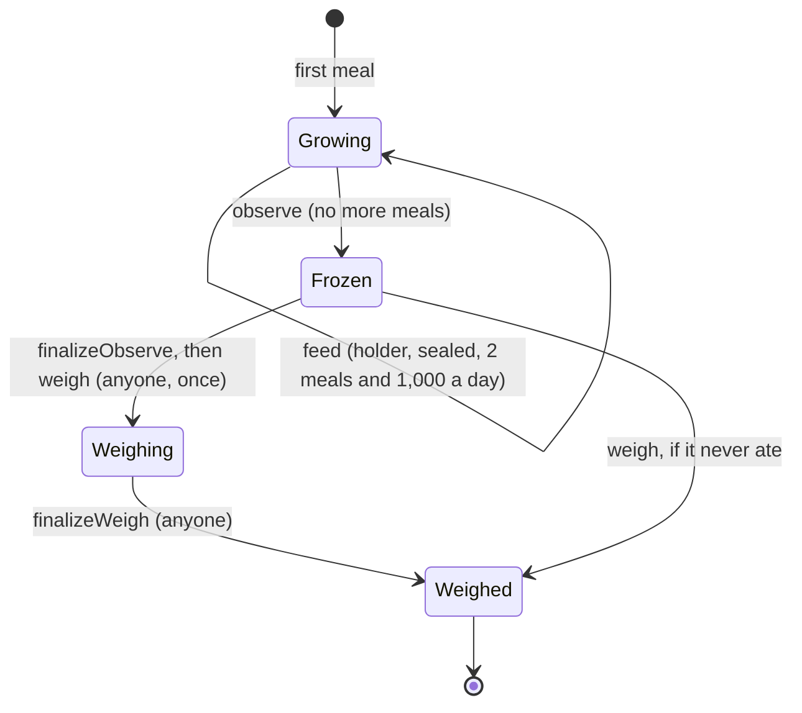

### Send croquettes to another player

`cCroq.confidentialTransfer(to, handle, proof)`, with the amount encrypted for
(cCROQ, sender). Both sides can decrypt the amount moved; nobody else can. A sender
who holds too little moves 0.

## What the app does when a step is interrupted

Every two-step action can be picked up later, by anyone:

| Left in | Shown in the app | Adapter call |
| --- | --- | --- |
| Box `Observing` | "Finish opening" | `finishObserve` |
| Alive check `Pending` | "Finish the check" | `finishProveAlive` |
| Duel `Pending` | "Reveal the result" | `finishDuel` |
| Box revealed, not weighed | "Weigh the cat" | `weigh` |
| Weigh-in pending | "Weigh the cat" | `weigh` (picks up the pending one: `finalizeWeigh`) |
