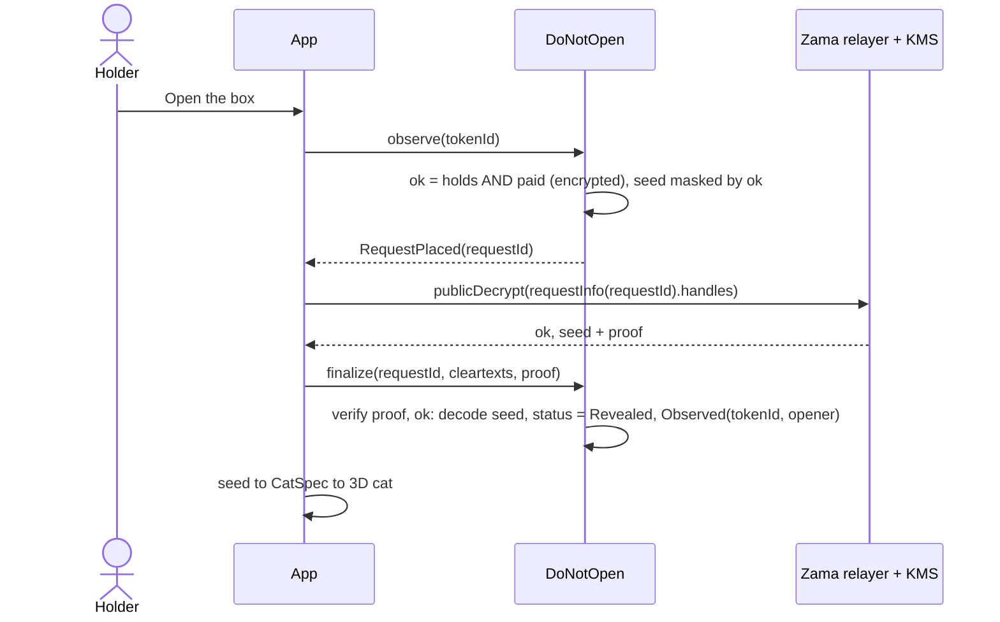
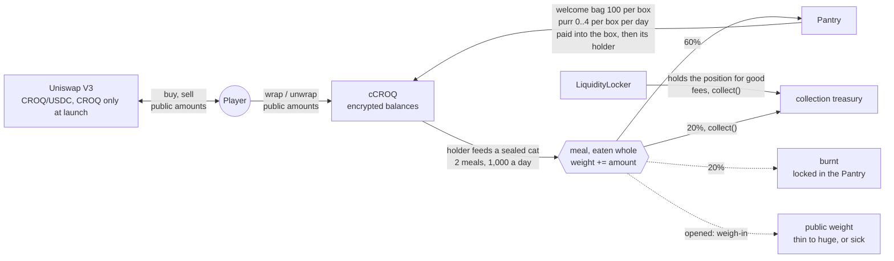

# The game

> [Play it](https://game.do-not-open.app) · [Its manual](https://game.do-not-open.app/docs) ·
> [Back to the README](../README.md#the-game) · Next to it: [the sealed vault](VAULT.md)

10,000 sealed boxes on the Zama Protocol (FHEVM). Each holds a cat whose state and traits are
drawn and stored encrypted on-chain, so nobody, the deployer included, knows what is inside until
a box is observed. Who holds which box, how many boxes an account holds, and how many boxes were
sold are encrypted too: `DoNotOpen` is a Confidential ERC-721, and only milestones of the sale
are announced. The sale stops at 9,000 boxes; the last 1,000 are kept for the mainnet whitelist's
gifts, minted free by `WhitelistGifts` and never sold.

Prices are in USDC and paid in cUSDC, Zama's confidential USDC, so no amount is public; the app
shields plain USDC first when needed. Holders pet their cats (affection, which can turn the
accessory golden) and feed them croquettes (CROQ), a game currency with encrypted balances. The
cat eats every croquette and puts on a weight nobody can read; when the box is opened, the cat is
weighed in public. The heavier it is, the rarer its build, and past a tolerance of its own the
cat is sick: an ultra-rare trophy.

This page is the developers' map of the game. Players read the manual in the app instead, which
says the same with no code.

**On this page:** [Every mechanic](#every-mechanic) · [How a box is opened](#how-a-box-is-opened) ·
[Croquettes](#croquettes) · [The studio and the rats](#the-studio-and-the-rats) ·
[The flea market](#the-flea-market) · [Play on Sepolia](#play-on-sepolia) ·
[Token metadata](#token-metadata) · [The manual](#the-manual) · [Read next](#read-next)

## Every mechanic

Each row opens its sequence diagram in [`FLOWS.md`](FLOWS.md).

| Mechanic | What it does |
| --- | --- |
| [Release form](FLOWS.md#release-form-when-a-wallet-connects) | Terms of play initialed and signed with the wallet before playing on mainnet |
| [Mint](FLOWS.md#mint) | Buy boxes in cUSDC, the quantity encrypted |
| [Finding your boxes](FLOWS.md#finding-your-boxes) | Your own transfer receipts, decrypted with one signature |
| [Shake](FLOWS.md#shake-user-decryption) | A hint about one of five traits, drawn under encryption and decrypted for the holder alone |
| [Feed](FLOWS.md#feed) | Croquettes eaten whole, the weight encrypted |
| [Alive check](FLOWS.md#alive-check-one-public-bit) | One public bit: is the cat alive |
| [Open a box](FLOWS.md#open-a-box-public-decryption) | The cat revealed for good, its opener public |
| [Entangle](FLOWS.md#entangle) | Two sealed boxes bound together |
| [Duel](FLOWS.md#duel) and [its ranking](FLOWS.md#duel-ranking) | Two boxes compared under encryption, posted on a shelf |
| [Allow list claim](FLOWS.md#mainnet-allow-list-claim) | A free signature for the mainnet list, scored from public facts |
| [Whitelist gifts](FLOWS.md#whitelist-gifts) | cCROQ, a free box and a free rat for each seated wallet |
| [Boarding pass](FLOWS.md#x-boarding-pass) | Sign in with X, tasks, referrals |
| [Give a box away](FLOWS.md#give-a-box-away) | A transfer that never reverts, decoys optional |
| [Paying](FLOWS.md#paying) and [getting USDC](FLOWS.md#getting-usdc) | cUSDC, the bureau de change |
| [Decryptions and credits](FLOWS.md#decryptions-and-credits) | What a decryption costs and who pays it |
| [The studio](FLOWS.md#the-studio), [adopt a rat](FLOWS.md#adopt-a-rat) | Rats drawn for free or from a prompt, then minted |
| [The rats' tricks](FLOWS.md#the-rats-tricks-sniff-shield-jam) | Sniff, shield or jam a box, decided under encryption |
| [The flea market](FLOWS.md#the-flea-market) | Boxes, cats and rats between players in cUSDC |

## How a box is opened

Every reveal follows this shape: a request on-chain, a decryption off-chain, a proof back
on-chain. There is no decryption callback on the current protocol. Nothing reverts on ownership:
a request by someone who does not hold the box is settled `Refused` and decrypts to zeros.



How the owners stay hidden through all of it is in [`HIDDEN_OWNERS.md`](HIDDEN_OWNERS.md); what
each token keeps encrypted, in [`DATA_MODEL.md`](DATA_MODEL.md).

## Croquettes

Two tokens: **CROQ**, a plain ERC-20 that any market can list, and **cCROQ**, its confidential
ERC-7984 wrapper, which is what the game uses. 20,000,000 CROQ were minted once at deployment;
nothing can mint more.



| Share | CROQ |
| --- | --- |
| Game reserve (Pantry, pays the purr, takes back 60% of every meal) | 10,000,000 |
| Welcome bags (Pantry, 100 per box) | 1,000,000 |
| Market liquidity (Uniswap V3, CROQ only, locked) | 4,000,000 |
| Treasury | 5,000,000 |

The market is one Uniswap V3 position that holds only CROQ: the creator put in no USDC. It sells
CROQ from 0.001 USDC up to 1 USDC each, so CROQ never sells below 0.001 USDC, and until someone
buys there is no USDC to sell into. The position is held for good by the `LiquidityLocker`; its
1% trading fees go to the treasury.

<details>
<summary><b>Go deeper into the croquettes</b></summary>

- [Supply](CROQ.md#supply) and [where croquettes come from](CROQ.md#where-croquettes-come-from): the welcome bag, the purr, the rats' croquettes
- [Where croquettes go](CROQ.md#where-croquettes-go): meals, the daily allowance, the weight
- [The weigh-in](CROQ.md#weigh-in) and [its calibration](CROQ.md#calibration)
- [The public market](CROQ.md#the-public-market) and [the liquidity locker](CROQ.md#the-liquidity-locker)
- [What leaks](CROQ.md#what-leaks) and [what it costs](CROQ.md#cost)

</details>

## The studio and the rats

The studio (`/studio`) is the way in for people who do not care about blockchains. It draws the
depot's rats, not cats, on purpose: the cats only come out of boxes, so nothing drawn in the
studio can be taken for one. Anyone draws a random rat there for free: a procedural rat generator
(`buildRatSpec` in `packages/generator`, `createRat` in `packages/scene`: buck teeth, big ears,
hats, a wedge of cheese, assembled from the Blender rat kit `rat.glb`), in the browser, no
wallet. To draw a rat from a prompt ("a chubby rat chef stealing a wheel of cheese"), a player
buys a pack in plain USDC from `StudioPacks`: **Starter**, 2 USDC for 10 sketches and 1 3D model;
**Litter**, 8 USDC for 50 and 5. A sketch is a cartoon picture in the house style (try again
until it looks right); a model turns a sketch into a 3D mesh, drawn with the game's toon
materials. The API spends a unit before it calls the AI services and gives it back if they fail,
and stops for the day past a dollar budget. Each pack sells for at least twice what it is
expected to cost, so the services are paid back with a margin for the treasury. The numbers are
in [`packages/game-spec/studio.json`](../packages/game-spec/studio.json), the flow in
[`FLOWS.md`](FLOWS.md#the-studio).

A rat can then be adopted: minted in `Rats`, a plain ERC-721, for 1 USDC (a free rat, by its
seed) or 3 USDC (an AI rat: the API stores its picture on Arweave like a cat's and keeps its 3D
model). An adopted rat earns 3 plain CROQ a day from the `RatPantry` (funded with 500,000 CROQ
sent from the treasury with a plain transfer, at most 7 days kept between two claims; while it is
empty a claim waits rather than losing the days) and sniffs boxes for its owner through the paid
shake. "My rats" in the game lists them.

Each rat also gets a secret power when it is minted, which only its holder can read: 1 (keen
nose: 30% of a sniff's price comes back, in secret), 2 (blocks one trait you pick) or 3 (blocks
all five). A rat can be set on a sealed box for 3 days, then rests 7. On your own box it protects
it: whoever shakes or sniffs it reads a fake for the blocked traits. On someone else's box it
attacks it: its holder's shakes of those traits come back scrambled. The contract decides which
under encryption, so nobody can tell a shield from an attack, a rat's power, or the trait
(`RatTricks`, see [`FLOWS.md`](FLOWS.md#the-rats-tricks-sniff-shield-jam)). There will only ever
be 700 free rats and 300 AI rats, and one wallet mints 5 at most: every rat is paid from the same
fixed fund, so the supply is capped in the contract, and the home page and the studio count the
rats left.

## The flea market

`FleaMarket` lets players sell each other sealed boxes, cats (opened boxes) and rats, paid in
cUSDC. The market holds what it sells. A rat is escrowed at once. A box goes to the market in a
"maybe" transfer whose arrival is proven by a public decryption, so only a seller who really held
it gets an active listing. Two ways to buy:

- **at the asking price**, which is public: the buyer pays, then a public decryption of the single
  bit "paid" delivers the item, or refunds the payment if someone else was faster or the listing
  changed;
- **with a secret offer**: an encrypted amount of cUSDC escrowed on the listing that only the
  buyer and the seller can read. The seller may accept it at once, and that price never becomes
  public.

2.5% of each sale goes to the treasury (`market.feeBps` in the spec, never more than 10%). A box
is sold in the public state it was listed in: if it is opened or entangled while it waits, the
sale is refused and a pending payment comes back. Public: the seller of an active listing (so
selling a box shows you held it), the asking price, the buyer of a sale. Never public: balances,
offer amounts, the price of a sale by offer, what is inside a sealed box.

<details>
<summary><b>The flea market's flows</b></summary>

- [List a box](FLOWS.md#list-a-box)
- [Buy at the asking price](FLOWS.md#buy-at-the-asking-price)
- [Make a secret offer](FLOWS.md#secret-offer)
- [Reprice, cancel, and a box that changes in escrow](FLOWS.md#reprice-cancel-and-a-box-that-changes-in-escrow)
- [What the market leaks](HIDDEN_OWNERS.md#5b-the-flea-market)

</details>

## Play on Sepolia

```bash
VITE_CHAIN_MODE=sepolia pnpm dev     # or open http://localhost:5173/app?chain=sepolia
```

You need a browser wallet with a little Sepolia ETH for gas. Prices are in Zama's test USDC on
Sepolia; the wallet slip has a button that mints some, and the bureau de change (in the menu)
swaps between ETH, USDC, cUSDC, CROQ and cCROQ in one form, with the route, fees and slippage
shown before signing. Its "Testnet faucet" card mints 100 test USDC, then turns the counter to
shielding it, with links to Google's Sepolia ETH faucet for gas and to Zama's test token
addresses. The notice shown when the game first opens on Sepolia (contracts can be redeployed,
what is kept) points to it.

Who holds a box is encrypted, so the app finds yours from your own transfer receipts: one
decryption signature per visit ("Show my boxes"). `?chain=mock` and `?chain=sepolia` switch modes
without restarting. The menu does the same under the languages: ETH / SOL (Solana stays disabled
until Zama ships SVM support) and Testnet / Mainnet: Testnet reloads the page with
`?chain=sepolia`, Mainnet stays disabled until a mainnet deployment exists (an old
`?chain=mainnet` link lands on Sepolia).

The game's contracts and their addresses are in the [README](../README.md#the-games-contracts).

## Token metadata

Token metadata is served live by the API (`GET /metadata/:id`); its images are stored for good on
Arweave, for free, as soon as a box is minted or a cat opened (see
[`apps/api/README.md`](../apps/api/README.md#token-images-on-arweave)). Offline render (JSON, a 3D
render and an SVG fallback per token):

```bash
pnpm --filter @dno/web render:metadata                    # fixtures
pnpm --filter @dno/web render:metadata --source sepolia   # every minted token
```

## The manual

The game carries its own illustrated manual in the game's look at `/docs` on `game.` (`/fr/docs`,
`/es/docs`, `/it/docs`), the "Manual" tag in the navigation: the seed, the flows and the package
layout as interactive three.js diagrams. Its source is `apps/web/src/docs`. The studio and the
manual are prerendered at build time, one file per language, with their sharing tags; their
social card is `og.png`.

## Read next

| Document | For the game |
| --- | --- |
| [`HIDDEN_OWNERS.md`](HIDDEN_OWNERS.md) | Encrypted owners, the hidden mint quantity, milestones, game actions checked under encryption |
| [`DATA_MODEL.md`](DATA_MODEL.md) | What each token keeps encrypted and who may read it |
| [`FLOWS.md`](FLOWS.md) | Every mechanic as a sequence diagram |
| [`CROQ.md`](CROQ.md) | The croquette economy |
| [`DESIGN.md`](DESIGN.md) | Art direction, effects, performance budget |
| [`../packages/game-spec/README.md`](../packages/game-spec/README.md) | The seed layout, the odds, the rarity formula |
| [`../packages/contracts-evm/README.md`](../packages/contracts-evm/README.md) | The contracts, the cost of each function, deploy and CLI |
| [`../assets/BLENDER_TODO.md`](../assets/BLENDER_TODO.md) | The cats' and rats' assets |
