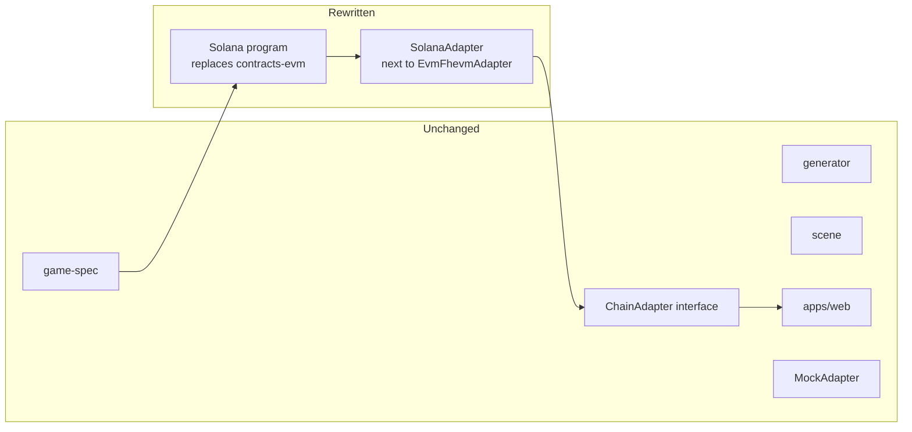
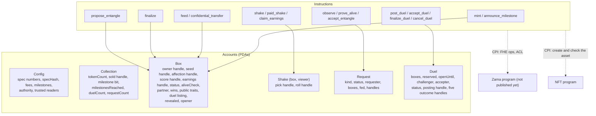

# Porting to Solana

## Where things stand

Checked against docs.zama.org on 2026-09-30: Zama's litepaper lists **"Solana support
(H2 2026)"** on its roadmap. There is no SVM program library, no SDK and no
documentation for confidential programs yet. The only Solana items in the docs today
are the ZAMA token's SPL mint, bridge and multisig addresses.

So this document is a map, not a recipe. The left column of each table is what exists
and runs today. The right column is what we expect to need, and every line of it has to
be re-checked against the real SDK when it ships. Where we are guessing, it says so.

## What does not change

About two thirds of the code base is on the left. That is what the package boundaries
were drawn for:

- `spec.json` is the rulebook for both programs. The Solana program loads the same
  numbers into a config account, and stores the same `specHash`.
- The generator decodes a revealed seed the same way whatever chain revealed it.
- The app only knows `ChainAdapter`. Its types were kept chain-neutral on purpose:
  accounts are opaque strings, amounts are `bigint` in the smallest unit with symbol and
  decimals reported by `collection()`, progress is four generic steps, errors carry a
  neutral code plus the program's own error name.

## The map

### Encrypted computation

| EVM / FHEVM today | Where | Expected on Solana | Confidence |
| --- | --- | --- | --- |
| `euint64`, `euint32`, `euint16`, `euint8`, `ebool`, `eaddress` handles in contract storage | `DoNotOpen.sol`, `ConfidentialERC721.sol` state | Ciphertext handles (32 bytes) stored in program accounts | High: handles are chain-agnostic identifiers |
| `eaddress` owner, `FHE.eq(owner, caller)` and `select` on it | every ownership check, transfers | An encrypted 32-byte public key and equality on it | Low: the whole hidden-owner design rests on it. Ask Zama |
| `externalEbool` input and `FHE.and` | `confidentialTransferIf` (a holder's decoys) | An encrypted bool input with its proof, and `and` on bools | Medium: needs encrypted inputs, as the hidden mint quantity does |
| `FHE.fromExternal` with an input proof bound to (contract, sender) | `mint` (the quantity), the Pantry | The same, bound to (program, signer) | Medium |
| `FHE.randEuint64()` and bounded `randEuintN(2^k)` | mint, shake, feed, duel | An encrypted-randomness instruction through CPI to Zama's program | Medium: must exist for the protocol to be useful; bounds may differ |
| `FHE.shr`, `select`, `ge`, `gt`, `lt`, `add`, `mul`, casts | shake, proveAlive, score, duel | The same operator set through CPI | Medium: check that encrypted-amount shifts exist; if not, the five trait bytes can be extracted with `and` + scalar shifts |
| Symbolic execution: the contract emits operations, the coprocessor computes | everywhere | Same model: the program records operations, a coprocessor computes off-chain | High: it is the protocol's architecture |
| HCU limit, 20M per transaction | batch size, duel split in two transactions | Solana compute units (1.4M max per transaction) **and** whatever FHE budget Zama defines | Low: re-measure everything. The first duel of two boxes already takes two transactions here |

### Access control and decryption

| EVM / FHEVM today | Where | Expected on Solana | Confidence |
| --- | --- | --- | --- |
| `FHE.allowThis(handle)` | after every computation | Allow the program, probably a PDA acting as its identity | Medium |
| `FHE.allow(handle, viewer)`, permanent | `_shakeFor` | Allow a wallet public key on a handle | Medium. If grants become revocable on Solana, nothing here needs it |
| No ACL on seed, score, affection or owner for any holder | design rule | Same rule. It is what makes transfers trivial | Ours to keep |
| `FHE.makePubliclyDecryptable` | observe, proveAlive, acceptEntangle, postDuel, acceptDuel, mint (the milestone bit) | A "mark public" instruction | Medium |
| `FHE.checkSignatures(handles, cleartexts, proof)` | `finalize`, `finalizeDuel`, `announceMilestone` | Verify KMS signatures inside the program | Low. See "transaction size" below |
| A public decryption refuses one handle twice | `observe` of two unfed entangled boxes | Unknown | Low: check, and keep publishing nothing for an unfed box |
| User decryption: EIP-712 permit signed with secp256k1, scoped to a contract and a duration | `EvmFhevmAdapter.permitFor` | A message signed with the wallet's ed25519 key (`signMessage`), scoped to a program id | Medium: the KMS must accept ed25519 |
| `publicDecrypt` / `userDecrypt` through the Relayer SDK | `EvmFhevmAdapter` | The same two calls in an SVM flavour of the SDK | Medium |

### Token and program model

| EVM today | Where | On Solana | Notes |
| --- | --- | --- | --- |
| Confidential ERC-721 inside the game contract | `DoNotOpen is ConfidentialERC721` | The encrypted owner stays in our own box account. A Metaplex or SPL asset has a public owner, which would undo the design: at most, every asset sits with a program PDA and the real owner is the encrypted handle | Ownership checks are encrypted comparisons, never a read of an asset account |
| `mapping(tokenId => ...)` | all state | One PDA per box: seeds `["box", collection, tokenId]` | Rent: the minter pays for the box account |
| `mapping(tokenId => mapping(viewer => Shake))` | `_shakes` | One PDA per (box, viewer): seeds `["shake", box, viewer]`, created on first shake, rent paid by the viewer | |
| `mapping(duelId => Duel)` | `_duels` | One PDA per duel: seeds `["duel", collection, duelId]`; can be closed after resolution to refund rent | |
| `_listing[tokenId]`, one duel on the shelf per box | `finalizeDuel` | A field in the box account | The older listing's duel account must be passed too, to cancel it, or to see that it was accepted and let the new posting give way |
| `_earnings[tokenId]` + `claimEarnings(ids)` | paid shake earnings | An encrypted handle in the box account, paid in the confidential token to whoever holds the box | Must stay per box: a per-holder account would name the holder |
| cUSDC `confidentialTransferFrom` that moves all or nothing | every paid action (`_pull`) | A CPI to the confidential token program, with the program as a delegate | The action stays masked by "paid == price"; no plain lamport fees, they would be public |
| `Ownable`, `withdraw`, `setMetadata` (and `BoxMetadata.setBaseURI`), `setTrustedReader`, `setGuard`, `setGiver` | admin | An authority public key in the config account, ideally a multisig (Squads); trusted readers as a list of program ids | Nobody may read the revenue; `withdraw` at most once per 7 days, with the last time in the config account |
| `DoNotOpenConfig` contract, immutable | rules | A config account written once at initialisation, with `specHash` | |
| Events | `MintPlaced`, `ConfidentialTransfer`, `Shaken`, `RequestPlaced`, ... | Anchor events (program logs) | Same names and fields as `spec.events` |
| Custom errors | `NotSealed`, ... | Anchor error codes with the same names | The app's error copy is keyed on these names. Nothing reverts on ownership |
| `confidentialTransfer` needs no hook | ACL design | Same: no transfer hook needed | A hook would only be needed if a holder had ACL to move |
| Sequential token ids from `tokenCount`, empty ids included | mint | A counter in the collection account | Writes to one account serialise mints: fine at this scale |
| Encrypted sold count, milestone bit | mint, `announceMilestone` | Handles in the collection account | |
| Replay of the account's own `ConfidentialTransfer` receipts | `boxesOf` | The same replay over program events naming the account, decrypting each "moved" bit | DAS (`getAssetsByOwner`) cannot help: the owner is encrypted |
| `StudioPacks`: packs bought in plain USDC, `PackBought` | the studio | An SPL USDC transfer to the treasury in the same instruction that bumps the buyer's account (a PDA per buyer: `["studio", buyer]`) and emits the same event | No FHE: a straight port. The API's indexer reads the event the same way |
| `Rats` (ERC-721) and `RatPantry` (plain CROQ a day) | the studio's adopted rats | A Metaplex Core asset per rat (public owner), minted by the program after an SPL USDC transfer, with the attester's ed25519 signature checked for AI rats; the caps (700 seed rats, 300 AI rats, 5 mints an address) as counters in a config PDA and a PDA per minter; the pantry a PDA token account paying plain CROQ, `paid_until` in a PDA per rat | No FHE: a straight port |
| `Rats`' power and `RatTricks` | a rat's secret power, its sniff and its tricks | The power an encrypted `u8` in the rat's PDA, drawn at mint; `RatTricks` a program holding per-box shield and jam PDAs (masks, end times, fake rolls as ciphertext handles) and a `ready_at` per rat; the collection's shake instruction CPIs into it as its guard, or reads its PDAs directly | Needs the coprocessor (`rand`, `select`, `shr`, comparisons) and ACL grants to the rat's holder; the guard call becomes a CPI or an account the shake instruction must take |
| `WhitelistGifts` | the whitelist's one-off gifts | A Merkle root of (wallet, tier) in a config PDA and a claimed flag per wallet PDA; the croquettes an encrypted draw (`rand` + `rem` + `add`) sent as a confidential CROQ transfer only the wallet decrypts; the box minted free by the collection program for its giver (a counter of gift boxes, capped at the supply less the sale's last milestone, never in the sold count), the rat minted by the program as the rats' giver | The draw and the confidential transfer need the coprocessor; the rest is plain |

### Things that are structurally different

- **Accounts must be declared up front.** `observe` on an entangled box writes the
  partner's box account too, so the instruction must list it. The adapter reads
  `partner` first and passes both. Same for a duel: both box accounts and the duel account,
  plus, when a posting is proven, the duel account of the box's previous listing.
  A mint creates up to 10 box accounts, real and empty alike.
- **Transaction size.** A Solana transaction is limited to 1,232 bytes. A KMS proof is
  a set of signatures from the threshold parties; `finalize` carries the proof and
  the clear values (up to five, for an entangled opening or a duel's outcome). If that does not fit, the proof has to be written to a buffer account
  across several transactions and then consumed. This is the single largest unknown.
- **Signature verification cost.** Verifying secp256k1 or ed25519 signatures is done with
  the native precompile programs plus instruction introspection, not in program code.
  Zama's library will presumably wrap this.
- **Re-entrancy.** Solana forbids re-entering a program through CPI (except self-recursion)
  and caps CPI depth. The audit item changes shape: what matters is account validation
  (owner, seeds, signer), not call ordering.
- **No `view` functions.** Reads are account fetches and deserialisation in the adapter.
  `requestInfo` and `duelHandles` become a few lines of client code reading the request
  or duel account.
- **Two compute budgets.** Compute units for the program, plus the FHE budget.
- **Upgradeability.** Solana programs are upgradeable by default. The EVM contract is
  not. Decide explicitly, and say which in the collection's description.

## Program sketch

The instruction list is the contract's function list, one to one. The state machine of
a box and of a duel are the ones in [FLOWS.md](FLOWS.md).

### The flea market

`FleaMarket` ports as its own program, with no privilege in the box program, like the EVM
contract:

- **Escrow.** The market's listing PDA becomes the box's holder through the same encrypted
  owner handle: a "maybe" transfer by CPI, signed by the seller (no operator is needed when
  the seller signs the listing instruction), then a public decryption of "arrived" and a
  permissionless `finalize_listing`. A rat (a plain NFT, owner public) goes to a token account
  owned by the listing PDA. Delivering is a transfer signed by the PDA's seeds.
- **Accounts.** `Listing` (collection, status, seller, price, listed at, token, snapshot,
  `arrived` handle), `Purchase` (listing, buyer, status, price, `paid` and `ok` handles) and
  `Offer` (listing, buyer, status, `amount` handle), one PDA each, seeded by their counters,
  plus a market config (treasury, fee, authority). `listings(from, count)` and `offerInfo`
  become account fetches in the adapter, filtered with `getProgramAccounts`.
- **Payments.** The confidential token program's transfers must be all-or-nothing like
  ERC-7984's, or the market must compute `ok` itself; `paid` is stored and refunded the same
  way. The offer cap is the same `min(amount, MAX_PRICE)` before the transfer, so the
  encrypted fee cannot overflow 64 bits.
- **ACL.** The offer amount is granted to the market program, the buyer and the seller; if the
  Solana ACL is per program or per account rather than per key (open question 1), the seller's
  read needs another shape.
- **State snapshot.** The hooks become a read of the box account's public fields (status,
  partner, vet check) hashed at listing and compared at sale; the box account is listed in
  `buy`, `accept_offer` and `finalize_purchase`. A failing comparison in `finalize_purchase`
  must still settle `Missed` and refund, never abort.
- **Re-entrancy** does not apply (see above); account validation does: the listing's token
  account, the seller and buyer token accounts, the treasury.

### The sealed vault

`SealedVault` ports as its own program too, sharing only the confidential-token base with the
box program:

- **Boxes and keys.** A box account per NFT (collection, token, state, listing, pending
  requests, proceeds, nonce, delegate) with an encrypted owner and an encrypted 256-bit key. If the SVM has no 256-bit
  encrypted integer with `xor` and `eq` (open question 9), the key becomes four 64-bit words,
  compared word by word and `and`ed. A transfer still draws a fresh random key.
- **Custody.** The NFT goes to a token account owned by a vault PDA; a withdrawal is a transfer
  signed by the PDA's seeds.
- **Requests.** `request` and a permissionless `finalize` with the public decryption of "the key
  matched", as everywhere else. The request hash is a hash of the program id, the box, the nonce
  and the terms; the bound key is an encrypted input, which must be bound to the transaction's
  signer as on the EVM, or carry its own binding. The relayer is native on Solana: a request
  needs no signer but the fee payer, which can be the API's key, so the holder signs nothing on
  chain.
- **Marketplace.** There is no Seaport on Solana. On the EVM, `VaultListings` writes the
  vault's order the way OpenSea shows a contract's listing (Seaport 1.6, OpenSea's conduit, its
  signed zone and its fees), so the listing shows on opensea.io and is bought there. The vault
  PDA would list the NFT on a Solana marketplace program that lets a PDA be the seller (a Tensor
  or Magic Eden listing, or an escrowless order the program validates itself), in the shape that
  marketplace's site shows, with its fees, and `sync` would read that listing's account. This is
  the part to design from scratch.
- **Offers.** The EVM vault accepts buyers' Seaport offers in WETH through a helper
  (`VaultOffers`) it hands one NFT for one call, and that helper is the offer board. On Solana a
  bid is a marketplace account (a Tensor or Magic Eden bid in SOL or wSOL); accepting it is the
  vault PDA calling that marketplace's sell-into-bid instruction, with the request binding the
  bid's account address where the EVM binds the order hash (`ref`). Only the box's NFT account
  goes in the instruction, which gives the same bound as the helper. The board could be the
  marketplace's own bid accounts, read like any program account.
- **Delegation.** delegate.xyz has no Solana deployment. The closest is the token's own
  delegate (SPL `approve`), which would let the delegate move the NFT, so not that; a small
  registry account per box naming a wallet (or a delegation standard if one emerges) plays the
  part, public as on the EVM, cleared at an exit and kept on a transfer.
- **Private sale.** Unchanged: the confidential token program's all-or-nothing transfer, a
  `select` on "paid and the seller held it", the price and the outcome granted to the two sides.
- **Pockets.** `SealedPockets` ports as a program whose pockets are accounts holding an
  encrypted key, an encrypted balance and a viewer pubkey, with the pool's confidential tokens in
  a PDA's token account. A spend names its sets as remaining accounts; the key bound to the terms
  and the spent-handle list carry over as they are (a bound key's ciphertext account can be
  marked spent). The viewer is an ed25519 keypair derived from the same `signMessage`. Other
  confidential tokens (cUSDT, cWETH, cZAMA on Sepolia) are one pool each, as on EVM, their key
  and viewer derived with the pool's address mixed in. The desk
  becomes an instruction of that program calling the vault program's private-sale accept, its
  public "ok" bit read the same way as the vault's requests.

## What to write in `packages/chain-adapter/src/solana`

`SolanaAdapter implements ChainAdapter`, with the same shape as `EvmFhevmAdapter`:

| Interface member | EVM implementation | Solana implementation |
| --- | --- | --- |
| `connect`, `account`, `onAccountChange` | EIP-1193 injected wallet | Wallet Standard |
| `collection`, `box`, `pair`, `openedCats`, `duelStandings`, `pendingRequests` | contract views and events | fetch and decode PDAs and program events |
| `boxesOf` | replay of the account's own decrypted receipts | the same replay over program events |
| `mint` ... `claimEarnings`, `sendBox` | one contract call each | one instruction each, with the accounts derived from token ids |
| `shake` decryption | EIP-712 permit + `userDecrypt` | ed25519-signed permit + the SVM SDK's user decryption |
| `finish*` | `publicDecrypt` then a `finalize*` call | same, possibly through a proof buffer account |
| `buyUsdc`, `trade` with `slippageBps`; `shieldUsdc`, `unshieldUsdc`, `wrap`, `unwrap` | `trade`: Uniswap V3 `QuoterV2` and `SwapRouter02` with a minimum out (`buyUsdc`: the ramp, over a V2 pool); ERC-7984 `wrap`, and `unwrap` + public decryption + `finalizeUnwrap` | a Solana AMM swap with a minimum out (a concentrated-liquidity pool such as Orca Whirlpools or Raydium CLMM takes the same CROQ-only range); the confidential token program's deposit and withdraw, the withdrawn amount made public the same way |
| `signTerms` (the release form) | EIP-191 `personal_sign` (secp256k1), then `POST /v1/terms` | the Wallet Standard's `signMessage` (ed25519) on the same text naming the base58 address; the API's `AcceptTerms` verifies EIP-191 only, so it needs an ed25519 path and an address format check for Solana keys |
| `allowList`, `claimAllowList` (the mainnet allow list) | EIP-191 `personal_sign` on `allowListMessage`, then `POST /v1/allowlist` | the same as `signTerms`: `signMessage` on the same text, and an ed25519 path in the API's `AllowList`, whose message names a 0x address today. `playerPoints` compares addresses lower-cased, which base58 must not be |
| `vault()` (`VaultAdapter`, the sealed vault, and its `pockets()`) | `EvmVault`: `SealedVault`, `VaultListings` (a listing's order read from it; `buy` refused where OpenSea's zone gates it), `VaultOffers` (offers signed with EIP-712 for the Seaport's version, WETH wrapped) and Seaport through ethers; `EvmPockets` for `SealedPockets` and `PocketDesk`, the pocket's key and viewer from a second signature; the box keys from one EIP-191 signature (wallets sign deterministically, RFC 6979, so the same wallet makes the same keys); requests through the API's relayer | a vault over the vault program and a Solana marketplace (its listings and bids); the keys from `signMessage` (ed25519 is deterministic too); the API's key as the fee payer |
| steps `wallet`, `confirming`, `decrypting`, `proving` | as is | as is |
| `ChainError.reason` | Solidity custom error name | Anchor error name, kept identical |
| `ChainError.detail` | `held`/`needed` from a dry run (`estimateGas`) and the balances; `resumable`/`landed` after the first transaction | `simulateTransaction` for the dry run and the fee; the same flags |

Then add `"solana"` to `ChainMode` in `src/index.ts` and a dynamic import next to the
Sepolia one. Nothing in `apps/web` changes except the wallet button's label.

## Order of work, once the SDK exists

1. Read the SDK and correct this document: ACL model, proof format and size, FHE budget.
2. Config and mint. Test that a seed and an owner are drawn and that nobody can decrypt
   them, and that a real id and an empty one look the same.
3. Shake with user decryption: this proves the ACL and permit story end to end.
4. Observe with public decryption: this settles the transaction size question.
5. `decode` in Rust, with the same cross-test against the generator that the Solidity
   one has (`decodes seeds exactly like the TypeScript generator`).
6. proveAlive, feed, entangle, duel. Re-measure costs and re-decide the batch size.
   The croquette economy comes after: a confidential SPL token (or Zama's equivalent of
   ERC-7984) next to a plain SPL mint for markets, and a Pantry program with one weight
   account per box (encrypted weight, today's meals and amount, the weigh-in).
   The market's liquidity locker has no FHE in it: a CROQ-only position in a
   concentrated-liquidity pool, whose position NFT (or position account) goes to a program
   with no withdraw instruction and a fee collect that pays the treasury.
   The flea market comes last (see "The flea market" above): it needs only the box
   program's transfer and the confidential token. The sealed vault is independent of the
   game and can come at any point after the confidential token, once a marketplace is chosen
   (see "The sealed vault" above).
7. `SolanaAdapter`, then run the app in a third mode.
8. Port the test suite: the 95 contract tests are written against behaviour, not against
   Solidity, and their names read as a specification.

## Open questions for Zama

1. Is the ACL on Solana per public key, per program, or per account?
2. What does a public decryption proof look like, how large is it, and how is it verified on-chain?
3. Does user decryption accept an ed25519 signature, and what does the signed message contain?
4. Is there an encrypted shift by an encrypted amount? (Used by `shake` and `duel`.)
5. What is the FHE budget per transaction, and does it interact with compute units?
6. Is there a local mock comparable to the Hardhat plugin's?
7. Is there an encrypted address type, with equality and `select`? (Used by every
   ownership check.)
8. Does a public decryption refuse a handle listed twice, as on the EVM?
9. Is there a 256-bit encrypted integer with `xor` and `eq`, and a random 256-bit draw? (Used by
   the sealed vault's keys.)
