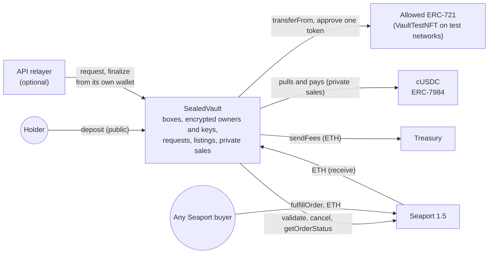
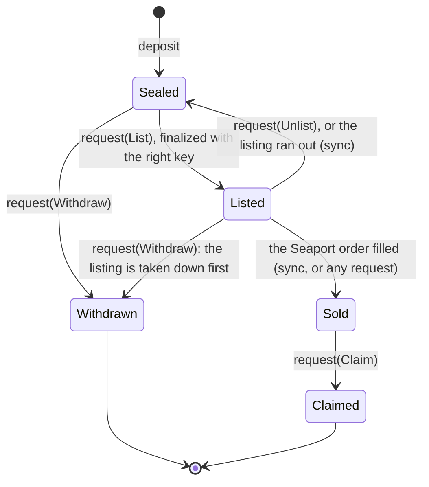
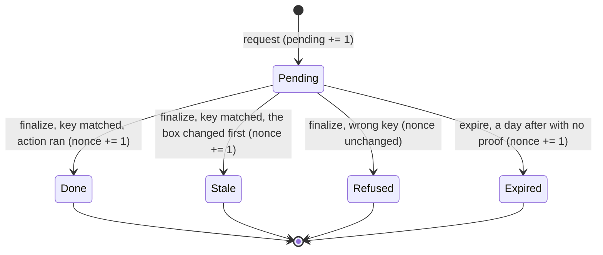
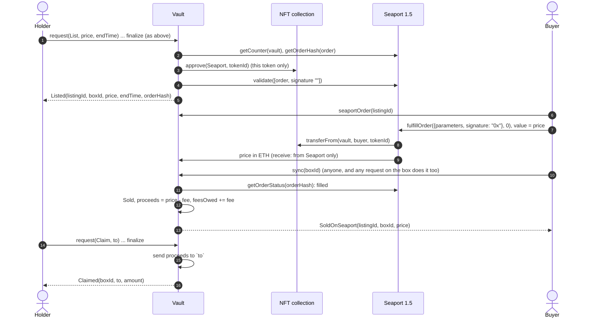
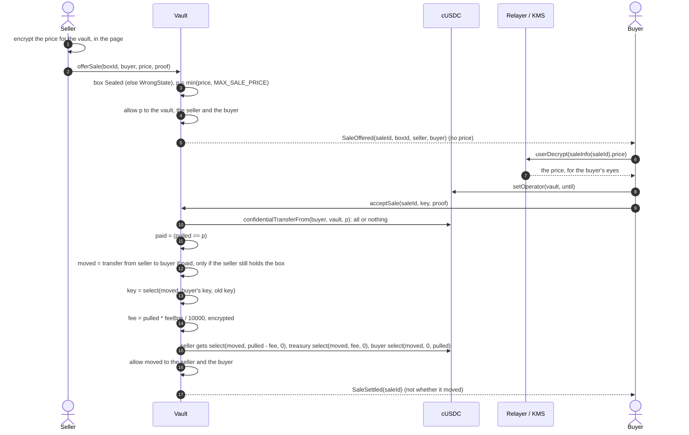
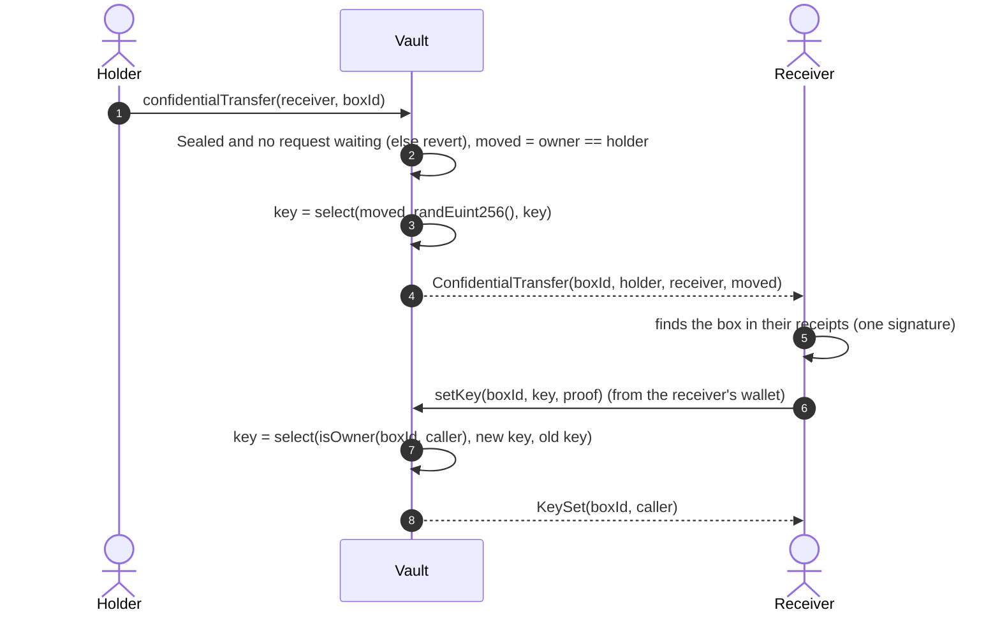

# The sealed vault

The sealed vault is a product next to the game, not a part of it. Any NFT of an allowed
collection goes into a box whose holder is encrypted: the box is a Confidential ERC-721 of its
own ("DO NOT OPEN Vault", `SEALED`), built on the same `ConfidentialERC721` base as the boxes of
the game. The NFT stays in the vault until the box's holder takes it out, sells it on Seaport
(OpenSea's protocol) with the vault as the seller, or sells the box privately for an encrypted
cUSDC price. The page is `vault.do-not-open.app` (`/vault` off the site's domains), and its
docs for holders, in four languages, are `vault.do-not-open.app/docs` (`apps/web/src/vault/docs`):
they follow this file, so a change here goes there too.

The contracts are the source of truth, especially the design notes at the top of
[`SealedVault.sol`](../packages/contracts-evm/contracts/SealedVault.sol). This file explains
them, what leaks, what it costs, and why each choice was made.

**Status.** Done on the mock and in the tests (44 contract tests in `test/SealedVault.ts`,
against Seaport 1.5's real bytecode), and on Sepolia since 2026-10-08: `SealedVault` at
`0x8B07846CaB181E1D010D2a9E39d7FDF60087fb18` (block 11872753), its free test collection `VaultTestNFT` at
`0xf72Eb38f816B1B8Effa8B6036C0BA6A38D6d6f9b`, listing on OpenSea's Seaport 1.5.

## Contracts

| Contract | What it is |
| --- | --- |
| `SealedVault` | The vault. `ConfidentialERC721` (encrypted owners, transfers that never revert on ownership), `ZamaEthereumConfig`, `Ownable`, `ReentrancyGuard`. 21,869 bytes deployed, compiled with the default optimizer (200 runs) |
| `vault/ISeaport.sol` | The slice of Seaport 1.5 the vault uses (`validate`, `cancel`, `getOrderHash`, `getOrderStatus`, `getCounter`, `fulfillOrder`) and its structs, as Seaport defines them. Seaport 1.5 is at `0x00000000000000ADc04C56Bf30aC9d3c0aAF14dC` on Sepolia and mainnet; Seaport 1.6 is not on Sepolia |
| `mocks/VaultTestNFT.sol` | Test networks only: "Sealed Vault Test NFT" (`VTEST`), free to mint for anyone, its picture an SVG drawn on-chain from its id, so a marketplace shows something |



`SealedVault` has no link to `DoNotOpen`, the Pantry or any other contract of the game: it only
shares the base contract and the cUSDC.

## A box and its key

Each box stores, in public, the NFT it holds (`collection`, `tokenId`), its state, its listing,
a pending request, the ETH a Seaport sale left in it, and a request nonce. Two things are
encrypted: its owner (an `eaddress`, as in every `ConfidentialERC721`) and its **key**, a
256-bit secret (`euint256`) its holder picks. Only the vault is allowed on the key
(`allowThis`): nobody can decrypt it, the holder included. It is only ever compared.



A box moves (transfer, private sale) only while `Sealed` and no request waits on it. `Withdrawn` and
`Claimed` are final: a box id is never reused, and an NFT taken out and put back gets a new box.

**What the app uses as the key.** `EvmVault` never stores a key. The wallet signs one fixed
message once a session, `vaultKeyMessage(vault, chainId)` (EIP-191, free); the secret is the
keccak256 of that signature, and the key of the box holding `tokenId` of `collection` is
`keccak256(abi.encode(secret, collection, tokenId))`. The same wallet makes the same keys on any
device. Anyone who gets that signature can take the wallet's NFTs out: the message says so, and
says to sign it only on DO NOT OPEN.

**Binding a key to a request.** The key is never sent as is. For a request, the holder encrypts
`key XOR requestHash(boxId, nonce, action, to, price, endTime)`, where

```
requestHash = keccak256(abi.encode(block.chainid, vault, boxId, nonce, action, to, price, endTime))
```

and `nonce` is how many requests on the box matched its key: `finalize` moves it on when the key
matched (the request `Done` or `Stale`), and `expire` does too; a wrong key leaves it where it
was. The vault computes the same hash from the terms it was actually given and compares
`input XOR hash` with the stored key, under encryption. A relayer that changed a term (the
recipient, say) makes the vault compare against another hash: the key does not match and the
request settles `Refused`. One that sends a used input again, once its request settled, finds
the nonce moved on: `Refused` too. One that sends it twice while the first still waits places
the holder's own request twice; the second finds the box changed (withdrawn, listed, sealed
again or claimed) and settles `Stale`. And a stranger's wrong key never moves the nonce, so it spoils no input the holder
already prepared. An encrypted input is bound to the address that sends it, so the page encrypts it for
the relayer's address when the relayer sends (`inputUser` in `EvmVault`), and for the wallet's
otherwise.

**A box that changes hands gets a random key.** `_transfer` (every transfer, decoys included,
and a private sale) sets the key to `select(moved, randEuint256(), key)`: a box that moved has a
key nobody knows, so the previous holder can no longer act on it; a transfer that moved nothing
keeps the key. The new holder sets theirs with `setKey(boxId, key, proof)` ("Make the key mine"
in the page, `adopt` in the adapter), a "maybe" like a transfer: `select(isOwner(caller), new,
old)`, so a stranger's `setKey` changes nothing and looks the same. A private sale sets the
buyer's key in the same transaction.

## Flows

Participants: **Holder** (the box's holder, and their page), **Relayer** (the API's vault
relayer, when there is one; otherwise the holder's wallet sends), **Vault** (`SealedVault`),
**Relayer / KMS** (Zama's), **Seaport**, **cUSDC**.

### Deposit

```mermaid
sequenceDiagram
  autonumber
  actor H as Holder
  participant N as NFT collection
  participant V as Vault
  H->>H: key = keccak256(secret, collection, tokenId), encrypted for the vault
  H->>N: approve(vault, tokenId)
  H->>H: decoys: up to 5 fresh random addresses, really = false for each, encrypted with the key
  H->>V: deposit(collection, tokenId, key, to[], really[], proof)
  V->>V: allowedCollection[collection], else CollectionNotAllowed; to and really pair up, 5 at most, else BadSends
  V->>N: transferFrom(holder, vault, tokenId)
  V->>V: mint box: owner = holder (moved = true), key stored, allowThis only
  V-->>H: Deposited(boxId, collection, tokenId, depositor), ConfidentialTransfer(boxId, 0x0, holder, moved)
  loop each of to[]
    V->>V: _transfer(holder, to[i], boxId, really[i]): moves only if really and the holder still holds it
    V-->>H: ConfidentialTransfer(boxId, holder, to[i], moved)
  end
```

The deposit is public: it is a plain NFT transfer, and `Deposited` names the depositor. What
happens to the box next is not, and it can start in the same transaction: `deposit` sends the
new box on to each of `to`, for real only where the encrypted `really` is true. The page sends
three decoys by default (`decoys` in the adapter, `decoySends`): fresh random addresses nobody
holds a key of, `really` false for each, so the depositor keeps the box, but to anyone else each
transfer is a "maybe" and the depositor is no longer its obvious holder. One of them may be real
(a gift, or the holder's own fresh wallet): the box then moves and gets a random key, as on any
transfer, and its receiver sets theirs with `setKey`. Each send costs a transfer's gas and HCU
(Cost, below). The holder finds their boxes the way a player finds theirs:
by replaying their own `ConfidentialTransfer` receipts and user-decrypting the "moved" bits
(`myBoxes`, one signature), see [HIDDEN_OWNERS.md](HIDDEN_OWNERS.md#finding-your-boxes).

### A request: take out, list, take down, collect

Everything that leaves the vault is asked with the key, never with the caller's address, in
two steps like every reveal in this repository: `request`, a public decryption of one bit ("the
key matched"), then `finalize` with the KMS proof, which anyone may send.

```mermaid
sequenceDiagram
  autonumber
  actor H as Holder
  participant Rl as Relayer (API)
  participant V as Vault
  participant R as Relayer / KMS
  H->>V: boxInfo(boxId).nonce, requestHash(boxId, nonce, action, to, price, endTime)
  H->>H: encrypt key XOR hash, for the vault and the relayer's address
  H->>Rl: POST /v1/vault/relay {call: "request", args}
  Rl->>V: request(boxId, action, to, price, endTime, boundKey, proof) (gas estimated first)
  V->>V: sync, state allows the action, price and end time sane (else revert); other waiting requests do not matter
  V->>V: ok = (boundKey XOR requestHash(terms, nonce)) == key, publicly decryptable
  V->>V: pending += 1, placedAt = now
  V-->>H: RequestPlaced(requestId, boxId, action, relayer)
  H->>R: publicDecrypt(requestInfo(requestId).ok)
  R-->>H: ok + KMS proof
  H->>Rl: POST /v1/vault/relay {call: "finalize", args}
  Rl->>V: finalize(requestId, ok, proof) (anyone may)
  V->>V: checkSignatures on the stored handle, pending -= 1, sync
  alt not ok
    V->>V: Refused: nothing happens
  else ok, but the box changed first (sold, expired, listed)
    V->>V: Stale: nothing happens
  else ok
    V->>V: run the action (below), Done
  end
  V->>V: if ok: nonce += 1
  V-->>H: RequestSettled(requestId, status)
```

| Action | Allowed in | `to` | What runs on `Done` |
| --- | --- | --- | --- |
| `Withdraw` | `Sealed`, `Listed` | where the NFT goes, not zero | A listed box is taken down first; then `Withdrawn`, the NFT sent with `transferFrom`, `Withdrawn(boxId, to)` |
| `List` | `Sealed` | unused | A Seaport order is validated (below), `Listed` |
| `Unlist` | `Listed` | unused | `seaport.cancel`, the approval cleared, `Sealed`, `Unlisted` |
| `Claim` | `Sold` | where the ETH goes, not zero | `Claimed`, the proceeds sent, `Claimed(boxId, to, amount)`. If the send fails (a contract that refuses ETH), the request settles `Stale` and the ETH stays in the box |

`request` reverts only on what is public: `NotABox`, `WrongState`, `BadPrice`, `BadEndTime` (a
listing ends after now and within 180 days), `ZeroAddress`. A wrong key is never a revert, and
neither is another request waiting on the box: requests do not lock each other out, each is
decided on its own at `finalize`, and one that can no longer run settles `Stale` (two of the
holder's own withdrawals at once: the first runs, the second finds the box `Withdrawn`). Without a relayer the page sends both transactions from the wallet, whose address then
shows on the request. In the adapter a `Refused` request throws `not-yours` and a `Stale` one
`missed`.

**No box stays stuck.** While any request waits (`pending > 0`), the box cannot move: a request
decided for one holder must never run for the next. Anyone may `finalize` a request as soon as
the KMS answers, and the page does it for every waiting request of a box before it sends the
box or accepts a private sale for it (`settlePending` in `EvmVault`, through the relayer when
there is one). A request whose proof never comes (the gateway down, say) can be settled by
anyone with `expire(requestId)` once `REQUEST_TIMEOUT` (one day) has passed since it was placed:
it settles `Expired`, runs nothing, and moves the nonce on, so its input cannot be sent again
later.



### Seaport: list, fill, sync, collect

The listing is a real Seaport order whose offerer is the vault itself. An offerer's own orders
need no signature once it validates them on-chain (`Seaport.validate`), so the vault never
signs anything and implements no ERC-1271: the only orders Seaport can fill on its NFTs are the
ones it validated.



The order is one ERC-721 offered against `price` wei paid to the vault (`NATIVE`), `FULL_OPEN`,
no zone, no conduit, from the block of the listing to `endTime`, salt
`keccak256(vault, listingId)`. `seaportOrder(listingId)` returns its parameters exactly as a
buyer passes them to `fulfillOrder`. Seaport does not call the vault back (no zone), so the
vault learns of a sale when someone calls `sync` or sends a request on the box; `buy` in the
adapter calls `sync` right after filling. A listing that ran out without a buyer goes back to
`Sealed` at the next `sync` (`ListingExpired`), and its approval is cleared. A listed box
cannot move, cannot be sold privately, and a withdrawal takes its listing down first. A
withdrawal beaten by a Seaport buyer settles `Stale`, and the ETH waits for the key.

The fee (`feeBps`, 2.5% by default, never more than `MAX_FEE_BPS`, 10%) is taken at `sync`, at
the rate of that moment, and kept in `feesOwed`; `sendFees` (anyone) sends it to the treasury.

### Private sale

The holder names a buyer and an encrypted cUSDC price only the two of them can read. Nothing is
decrypted in public: to everyone else, a sale that went through and one that did not look the
same.



Anyone may offer any box: unless the caller holds it when the buyer accepts, nothing moves and
the buyer gets their cUSDC back, so an offer proves nothing about who holds the box. The seller
may `cancelSale` while it is open; only the named buyer may accept, once. A box offered to two
buyers moves to the first who accepts; the second's acceptance moves nothing and refunds them.
`acceptSale` reverts (and so takes nothing) when the box is listed or a request waits on it (the
page settles those first). The price is capped
at `MAX_SALE_PRICE` (1,000,000 USDC) under encryption, so `pulled * MAX_FEE_BPS` stays under
2^64 and the encrypted fee cannot wrap. In the adapter: `offerSale`, `sales`, `salePrices` (one
user decryption), `acceptSale` (returns whether it moved, decrypted for the buyer), `cancelSale`.

### Give a box, and make its key yours



Until the receiver sets their key, nobody can take the NFT out, list it or collect anything: the
key is random. `confidentialTransferIf` (the holder's own decoys) works on vault boxes as on the
game's boxes. In the adapter: `send`, `adopt`.

## What is public, what is not

| Fact | Visible to everyone | How |
| --- | --- | --- |
| A deposit | the depositor, the collection and the token id, and the addresses its decoys went to, not whether any moved the box | `Deposited`, `ConfidentialTransfer`, and the NFT's own `Transfer` to the vault |
| The NFT inside each box | yes | `boxInfo`, `boxOf`, `tokenURI` (the NFT's own metadata) |
| A box's state, its listing, its pending request, its unclaimed ETH | yes | `boxInfo`, `listingInfo`, `requestInfo` |
| A Seaport listing | its price, end time and order hash; the seller is the vault | `Listed`, and Seaport is public |
| A Seaport purchase | the buyer and the price, as any Seaport fill | Seaport's `OrderFulfilled`, `SoldOnSeaport` |
| A request | the sender, the box, the action and its terms (`to`, price, end time), and whether it settled `Done`, `Refused`, `Stale` or `Expired` | `RequestPlaced`, `RequestSettled`, calldata. With the relayer, the sender is the relayer |
| Where an NFT or a sale's ETH goes | the address and the amount | `Withdrawn`, `Claimed`, the transfers themselves |
| A transfer | the sender and the recipient addresses, not whether it moved | `ConfidentialTransfer` |
| A `setKey` | the caller, not whether it took effect | `KeySet` |
| A private sale | the seller and the buyer addresses, that it was offered, cancelled or settled | `SaleOffered`, `SaleCancelled`, `SaleSettled` |

Never public: who holds a box, the key, a private sale's price and fee, whether a private sale
or a transfer moved anything, a buyer's or seller's cUSDC balance.

What that means in practice:

- **The deposit names the depositor.** With its decoys (the page's default) the depositor is not
  its obvious holder: any of the transfers may have moved the box. Without them, they are until
  the box moves. Decoys are only as good as the doubt they leave: someone who sees a "Make the
  key mine" (`KeySet`) from none of the decoy addresses may bet the box stayed; a real send among
  them, followed by a `setKey`, names its receiver.
- **A request hides its sender only when the relayer sends it.** Sent from the holder's wallet,
  it ties that wallet to the box (it held the key).
- **The exit is public**: the address an NFT or a sale's ETH goes to, and the amount. An address
  with no history shows no link to the holder; timing still can.
- **`setKey` names its caller.** A `setKey` right after a transfer to the same address is a
  strong hint, though anyone may call `setKey` on any box and it looks the same.
- **A private sale names both sides**, not who held the box nor whether it moved.

## The relayer

`apps/api` can send holders' requests and their proofs from a wallet of its own, so the holder's
address appears in no transaction. `GET /v1/vault/relayer` answers `{ address }` (null without
one); `POST /v1/vault/relay` takes `{ call: "request" | "finalize", args }` and answers the
transaction hash. Details and settings: [`apps/api/README.md`](../apps/api/README.md#the-sealed-vaults-relayer).

- **It learns nothing a chain observer would not.** The key arrives encrypted for the vault and
  bound to the request's terms and nonce: the relayer can neither read it, change the terms, nor
  reuse it. The API does see the IP a relay comes from, as any web server does, and counts it in
  memory for the rate limit.
- **It pays the gas**, so it is capped: `VAULT_RELAY_RATE_PER_MINUTE` (10) per IP, and
  `VAULT_RELAY_PER_DAY` (500) transactions a day per replica. Every call is estimated first, so
  a request the vault would refuse (wrong state, bad price) costs nothing and answers
  `400` with the contract's reason.
- **It can refuse, not cheat.** A relayer that is down, capped or censoring leaves the holder
  their wallet: the page sends the request itself, and says the address then shows.
- **Replicas share one key and one nonce space**; a nonce taken by another replica is retried
  with a fresh count, twice at most. The indexer role never sends.

## What the team sees

The API's index reads the vault's events and keeps their counts, never an address that could
name a holder: the depositor, a withdrawal's or a claim's recipient, a private sale's parties and
a request's sender are public on-chain but dropped when the logs are decoded. The admin site's
"Coffre" tab shows boxes by state, deposits per collection, Seaport listings, sales and volume,
private sales offered and settled (their price stays encrypted, to the team too), requests by
action and outcome, and the latest events. Grafana's "The sealed vault" row shows the same
counts and the relayer's wallet, its day against its cap and what it sent or refused; Discord
gets an alert when the relayer runs low (`VaultRelayerLow` under 0.05 ETH, `VaultRelayerEmpty`),
fails to send, nears its cap, or a request waits over an hour, and an activity post for each
deposit, Seaport sale, private sale and withdrawal ([`deploy/README.md`](../deploy/README.md#monitoring)).

## Decisions

- **Requests are asked with a key, not an address.** An address check needs the holder to sign
  the transaction, which names them. A key compared under encryption lets any wallet carry the
  request, and only one bit ("matched") is decrypted.
- **The key is bound to the terms with an XOR, not a signature.** Checking a signature under
  encryption is out of reach; XOR with a public hash of the terms and a per-box nonce costs one
  `xor` and one `eq` on `euint256`, and makes a changed or replayed request fail like a wrong key.
- **Nobody is allowed on the key.** ACL grants cannot be revoked
  ([ZAMA_NOTES.md](ZAMA_NOTES.md#2-acl-grants-cannot-be-revoked)): a holder allowed on their key
  would keep reading it after selling the box. The app derives the key from a signature instead
  of reading it back.
- **A transfer gives the box a random key.** The old key must not open the box for the next
  holder; a fresh `randEuint256` selected by `moved` does it without revealing whether it moved.
- **Requests do not lock each other out; transfers wait for them.** A first version took one
  request per box and refused the others while it waited (`busy`), and moved the nonce on with
  every request: a stranger could send wrong-key requests in a loop, about 323k gas each, keep
  the holder from taking the NFT out, listing it, taking a listing down or collecting, and spoil
  every request the holder prepared. Now any number may wait; each is decided alone, `_canRun`
  turns a request the box outgrew into `Stale`, and only a matched key moves the nonce on. A
  request decided for one holder must still never run for the next, so transfers and private
  sales wait until no request does (`pending` is public anyway). A stranger can still delay a
  transfer, never an exit, and anyone can clear the way: `finalize` as soon as the KMS answers,
  `expire` after a day.
- **Decoys at the deposit, not an encrypted recipient.** Minting the box to an encrypted address
  would hide who it went to, but the receiver could not find it: receipts are how a holder finds
  their boxes, and a receipt names its address. Transfers in the same transaction, each real or
  not under encryption, leave the same doubt as the game's decoys and keep the receipts working.
- **Seaport, with the vault as the offerer, validated on-chain.** No signature to forge and no
  ERC-1271 to get wrong; Seaport is approved for one token at a time and only while it is listed;
  no conduit; the ETH comes to the vault, which takes it from Seaport only (`receive`). Seaport
  1.5, because it is OpenSea's deployment on Sepolia and mainnet and 1.6 is not on Sepolia.
- **`sync` is lazy and permissionless.** Seaport does not call back. Any request syncs first, and
  `finalize` checks again (`_canRun`), so a sale that landed between the two settles `Stale`.
- **The private sale is decided under encryption, in one transaction.** A public decryption would
  tell everyone whether the box moved; `select` on "paid and the seller held it" moves the box,
  the key and the money together, and only the two sides may read `moved`.
- **A failed ETH payout is not a revert.** A `to` that refuses ETH settles the claim `Stale` and
  leaves the proceeds in the box, so a mistaken address costs a retry, not the money.
- **Collections are allowed one by one.** `deposit` trusts the collection's `transferFrom` and
  `tokenURI` (the latter called through `try/catch`): a malicious ERC-721 could mint boxes backed
  by nothing. Disallowing a collection stops new deposits only; its boxes still come out.
- **Its own contract, at the default optimizer.** It shares nothing with `DoNotOpen` but the
  base and needs no privilege in it; at 21,869 bytes it is under the limit without the size
  tricks `DoNotOpen` needs.

## Limits

- On Sepolia the first public decryptions waited on Zama's gateway ("ciphertext not ready" for
  every new handle, the vault's and a probe's alike, on 2026-10-08): the end-to-end demo is to run
  again once it answers. Request 0 (box 0, a listing) waits for its proof meanwhile.
- OpenSea's own website lists orders posted to its API; an order validated on-chain may not show
  there, and its testnet site may not show Sepolia orders at all. Not checked. The orders are
  real Seaport orders: any Seaport marketplace, aggregator or script can fill them.
- A stranger's wrong-key requests can still hold a box's transfers and private sales back until
  someone finalizes them (anyone may, as soon as the KMS answers; the page does) or, after a day
  without a proof, expires them. Each try costs the stranger a request's gas (~290k to 375k). A
  transfer sent in the same block as such a request reverts and must be sent again. Exits
  (withdraw, list, unlist, claim) are never held back.
- The deposit, the exit and the request's sender without the relayer are public (above).
- The relayer is one hot key on the API; its daily cap is per replica, so the stack's is
  `VAULT_RELAY_PER_DAY` times the replicas.
- The key comes from one signature of a fixed message: a site that tricks a wallet into signing
  it can take out every NFT that wallet holds in the vault.
- A private sale's outcome is readable by the two sides only; the seller learns it from `moved`
  or their cUSDC balance.
- The fee is read when a Seaport sale is synced, not when it is listed: the owner can change it
  in between (at most 10%).
- ERC-721 only (no ERC-1155), ETH listings only, one NFT per box.

## Cost

Measured on the local FHEVM with Seaport 1.5's Sepolia bytecode (gas from
`REPORT_GAS=1 pnpm test test/SealedVault.ts`, HCU with `fhevm.computeTransactionHCU`):

| Action | Gas | HCU |
| --- | --- | --- |
| `deposit`, no decoy | 450,000 to 470,000 | 83,000 |
| `deposit`, each decoy (or real send) more | about 230,000 | about 363,000 (with 5: 1,898,000, depth 1,233,000) |
| `request` (any action) | 289,000 to 375,000 | 191,000 |
| `finalize`: refused / withdraw / list / unlist / claim | 101,000 / 152,000 / 317,000 to 341,000 / 153,000 / 122,000 | 0 |
| `expire` | 56,000 | 0 |
| Seaport `fulfillOrder` (the buyer) | 97,000 | 0 |
| `sync` (sold / expired) | 92,000 / 51,000 | 0 |
| `confidentialTransfer` | 209,000 to 266,000 | 338,000 |
| `setKey` | 185,000 | 225,000 |
| `offerSale` | 304,000 to 324,000 | 150,000 |
| `acceptSale` | 1,660,000 | 4,342,000 (depth 2,307,000) |
| `cancelSale`, `sendFees` | 30,000, 36,000 | 0 |

Deploying the vault takes about 4.77M gas. Every call is far under the protocol's 20M HCU (5M
depth) a transaction.

## Run it

```bash
pnpm --filter @dno/contracts-evm test test/SealedVault.ts   # 44 tests, Seaport 1.5's real bytecode
pnpm --filter @dno/chain-adapter exec vitest run test/vault.test.ts   # the mock vault
pnpm --filter @dno/api exec vitest run test/vaultRelay.test.ts        # the relayer and its routes
pnpm dev                                                    # http://localhost:5173/vault, on the mock
```

The tests put Seaport 1.5's runtime code, read from Sepolia with `eth_getCode`
(`test/fixtures/seaport-1.5.json`, with its conduit controller), at its usual address with
`hardhat_setCode`, and set storage slot 0 to 1, its reentrancy guard (`test/seaport.ts`): the
vault is tested against Seaport itself, not a stand-in. In the mock (`MockVault`) the night
shift holds two boxes, one listed on Seaport; a listing of yours finds a buyer after 20 mock
seconds, and the night shift accepts any private sale offered to it.

End to end, on a local node or on Sepolia (`dno:vault-demo`: mints a test NFT, seals it, lists
it, buys it the way any Seaport buyer would, sends the ETH to a fresh address, shows a wrong key
refused, and takes a second NFT out to another fresh address; the fresh addresses are the team's
kept test wallets `vault-proceeds` and `vault-withdrawals`):

```bash
pnpm chain                                        # terminal 1, in packages/contracts-evm
pnpm deploy:localhost                             # terminal 2: the game, then the vault
npx hardhat --network localhost dno:vault-demo

npx hardhat deploy --network sepolia --tags Vault # the vault alone, next to a live collection
pnpm export:sepolia                               # writes its `vault` entry in sepolia.json
npx hardhat --network sepolia dno:vault-demo
```

`deploy/vault.ts` (tag `Vault`, run at the end, redeploys nothing else; `pnpm deploy:<net>` runs
it with every other script) takes `VAULT_FEE_BPS`
(250), `STUDIO_TREASURY` (or the owner) for the fee, and `COLLECTION_OWNER` (or the deployer) as
the owner. On a test network it deploys `VaultTestNFT` and allows it; on a local node it first
puts Seaport's Sepolia code at its address. Payments are in the network's cUSDC (Zama's on
Sepolia, a test one locally). `dno:export` writes `vault` (address, ABI, deploy block, Seaport,
the allowed collections) for the adapter and the API. Set `VAULT_RELAYER_KEY` on the API, and
fund that address with a little ETH, for the relayer.
