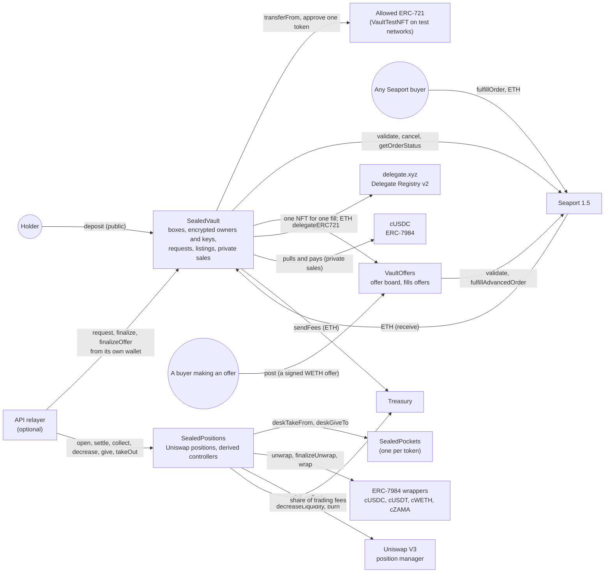
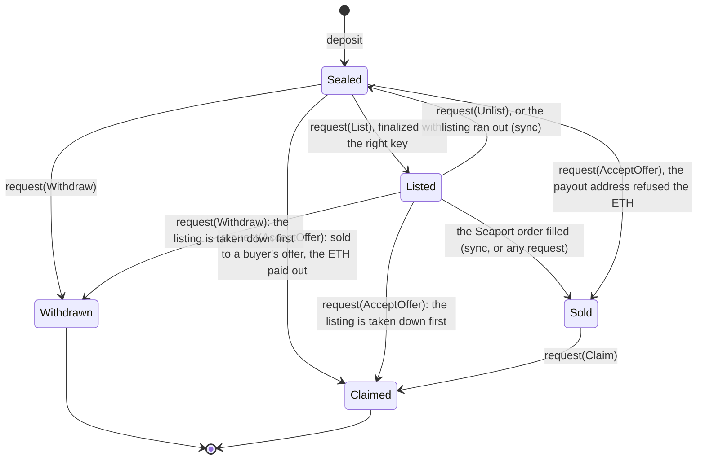
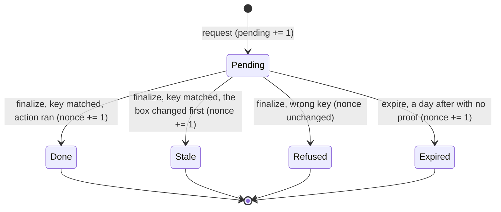
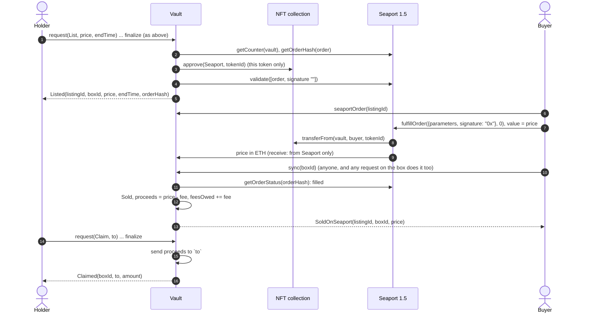
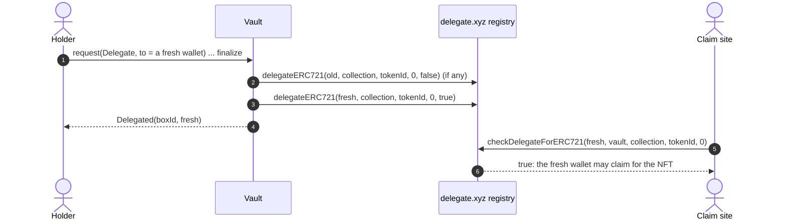
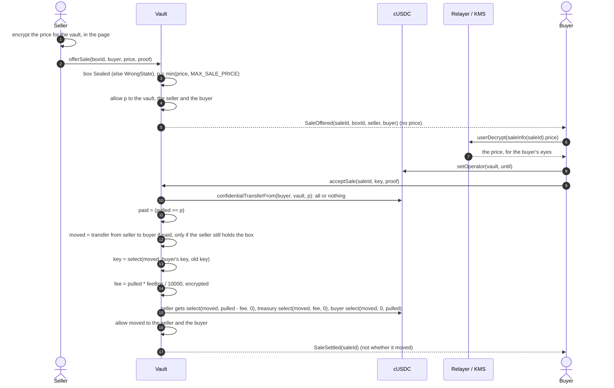
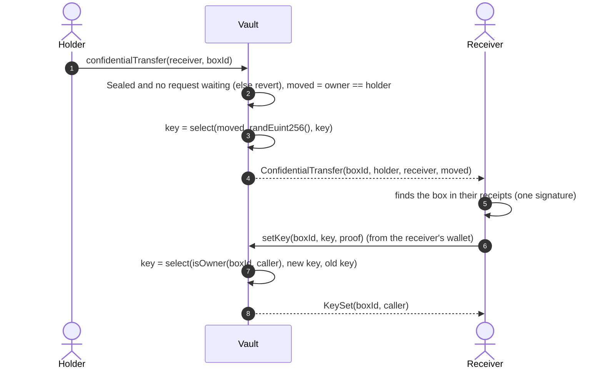
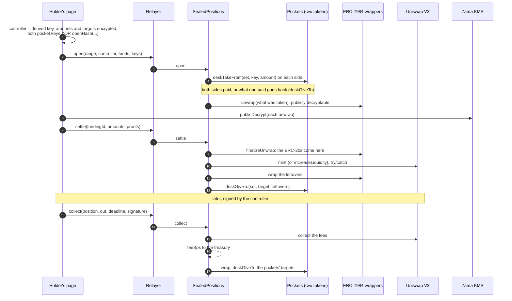
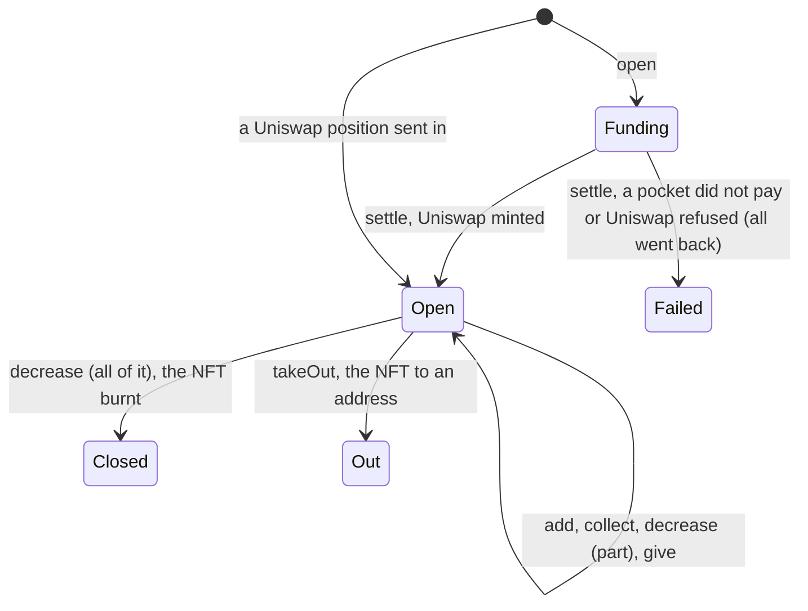

# The sealed vault

> [Open the vault](https://vault.do-not-open.app) · [Its docs](https://vault.do-not-open.app/docs) ·
> [Back to the README](../README.md#the-sealed-vault) · Next to it: [the game](GAME.md)

The sealed vault is a product next to the game, not a part of it. Any NFT of an allowed
collection goes into a box whose holder is encrypted: the box is a Confidential ERC-721 of its
own ("DO NOT OPEN Vault", `SEALED`), built on the same `ConfidentialERC721` base as the boxes of
the game. The NFT stays in the vault until the box's holder takes it out, sells it on Seaport
(OpenSea's protocol) with the vault as the seller, by a listing or by accepting a buyer's WETH
offer, or sells the box privately for an encrypted cUSDC price. Meanwhile the holder may lend
the NFT's rights (airdrops, holder-only access) to a wallet of theirs through delegate.xyz.
Tokens go in too: cUSDC in a [pocket](#pockets) locked by a key rather than an address, sent to
another pocket, used to buy a box, or taken out anywhere, without anything public saying who paid
whom or how much. And liquidity: a Uniswap V3 [position](#liquidity-positions) paid for out of
pockets, held by the vault, steered by an address tied to no wallet, its fees paid back into
pockets. The page (a switch at its top picks a side: NFTs, non-fungible, in boxes; tokens,
fungible, in "My pocket"; or LP positions; `#tokens` opens the second, `#liquidity` the third) is `vault.do-not-open.app` (`/vault` off the site's domains), and its
docs for holders, in four languages, are `vault.do-not-open.app/docs` (`apps/web/src/vault/docs`):
they follow this file, so a change here goes there too.

Every action on the page runs on a stage (`apps/web/src/vault/tx`): an animated scene for its kind
(the NFT sealed in a box among its decoys, the vault door opening, a ship sailing to Seaport, the
NFT and the ETH crossing, a badge flying to the delegate...), its steps as they come, and every
transaction it sent with its block, its gas and a link to the explorer. Addresses (the
connected wallet, a box's depositor and delegate, its collection, the vault's contract) and each
NFT link to the explorer too, and to a marketplace where one shows the chain. The header
carries the wallet's balances, read live like the game's (ETH, WETH, USDC, and cUSDC behind a
lock until its holder decrypts it), and a click on the address opens its profile: the full
address (copy, explorer), the same balances, its boxes, switch wallet and disconnect. Folded away, it sits at the
foot of the screen. It is also written to a cookie shared by the site's hosts, so the home page,
boarding and both docs show it at their foot when the visitor left the vault mid-way: the steps
that run in the browser (the decryption and the proof) stop with the page, and the next visit
settles the box's waiting requests.

The first visit plays a guided tour (`apps/web/src/vault/VaultTour.tsx`, on the spotlight the
game's depot tour uses, `apps/web/src/tour/Spotlight.tsx`): the two sides, the encrypted holders,
the wallet, then each tab in the order a newcomer uses them (the market, sealing with decoys,
one's boxes, private sales, the pocket, what leaks) and the Warden. Each tab's step opens that tab
first, so the spotlight lands on the real thing (without a wallet, on the tab itself). It shows
once per browser (`localStorage`), never over a box opened from a link, and the "?" in the
vault's bar plays it again.

The contracts are the source of truth, especially the design notes at the top of
[`SealedVault.sol`](../packages/contracts-evm/contracts/SealedVault.sol). This file explains
them, what leaks, what it costs, and why each choice was made.

**Status.** Done on the mock and in the tests (62 contract tests in `test/SealedVault.ts`,
against the real bytecode of Seaport 1.5 and of delegate.xyz's registry), and on Sepolia since
2026-10-08: `SealedVault` at `0xE22509e741233072aFF4e0c6B56d5e3De8018262` and `VaultOffers` at
`0x750d5B8E8A0f55b8E1F74bA3387B59cc8080f9E2` since 2026-10-09 (blocks 11876575 and 11876574;
owner and treasury `0x590891F269720001435004A1089cAB5b2c20029A`), its free test collection
`VaultTestNFT` at `0xf72Eb38f816B1B8Effa8B6036C0BA6A38D6d6f9b`, on OpenSea's Seaport 1.5, the
WETH OpenSea uses on Sepolia (`0x7b79995e5f793A07Bc00c21412e50Ecae098E7f9`) and delegate.xyz's
registry. Earlier deployments are left as they were: `0x27CA3698A34b53900047cD1D0856B954a695C79D`
(2026-10-09, block 11876345) took no offers and no delegation; the first,
`0x8B07846CaB181E1D010D2a9E39d7FDF60087fb18` (2026-10-08, block 11872753), took one request per
box and moved the nonce on with every request (see Decisions).

The pockets (`SealedPockets`, and `PocketDesk` that buys private sales out of them) are done on
the mock and in the tests (46 contract tests in `test/SealedPockets.ts`, 5 more running the
adapter against them), and on Sepolia: redeployed on 2026-10-10 so that they take several desks
(the positions are one) and a desk credits only what it pays in, `SealedPockets` at
`0x220635318dDe0517E835D9FdF80AFEaD52720B7C` (owner `0x590891F269720001435004A1089cAB5b2c20029A`) and
`PocketDesk` at `0xd17cB7696236B14C28f51Ef03BEBd133710e4A5f`, on the vault above and Zama's
cUSDC, and pockets of cUSDT, cWETH and cZAMA, without the vault's desk (see
[Other tokens](#other-tokens)). The first ones, from 2026-10-09 (cUSDC `0xAfEc56C76B8682A5FcDCf061fD3e703fD75Be00C`
and its desk `0x0939D713429FCD1c5AF9589b121a8F77C49F759b`, blocks 11877902 and 11877903; cUSDT, cWETH,
cZAMA blocks 11878756 to 11878758), are left as they were: `pnpm --filter @dno/chain-adapter smoke:pockets`
(open, deposit, send, withdraw, both balances read by their viewers) passed on them, with cUSDC,
cZAMA and cWETH (1 WETH of 18 decimals wrapped to 1 cWETH of 6). A redeploy on 2026-10-10 also
left a vault `0x9f11433238DaC70198085c9f8f273fdfBD777FDf` with its desk `0xdBD563Edce8BF578F6aAF744e20b342c1909efAD`
and pockets `0x37025bB7369B0D7F1845a3d81802669c6eF0Bc46` that nothing uses (the vault's script
redeployed it under another key; `KEEP_VAULT=1` now keeps the live one).

The liquidity positions (`SealedPositions`) are done on the mock and in the tests (25 contract
tests in `test/SealedPositions.ts` against Uniswap V3's own bytecode, 3 more running the adapter
against them), and on Sepolia since 2026-10-10: see [Positions on Sepolia](#positions-on-sepolia).

## Contracts

| Contract | What it is |
| --- | --- |
| `SealedVault` | The vault. `ConfidentialERC721` (encrypted owners, transfers that never revert on ownership), `ZamaEthereumConfig`, `Ownable`, `ReentrancyGuard`. 24,322 bytes deployed, 254 under the 24,576-byte limit, compiled with the default optimizer (200 runs): a new feature has to move logic out first, as accepting offers did into `VaultOffers` |
| `vault/VaultOffers.sol` | Fills the buyers' offers the vault accepts, and is the board buyers post them to. Stateless and open to anyone: the vault hands it one NFT for one call (`fill`), so an order can only ever take that NFT. `inspect` says whether an offer can still fill one token for at least a price; `post` validates a buyer's signed offer on Seaport and logs it by NFT (`OfferPosted`). 6,517 bytes |
| `vault/ISeaport.sol` | The slice of Seaport 1.5 the vault and `VaultOffers` use (`validate`, `cancel`, `getOrderHash`, `getOrderStatus`, `getCounter`, `fulfillOrder`, `fulfillAdvancedOrder`) and its structs, as Seaport defines them. Seaport 1.5 is at `0x00000000000000ADc04C56Bf30aC9d3c0aAF14dC` on Sepolia and mainnet; Seaport 1.6 is not on Sepolia |
| `vault/IDelegateRegistry.sol` | The slice of delegate.xyz's Delegate Registry v2 the vault uses (`delegateERC721`, `checkDelegateForERC721`). The registry is at `0x00000000000000447e69651d841bD8D104Bed493` on Ethereum, Sepolia and most other chains |
| `vault/IWETH.sol` | Wrapped ether (`deposit`, `withdraw`): what offers pay in |
| `mocks/TestWETH.sol` | Local networks only: WETH as WETH9 does it |
| `SealedPockets` | The pockets: one confidential token (cUSDC; cUSDT, cWETH and cZAMA in instances of their own, without the vault's desk) held under encrypted 256-bit keys, not addresses. `open`, `deposit` (from a wallet, into one pocket of a set), `send` (from one pocket of a set to one pocket of another, the key bound to the terms), `withdraw` (to any address, as cUSDC), and for desks only `deskTake`, `deskTakeFrom` (from the pocket of a set whose key matches), `deskCheck`, `deskGive` and `deskGiveTo` (into the pocket of a set an encrypted target names), both pulling what they credit from the desk's own balance. No decryption anywhere: every spend settles under encryption in one transaction. `ZamaEthereumConfig`, `Ownable` (only to add desks, never removed), `ReentrancyGuard`. 9,974 bytes |
| `SealedPositions` | The liquidity positions: Uniswap V3 positions funded out of two tokens' pockets (a desk of each), held here, steered by a controller's EIP-712 signature, paying fees and liquidity back into pockets. `open`, `add`, `settle` (the unwraps' proofs, then the mint), `collect`, `decrease`, `give`, `takeOut`, and Uniswap positions sent in. `ZamaEthereumConfig`, `Ownable` (tokens, fee, treasury), `ReentrancyGuard`, `EIP712`. 20,982 bytes |
| `vault/IPositionManager.sol`, `vault/IConfidentialWrapper.sol` | The slice of Uniswap V3's NonfungiblePositionManager the positions use (`mint`, `increaseLiquidity`, `decreaseLiquidity`, `collect`, `burn`, `positions`), and of an ERC-7984 wrapper (`unwrap`, `finalizeUnwrap`, `unwrapRequester`, `wrap` without its return value, as older wrappers have none) |
| `mocks/TestERC20.sol`, `mocks/TestConfidentialToken.sol` | Local networks only: an ERC-20 of any decimals, free to mint, and OpenZeppelin's wrapper over it, as Zama's test tokens on Sepolia |
| `vault/PocketDesk.sol` | Buys the vault's private sales out of pockets. A seller offers a box to the desk and `reserve`s the sale for a pocket; its holder `ask`s (the key and the balance checked under encryption, one bit made public), then `buy`s with the proof: the desk takes the price from the pocket, accepts the sale on the vault, and hands back any refund. The box stays with the desk, its vault key the buyer's. Holds tokens only during `buy`, never sells |
| `mocks/VaultTestNFT.sol` | Test networks only: "Sealed Vault Test NFT" (`VTEST`), free to mint for anyone, its picture an SVG drawn on-chain from its id, so a marketplace shows something |



`SealedVault` has no link to `DoNotOpen`, the Pantry or any other contract of the game: it only
shares the base contract and the cUSDC. `SealedPositions` has no link to `SealedVault` either:
it shares its pockets and its relayer. `VaultOffers` knows nothing of the vault either: it
sells whatever NFT its caller hands it.

## A box and its key

Each box stores, in public, the NFT it holds (`collection`, `tokenId`), its state, its listing,
how many requests wait on it, the ETH a Seaport sale left in it, a request nonce, and its
delegate in delegate.xyz. Two things are
encrypted: its owner (an `eaddress`, as in every `ConfidentialERC721`) and its **key**, a
256-bit secret (`euint256`) its holder picks. Only the vault is allowed on the key
(`allowThis`): nobody can decrypt it, the holder included. It is only ever compared.



A box moves (transfer, private sale) only while `Sealed` and no request waits on it. `Withdrawn` and
`Claimed` are final: a box id is never reused, and an NFT taken out and put back gets a new box.

**What the app uses as the key.** `EvmVault` never stores a key. The wallet signs one fixed
message once a session, `vaultKeyMessage(vault, chainId)` (EIP-191, free); the secret is the
keccak256 of that signature, and the key of the box holding `tokenId` of `collection` is
`keccak256(abi.encode(secret, collection, tokenId))`. The same wallet makes the same keys on any
device. Anyone who gets that signature can take the wallet's NFTs out: the message says so, and
says to sign it only on DO NOT OPEN.

**Binding a key to a request.** The key is never sent as is. For a request, the holder encrypts
`key XOR requestHash(boxId, nonce, action, to, price, endTime, ref)`, where

```
requestHash = keccak256(abi.encode(block.chainid, vault, boxId, nonce, action, to, price, endTime, ref))
```

and `ref` is the Seaport order hash of the offer an `AcceptOffer` names (zero otherwise),

`nonce` is how many requests on the box matched its key: `finalize` moves it on when the key
matched (the request `Done` or `Stale`), and `expire` does too; a wrong key leaves it where it
was. The vault computes the same hash from the terms it was actually given and compares
`input XOR hash` with the stored key, under encryption. A relayer that changed a term (the
recipient, say) makes the vault compare against another hash: the key does not match and the
request settles `Refused`. One that sends a used input again, once its request settled, finds
the nonce moved on: `Refused` too. One that sends it twice while the first still waits places
the holder's own request twice; the second finds the box changed (withdrawn, listed, sealed
again or claimed) and settles `Stale`. And a stranger's wrong key never moves the nonce, so it spoils no input the holder
already prepared. An encrypted input is bound to the address that sends it, so the page encrypts it for
the relayer's address when the relayer sends (`inputUser` in `EvmVault`), and for the wallet's
otherwise.

**A box that changes hands gets a random key.** `_transfer` (every transfer, decoys included,
and a private sale) sets the key to `select(moved, randEuint256(), key)`: a box that moved has a
key nobody knows, so the previous holder can no longer act on it; a transfer that moved nothing
keeps the key. The new holder sets theirs with `setKey(boxId, key, proof)` ("Make the key mine"
in the page, `adopt` in the adapter), a "maybe" like a transfer: `select(isOwner(caller), new,
old)`, so a stranger's `setKey` changes nothing and looks the same. A private sale sets the
buyer's key in the same transaction.

## Flows

Participants: **Holder** (the box's holder, and their page), **Relayer** (the API's vault
relayer, when there is one; otherwise the holder's wallet sends), **Vault** (`SealedVault`),
**Relayer / KMS** (Zama's), **Seaport**, **cUSDC**.

### Deposit

```mermaid
sequenceDiagram
  autonumber
  actor H as Holder
  participant N as NFT collection
  participant V as Vault
  H->>H: key = keccak256(secret, collection, tokenId), encrypted for the vault
  H->>N: approve(vault, tokenId)
  H->>H: decoys: up to 5 fresh random addresses, really = false for each, encrypted with the key
  H->>V: deposit(collection, tokenId, key, to[], really[], proof)
  V->>V: allowedCollection[collection], else CollectionNotAllowed; to and really pair up, 5 at most, else BadSends
  V->>N: transferFrom(holder, vault, tokenId)
  V->>V: mint box: owner = holder (moved = true), key stored, allowThis only
  V-->>H: Deposited(boxId, collection, tokenId, depositor), ConfidentialTransfer(boxId, 0x0, holder, moved)
  loop each of to[]
    V->>V: _transfer(holder, to[i], boxId, really[i]): moves only if really and the holder still holds it
    V-->>H: ConfidentialTransfer(boxId, holder, to[i], moved)
  end
```

The deposit is public: it is a plain NFT transfer, and `Deposited` names the depositor. What
happens to the box next is not, and it can start in the same transaction: `deposit` sends the
new box on to each of `to`, for real only where the encrypted `really` is true. The page lets
the holder pick how many decoys, 0 to 5, three by default (`decoys` in the adapter, `decoySends`): fresh random addresses nobody
holds a key of, `really` false for each, so the depositor keeps the box, but to anyone else each
transfer is a "maybe" and the depositor is no longer its obvious holder. One of them may be real
(a gift, or the holder's own fresh wallet): the box then moves and gets a random key, as on any
transfer, and its receiver sets theirs with `setKey`. Each send costs a transfer's gas and HCU
(Cost, below). The holder finds their boxes the way a player finds theirs:
by replaying their own `ConfidentialTransfer` receipts and user-decrypting the "moved" bits
(`myBoxes`, one signature), see [HIDDEN_OWNERS.md](HIDDEN_OWNERS.md#finding-your-boxes).

### A request: take out, list, take down, collect, accept an offer, delegate

Everything that leaves the vault is asked with the key, never with the caller's address, in
two steps like every reveal in this repository: `request`, a public decryption of one bit ("the
key matched"), then `finalize` with the KMS proof, which anyone may send.

```mermaid
sequenceDiagram
  autonumber
  actor H as Holder
  participant Rl as Relayer (API)
  participant V as Vault
  participant R as Relayer / KMS
  H->>V: boxInfo(boxId).nonce, requestHash(boxId, nonce, action, to, price, endTime, ref)
  H->>H: encrypt key XOR hash, for the vault and the relayer's address
  H->>Rl: POST /v1/vault/relay {call: "request", args}
  Rl->>V: request(boxId, action, to, price, endTime, ref, boundKey, proof) (gas estimated first)
  V->>V: sync, state allows the action, price and end time sane (else revert); other waiting requests do not matter
  V->>V: ok = (boundKey XOR requestHash(terms, nonce)) == key, publicly decryptable
  V->>V: pending += 1, placedAt = now
  V-->>H: RequestPlaced(requestId, boxId, action, relayer)
  H->>R: publicDecrypt(requestInfo(requestId).ok)
  R-->>H: ok + KMS proof
  H->>Rl: POST /v1/vault/relay {call: "finalize", args}
  Rl->>V: finalize(requestId, ok, proof) (anyone may; finalizeOffer for an offer, below)
  V->>V: checkSignatures on the stored handle, sync
  alt not ok
    V->>V: Refused: nothing happens
  else ok, but the box changed first (sold, expired, listed)
    V->>V: Stale: nothing happens
  else ok
    V->>V: run the action (below), Done
  end
  V->>V: pending -= 1 (only now: the box cannot move while the action runs), if ok: nonce += 1
  V-->>H: RequestSettled(requestId, status)
```

| Action | Allowed in | `to` | What runs on `Done` |
| --- | --- | --- | --- |
| `Withdraw` | `Sealed`, `Listed` | where the NFT goes, not zero | A listed box is taken down first; then `Withdrawn`, the NFT sent with `transferFrom`, `Withdrawn(boxId, to)` |
| `List` | `Sealed` | unused | A Seaport order is validated (below), `Listed` |
| `Unlist` | `Listed` | unused | `seaport.cancel`, the approval cleared, `Sealed`, `Unlisted` |
| `Claim` | `Sold` | where the ETH goes, not zero | `Claimed`, the proceeds sent, `Claimed(boxId, to, amount)`. If the send fails (a contract that refuses ETH), the request settles `Stale` and the ETH stays in the box |
| `AcceptOffer` | `Sealed`, `Listed` | where the ETH goes, not zero; `price` is the least WETH the offer must net, `ref` its order hash | Only through `finalizeOffer`, with the order: see [Accepting an offer](#accepting-an-offer) |
| `Delegate` | `Sealed`, `Listed` | the delegate, or zero to clear it | The old delegate revoked and the new one named in delegate.xyz's registry, `Delegated(boxId, delegate)`: see [Delegation](#delegation) |

`request` reverts only on what is public: `NotABox`, `WrongState`, `BadPrice` (a listing's price,
or an offer's least price or order hash, zero), `BadEndTime` (a listing ends after now and
within 180 days), `ZeroAddress`. A wrong key is never a revert, and
neither is another request waiting on the box: requests do not lock each other out, each is
decided on its own at `finalize`, and one that can no longer run settles `Stale` (two of the
holder's own withdrawals at once: the first runs, the second finds the box `Withdrawn`). Without a relayer the page sends both transactions from the wallet, whose address then
shows on the request. In the adapter a `Refused` request throws `not-yours` and a `Stale` one
`missed`.

**No box stays stuck.** While any request waits (`pending > 0`), the box cannot move: a request
decided for one holder must never run for the next. Anyone may `finalize` a request as soon as
the KMS answers, and the page does it for every waiting request of a box before it sends the
box or accepts a private sale for it (`settlePending` in `EvmVault`, through the relayer when
there is one). A request whose proof never comes (the gateway down, say) can be settled by
anyone with `expire(requestId)` once `REQUEST_TIMEOUT` (one day) has passed since it was placed:
it settles `Expired`, runs nothing, and moves the nonce on, so its input cannot be sent again
later.



### Seaport: list, fill, sync, collect

The listing is a real Seaport order whose offerer is the vault itself. An offerer's own orders
need no signature once it validates them on-chain (`Seaport.validate`), so the vault never
signs anything and implements no ERC-1271: the only orders Seaport can fill on its NFTs are the
ones it validated.



The order is one ERC-721 offered against `price` wei paid to the vault (`NATIVE`), `FULL_OPEN`,
no zone, no conduit, from the block of the listing to `endTime`, salt
`keccak256(vault, listingId)`. `seaportOrder(listingId)` returns its parameters exactly as a
buyer passes them to `fulfillOrder`. Seaport does not call the vault back (no zone), so the
vault learns of a sale when someone calls `sync` or sends a request on the box; `buy` in the
adapter calls `sync` right after filling. A listing that ran out without a buyer goes back to
`Sealed` at the next `sync` (`ListingExpired`), and its approval is cleared. A listed box
cannot move, cannot be sold privately, and a withdrawal takes its listing down first. A
withdrawal beaten by a Seaport buyer settles `Stale`, and the ETH waits for the key.

The fee (`feeBps`, 2.5% by default, never more than `MAX_FEE_BPS`, 10%) is taken at `sync`, at
the rate of that moment, and kept in `feesOwed`; `sendFees` (anyone) sends it to the treasury.

### Accepting an offer

A buyer offers WETH for a box's NFT the way they would on any marketplace: a Seaport order whose
offer is WETH and whose consideration is the NFT (to the buyer) and, if any, the order's own
fees in WETH. The holder accepts it with a request like any other; the vault fills it with the
vault as the fulfiller, through `VaultOffers`, and the ETH goes straight to the address the
holder named.

```mermaid
sequenceDiagram
  autonumber
  actor B as Buyer
  participant W as WETH
  participant O as VaultOffers
  participant S as Seaport 1.5
  actor H as Holder
  participant V as Vault
  participant N as NFT collection
  B->>W: deposit (wrap ETH), approve(Seaport, amount)
  B->>B: sign the Seaport order (EIP-712): offer WETH, consideration the NFT
  B->>O: post(order, signature) (anyone may send it)
  O->>S: validate([order, signature]): fills with no signature from now on
  O-->>H: OfferPosted(collection, tokenId or ANY_TOKEN, orderHash, order)
  H->>O: inspect(offer, collection, tokenId, 0): alive, and what it nets
  H->>V: request(AcceptOffer, to, least = net, ref = orderHash) ... publicDecrypt (as above)
  H->>V: finalizeOffer(requestId, ok, proof, abi.encode(order, criteriaProof))
  V->>O: inspect(offer, collection, tokenId, least): orderHash must be ref (else WrongOrder)
  alt not ok
    V->>V: Refused
  else the order is dead: cancelled, filled, ended, or worth less than least
    V->>V: Stale: the box stays
  else
    V->>V: a listed box is taken down first
    V->>N: transferFrom(vault, VaultOffers, tokenId)
    V->>O: fill(offer, collection, tokenId)
    O->>S: fulfillAdvancedOrder(order, 1/units, resolver to tokenId, recipient VaultOffers)
    S->>W: WETH from the buyer to VaultOffers
    S->>N: the NFT from VaultOffers to the buyer
    S->>W: the order's fees from VaultOffers
    O->>W: withdraw (unwrap)
    O->>V: ETH (receive: from Seaport or VaultOffers only)
    V->>V: at least least, else revert; proceeds = amount - fee, feesOwed += fee, delegate cleared
    V-->>H: OfferAccepted(boxId, orderHash, buyer, amount)
    V->>V: send proceeds to `to`: Claimed; if it refuses ETH, the box stays Sold for a Claim
  end
```

- **Only the box's NFT can go.** The vault hands `VaultOffers` the one NFT for the one call; it
  holds nothing else, so an order that asked for another box's NFT (even a listed one Seaport is
  approved for) cannot take it. `inspect` also turns away anything but WETH paid, WETH fees and
  that NFT, with fixed amounts and no tips. An offer on any NFT of a collection (an item "with
  criteria", root 0) is resolved by `VaultOffers` to the box's own token.
- **One token's share.** An offer for several NFTs (`units`) is filled for one: `VaultOffers`
  sets the fraction to 1/units. What the request's `price` must cover is one share, net of the
  order's own fees: `(paid - fees) / units`.
- **Dead or not yet.** An order that is cancelled, filled, ended or worth less than asked will
  never fill: `finalizeOffer` settles `Stale`. One that only cannot fill now (the buyer's WETH or
  allowance short, the order not yet validated) reverts and leaves the request waiting: someone
  who finalizes with bad data cannot spoil it. It fills on a later try, or anyone expires it
  after a day. Plain `finalize` settles a wrong key `Refused` without the order, and reverts with
  `NeedsOrder` when the key matched.
- **The offer board.** Buyers post their offers to `VaultOffers.post`, which validates them on
  Seaport with the buyer's signature and logs them by NFT, so the page finds the offers on a box
  without a marketplace's API. Any signed Seaport 1.5 offer for an NFT of an allowed collection
  can be posted there, from any marketplace or script. An offer the vault accepts does not have
  to be on the board: the holder can name any Seaport 1.5 order that fits.

### Delegation

The vault owns every NFT it holds, so it is the vault that delegate.xyz's registry is asked
about. A `Delegate` request names one wallet per box (`delegateERC721(delegate, collection,
tokenId, rights 0, true)`, every right), revoking the one before; zero clears it. Airdrop claims,
token gates and claim sites that read the registry let that wallet act for the NFT without
holding it.



The delegate is public (`boxInfo`, `Delegated`, the registry): a fresh wallet keeps the holder
unlinked, their main wallet would not. A box keeps its delegate when it changes hands, since
whether a transfer moved it is secret and anyone may send a transfer that moves nothing: its new
holder names their own (the page shows the box's delegate). Taking the NFT out, a Seaport sale
and an accepted offer clear it. The game's own collection is not concerned: only the vault's
boxes are.

### Private sale

The holder names a buyer and an encrypted cUSDC price only the two of them can read. Nothing is
decrypted in public: to everyone else, a sale that went through and one that did not look the
same.



Anyone may offer any box: unless the caller holds it when the buyer accepts, nothing moves and
the buyer gets their cUSDC back, so an offer proves nothing about who holds the box. The seller
may `cancelSale` while it is open; only the named buyer may accept, once. A box offered to two
buyers moves to the first who accepts; the second's acceptance moves nothing and refunds them.
`acceptSale` reverts (and so takes nothing) when the box is listed or a request waits on it (the
page settles those first). The price is capped
at `MAX_SALE_PRICE` (1,000,000 USDC) under encryption, so `pulled * MAX_FEE_BPS` stays under
2^64 and the encrypted fee cannot wrap. In the adapter: `offerSale`, `sales`, `salePrices` (one
user decryption), `acceptSale` (returns whether it moved, decrypted for the buyer), `cancelSale`.

### Give a box, and make its key yours



Until the receiver sets their key, nobody can take the NFT out, list it or collect anything: the
key is random. `confidentialTransferIf` (the holder's own decoys) works on vault boxes as on the
game's boxes. In the adapter: `send`, `adopt`.

## Pockets

The vault holds tokens too. An ERC-7984 token like cUSDC hides balances and amounts, but every
transfer still names its sender and its receiver: the graph of who pays whom stays public. A
pocket hides that as well. It is a number with an encrypted 256-bit key, an encrypted `euint64`
balance and a `viewer`, an address the holder's page derives to read the balance; the holder's
wallet appears in none of it. The design notes at the top of
[`SealedPockets.sol`](../packages/contracts-evm/contracts/SealedPockets.sol) and
[`PocketDesk.sol`](../packages/contracts-evm/contracts/vault/PocketDesk.sol) are the reference.

**One signature.** The page asks the wallet to sign a fixed message (`pocketKeyMessage` in
`EvmPockets.ts`), free and off-chain. `keccak256(signature, "key")` is the pocket's key,
`keccak256(signature, "viewer")` the private key of its viewer, a wallet that only ever signs
decryption permits and never a transaction. Nothing is stored: `pocketOf(viewer)` finds the
pocket again on any device. A wallet has one pocket per token (see [Other tokens](#other-tokens)).

**Sets, not pockets.** Every action names a set of pockets (`MAX_SET`, 5 at most, in increasing
order, all opened): the real one and decoys the page picks at random among the pockets that
exist. A deposit credits the pocket of its set whose number equals an encrypted target; a send
debits the pocket of its paying set whose key matches and credits the pocket of its receiving
set whose number matches; a withdrawal debits the matching pocket and pays the amount out. Every
pocket named gets a new balance handle, moved or not, so nobody can tell which one moved.

**The key bound to the terms.** A spend sends the amount and the target in one encrypted input,
then the key XOR `spendHash(action, from, to, destination, amount handle, target handle)` in a
second one (its terms hash the first one's handles, so it is encrypted after them). A relayer
that changed a set, the destination or an encrypted value would make the pockets compare against
another hash: the key would not match and nothing would move. Each bound key's handle can be used
once (`spent`), so a spend cannot be replayed. A wrong key, a short balance or a target outside
the receiving set move nothing, without a revert.

**No decryption.** Unlike the boxes' requests, a spend never needs a public decryption: what it
moves is decided and applied under encryption in the same transaction, and a withdrawal pays out
an encrypted amount (`confidentialTransfer`). Pockets do not wait for Zama's gateway.

### Flows

```mermaid
sequenceDiagram
  actor W as Holder's wallet
  participant P as Page
  participant R as Relayer
  participant S as SealedPockets
  participant C as cUSDC
  W->>P: sign the pocket message (once)
  P->>P: key, viewer from the signature
  P->>R: open(key encrypted, viewer)
  R->>S: open
  W->>S: deposit([decoys + mine], target, amount) (setOperator first)
  S->>C: confidentialTransferFrom(wallet, pockets, amount)
  S->>S: credit select(target == id) to each pocket of the set; refund what found no pocket
  P->>R: send(from set, to set, amount + target, key XOR spendHash)
  R->>S: send
  S->>S: debit select(key matches and balance covers and target in set); credit the target
  P->>R: withdraw(from set, to, amount, key XOR spendHash)
  R->>S: withdraw
  S->>C: confidentialTransfer(to, what was debited)
  P->>P: the viewer decrypts the balance (user decryption)
```

```mermaid
sequenceDiagram
  actor Seller
  participant V as SealedVault
  participant D as PocketDesk
  participant P as Buyer's page
  participant K as Zama relayer + KMS
  participant S as SealedPockets
  Seller->>V: offerSale(box, desk, price)
  Seller->>D: reserve(saleId, pocket) (the pocket's viewer may read the price)
  P->>D: ask(saleId, key XOR buyHash(sale, pocket, box key handle))
  D->>S: deskCheck: key matches and balance covers price (one bit, public)
  P->>K: publicDecrypt(ok)
  P->>D: buy(askId, proof, box key for the vault)
  D->>S: deskTake(pocket, key, price): price or 0 to the desk
  D->>V: acceptSale(saleId, box key): pulls the price from the desk, all or nothing
  V-->>D: the box, if paid and the seller still held it; or a refund
  D->>S: deskGive(pocket, what came back)
```

### With the vault's boxes

**Paying from a pocket.** A seller offers a box privately to the desk and reserves the sale for
the buyer's pocket (its code, `P-12` on the page); the desk lets that pocket's viewer read the
price. The buyer asks first: the desk checks the key and the balance under encryption and makes
only that bit public. Without that step a stranger could spend the seller's sale with a wrong
key, since the vault settles a sale on its first `acceptSale`, paid or not. With the proof, `buy`
takes the price from the pocket (or nothing, if the balance moved since), lets the vault pull it
from the desk (all or nothing, so a pocket that paid nothing buys nothing), and hands back
whatever the vault refunded. The desk never holds tokens outside `buy` and never sells, so the
vault can never pull anything but the price just taken. The box is then held by the desk, a
holder every pocket shares, with the buyer's vault key (the same key the page derives for any of
the wallet's boxes): taking the NFT out, listing it, accepting an offer, claiming a sale's ETH and
delegating work as for any box. Giving it away or selling it privately need its holder's address,
here the desk's, so they are not offered for those boxes. `ownerOf(box)` on the desk (encrypted,
readable by the buyers' viewers) tells the page which bought boxes are its pocket's.

**Cashing in.** After a private sale, the seller's page offers "Into my pocket": a deposit of the
price, less the fee, from the seller's cUSDC. The deposit names the seller's wallet, as any
deposit does.

### What is public

| Fact | Visible to everyone |
| --- | --- |
| A pocket | its number and its viewer (an address tied to no wallet), when it was opened, by which sender |
| A deposit | the wallet, and the set of pockets it named; not the amount when it comes from cUSDC, nor which pocket got it |
| A send | the paying set and the receiving set, the sender (the relayer); not who paid whom, nor how much |
| A withdrawal | the paying set, the address paid; not the amount, nor which pocket paid |
| A purchase from a pocket | the sale, its seller, the pocket it is reserved for, the ask's yes or no; not the price, nor whether the box moved |

Never public: a pocket's balance, an amount, which pocket of a set moved, who holds a pocket.

In practice: the sets are public, so few decoys, or the same pockets named again and again, give
hints, and a pocket's sets can be followed over time; the more pockets exist, the better each one
hides. A deposit from plain USDC shows the amount when it is shielded; a withdrawal to a known
address names its receiver. The reserved pocket of a desk sale is public (the seller chose it):
that pocket tried to buy that box.

### Other tokens

The pockets hold Zama's other confidential tokens too: cUSDT, cWETH and cZAMA, the ERC-7984
wrappers listed in Zama's Confidential Token Wrappers Registry
(`0x2f0750Bbb0A246059d80e94c454586a7F27a128e` on Sepolia), all with 6 decimals, their test
ERC-20s free for anyone to mint. Each has its own `SealedPockets`, the same contract unchanged,
deployed by `deploy/pockets.ts` from `lib/pocketTokens.ts` as `SealedPockets_<symbol>`, without a
desk: the vault's private sales settle in cUSDC, so only cUSDC pockets buy boxes.

| Token | Its pockets on Sepolia | The token | Its ERC-20 |
| --- | --- | --- | --- |
| cUSDC | `0xAfEc56C76B8682A5FcDCf061fD3e703fD75Be00C` (with `PocketDesk`) | `0x7c5BF43B851c1dff1a4feE8dB225b87f2C223639` | USDC (6 decimals) |
| cUSDT | `0x56ea8016aE3a392E7E1bdf0c7C457a3786047aAe` | `0x4E7B06D78965594eB5EF5414c357ca21E1554491` | USDT `0xa7dA08FafDC9097Cc0E7D4f113A61e31d7e8e9b0` (6) |
| cWETH | `0x4e8A23DfD7a23677b023E069CB8D3A94993b1350` | `0x46208622DA27d91db4f0393733C8BA082ed83158` | Zama's WETHMock `0xff54739b16576FA5402F211D0b938469Ab9A5f3F` (18, rate 10^12), not OpenSea's WETH the offers pay in |
| cZAMA | `0x6D1585c58238DaADF748558051BF368DAA3eceE2` | `0xf2D628d2598aF4eAF94CB76a437Ff86CA78FfbFB` | ZAMA `0x75355a85c6FB9df5f0C80FF54e8747EEe9a0BF57` (18, rate 10^12) |

**Still one signature.** The same message (it names the cUSDC pockets) makes every token's
pocket. cUSDC keeps `keccak256(signature, "key")` and `"viewer"`; another token's pocket uses
`keccak256(signature, "key:" + its pockets' address, lowercase)` and `"viewer:" + address`. Each
pocket has its own viewer, so nothing on-chain ties a wallet's pockets of different tokens
together; switching tokens on the page asks nothing more.

**On the page.** A token picker, each with its logo, above "My pocket"; the pouch, the balance,
the amounts and every action's scene wear the picked token's logo. On a test network, "Get test
…" mints the ERC-20 and "Turn … into …" wraps it before the deposit.

**What it adds to what leaks.** Which token an action moves is public (each token's pockets are
their own contract), and decoys are picked only among the same token's pockets: a token few
people use hides its pockets among fewer.

### Pockets' decisions

- **A key, as for the boxes, and a viewer apart.** The balance must be readable by its holder,
  and ACL grants are public: allowing the wallet on its pocket's handles would name it. The
  viewer, derived from the same signature, is allowed instead; it holds no ETH and signs only
  decryption permits.
- **Sets and an encrypted target, not one pocket.** Naming one pocket per side would make every
  send a public edge between two pseudonyms. A set of five with the real one hidden costs a few
  more encrypted operations per pocket (6.5M HCU for five on each side, under the 20M limit).
- **A spent-handle list, not a nonce.** A nonce would have to move only when the key matched,
  which is encrypted here (the boxes make that bit public; a spend does not decrypt anything).
  A bound key's handle can be used once instead: a fresh encryption gives a fresh handle, and
  only the key's holder can make one that matches.
- **The desk asks first.** The vault's `acceptSale` settles a sale on its first call, paid or
  not; letting anyone call `buy` straight away would let a stranger spend a seller's sale with a
  wrong key. The one public bit costs a decryption, as the boxes' requests do.
- **The desk, not the pockets, buys.** The vault pulls a sale's price from its buyer's whole
  balance; the pockets' contract holds everyone's tokens, so a short pocket would have been paid
  for by the others. The desk holds only what `buy` just took.
- **No change to `SealedVault`.** It is 254 bytes under the size limit; the desk works with the
  vault as it is deployed.
- **One contract per token, not one for all.** One contract holding every token would share the
  decoys but would show which token moved anyway, unless every action touched every token (the
  HCU multiplied by the number of tokens). The same `SealedPockets`, deployed again, needed no
  new code and no new audit surface.
- **A viewer's permit names the vault's contracts only.** Zama's relayer takes 10 contracts per
  decryption permit; the wallet's permit already names nine. A pocket's viewer reads only its
  pocket, the desk and the vault's sale prices, so its permit names the vault, the pockets (every
  token's) and the desk.

### Pockets' limits

- One token per pockets contract (cUSDC, cUSDT, cWETH, cZAMA on Sepolia), one pocket per wallet
  and token, five pockets a side at most; only cUSDC pockets buy boxes.
- A box bought from a pocket cannot be given or sold privately again (its holder is the desk).
- A purchase needs a public decryption, so it waits for Zama's gateway like the boxes' requests;
  deposits, sends and withdrawals do not.
- The pocket key comes from one signature of a fixed message: a site that tricks a wallet into
  signing it can spend that wallet's pocket.
- Not audited. A purchase from a pocket has not run on Sepolia yet: it waits for the gateway like
  the boxes' requests.

## Liquidity positions

The vault's third side: Uniswap V3 liquidity nobody can tie to a wallet. On Uniswap a position is
an NFT in its provider's wallet: its range, its capital, its fees and every move it makes are
read off that wallet, copied by bots and tied to everything else the wallet holds. Here a position
is paid for out of pockets, held by `SealedPositions`, steered by an address the holder's page
derives and nobody can tie to the wallet, and it pays its fees and its liquidity back into
pockets. What the position does on Uniswap stays public, as any position's does; whose it is does
not. The design notes at the top of
[`SealedPositions.sol`](../packages/contracts-evm/contracts/SealedPositions.sol) are the
reference.

**Funded out of pockets.** `open` names the pool and range, a fresh controller (below), and a
set of pockets on each side (the real one among decoys) with the encrypted amounts (in the
pockets' units) and the encrypted pocket of each set that gets the leftovers back, in one input;
then each side's pocket key XOR `openHash(...)`, the hash of every term, in a second one (`add`
does the same for more liquidity, bound to `addHash(positionId, ...)`). `SealedPositions` is a
desk of every token's pockets: `deskTakeFrom` takes the amount from the pocket of the set whose
key matches. Both sides are taken or neither: when one side's pocket did not pay what was asked
(a wrong key, a short balance), the other side's tokens go straight back, under encryption, and
the funding unwraps nothing. A relayer cannot change a term (the keys would not match) nor send
the inputs twice (each bound key's handle is spent once).

**Unwrapped for Uniswap, then minted.** Uniswap needs plain ERC-20s, so what was taken is
unwrapped (`unwrap` on the token's ERC-7984 wrapper), and its amount becomes public, as every
position's amounts are on Uniswap. The unwrap waits for Zama's public decryption: `settle`
(anyone may send it, with the KMS's proof of each side) finalizes both unwraps, mints the
position (or adds to it), and wraps what Uniswap did not take back into the pockets the encrypted
targets name. When Uniswap refuses (the price moved past the slippage limits, or the deadline
passed), everything goes back the same way: `settle` never reverts on Uniswap's account, so no
funding is ever stuck. Someone who finalized an unwrap on the token first changes nothing: the
ERC-20s came here anyway, and `settle` checks the proof itself.

**Steered by a derived controller.** Each position has a controller, an address whose key the
page derives from the pockets' one signature: `keccak256(signature, "position:<contract>:open:<n>")`
for the `n`-th position the wallet opened, `...:receive:<n>` for the `n`-th it was given.
Nothing is stored: the page walks both lists (`controllerUsed`, `positionOf`) and finds the
wallet's positions on any device, and since each position has its own controller, nothing ties
two positions of one wallet together. The controller never holds ETH nor sends a transaction: it
signs (EIP-712, `actDigest`: the position, the action, the action's terms, a nonce and a
deadline), and the relayer sends.

**Why a signature here, and not a key compared under encryption.** The boxes' keys are compared
under encryption because whether a box moved must stay secret. A position's actions are public
anyway (a collect, a withdrawal, a take-out happen on Uniswap for all to see): a public bit
decrypted by the KMS would say as much as a signature checked in the clear, minutes later. So
the controller signs, the check costs a few thousand gas, and only funding waits for Zama's
gateway (because of the unwrap).

**Fees and liquidity back into pockets.** `collect` and `decrease` name a set of pockets per
token and an encrypted target in each (`Out`); the ERC-20s are wrapped again and credited to the
target's pocket under encryption (`deskGiveTo`), the others in the set get new handles for the
same balance. `feeBps` of the trading fees (5% on Sepolia, at most 10%) goes to the treasury in
the clear, as Uniswap's amounts are; never a share of the liquidity: `decrease` collects the fees
first (that share taken), then takes the liquidity out. Taking all of it out burns the Uniswap
NFT and closes the position. `give` hands the position to another holder's receive address;
`takeOut` sends the Uniswap NFT to any address, out of the vault. A wallet's own Uniswap position
comes in with `safeTransferFrom(wallet, SealedPositions, tokenId, abi.encode(controller))`.





### Positions on Sepolia

Live since 2026-10-10: `SealedPositions` at `0x118081c2Cf2719cBe624a818C2ae50961A92aC53` (owner and
treasury `0x590891F269720001435004A1089cAB5b2c20029A`, 5% of the trading fees), on Uniswap V3's
Sepolia deployment (position manager `0x1238536071E1c677A632429e3655c799b22cDA52`, factory
`0x0227628f3F023bb0B980b67D528571c95c6DaC1c`, SwapRouter02 `0x3bFA4769FB09eefC5a80d6E87c3B9C650f7Ae48E`),
a desk of the four tokens' pockets. Uniswap's own pools of Zama's test ERC-20s did not exist; the
deploy opened them, each seeded with a full-range position of the deployer's at a made-up price:

| Pool | Fee | Opened at | Address |
| --- | --- | --- | --- |
| WETH / USDC (cWETH, cUSDC) | 0.3% | 2,500 USDC a WETH | `0x061917a4Aa293bC74fE8d9c5341FE7b5E4275285` |
| ZAMA / USDC (cZAMA, cUSDC) | 1% | 0.05 USDC a ZAMA | `0x821E98fAfDB88C16F558A2DC6f45E9A74Dd76D78` |
| USDT / USDC (cUSDT, cUSDC) | 0.05% | 1 | not opened yet: the deployer ran out of test ETH; the next `--tags Positions` opens it |

On the page, "Make it trade (test)" mints a slice of the pool's token from the connected wallet,
sells it and buys it back through SwapRouter02, so the positions in range earn fees to collect.
`pnpm --filter @dno/chain-adapter smoke:positions` fills the deployer's cUSDC and cWETH pockets,
opens a position in WETH/USDC, finds it again from the signature, makes the pool trade, collects
and closes it; it waits for Zama's gateway (the unwraps) and has not run on Sepolia yet.

### On the page

A third side, "LP positions", next to NFTs and tokens (`#liquidity`, `apps/web/src/vault/VaultLiquidity.tsx`):

- **Pools**: each pool the pockets' tokens trade in, its price, the positions the vault holds in
  it and what they hold; every position in the vault, public as on Uniswap, its holder a cipher;
  and the form that opens one: a range (±5%, ±15%, ±50% around today's price, or the full range,
  drawn as a bar with today's price on it), one amount and the other one it needs at today's
  price (`pairedAmount`, rounded up: the rest comes back), the decoys on each side.
- **My positions**: found from the pockets' signature (none in the demo), each with its range, what
  it holds now, the fees to collect (Uniswap's own count, a static `collect` from the contract's
  address), and its actions: collect the fees, add, take 25%, 50% or all of it out, give it to a
  receive address, take it out to a wallet. A funding left waiting can be settled from there. A
  receive address to be given positions, and the wallet's own Uniswap positions in these pools,
  to bring in.

Every action plays on the stage like the others: two coins dropping into a sealed pool, the fees
rising into pouches among others, a position's ticket passing from key to key.

### What is public

| Fact | Visible to everyone | How |
| --- | --- | --- |
| A position's pool, range, liquidity, amounts and fees | yes, as any Uniswap position | Uniswap's own events and `positions(tokenId)` |
| Which sets of pockets funded it, and which were paid by a collect or a withdrawal | yes, not which pocket of each set | `Funded`, `Collected`, `Decreased` |
| What went into Uniswap, and what came back out | yes, once the unwraps are decrypted | `Settled`, Uniswap's events, the wrapper's `UnwrapFinalized` |
| The treasury's share of each collect | yes | `Collected` (`fee0`, `fee1`) |
| A position's controller | yes: an address tied to no wallet | `Opened`, `Given`, `positionInfo` |
| A deposit's sender, a take-out's address | yes | `Deposited`, `TakenOut` |
| Who sent each transaction | the relayer, or the wallet without one | the transaction itself |

Never public: who holds a position, which pocket of a set paid or was paid, and which positions
belong to the same holder.

What that means in practice:

- **Funding both sides at once says one pocket of each set is the same holder's.** Among decoys,
  that is a guess among the pairs of the two sets; the same pocket funding many positions makes
  the guess better.
- **Timing still talks.** A pocket set debited, a position minted, minutes apart, by the relayer:
  the amounts match what went into Uniswap. The pockets' encrypted balances keep the rest: how
  much the holder has left, and where it goes next.
- **Bringing a position in names the wallet**, as a vault deposit does; taking it out names the
  address it goes to.
- **The anonymity set is the vault's.** With few positions in a pool, decoys and controllers hide
  among few: more holders hide each other better.

### Positions' decisions

- **A new contract, not the vault.** `SealedVault` is 254 bytes under the size limit and its
  actions are fixed; positions share its relayer and its pockets, not its bytecode.
- **A desk of the pockets, for sets.** `deskTakeFrom` and `deskGiveTo` take a set and an
  encrypted key or target, as `send` does, so a funding hides which pocket paid. The pockets now
  take any number of desks (the owner adds them, never removes them), and a desk can only credit
  what it pays in (`deskGive` and `deskGiveTo` pull from the desk's own balance): a desk cannot
  spend a pocket without its key, nor credit one out of nothing. That is why the pockets and
  `PocketDesk` were redeployed alongside.
- **Both sides or neither, decided under encryption.** A position paid on one side only would
  either fail at Uniswap or be one-sided by accident; `ok = (got0 == asked0) && (got1 == asked1)`
  sends back what one side paid when the other did not, before anything is unwrapped.
- **A settle that never reverts on Uniswap.** The mint is a `try/catch`: a price that moved or a
  late proof refunds the pockets instead of leaving ERC-20s stuck in the contract.
- **A signature for actions, not an encrypted key.** See above: what an action does is public,
  so the decryption would only add minutes. Funding keeps the pocket keys, bound by XOR as
  everywhere else, because it spends pockets.
- **Fees on fees only.** A share of the liquidity would tax capital; a share of trading fees is
  how liquidity managers are paid, and it grows with what the positions earn.
- **Dust stays.** Wrapping back rounds down to the confidential unit (10^12 wei of an 18-decimal
  token): what is below it stays in the contract, less than a millionth of a token a move.

### Positions' limits

- Uniswap V3 only (not V4), and pools between two tokens with pockets (cUSDC, cUSDT, cWETH,
  cZAMA on Sepolia); the pools the page shows are the ones `dno:export` finds.
- Funding waits for Zama's gateway (the unwraps' public decryption); collects, withdrawals, gifts
  and take-outs do not.
- Amounts are public once unwrapped: the position hides its holder, not its size.
- The controller's key comes from the pockets' signature: a site that tricks a wallet into
  signing that message can steer its positions, as it can spend its pockets.
- A receive address is good until something is given to it; the next one is the wallet's next.
- The page's "fees to collect" is a static call of Uniswap's `collect` from the contract's
  address: it needs an RPC that allows calls from a contract address (public ones do).
- Not audited. Not run end to end on Sepolia yet (`smoke:positions` waits for test ETH and the
  gateway).

## What is public, what is not

| Fact | Visible to everyone | How |
| --- | --- | --- |
| A deposit | the depositor, the collection and the token id, and the addresses its decoys went to, not whether any moved the box | `Deposited`, `ConfidentialTransfer`, and the NFT's own `Transfer` to the vault |
| The NFT inside each box | yes | `boxInfo`, `boxOf`, `tokenURI` (the NFT's own metadata) |
| A box's state, its listing, its pending request, its unclaimed ETH | yes | `boxInfo`, `listingInfo`, `requestInfo` |
| A Seaport listing | its price, end time and order hash; the seller is the vault | `Listed`, and Seaport is public |
| A Seaport purchase | the buyer and the price, as any Seaport fill | Seaport's `OrderFulfilled`, `SoldOnSeaport` |
| An offer | the buyer, the NFT, the WETH and its end time, as on any marketplace | `OfferPosted`, Seaport's `OrderValidated` |
| An accepted offer | the buyer, the box, what it netted, where the ETH went | `OfferAccepted`, `Claimed`, Seaport's `OrderFulfilled` |
| A box's delegate | the wallet, and when it was set or cleared | `boxInfo`, `Delegated`, the registry's own events |
| A request | the sender, the box, the action and its terms (`to`, price, end time, an offer's order hash), and whether it settled `Done`, `Refused`, `Stale` or `Expired` | `RequestPlaced`, `RequestSettled`, calldata. With the relayer, the sender is the relayer |
| Where an NFT or a sale's ETH goes | the address and the amount | `Withdrawn`, `Claimed`, the transfers themselves |
| A transfer | the sender and the recipient addresses, not whether it moved | `ConfidentialTransfer` |
| A `setKey` | the caller, not whether it took effect | `KeySet` |
| A private sale | the seller and the buyer addresses, that it was offered, cancelled or settled | `SaleOffered`, `SaleCancelled`, `SaleSettled` |

Never public: who holds a box, the key, a private sale's price and fee, whether a private sale
or a transfer moved anything, a buyer's or seller's cUSDC balance.

What that means in practice:

- **The deposit names the depositor.** With its decoys (the page's default) the depositor is not
  its obvious holder: any of the transfers may have moved the box. Without them, they are until
  the box moves. Decoys are only as good as the doubt they leave: someone who sees a "Make the
  key mine" (`KeySet`) from none of the decoy addresses may bet the box stayed; a real send among
  them, followed by a `setKey`, names its receiver.
- **A request hides its sender only when the relayer sends it.** Sent from the holder's wallet,
  it ties that wallet to the box (it held the key).
- **The exit is public**: the address an NFT or a sale's ETH goes to, and the amount. An address
  with no history shows no link to the holder; timing still can.
- **A delegate is public.** The wallet named for the NFT shows in the registry: a fresh one says
  nothing about the holder, their main wallet would name them.
- **Accepting an offer is a Seaport sale**: the buyer, the price and the payout address show,
  the holder does not.
- **`setKey` names its caller.** A `setKey` right after a transfer to the same address is a
  strong hint, though anyone may call `setKey` on any box and it looks the same.
- **A private sale names both sides**, not who held the box nor whether it moved.

## The relayer

`apps/api` can send holders' requests and their proofs from a wallet of its own, so the holder's
address appears in no transaction. `GET /v1/vault/relayer` answers `{ address }` (null without
one); `POST /v1/vault/relay` takes `{ call: "request" | "finalize", args }` and answers the
transaction hash. A request carries `ref` (an offer's order hash, zero otherwise); a `finalize`
with `offer` (the encoded order) is sent as `finalizeOffer`. Details and settings: [`apps/api/README.md`](../apps/api/README.md#the-sealed-vaults-relayer).

- **It learns nothing a chain observer would not.** The key arrives encrypted for the vault and
  bound to the request's terms and nonce: the relayer can neither read it, change the terms, nor
  reuse it. The API does see the IP a relay comes from, as any web server does, and counts it in
  memory for the rate limit.
- **It pays the gas**, so it is capped: `VAULT_RELAY_RATE_PER_MINUTE` (10) per IP, and
  `VAULT_RELAY_PER_DAY` (500) transactions a day per replica. Every call is estimated first, so
  a request the vault would refuse (wrong state, bad price) costs nothing and answers
  `400` with the contract's reason.
- **It can refuse, not cheat.** A relayer that is down, capped or censoring leaves the holder
  their wallet: the page sends the request itself, and says the address then shows.
- **Replicas share one key and one nonce space**; a nonce taken by another replica is retried
  with a fresh count, twice at most. The indexer role never sends.

## What the team sees

The API's index reads the vault's events and keeps their counts, never an address that could
name a holder: the depositor, a withdrawal's or a claim's recipient, a private sale's parties and
a request's sender are public on-chain but dropped when the logs are decoded. The admin site's
"Coffre" tab shows boxes by state, deposits per collection, Seaport listings, sales (accepted
offers among them) and volume, delegations set or cleared, private sales offered and settled (their price stays encrypted, to the team too), requests by
action and outcome, and the latest events. Grafana's "The sealed vault" row shows the same
counts and the relayer's wallet, its day against its cap and what it sent or refused; Discord
gets an alert when the relayer runs low (`VaultRelayerLow` under 0.05 ETH, `VaultRelayerEmpty`),
fails to send, nears its cap, or a request waits over an hour, and an activity post for each
deposit, Seaport sale, private sale and withdrawal ([`deploy/README.md`](../deploy/README.md#monitoring)).

## Decisions

- **Requests are asked with a key, not an address.** An address check needs the holder to sign
  the transaction, which names them. A key compared under encryption lets any wallet carry the
  request, and only one bit ("matched") is decrypted.
- **The key is bound to the terms with an XOR, not a signature.** Checking a signature under
  encryption is out of reach; XOR with a public hash of the terms and a per-box nonce costs one
  `xor` and one `eq` on `euint256`, and makes a changed or replayed request fail like a wrong key.
- **Nobody is allowed on the key.** ACL grants cannot be revoked
  ([ZAMA_NOTES.md](ZAMA_NOTES.md#2-acl-grants-cannot-be-revoked)): a holder allowed on their key
  would keep reading it after selling the box. The app derives the key from a signature instead
  of reading it back.
- **A transfer gives the box a random key.** The old key must not open the box for the next
  holder; a fresh `randEuint256` selected by `moved` does it without revealing whether it moved.
- **Requests do not lock each other out; transfers wait for them.** A first version took one
  request per box and refused the others while it waited (`busy`), and moved the nonce on with
  every request: a stranger could send wrong-key requests in a loop, about 323k gas each, keep
  the holder from taking the NFT out, listing it, taking a listing down or collecting, and spoil
  every request the holder prepared. Now any number may wait; each is decided alone, `_canRun`
  turns a request the box outgrew into `Stale`, and only a matched key moves the nonce on. A
  request decided for one holder must still never run for the next, so transfers and private
  sales wait until no request does (`pending` is public anyway). A stranger can still delay a
  transfer, never an exit, and anyone can clear the way: `finalize` as soon as the KMS answers,
  `expire` after a day.
- **Decoys at the deposit, not an encrypted recipient.** Minting the box to an encrypted address
  would hide who it went to, but the receiver could not find it: receipts are how a holder finds
  their boxes, and a receipt names its address. Transfers in the same transaction, each real or
  not under encryption, leave the same doubt as the game's decoys and keep the receipts working.
- **Seaport, with the vault as the offerer, validated on-chain.** No signature to forge and no
  ERC-1271 to get wrong; Seaport is approved for one token at a time and only while it is listed;
  no conduit; the ETH comes to the vault, which takes it from Seaport only (`receive`). Seaport
  1.5, because it is OpenSea's deployment on Sepolia and mainnet and 1.6 is not on Sepolia.
- **Offers are filled through a helper that holds one NFT.** The vault, as the fulfiller, would
  hand Seaport any NFT it approved (a listed box's included) that an order asked for; checking
  every item in the vault cost more than the 254 bytes left. `VaultOffers` is handed the box's
  NFT for one call and holds nothing else, so what an order can take is bounded by what it holds,
  and the item checks (`inspect`) live there too. The order travels as bytes the vault never
  decodes, for the same reason.
- **An on-chain offer board, not a marketplace's API.** OpenSea's API needs a key and lists its
  own orders; a log on `VaultOffers`, indexed by collection and token, is read by the page like
  any other event, and anyone can post to it. The orders themselves are plain Seaport 1.5 orders,
  validated on Seaport.
- **WETH only, fixed amounts.** That is what Seaport offers pay in; other tokens, auctions
  (amounts that change over time) and tips are refused, so what an offer nets is known before it
  fills.
- **A failed fill keeps the request.** Anyone may send `finalizeOffer`, with any data: if a fill
  that only failed this time settled `Stale`, a stranger could spoil the holder's request with a
  bad order or proof. Only facts read from Seaport (cancelled, filled, ended) or the order's
  own terms settle it.
- **A delegate survives a transfer.** Clearing it on every transfer would let anyone clear any
  box's delegate with a transfer that moves nothing (a "maybe" anyone may send). The new holder
  replaces it with one request; withdrawals and sales clear it, as the NFT leaves.
- **`sync` is lazy and permissionless.** Seaport does not call back. Any request syncs first, and
  `finalize` checks again (`_canRun`), so a sale that landed between the two settles `Stale`.
- **The private sale is decided under encryption, in one transaction.** A public decryption would
  tell everyone whether the box moved; `select` on "paid and the seller held it" moves the box,
  the key and the money together, and only the two sides may read `moved`.
- **A failed ETH payout is not a revert.** A `to` that refuses ETH settles the claim `Stale` and
  leaves the proceeds in the box, so a mistaken address costs a retry, not the money.
- **Collections are allowed one by one.** `deposit` trusts the collection's `transferFrom` and
  `tokenURI` (the latter called through `try/catch`): a malicious ERC-721 could mint boxes backed
  by nothing. Disallowing a collection stops new deposits only; its boxes still come out.
- **Its own contract, at the default optimizer.** It shares nothing with `DoNotOpen` but the
  base and needs no privilege in it; at 24,322 bytes it is under the limit without the size
  tricks `DoNotOpen` needs (an optimizer at 1 run saved 440 bytes only). The next feature moves
  logic out first, as offers did.

## Limits

- On Sepolia the public decryptions wait on Zama's gateway ("ciphertext not ready" for every new
  handle, the vault's and a probe's alike, on 2026-10-08, and again on 2026-10-09 with both
  redeployed vaults, after 90 seconds): the end-to-end demo is to run again once it answers. It
  runs whole on a local node (offer and delegation included). On the current vault, requests 0
  and 1 (boxes 0 and 1, listings, placed 2026-10-09 around 10:30 UTC) wait for their proof;
  anyone may `expire` them a day later, and the boxes take other requests meanwhile.
- The vault accepts Seaport 1.5 offers only. OpenSea makes its offers on Seaport 1.6 on mainnet,
  through its own zone and API: those cannot be filled by this vault. Offers come from the
  vault's board, or any Seaport 1.5 order that pays WETH.
- Offers on some of a collection's tokens (a criteria root other than 0, as for trait offers)
  are refused by the board; the vault would fill one only with its Merkle proof.
- OpenSea's own website lists orders posted to its API; an order validated on-chain may not show
  there. OpenSea closed its testnets (`testnets.opensea.io` redirects to its farewell page,
  checked 2026-10-09), so on Sepolia the page links boxes and NFTs to Etherscan only; on mainnet
  the chain's `marketplaceUrl` adds an OpenSea link. The orders are real Seaport orders: any
  Seaport marketplace, aggregator or script can fill them.
- A stranger's wrong-key requests can still hold a box's transfers and private sales back until
  someone finalizes them (anyone may, as soon as the KMS answers; the page does) or, after a day
  without a proof, expires them. Each try costs the stranger a request's gas (~290k to 375k). A
  transfer sent in the same block as such a request reverts and must be sent again. Exits
  (withdraw, list, unlist, claim) are never held back.
- The deposit, the exit and the request's sender without the relayer are public (above).
- The relayer is one hot key on the API; its daily cap is per replica, so the stack's is
  `VAULT_RELAY_PER_DAY` times the replicas.
- The key comes from one signature of a fixed message: a site that tricks a wallet into signing
  it can take out every NFT that wallet holds in the vault.
- A private sale's outcome is readable by the two sides only; the seller learns it from `moved`
  or their cUSDC balance.
- The fee is read when a Seaport sale is synced, not when it is listed: the owner can change it
  in between (at most 10%).
- ERC-721 only (no ERC-1155), ETH listings and WETH offers only, one NFT per box, one delegate
  per box (every right).

## Cost

Measured on the local FHEVM with Seaport 1.5's Sepolia bytecode (gas from
`REPORT_GAS=1 pnpm test test/SealedVault.ts`, HCU with `fhevm.computeTransactionHCU`):

| Action | Gas | HCU |
| --- | --- | --- |
| `deposit`, no decoy | 450,000 to 470,000 | 83,000 |
| `deposit`, each decoy (or real send) more | about 230,000 | about 363,000 (with 5: 1,898,000, depth 1,233,000) |
| `request` (any action) | 289,000 to 375,000 | 191,000 |
| `finalize`: refused / withdraw / list / unlist / claim | 101,000 / 152,000 (168,000 with a delegate to clear) / 317,000 to 341,000 / 153,000 / 122,000 | 0 |
| `finalizeOffer` (one WETH offer filled, a fee paid, ETH sent) | 399,000 | 0 |
| `finalize`: delegate (first / replacing one) | 294,000 / 269,000 | 0 |
| `VaultOffers.post` (the buyer's offer validated and logged) | 102,000 | 0 |
| `expire` | 56,000 | 0 |
| Seaport `fulfillOrder` (the buyer) | 97,000 | 0 |
| `sync` (sold / expired) | 92,000 / 51,000 | 0 |
| `confidentialTransfer` | 209,000 to 266,000 | 338,000 |
| `setKey` | 185,000 | 225,000 |
| `offerSale` | 304,000 to 324,000 | 150,000 |
| `acceptSale` | 1,660,000 | 4,342,000 (depth 2,307,000) |
| `cancelSale`, `sendFees` | 30,000, 36,000 | 0 |

The pockets, measured the same way (`REPORT_COSTS=1 npx hardhat test test/SealedPockets.ts`):

| Action | Gas | HCU |
| --- | --- | --- |
| `open` | 280,000 to 317,000 | 32 |
| `deposit`, set of 1 / 3 / 5 | 835,000 / 1,026,000 / 1,242,000 | 1,633,000 / 2,555,000 / 3,477,000 |
| `send`, 1 / 3 / 5 pockets a side | 541,000 / 1,079,000 / 1,614,000 | 1,315,000 / 3,915,000 / 6,515,000 (depth 1,971,000) |
| `withdraw`, set of 1 / 3 / 5 | 696,000 / 970,000 / 1,268,000 | 1,358,000 / 2,824,000 / 4,290,000 |
| `PocketDesk.ask` | 432,000 | 368,000 |
| `PocketDesk.buy` (the sale accepted on the vault) | 2,667,000 | 6,277,000 (depth 3,277,000) |

The positions, against Uniswap V3's own bytecode (`REPORT_COSTS=1 npx hardhat test test/SealedPositions.ts`):

| Action | Gas | HCU |
| --- | --- | --- |
| `open`, 1 / 3 / 5 pockets a side | 3,689,000 / 4,655,000 / 5,731,000 | 7,640,000 / 12,415,000 / 17,191,000 (depth 1,989,000 / 2,637,000 / 3,285,000) |
| `settle` (both unwraps, the mint, the leftovers back), 1 / 3 / 5 a side | 1,617,000 / 1,859,000 / 1,968,000 | 2,219,000 / 3,141,000 / 4,063,000 |
| `collect`, 1 / 3 / 5 a side | 2,259,000 / 2,657,000 / 3,040,000 | 4,438,000 / 6,282,000 / 8,126,000 |
| `decrease` (part, or all of it and the NFT burnt), 1 a side | 2,200,000 to 2,217,000 | 4,438,000 |
| `give` / `takeOut` | 84,000 / 137,000 | 0 |

An `open` with five pockets a side is the heaviest call of the vault, at 86% of the 20M HCU a
transaction may use; the page names two decoys a side by default (12.4M).

Deploying the vault takes about 5.5M gas, `VaultOffers` about 1.9M; on Sepolia, where the
coprocessor's contracts are live, a `SealedPockets` took 16.2M gas, `PocketDesk` 12.8M and
`SealedPositions` 33.4M. Every call is far under the protocol's 20M HCU (5M
depth) a transaction.

## Run it

```bash
pnpm --filter @dno/contracts-evm test test/SealedVault.ts   # 62 tests, Seaport 1.5's and delegate.xyz's real bytecode
pnpm --filter @dno/contracts-evm test test/SealedPockets.ts # 46 tests: the pockets and the desk, on the real vault
pnpm --filter @dno/contracts-evm test test/SealedPositions.ts # 25 tests: the positions, on Uniswap V3's own bytecode
pnpm --filter @dno/contracts-evm test test/PositionsAdapter.ts # 3: the adapter's EvmPositions against them, relayed
pnpm --filter @dno/contracts-evm test test/PocketsAdapter.ts # 5: the adapter's EvmPockets against them, relayed or not
pnpm --filter @dno/chain-adapter exec vitest run test/vault.test.ts   # the mock vault
pnpm --filter @dno/chain-adapter exec vitest run test/positions.test.ts # Uniswap's math and the mock positions
pnpm --filter @dno/api exec vitest run test/vaultRelay.test.ts        # the relayer and its routes
pnpm dev                                                    # http://localhost:5173/vault, on the mock
```

The tests put Seaport 1.5's runtime code, read from Sepolia with `eth_getCode`
(`test/fixtures/seaport-1.5.json`, with its conduit controller), at its usual address with
`hardhat_setCode`, and set storage slot 0 to 1, its reentrancy guard (`test/seaport.ts`): the
vault is tested against Seaport itself, not a stand-in. delegate.xyz's registry is put the same
way (`test/fixtures/delegate-registry-v2.json`, no constructor state), and WETH is `TestWETH`.
In the mock (`MockVault`) the night shift holds two boxes, one listed on Seaport; a listing of
yours finds a buyer after 20 mock seconds, the night shift offers 0.03 WETH for every NFT you
seal, and it accepts any private sale offered to it. Its pockets: four strangers' and the night
shift's, which buys any box offered to it; opening yours brings an offer of one of its boxes for
5 cUSDC, so paying from a pocket can be played alone.

End to end, on a local node or on Sepolia (`dno:vault-demo`: mints a test NFT, seals it, lists
it, buys it the way any Seaport buyer would, sends the ETH to a fresh address, shows a wrong key
refused, takes a second NFT out to another fresh address, then names a fresh wallet a third
NFT's delegate and sells it by accepting a WETH offer posted to the board; the fresh addresses
are the team's kept test wallets `vault-proceeds`, `vault-withdrawals` and `vault-delegate`):

```bash
pnpm chain                                        # terminal 1, in packages/contracts-evm
pnpm deploy:localhost                             # terminal 2: the game, then the vault
npx hardhat --network localhost dno:vault-demo

npx hardhat deploy --network sepolia --tags Vault # the vault alone, next to a live collection
pnpm export:sepolia                               # writes its `vault` entry in sepolia.json
npx hardhat --network sepolia dno:vault-demo
```

`deploy/vault.ts` (tag `Vault`, run at the end, redeploys nothing else; `pnpm deploy:<net>` runs
it with every other script) takes `VAULT_FEE_BPS`
(250), `STUDIO_TREASURY` (or the owner) for the fee, and `COLLECTION_OWNER` (or the deployer) as
the owner. It deploys `VaultOffers` first, with the network's WETH (`WETH` in `deploy/vault.ts`,
OpenSea's; a `TestWETH` locally). On a test network it deploys `VaultTestNFT` and allows it; on
a local node it first puts Seaport's and delegate.xyz's Sepolia code at their addresses.
Payments are in the network's cUSDC (Zama's on Sepolia, a test one locally). `dno:export`
writes `vault` (address, ABI, deploy block, Seaport, `offers` with its ABI and deploy block,
WETH, the registry, the allowed collections, `pockets` with its `desk` and its `token` when they
are deployed, and `otherPockets`: each other token's pockets, deploy block and token) for the
adapter and the API. `deploy/pockets.ts` (tag `Pockets`, after `Vault`) deploys
`SealedPockets` on the vault's cUSDC and `PocketDesk` on the vault, adds the desk and hands
the pockets to `COLLECTION_OWNER`, then one `SealedPockets_<symbol>` per token of
`lib/pocketTokens.ts`: `npx hardhat deploy --network sepolia --tags Pockets` adds them next to a
live vault (with `KEEP_VAULT=1`, or the vault's script redeploys a vault another key deployed).
`deploy/positions.ts` (tag `Positions`, after `Pockets`) deploys `SealedPositions` on the
network's Uniswap V3 (`lib/positionPools.ts`; Uniswap's own bytecode on a local node, with a test
cWETH the pockets' script adds there), makes it a desk of every token's pockets and adds them,
hands it to `COLLECTION_OWNER`, and opens the pools of `lib/positionPools.ts` nobody has, each
seeded full range from the deployer (`POSITIONS_FEE_BPS`, 500 by default, is its fee on trading
fees): `KEEP_VAULT=1 npx hardhat deploy --network sepolia --tags Positions`. `dno:export` writes
`positions` (address, ABI, deploy block, the Uniswap it uses, the router's version, and the pools
it finds open on Uniswap's factory). Sepolia's fees can sit far below the default tip:
`SEPOLIA_GAS_PRICE=2000000` paid for that deploy. Set `VAULT_RELAYER_KEY` on the API, and
fund that address with a little ETH, for the relayer.
