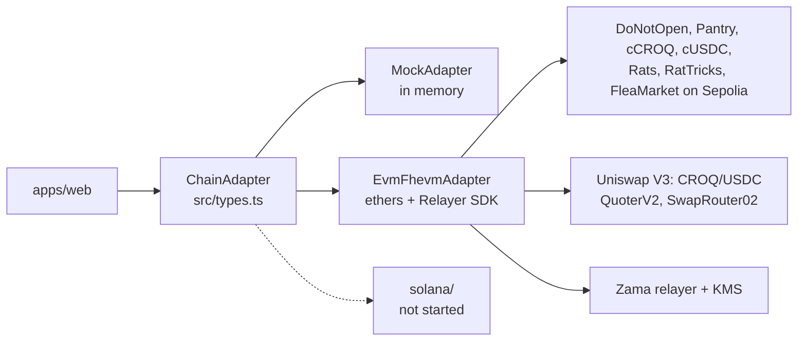
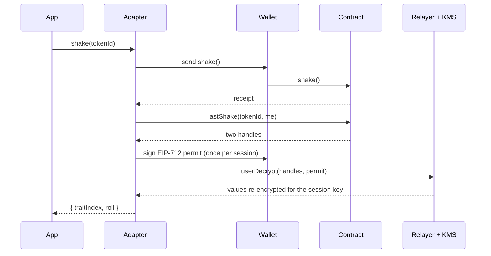

# @dno/chain-adapter

The only package that knows which chain the game runs on. The web app imports
`ChainAdapter` from here and nothing else chain-related: no ethers, no viem, no Relayer SDK.



| File | What it is |
| --- | --- |
| `src/types.ts` | The interface, its data types, `ChainError`, and a few chain-neutral helpers |
| `src/mock/MockAdapter.ts` | The whole game in memory, with the contract's rules and refusals. The other holder (the night shift) keeps two of its boxes on the duel shelf, takes up at once any duel reserved for one of its boxes, and accepts every entanglement, so every flow can be played alone. With `fleaMarket: true` it also keeps stalls at the flea market (a sealed box, a cat, two rats), makes a secret offer below the asking price on whatever you list, and takes an offer of yours that is fair enough |
| `src/evm/EvmFhevmAdapter.ts` | Sepolia: transactions through ethers, decryptions through `@zama-fhe/relayer-sdk` |
| `src/evm/wallet.ts` | Where signatures come from: an injected browser wallet, or a fixed signer in Node |
| `src/evm/browser.ts`, `src/evm/node.ts` | The two ways to build the EVM adapter. They differ only in wallet and in which SDK build they load |
| `src/evm/deployments/sepolia.json` | Address and ABI of `DoNotOpen`, and of the studio, the rats and the flea market (`market`, null until it is deployed), written by `pnpm --filter @dno/contracts-evm export:sepolia` |
| `src/evm/deployments/sepolia-economy.json` | Addresses and ABIs of CROQ, cCROQ and the Pantry, and the Uniswap V3 market (pool, fee, locked position and its ticks, locker, position manager, `SwapRouter02`, `QuoterV2`, USDC), written by the same command |
| `src/evm/uniswapV3.ts` | Reading the V3 pool like a constant-product one: `sqrtRatioAtTick` (a port of `TickMath`), `virtualReserves`, `rangePerThousand`. Exported as `@dno/chain-adapter/uniswap-v3`, also used by the API |
| `src/standings.ts` | The duel ranking (`duelStandings`, `rosettePlace`, `ROSETTES`) and the mainnet allow list's points and claim message (`playerPoints`, `ALLOW_LIST_POINTS`, `allowListMessage`, `allowListAddress`, `byClaimRank`), and the boarding pass bonuses (`X_PASS_BONUS`, `DISCORD_BONUS`, `xPassWalletMessage`). Pure, exported as `@dno/chain-adapter/standings`, also used by the API, so every reader ranks the same way |
| `src/mock/pool.ts` | `MockPool`: the mock's market, the same CROQ-only V3 range |
| `src/solana/README.md` | What the Solana port needs |

## Using it

```ts
import { createAdapter } from "@dno/chain-adapter";

const chain = await createAdapter({ mode: "sepolia" }); // or "mock"
const me = await chain.connect();
const [tokenId] = await chain.mint(1, { ids: 10 }); // 1 box hidden among 10 ids, paid in cUSDC
const mine = await chain.boxesOf(me);              // found in my own receipts
const { traitIndex, roll } = await chain.shake(tokenId, { onStep: console.log });
```

Every action takes `onStep` and reports its steps, in order, from `encrypting`, `wallet`,
`confirming`, `decrypting`, `proving`. Failures are `ChainError` with a chain-neutral
`code`, and for contract refusals the contract's error name in `reason`. Three codes come
from encrypted checks rather than reverts: `unpaid` (the cUSDC did not cover the price,
or the mint would pass the cap; nothing was taken), `not-yours` (the caller did not
hold the box; nothing happened, and nobody else learned it) and `scrambled` (the holder's
shake hit a trait someone's rat jams). The others are `rejected`,
`wallet-busy` (the wallet already shows a request), `wrong-network`, `insufficient-funds`
(the gas coin), `insufficient-usdc`, `nonce` (an earlier transaction in the way), `network`
(an endpoint or the decryption service did not answer), `decryption`, `reverted`,
`not-connected`, `no-wallet` and `unknown`. The flea market adds `missed`: someone else
bought the item first, or the listing was repriced, cancelled or its box changed, and the
payment came back in full.

`ChainError.detail` says what the app needs to word a way out: `held` and `needed` for a
missing balance, `txUrl` for the transaction that failed, `resumable` when the first
transaction went through and running the action again picks it up, and `landed` when it
did its work and only reading the result back failed (running it again would do it twice).
The EVM adapter dry-runs every transaction against the read endpoint first, so a contract
refusal or missing gas money is reported, with its reason, before the wallet opens.
`src/evm/errors.ts` sorts what wallets and endpoints throw into these codes.

In Node (scripts, metadata), import from `@dno/chain-adapter/node`.

## Hidden owners

Who holds a box is encrypted on-chain (see [`docs/HIDDEN_OWNERS.md`](../../docs/HIDDEN_OWNERS.md)),
so the interface has no owner field anywhere:

- `boxesOf(account)` finds the connected account's boxes by replaying its own
  `ConfidentialTransfer` receipts, whose "moved" bits only it can decrypt: one decryption
  signature the first time, then only new blocks are read. It returns `[]` for anyone else.
  `BoxInfo.mine` and `BoxSummary.mine` say whether a box was found that way.
- `mint(quantity, { ids, pay })`: the quantity is encrypted in the page and hidden among
  `ids` token ids (the rest are empty). Paid in cUSDC; `pay: "usdc"` shields the exact
  price first, publicly. Returns the ids the caller got, and announces a milestone the
  mint reached (`announceMilestone`, which anyone may also call).
- `collection()` reports `tokenCount` (ids created, empty ones included) and `sale`
  (`milestones`, `reached`, `soldOut`) instead of a minted count.
- Openings, alive checks and entanglements are requests: `pendingRequests(account)` lists
  the ones waiting for their proof, `finishRequest(requestId)` sends it (anyone may).
- Duels go on a shelf. `postDuel(tokenA, { reservedFor })` puts a box up, open to any
  sealed box or reserved for one, and proves the caller holds it (that much becomes
  public); it throws `not-yours` when they do not, and `reverted` with reason `DuelPending`
  when the box's listed duel was accepted and still waits for its outcome (the new posting
  gives way to it). `duelShelf()` lists every box up for a
  duel that can still be taken up (in time, its box and any reserved one still sealed;
  `shelfBoxes(duel)` names those boxes). `acceptDuel(duelId, tokenB)` takes one up and returns
  the outcome, or `null` when the duel was void or went back on the shelf. `finishDuel`
  sends whichever proof a duel waits for (the holding, or the outcome); `cancelDuel`
  withdraws a box until someone takes it up. `pair(a, b).duels` lists the duels the two
  boxes can settle: both can be up at once. `DuelStatus` is `"posted"`, `"open"`,
  `"pending"`, `"resolved"`, `"cancelled"` or `"void"` (`"none"` for an unknown id).
- `entangleProposals(tokenIds)` lists the entanglements proposed to or by these boxes that
  can still be accepted (both sealed, neither entangled), newest first: from the API, or
  from the `EntangleProposed` logs without it.
- `claimEarnings(tokenIds)` collects what paid shakes earned the boxes the caller holds;
  `sendBox(tokenId, to)` is a confidential transfer. `sendBox(tokenId, to, { decoys: n })`
  (up to `MAX_DECOYS`, 5) also sends `n` decoys to fresh random addresses through
  `confidentialTransferIf`, in a random order with the real one, from one encryption: one
  transaction each. `decoyPlan(to, n)` is the plan it follows.
- A claim lists its ids in the clear, so never list the held boxes alone:
  `claimWindows(tokenIds, tokenCount)` turns them into whole windows of `CLAIM_WINDOW` (10)
  ids, 0-9, 10-19…, the same every time. Claim each window with `claimEarnings` or
  `claimCroquettes`.
- `openedCats()` lists every opened cat and who opened it: the only holders that are public.
- `duelStandings()` ranks every box that settled a duel: most wins, then fewest losses, then
  the lower serial. Boxes, not players: the first three with a win wear a rosette in the app.
  From the API, or from the `DuelResolved` logs without it.

The croquette economy sits on the same interface: `economy()`, `boxPantry(tokenId)`,
`croqBalance(owner)`, `confidentialBalance()` (a user decryption), `confidentialCroqHandle(owner)`
(the public handle of that sealed balance, new after every move, so a decrypted figure can
be told stale like a cUSDC one with `confidentialUsdcHandle`), `claimCroquettes`
(paid into the boxes, collected from those the caller holds), `feedCroquettes` (the amount
is encrypted in the page), `pantryDay` (today's meals and croquettes eaten, decrypted:
zeros unless the caller holds the cat), `weigh`, `wrap`, `unwrap` (a public decryption of
the amount, then `finalizeUnwrap`), `sendCroquettes`, and `quote` / `trade` against the
public market. See [`docs/CROQ.md`](../../docs/CROQ.md).

The market is a Uniswap V3 pool where one locked position sells CROQ from a start price
up. `quote` asks Uniswap's `QuoterV2` and returns 0 when the swap would move nothing (a
sale before anyone has bought, a buy past the end of the range); `trade` then throws
`reverted` with reason `NoLiquidity` instead of sending, and otherwise swaps through
`SwapRouter02` (`exactInputSingle` in a `multicall` with a 20-minute deadline).
`economy().market` (`MarketInfo`) carries:

- `croqReserve` / `quoteReserve`: the reserves a constant-product pool would price with,
  that is the active range's virtual reserves L/√P and L·√P. Their ratio is the price, and
  price impact reads the same as on a V2 pool. When the pool's price has left the range,
  they are held at its edge, since nothing trades past it;
- `croqHeld` / `quoteHeld`: what the pool actually holds;
- `range`: `{ from, to }` in USDC units per 1,000 CROQ, where CROQ starts and stops selling.

USDC goes in and out the same way: `shieldUsdc(amount)` wraps plain USDC as cUSDC (the
amount is public, the site takes nothing), and `unshieldUsdc(amount)` goes back through the
cUSDC wrapper's `unwrap` (the amount encrypted in the page, a public decryption, then
`finalizeUnwrap`, like a cCROQ unwrap). It returns what was paid out: 0 when the cUSDC
balance did not cover `amount`, and then nothing moves. `quoteUsdc` / `buyUsdc(coinIn,
shield)` buy USDC with the chain's coin through `UsdcRamp`, plain or shielded in the same
transaction. `buyUsdc` and `trade` take `SwapOptions`: `slippageBps`, an integer from 1 to
5000, 100 (1%) when left out, is how far under the quote the swap may land before it
reverts; anything else throws before a transaction. The app's bureau de change
(`apps/web/src/chain/exchange.ts`) chains these calls, one transaction per leg, to reach
any pair.

Where the API's relayer proxy pays Zama (`metered`), `decryptionAllowance()` returns the
wallet's units: `freePerDay`, `freeLeft`, `credits`, `resetsAt`, the credit `price` in
plain USDC, `inputUnits`, what one encrypted input costs (a decrypted value costs one), and
`publicUnits`, what a value made public costs the wallet that asks Zama for it first (an
opening, a duel's proof; asked again it is free). Public decryptions carry the same bearer permit,
and an opening, an alive check, an entanglement or a duel checks the allowance before its gas.
Every encryption sends the session's decryption permit as a bearer token, so the input is
charged to this wallet; a mint, a meal or a croquette send checks the allowance first and
fails with `no-credits` before any gas. `buyCredits(n)` buys more. Only the API counts units, so
`decryptionAllowance()` has no chain fallback and never waits: credits this adapter bought and
the API has not indexed yet (a purchase shows once its block is indexed, two confirmations
later) are added on top of the API's count, so the figure is right as soon as `buyCredits`
resolves.

The studio's packs (AI sketches and 3D models, `packages/game-spec/studio.json`) are sold by
the `StudioPacks` contract in plain USDC. `studioPacks()` reads them from the contract (`id`,
`key`, `name`, `price` in USDC's smallest unit, `sketches`, `models`), dropping a withdrawn
one, and returns null where no StudioPacks is deployed. `buyStudioPack(id)` approves the USDC
if needed and buys at the price just read (a change meanwhile reverts); it throws
`insufficient-usdc` before any transaction when the wallet holds too little. The API counts
what is spent, so `studioPending(block)` gives the units this browser bought that an API
answer as of `block` may not count yet: the page adds them to it. `apiSession()` signs in to
the API with the connected wallet (`POST /v1/auth/nonce`, one free EIP-191 signature, then
`/v1/auth/verify`) and returns `{ account, token, expiresAt }`, the bearer token the studio's
routes take; null without an API. The mock sells the same packs for its pretend USDC, reports
every unit bought through `studioPending` (there is no API to count them) and has no session.

The depot's rats are a plain ERC-721 (`Rats`), owners public, with the `RatPantry` paying each
rat its daily plain CROQ (`studio.json` `rats`). `ratPrices()` reads `{ seed, model }` in USDC's
smallest unit, null where no Rats contract is deployed. `ratSupply(account)` reads
`{ seed: { minted, max }, model: { minted, max }, perWallet, mintedBy }` (the caps are the
contract's, `mintedBy` null without an account). `ratTaken({ seed } | { job })` reads which rat a
seed or a studio job (its UUID, or the adoption's bytes32) became and who holds it, null while
nobody adopted it: the studio offers neither a rat someone else took nor one the wallet already has. `mintSeedRat(seed)` and `mintModelRat(adoption)` refuse with `reverted` (`SoldOut`,
`WalletLimit`) before any approval when no rat of the kind is left or the account minted its
share, approve the USDC if needed, mint at the price just read and return the token id; the adoption is the API's answer to
`POST /v1/studio/jobs/:id/adopt` (`{ job, uri, deadline, signature, priceUsdc }`), its `job` the
bytes32 the API signed (keccak256 of the job's UUID), passed through as is (`ratJob`). `ratsOf(account)` reads
`GET /v1/rats?owner=` first and the chain's `Transfer` logs from the deploy block when the API is
behind, so a fresh mint shows at once. `ratClaimable(ids)`, `ratPantry()` (`{ perDay, maxDays,
reserve }`) and `claimRatCroq(ids)` (returns the CROQ paid) go to the RatPantry. The mock keeps
the same rules with its clock (a "day" is a minute) and, given `ratStore`, keeps its rats between
pages: the web app passes one backed by `localStorage`, so a rat adopted in the studio is still
there in the game.

Each rat has a secret power (1, 2 or 3) and `RatTricks` (the deployment's `ratTricks`, the EVM
adapter's `ratTricks` option) plays with it. `ratTricks()` reads `{ sniffFee, sniffRebate,
trickSeconds, rechargeSeconds }`, null where none is deployed. `ratPower(id)` user-decrypts the
connected account's rat's power; for a rat it bought (`powerReadableBy` false) it first sends
`allowPower`, one transaction. `ratReadyAt(ids)` reads when each rat can play again (unix
seconds, 0 when ready). `sniffWithRat(ratId, tokenId, { pay })` makes `RatTricks` its cUSDC
operator if needed, sniffs and decrypts the trait (`lastSniff`, the collection's handles); it
throws `unpaid` like `paidShake`. `playTrick(ratId, tokenId, traitIndex)` encrypts the trait for
`RatTricks` and returns `{ until, readyAt }` from `TrickPlayed`; it throws `reverted` with
`Recharging`, `NotYourRat` or `NotSealed`. A holder's `shake` of a jammed trait throws
`scrambled`. The mock draws powers with `mockRatPower(id)` (the spec's odds, from the id) and
keeps shields and jams in memory, its days a minute long.

## The flea market

`FleaMarket` sells boxes, cats and rats between players, in cUSDC. `fleaMarket()` reads its
terms (`address`, `explorerUrl`, `feeBps`, `maxPrice`), null where no market is deployed: the
app then shows "Closed tonight". On Sepolia at `0x4E9fC2Cb042d7Bd49B559Ad3e1110c200d7081C1` (since 2026-10-07); the EVM adapter takes it as its
`market` option (`sepolia.json`'s `market` entry in `createSepoliaBrowserAdapter` and
`createSepoliaNodeAdapter`). `rat(id)` reads one rat whoever holds it (the market, while it is for
sale).

- `listings({ status, seller, collection })` lists `Listing`s newest first: `listingId`,
  `collection` (`"boxes"` or `"rats"`), `tokenId`, `seller`, `price` (public), `listedAt`,
  `status` (`"pending"`, `"active"`, `"sold"`, `"cancelled"`, `"refused"`).
- `listItem(collection, tokenId, price)` first makes the market the account's operator on the
  boxes (`setOperator`, 365 days) or approves it on the rats if it may not yet move the item.
  A rat is listed at once. A box goes to the market in a "maybe" transfer, then the adapter
  relays the public decryption of "it arrived" (`finalizeListing`); it throws `not-yours` when
  the account did not hold it (nothing moved, nobody else learned it). `finishListing(listingId)`
  relays that proof for a listing left pending; anyone may.
- `repriceListing` and `cancelListing` are the seller's. Repricing refunds purchases placed at
  the old price; cancelling gives the item back and leaves open offers withdrawable.
- `buyListing(listingId, { pay })` pays the asking price in cUSDC (shielding USDC first with
  `pay: "usdc"`, and making the market the cUSDC operator if needed), then relays the proof
  that it was paid, which delivers the item. It throws `unpaid` when the cUSDC did not cover
  the price (nothing was taken) and `missed` when someone else got it first or the listing
  changed (refunded in full). `pendingPurchases(account)` lists the account's purchases still
  waiting for their proof, `finishPurchase(purchaseId)` relays it.
- `makeOffer(listingId, amount)` encrypts the amount in the page and escrows it; it returns the
  offer's id. `withdrawOffer` (the buyer, any time while open) and `acceptOffer` (the seller,
  at the secret amount) close it. `offers({ listingId, buyer, seller, status })` lists
  `MarketOffer`s without amounts; `offerAmounts(offerIds)` user-decrypts those the connected
  account made or received and leaves the others out.

The API does not index the market yet: the EVM adapter reads the chain directly, listings in
pages through `listings(from, count)`, offers through `offerInfo`, and pending purchases from
the account's `PurchaseRequested` logs. The flows are in
[`docs/FLOWS.md`](../../docs/FLOWS.md#the-flea-market).

`connect(walletId?, { chooseAccount })`: with `chooseAccount`, a browser extension shows its
account picker again (EIP-2255 `wallet_requestPermissions`) rather than handing back the
account it shared last time; the app's "Use another one" on the release form uses it.

`signTerms(message)` has the connected wallet sign the release form the app shows before
play (a readable EIP-191 message naming the address, the terms version and the SHA-256 of
the English text; free, no transaction), then files it with the API (`POST /v1/terms`) when
one is configured. It returns `SignedTerms`: `account`, `message`, `signature` and
`recorded`, false when only the browser keeps it (no API, or the API did not answer: that
never blocks play). The mock returns a stand-in signature, never recorded.

`allowList()` and `claimAllowList()` are the mainnet allow list. `claimAllowList` has the
connected wallet sign `allowListMessage(account, now)` (EIP-191, free) and files it with the API
(`POST /v1/allowlist`); signing again keeps the first claim's date and the best points. Both
return `AllowListStatus`: `live` (`PlayerPoints`: `points`, `beaten`, `faced`, `opened`), the
`points` the ranking counts (the best since the claim: a test network redeployment forgets the
duels, not the claims), `claimedAt`, `rank` among claimants (null until it claims),
`claimants`, `places` and `tier`, the gift class the rank would get if the list closed now
(an index into the spec's `whitelist.tiers`, null without a seat). The claims live in the API only: without one, `allowList()` returns
null and `claimAllowList` throws `network`. The mock keeps its claims in memory, with the
same rules (`playerPoints`).

`whitelistGift()`, `claimWhitelistGift()` and `whitelistGiftCroq()` are the whitelist's gifts
(`WhitelistGifts`, `whitelistGifts` in the deployment file). `whitelistGift` returns null where
none is deployed or nobody is connected, else a `WhitelistGift`: `status` (`waiting` before the
root is set, `none` when the frozen list does not have the wallet, `ready`, `claimed`, `closed`),
`tier`, `closesAt`, and the `box` and `rat` once collected. The proof comes from the API
(`GET /v1/gifts/:address`; a 404 is an answer, not the API being down). `claimWhitelistGift`
encrypts the box's quantity (1) for `DoNotOpen` with the gifts contract as the input's user,
draws a rat seed nobody adopted, and sends `claim`; it throws `reverted` (`NotOnTheList`,
`AlreadyClaimed`, `NotOpen`). `whitelistGiftCroq` user-decrypts the croquettes drawn (null
before the claim). The mock (`MockOptions.whitelistGifts`: `open` by default, `waiting`, `off`)
treats its list as frozen as it stands, so a claimant collects their rank's gift; its gift
rats stay out of `ratSupply`.

`signText(message)` has the connected wallet sign any text (EIP-191, free) and returns the
signature, filed nowhere: the app sends it where it belongs, such as linking a wallet to an X
boarding pass (`xPassWalletMessage` in `@dno/chain-adapter/standings`). The mock returns a
stand-in signature.

## What happens in a shake



Opening a box, the alive check, an entanglement, a duel and a milestone use a public
decryption instead: the relayer returns the clear values with a KMS proof, and the
adapter sends both back to the contract (`finalize`, `finalizeDuel`,
`announceMilestone`, and the flea market's `finalizeListing` and `finalizePurchase`), which
verifies the proof before storing anything. Finding one's
boxes and reading a mint's result use the same user decryption as a shake.

## Tests

```bash
pnpm --filter @dno/chain-adapter test            # the mock and the V3 math, no network
pnpm --filter @dno/chain-adapter smoke:sepolia   # every mechanic on the deployed contracts
pnpm --filter @dno/chain-adapter smoke:croq      # welcome bag, meal, buy, wrap, unwrap, transfer, sell
pnpm --filter @dno/chain-adapter smoke:rats      # a rat's power, a sniff, a shield, a rest, a jam on a second wallet
pnpm --filter @dno/chain-adapter test-wallets    # the kept throwaway wallets (.test-wallets.json), for TEAM_WALLETS
```

The smoke scripts spend testnet ETH (mints, fees, a small market buy) and need
`PRIVATE_KEY` in the repo-root `.env`. `smoke:croq` passed against the Uniswap V2 economy
on 2026-10-01. Both passed in full against the contracts deployed on 2026-10-03 (block
11836238), and a box sent there with three decoys left the sender's holdings. `smoke:rats`
passed against the contracts of 2026-10-07: a power read, a sniff, a shield, `Recharging` on a
resting rat, and a power-2 jam scrambling half of a throwaway wallet's shakes (it sends that
wallet 0.003 ETH).
