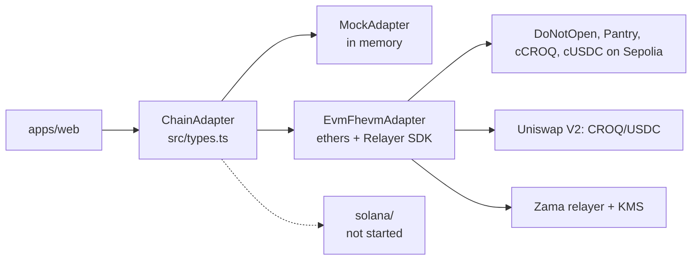
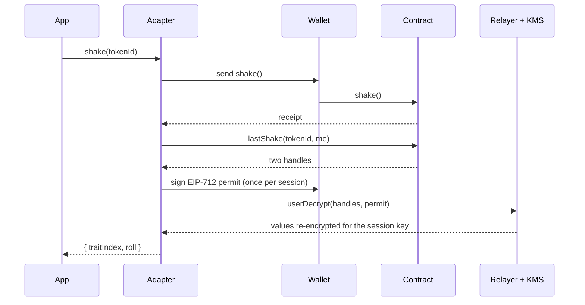

# @dno/chain-adapter

The only package that knows which chain the game runs on. The web app imports
`ChainAdapter` from here and nothing else chain-related: no ethers, no viem, no Relayer SDK.



| File | What it is |
| --- | --- |
| `src/types.ts` | The interface, its data types, `ChainError`, and a few chain-neutral helpers |
| `src/mock/MockAdapter.ts` | The whole game in memory, with the contract's rules and refusals. The other holder accepts everything at once, so every flow can be played alone |
| `src/evm/EvmFhevmAdapter.ts` | Sepolia: transactions through ethers, decryptions through `@zama-fhe/relayer-sdk` |
| `src/evm/wallet.ts` | Where signatures come from: an injected browser wallet, or a fixed signer in Node |
| `src/evm/browser.ts`, `src/evm/node.ts` | The two ways to build the EVM adapter. They differ only in wallet and in which SDK build they load |
| `src/evm/deployments/sepolia.json` | Address and ABI of `DoNotOpen`, written by `pnpm --filter @dno/contracts-evm export:sepolia` |
| `src/evm/deployments/sepolia-economy.json` | Addresses and ABIs of CROQ, cCROQ and the Pantry, and the Uniswap V2 market, written by the same command |
| `src/solana/README.md` | What the Solana port needs |

## Using it

```ts
import { createAdapter } from "@dno/chain-adapter";

const chain = await createAdapter({ mode: "sepolia" }); // or "mock"
const me = await chain.connect();
const [tokenId] = await chain.mint(1, { ids: 10 }); // 1 box hidden among 10 ids, paid in cUSDC
const mine = await chain.boxesOf(me);              // found in my own receipts
const { traitIndex, roll } = await chain.shake(tokenId, { onStep: console.log });
```

Every action takes `onStep` and reports its steps, in order, from `encrypting`, `wallet`,
`confirming`, `decrypting`, `proving`. Failures are `ChainError` with a chain-neutral
`code`, and for contract refusals the contract's error name in `reason`. Two codes come
from encrypted checks rather than reverts: `unpaid` (the cUSDC did not cover the price,
or the mint would pass the cap; nothing was taken) and `not-yours` (the caller did not
hold the box; nothing happened, and nobody else learned it).

In Node (scripts, metadata), import from `@dno/chain-adapter/node`.

## Hidden owners

Who holds a box is encrypted on-chain (see [`docs/HIDDEN_OWNERS.md`](../../docs/HIDDEN_OWNERS.md)),
so the interface has no owner field anywhere:

- `boxesOf(account)` finds the connected account's boxes by replaying its own
  `ConfidentialTransfer` receipts, whose "moved" bits only it can decrypt: one decryption
  signature the first time, then only new blocks are read. It returns `[]` for anyone else.
  `BoxInfo.mine` and `BoxSummary.mine` say whether a box was found that way.
- `mint(quantity, { ids, pay })`: the quantity is encrypted in the page and hidden among
  `ids` token ids (the rest are empty). Paid in cUSDC; `pay: "usdc"` shields the exact
  price first, publicly. Returns the ids the caller got, and announces a milestone the
  mint reached (`announceMilestone`, which anyone may also call).
- `collection()` reports `tokenCount` (ids created, empty ones included) and `sale`
  (`milestones`, `reached`, `soldOut`) instead of a minted count.
- Openings, alive checks and entanglements are requests: `pendingRequests(account)` lists
  the ones waiting for their proof, `finishRequest(requestId)` sends it (anyone may).
- `DuelStatus` has `"void"`, and `finishDuel` returns `null` for a void duel.
- `claimEarnings(tokenIds)` collects what paid shakes earned the boxes the caller holds;
  `sendBox(tokenId, to)` is a confidential transfer.
- `openedCats()` lists every opened cat and who opened it: the only holders that are public.

The croquette economy sits on the same interface: `economy()`, `boxPantry(tokenId)`,
`croqBalance(owner)`, `confidentialBalance()` (a user decryption), `claimCroquettes`
(paid into the boxes, collected from those the caller holds), `feedCroquettes` (the amount
is encrypted in the page), `pantryDay` (today's meals and croquettes eaten, decrypted:
zeros unless the caller holds the cat), `weigh`, `wrap`, `unwrap` (a public decryption of
the amount, then `finalizeUnwrap`), `sendCroquettes`, and `quote` / `trade` against the
public market. See [`docs/CROQ.md`](../../docs/CROQ.md).

## What happens in a shake



Opening a box, the alive check, an entanglement, a duel and a milestone use a public
decryption instead: the relayer returns the clear values with a KMS proof, and the
adapter sends both back to the contract (`finalize`, `finalizeDuel`,
`announceMilestone`), which verifies the proof before storing anything. Finding one's
boxes and reading a mint's result use the same user decryption as a shake.

## Tests

```bash
pnpm --filter @dno/chain-adapter test            # the mock, 26 tests, no network
pnpm --filter @dno/chain-adapter smoke:sepolia   # every mechanic on the deployed contracts
pnpm --filter @dno/chain-adapter smoke:croq      # welcome bag, meal, buy, wrap, unwrap, transfer, sell
```

The smoke scripts spend testnet ETH (mints, fees, a small market buy) and need
`PRIVATE_KEY` in the repo-root `.env`. `smoke:croq` passed against the previous Pantry,
cCROQ and Uniswap pool on 2026-10-01. The hidden-owner contracts are not deployed on
Sepolia yet, so neither script has run against them.
