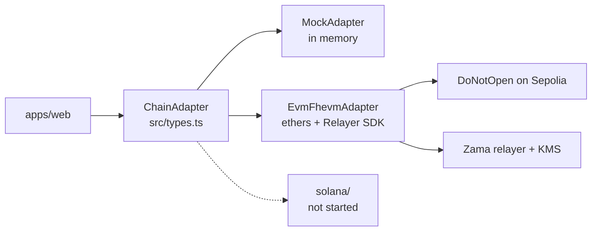
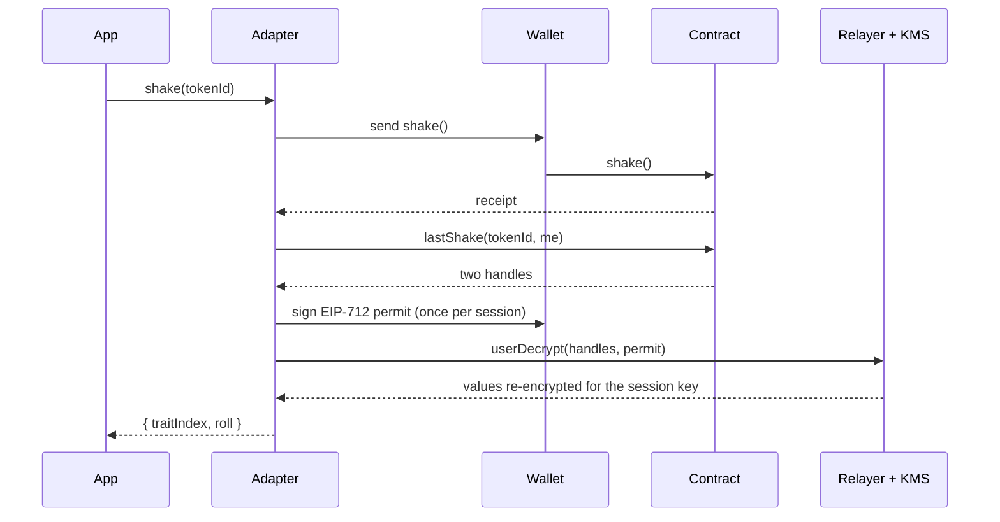

# @dno/chain-adapter

The only package that knows which chain the game runs on. The web app imports
`ChainAdapter` from here and nothing else chain-related: no ethers, no viem, no Relayer SDK.



| File | What it is |
| --- | --- |
| `src/types.ts` | The interface, its data types, `ChainError`, and a few chain-neutral helpers |
| `src/mock/MockAdapter.ts` | The whole game in memory, with the contract's rules and refusals. The other holder accepts everything at once, so every flow can be played alone |
| `src/evm/EvmFhevmAdapter.ts` | Sepolia: transactions through ethers, decryptions through `@zama-fhe/relayer-sdk` |
| `src/evm/wallet.ts` | Where signatures come from: an injected browser wallet, or a fixed signer in Node |
| `src/evm/browser.ts`, `src/evm/node.ts` | The two ways to build the EVM adapter. They differ only in wallet and in which SDK build they load |
| `src/evm/deployments/sepolia.json` | Address and ABI, written by `pnpm --filter @dno/contracts-evm export:sepolia` |
| `src/solana/README.md` | What the Solana port needs |

## Using it

```ts
import { createAdapter } from "@dno/chain-adapter";

const chain = await createAdapter({ mode: "sepolia" }); // or "mock"
await chain.connect();
const [tokenId] = await chain.mint(1);
const { traitIndex, roll } = await chain.shake(tokenId, { onStep: console.log });
```

Every action takes `onStep` and reports the same four steps, in order: `wallet`,
`confirming`, `decrypting`, `proving`. Failures are `ChainError` with a chain-neutral
`code`, and for contract refusals the contract's error name in `reason`.

In Node (scripts, metadata), import from `@dno/chain-adapter/node`.

## What happens in a shake



Opening a box, the alive check and a duel use a public decryption instead: the relayer
returns the clear values with a KMS proof, and the adapter sends both back to the
contract, which verifies the proof before storing anything.

## Tests

```bash
pnpm --filter @dno/chain-adapter test            # the mock, 12 tests, no network
pnpm --filter @dno/chain-adapter smoke:sepolia   # every mechanic on the live contract
```

The smoke script spends testnet ETH (three mints and a few fees) and needs `PRIVATE_KEY`
in the repo-root `.env`.
